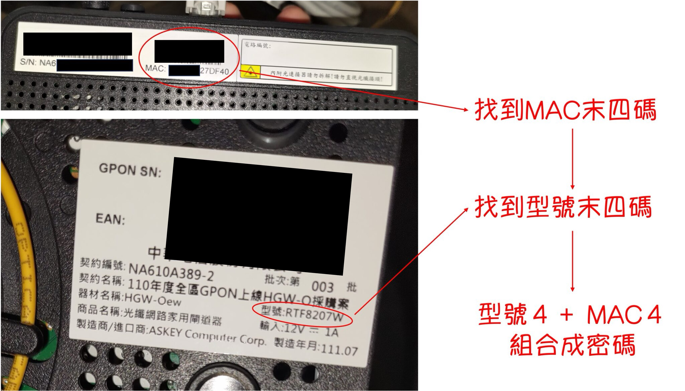

這次我們想要登入中華電信的小烏龜，也就是 RTF8207W 數據機。

<!-- truncate -->

### 1. 登入管理介面。

通常可以透過網頁瀏覽器輸入 `192.168.1.1` 或其他 IP 地址進行訪問，具體地址可能依你的路由器型號而異。

<figure style={{"width": "60%"}}>

</figure>

### 2. 工程帳號

一般來說，帳號為：`cht`，密碼為`型號末四碼＋MAC末四碼`。

<figure style={{"width": "60%"}}>

</figure>

### 3. 登入

然後你就可以為所欲為了。

:::danger
如果不小心弄壞了設定，導致網路崩潰無法連線，請自行連絡**中華電信工程師**。

本文章僅供參考，不負任何責任。
:::
