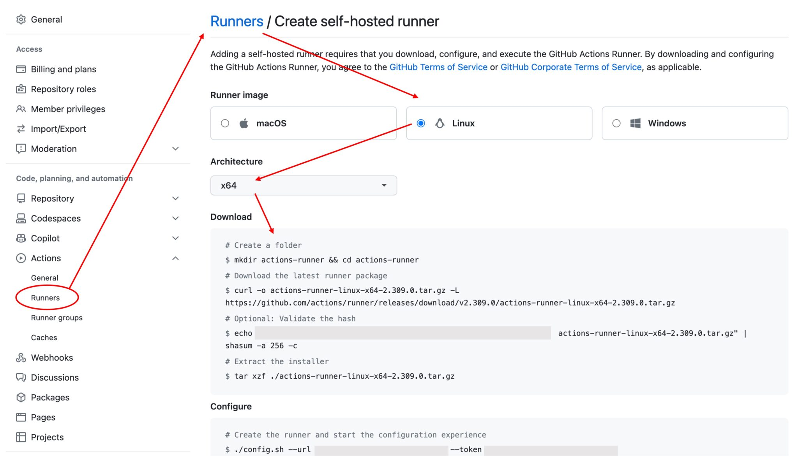

<figure>

<figcaption>封面圖片：由 GPT-4 閱讀本文之後自動生成</figcaption>
</figure>

---

我們在使用 Github 協作的過程中，常會使用到私有主機來進行 CI/CD 的工作。這個部分在 Github 中有提供說明文件，告訴使用者該如何進行初步的安裝，依照步驟做完就可以配置成功。

然而，在不久之後，因為某些原因，主機被重新啟動，而原本的 Runner 卻沒有跟上。這件事情就這樣被忘記，直到有人發現 CI/CD 沒有反應，才會被提醒應該把服務啟動，直到下個重新開機的迴圈為止。

所以，我們需要自動執行！

- 說明文件示意圖

  

## 配置流程

要在主機開機後自動執行某個任務，通常可以使用 systemd 服務 (service) 來做。

1. **建立一個新的 systemd 服務檔案：**

   ```bash
   sudo vim /etc/systemd/system/actions-runner.service
   ```

2. **貼上以下的內容到檔案中：**

   ```bash
   [Unit]
   Description=GitHub Action Runner
   After=network.target

   [Service]
   Type=simple
   User=你的使用者名稱
   WorkingDirectory=/home/你的使用者名稱/actions-runner
   ExecStart=/home/你的使用者名稱/actions-runner/run.sh
   Restart=always
   RestartSec=5

   [Install]
   WantedBy=multi-user.target
   ```

   ＊注意：`User` 與 `WorkingDirectory` 要改成你自己的使用者名稱。

3. **告知 systemd 重新讀取新的服務設定：**

   ```bash
   sudo systemctl daemon-reload
   ```

4. **啟用此服務，使其在開機時自動啟動：**

   ```bash
   sudo systemctl enable actions-runner.service
   ```

5. **現在你可以手動開始此服務，或是重新開機來測試它：**

   ```bash
   sudo systemctl start actions-runner.service
   ```

   使用這個方法，當你的主機開機時，actions-runner 會自動背景執行。

   如果你想停止服務，可以使用以下指令：

   ```bash
   sudo systemctl stop actions-runner.service
   ```

   ＊注意：確保 `run.sh` 具有可執行的權限。

## 查看狀態

當你使用 systemd 來管理服務時，你無法直接「attach」之類的服務來看它的輸出，但你可以查看這個服務的日誌來了解它的工作狀態，要查看 actions-runner 服務的日誌，你可以使用以下命令：

```bash
sudo journalctl -u actions-runner.service -f
```

解釋一下：

- `-u actions-runner.service`：只查看名為 actions-runner 的服務的日誌。
- `-f`：這個參數讓 journalctl 持續追踪最新的日誌，所以你可以實時看到新的輸出。

此外，如果你想查看服務的當前狀態，你可以使用：

```bash
sudo systemctl status actions-runner.service
```

這將會顯示 `actions-runner` 服務的當前狀態，包括是否正在運行，以及最近的日誌輸出：


## 重新配置

如果是原本的 Runner 不見了，通常會是在切換儲存庫的 Public 和 Private 的時候，或是原本 Runner 太久沒有調用，總之就是原本的 Runner 弄丟了，這時候就需要重新配置。

這時候，就到 actions-runner 資料夾底下，把 .runner 檔案刪掉，再重新跑一次：

```bash
./config.sh --url ... (改成新的 Token 配置)
```

其他流程都一樣，配置完之後，把服務重新啟動就好。
