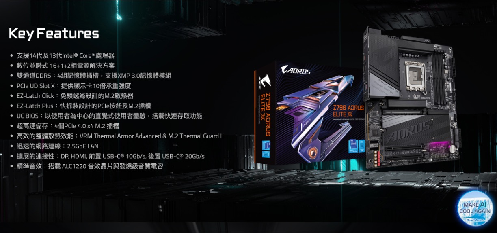
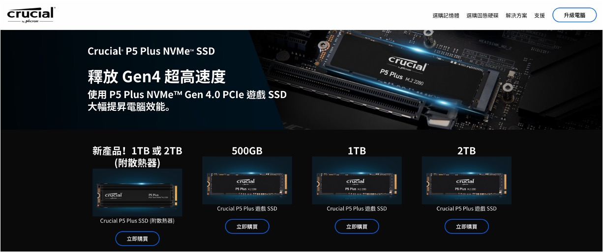
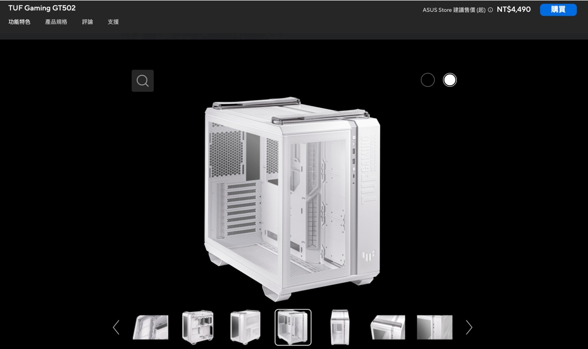

突然想買一台電腦。

不為別的，就是想用 RTX 4090 來 Train 模型。

<!-- truncate -->

## 免責聲明

我們自己忙碌一番，動手組一台訓練用的主機，再順手留個紀錄。

1. 如果你根據本紀錄自行組裝主機，並因此產生任何問題或造成任何形式的損失，我們概不負責。
2. 本文章僅為個人紀錄之用，並無任何推薦或廣告意圖。
3. 文中提及的所有產品或品牌均為記錄所需，不代表任何商業合作或推薦立場。

## 採購明細

看完免責聲明，現在我們可以正式開始了。

以下表格紀錄了我們的採購清單：

| 品名       | 品項                                                                        | 數量 | 總價 (NTD) |
| ---------- | --------------------------------------------------------------------------- | ---- | ---------- |
| CPU        | Intel i9-13900K 【24 核/32 緒】3.0GHz-5.8GHz 36MB LGA1700 125W              | 1    | $ 19,500   |
| 主機板     | 技嘉 Z790 AORUS ELITE (ATX/Realtek 2.5Gb) 16+1+2 相電源                     | 1    | $ 7,990    |
| 顯示卡     | 技嘉 RTX 4090 AERO OC 24G 白色風之力 散熱 金屬背板                          | 1    | $ 60,990   |
| 記憶體     | 金士頓 64 GB (雙通道 32GBx2) DDR5 6000 CL36 FURY Beast 白色                 | 2    | $ 12,258   |
| 硬碟       | 美光 Crucial P5 Plus 2TB (Gen4 M.2 PCIe 4.0) NVMe SSD (讀 6600M / 寫 5500M) | 2    | $ 7,800    |
| 水冷系統   | NZXT Kraken 360 RGB 白色                                                    | 1    | $ 7,990    |
| 機殼       | 華碩 TUF Gaming GT502 白色 ATX                                              | 1    | $ 5,490    |
| 機殼風扇   | 華碩 TUF Gaming TF120 ARGB 白色 三風扇組 (機殼贈品)                         | 1    | -          |
| 機殼風扇   | 華碩 TUF Gaming TF120 ARGB 白色 三風扇組 (加購)                             | 1    | $ 1,690    |
| 機殼風扇   | 華碩 TUF Gaming TF120 ARGB 白色 單風扇 (加購)                               | 4    | $ 2,196    |
| 電源供應器 | 全漢 HYDRO PTM PRO 1200W ATX3.0 白金 全模                                   | 1    | $ 5,790    |
| 連接線     | 銀欣 1 分 4 A.RGB 連接線（SST-CPL03）                                       | 2    | $ 250      |

- **總價（含稅）**：新台幣 131,944 元，折合美金約 4,100 元
- **日期**：2023 年 9 月

:::info
我們去看了同等規格的預組電腦，價格大概是 180,000 元左右。

自己動手做還是很划算的！
:::

## RTX 4090

一切都從這裡開始。

我們先到原價屋看看，發現 4090 大概有幾個廠商：華碩、技嘉和微星。

接著去找個測試影片：

- [**MSI RTX 4090 Suprim X vs. RTX 4090 Gaming X Trio, Thermals, Power & Overclocking**](https://www.youtube.com/watch?v=uyMnMPLYk2w)

看起來微星的工作溫度特別高，反觀另外兩個廠商的溫度差不多。

再去找個相關文章：

- [**【情報】6 張 4090 散熱比較**](https://forum.gamer.com.tw/C.php?bsn=60030&snA=615853)

整體看起來，技嘉的整體表現最好，那麼我們就從技嘉的產品中選擇最好看的白色風之力版本：

詳細參數：

- 品項：GIGABYTE RTX 4090 AERO OC 24G 白色風之力 散熱 金屬背板
- 價格：原價屋 $ 60,900 NTD
- 長度：34.2 cm

  

:::tip
這一代的 GPU 還牽扯到 ATX 的規格，這裡我們放到電源供應器的部分再說。
:::

## 主機板

決定了顯卡，接著就是主機板了。

這裡出現了「腳位」的問題，不同的主機板對應了不同的 CPU，這裡我們繼續查一下資料：

- Intel 12 代，搭配 600 系列主機板，用 1700 腳位。
- Intel 13 代，搭配 700 系列主機板，用 1700 腳位。
- Intel 14 代，搭配 700 系列主機板，用 1700 腳位。

看起來 1700 腳位是一個比較長期的選擇，那麼我們就選擇了 700 系列主機板：

### 1700 腳位

根據[**維基百科對於 LGA 1700**](https://zh.wikipedia.org/zh-tw/LGA_1700) 的描述：

LGA 1700，是英特爾用於 2021 年推出 Alder Lake 微架構（第 12 代 Intel Core）和 Raptor Lake 微架構(第 13 代、第 14 代 Intel Core）的桌上型微處理器插槽。此插槽取代 LGA 1200，且支援 DDR5 記憶體。由於接觸點大幅增加，之前對應 LGA 1200、LGA 1151(封裝大小 37.5 mm x 37.5 mm)的處理器散熱器均與 LGA 1700 不相容(封裝大小 45.0 mm x 37.5 mm)。

### 晶片組規格

實際上在採購時，還會看到 B660、H670、Z690 等主機板，這裡我們繼續查一下資料：

  
點選展開

| **特性**                                                    | **H610**                                     | **B660**                                     | **H670**                                     | **Z690**                                     | **W680**                                     | **Z790**                                     |
| ----------------------------------------------------------- | -------------------------------------------- | -------------------------------------------- | -------------------------------------------- | -------------------------------------------- | -------------------------------------------- | -------------------------------------------- |
| **CPU 超頻**                                                | 否                                           | 否 (支援記憶體超頻)                          | 否 (支援記憶體超頻)                          | 是                                           | 是                                           | 是                                           |
| **匯流排界面**                                              | DMI 4.0 x4                                   | DMI 4.0 x8                                   | DMI 4.0 x8                                   | DMI 4.0 x8                                   | DMI 4.0 x8                                   | DMI 4.0 x8                                   |
| **支援的 CPU**                                              | Alder Lake, Raptor Lake, Raptor Lake Refresh | Alder Lake, Raptor Lake, Raptor Lake Refresh | Alder Lake, Raptor Lake, Raptor Lake Refresh | Alder Lake, Raptor Lake, Raptor Lake Refresh | Alder Lake, Raptor Lake, Raptor Lake Refresh | Alder Lake, Raptor Lake, Raptor Lake Refresh |
| **支援的記憶體**                                            | 最高支持 64GB, DDR4 3200 / DDR5 4800         | 最高支持 128GB, DDR4 3200 / DDR5 4800        | 最高支持 128GB, DDR4 3200 / DDR5 4800        | 最高支持 128GB, DDR4 3200 / DDR5 4800        | 最高支持 128GB, DDR4 3200 / DDR5 4800        | 最高支持 128GB, DDR4 3200 / DDR5 4800        |
| **最大 DIMM 插槽**                                          | 2                                            | 4                                            | 4                                            | 4                                            | 4                                            | 4                                            |
| **最大 USB 2.0 埠**                                         | 10                                           | 12                                           | 14                                           | 14                                           | 14                                           | 14                                           |
| **USB 3.2 Gen 1 (5 Gbit/s)**                                | 最多 4 個                                    | 最多 6 個                                    | 最多 8 個                                    | 最多 10 個                                   | 最多 10 個                                   | 最多 10 個                                   |
| **USB 3.2 Gen 2 (10 Gbit/s)**                               | 最多 1 個                                    | 最多 2 個                                    | 最多 4 個                                    | 最多 4 個                                    | 最多 4 個                                    | 最多 10 個                                   |
| **USB 3.2 Gen 2x2 (20 Gbit/s)**                             | 否                                           | 最多 2 個                                    | 最多 4 個                                    | 最多 4 個                                    | 最多 4 個                                    | 最多 5 個                                    |
| **最大 SATA 3.0 埠**                                        | 4                                            | 4                                            | 8                                            | 8                                            | 8                                            | 8                                            |
| **處理器 PCI Express 5.0 設置**                             | 1x16                                         | 1x16+1x4                                     | 1x16+1x4 或 2x8+1x4                          | 1x16+1x4 或 2x8+1x4                          | 1x16+1x4 或 2x8+1x4                          | 1x16 或 2x8                                  |
| **PCH PCI Express 4.0 設置**                                | 否                                           | 6                                            | 12                                           | 16                                           | 16                                           | 16                                           |
| **PCH PCI Express 3.0 設置**                                | 8                                            | 12                                           | 12                                           | 12                                           | 12                                           | 12                                           |
| **內建支持顯示 (數字埠/管道)**                              | 3                                            | 4                                            | 4                                            | 4                                            | 4                                            | 4                                            |
| **內建無線網 (802.11ax / Wi-Fi 6E)**                        | 是                                           | 是                                           | 是                                           | 是                                           | 是                                           | 是                                           |
| **SATA RAID 0/1/5/10 支持**                                 | 否                                           | 是                                           | 是                                           | 是                                           | 是                                           | 是                                           |
| **Intel Optane Memory 支持**                                | 否                                           | 是                                           | 是                                           | 是                                           | 是                                           | 是                                           |
| **Intel Smart Sound 技術**                                  | 是                                           | 是                                           | 是                                           | 是                                           | 是                                           | 是                                           |
| **Intel Active Management, Trusted Execution 與 vPro 技術** | 否                                           | 否                                           | 否                                           | 否                                           | 是                                           | 否                                           |
| **晶片組 TDP**                                              | 6W                                           | 6W                                           | 6W                                           | 6W                                           | 6W                                           | 6W                                           |
| **發布日期**                                                | Q1 2022                                      | Q1 2022                                      | Q1 2022                                      | Q4 2021                                      | Q2 2022                                      | Q4 2022                                      |

哎呀！這裡的資訊太多了，總之就挑好的買，就選 Z790 吧！

詳細參數：

- 品項：GIGABYTE Z790 AORUS ELITE (ATX/Realtek 2.5Gb) 16+1+2 相電源
- 價格：原價屋 $ 7,990 NTD

  

## CPU

聽說 Intel 13 代和 14 代充滿了奇怪的問題。

但是我們也不超頻，應該問題不大，不如先買個 Intel 13 代吧！

詳細參數：

- 品項：Intel i9-13900K 【24 核/32 緒】3.0GHz-5.8GHz 36MB 1700 腳位 125W
- 價格：原價屋 $ 19,500 NTD

:::tip
我們運行的是 Ubuntu 系統，在後續使用中確實有當機的問題。

但是在某次系統更新後，這個問題就消失了，所以我們不確定是否該把責任推給 CPU 瑕疵？
:::

## 記憶體

我們認知的記憶體三大廠應該是：美光、金士頓和威剛。這個部分我們也不是專業玩家，總之就從這三間挑就對了。

重點是容量，既然要 Train 模型，插滿 128GB 是很基本的操作，對吧！

詳細參數：

- 品項：金士頓 64 GB (雙通道 32GBx2) DDR5 6000 CL36 FURY Beast 白色
- 價格：原價屋 $ 6,129 NTD / 1 組
- 數量：2 組

  

## 硬碟

這一個部分我們在 PTT 上有找到硬碟大神的指南：

- [**SSD(固態硬碟)選購指南**](https://www.ptt.cc/bbs/PC_Shopping/M.1675587557.A.3D3.html)

裡面還有很多延伸閱讀，和各種廠商的比較彙整等，總之這裡的專業知識太多了。

就在我們頭昏腦脹之際，似乎瞥見一個結論是選美光，那就這麼辦吧！（~太隨便了吧？~）

---

我們查詢資料後，得到不要選 QLC 的結論，似乎是因為 QLC 的寫入速度慢和壽命短。另一方面，PCIe 5 的 SSD 似乎有災情（連結如下），所以我們選擇了 TLC 技術和 PCIe 4.0 的 SSD。

- [**Crucial, Corsair PCIe 5.0 SSDs running hot, throttling, and shutting down without heatsink**](https://www.neowin.net/news/crucial-corsair-pcie-50-ssds-running-hot-throttling-and-shutting-down-without-heatsink/?fbclid=IwAR0aM7igqoPCImgSMKCtPTNLRw5nOeGJPxLN3HYN89CsTSFEEtl2YsDqbCU)

:::tip
不過技術迭代很快，說不定過一陣子，這些問題都不是問題了！所以這裡還是要看最新的資訊。
:::

---

既然要 Train 模型，就配個 4 TB 的硬碟，資料集才放得下。

詳細參數：

- 品項：美光 Crucial P5 Plus 2TB PCIe 4.0 NVMe SSD (讀 6600M / 寫 5500M) TLC
- 價格：原價屋 $ 3,900 NTD / 1 顆
- 數量：2 顆

  

## 水冷系統

這裡大概有華碩、微星、海盜船和 NZXT 等品牌。雖然選擇看起來很多，但在網上搜實在找不到什麼比較有參考性的評比資料，於是我們挑選的重點變成是保固時間。

大多數的保固時間是 3 年，但 NZXT 的保固時間是 6+1 年，這個部分我們就選擇了 NZXT。

詳細參數：

- 品項：NZXT Kraken 360 RGB 白色
- 價格：原價屋 $ 7,990 NTD
- 厚度：5.6 cm

  

:::tip
如果你是這方面的專業人士，或許可以提供我們更專業的建議，我們在組裝下一台主機時會優先考慮。
:::

## 機殼和風扇

這裡就是選一個可以塞下所有東西的機殼，然後再買一些風扇裝進去。

詳細參數：

- 品項：
  - 華碩 TUF Gaming GT502 白色 ATX
  - TUF Gaming TF120 ARGB 白 三風扇組 (機殼贈品) x1
  - TUF Gaming TF120 ARGB 白 三風扇組 (加購) x1
  - TUF Gaming TF120 ARGB 白 單風扇 (加購) x4
- 價格：

  - 機殼加贈品，原價屋 $ 5,490 NTD
  - 三風扇組加購，原價屋 $ 1,690 NTD / 1 組
  - 單風扇加購，原價屋 $ 549 NTD / 1 組

    

## 電源供應器

這個部分就是到網上搜一下，看看年度推薦的電源供應器品牌。

其實有在榜單上的品牌都可以選，我們認為這個部分沒有太大的差異，所以根據保固時間和價格，選擇了全漢。

詳細參數：

- 品項：全漢 HYDRO PTM PRO 1200W ATX3.0 白金 全模
- 價格：原價屋 $ 5,790 NTD

  

---

延續 GPU 的話題，這裡得在補充一下 ATX 3.0 的相關知識：

- [**ATX 3.0 規格**](https://zh.wikipedia.org/zh-tw/ATX%E8%A6%8F%E6%A0%BC)

  ATX 3.0 規格於 2022 年 2 月發布。它包括新的 16-Pin 12VHPWR 供電介面，可為顯示卡提供高達 600 W 的功率。這些組件包含用於與電源供應器協商電源功能的數據線，因此它們不會消耗比電源供應器能夠提供的功率為多。該規範還對處理尖峰有更嚴格的要求。

為了因應 4090 的功率需求，在選擇電源供應器時，我們就要注意 ATX 3.0 的相容性。在 4090 發布後的一段時間內，出現很多燒機的案例，大多數的原因都是因為電源供應器功率不足，系統無法難以穩定運行。

## 竣工

買了一堆東西，其實我們也沒把握裝得好，所以最後這一步驟就委託給原價屋的技師了。我們攝影技術不行，你可以參考下面這個影片，最後的成品差不多就長這樣，差別在於我們的顯卡和四條記憶體也都是白色的。

- [**ASUS TUF GT502 CUSTOM SETUP | Black & White PC BUILD | i9-13900k | ASUS TUF RTX 4070TI | ProArt Z790**](https://www.youtube.com/watch?v=puMYF4wpzTQ)

  

---

這次的組裝過程就到這裡，我們要去開心愉快地 Train 模型了～

## 後記一

:::info
更新於 2024 年 6 月
:::

滿載 Train 模型，基於臺灣的家用電表計費，一個月的電費大概是新台幣 5,000 元。

## 後記二

:::info
更新於 2024 年 10 月
:::

用了一年後，覺得硬碟買 4T 實在太保守：

1. WebFace42M 的資料集就要 0.9T。
2. ImageNet 21k 的資料集就要 1.3T。
3. ...

還有其他大規模的資料集，4T 根本不夠用，下次買至少要買 16T 才行。
