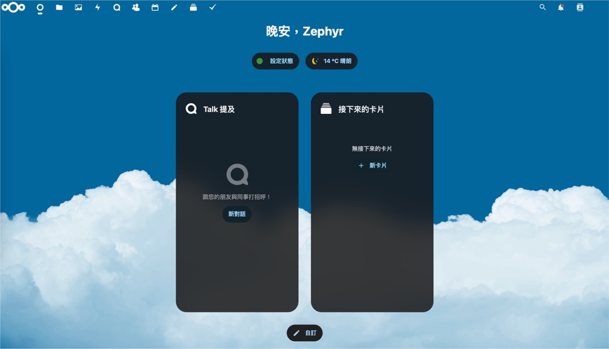

之前我都把檔案放在 Google Drive 上，下載檔案的時候會透過 wget 指令來下載。

直到某一天，Google 稍作更新，原本的下載指令突然就不能用了......

真無奈。

既然如此，那就來試試看 Nextcloud 吧，以下我是基於 Ubuntu 22.04 來進行相關配置。

<!-- truncate -->

:::tip
在開始之前，請你準備好一個域名，並且把這個域名指向你的伺服器。

如果不知道該怎麼做，可以直接向 ChatGPT 問問，它會告訴你。
:::

## 安裝 Nextcloud

**第一問：為什麼要用 Nextcloud？**

- 我想要一個私有雲，不想要把檔案放在別人的伺服器上。

**第二問：Nextcloud 跟 Owncloud 有什麼不一樣？**

- Nextcloud 是由 Owncloud 的開發者分家出來的，兩者的功能差不多，但 Nextcloud 的開發速度比較快。

**第三問：Nextcloud 要怎麼安裝？**

- 這個問題比較複雜，因為 Nextcloud 的安裝方式有很多種，而且每一種都有不同的優缺點。
- 在本篇文章中，我唯一推薦的安裝方式是使用 Docker。

## 設定 Nextcloud All-in-One

- 參考官方文件：[**Nextcloud All-in-One**](https://github.com/nextcloud/all-in-one)

**首先確保你已經安裝了 Docker 和 Docker Compose。**

接著，建立一個 NextCloud 資料夾，然後寫一個 Docker Compose 的設定檔 `docker-compose.yml`：

```bash
mkdir nextcloud
vim nextcloud/docker-compose.yml
```

把以下的內容貼到 `docker-compose.yml` 裡面：

```yaml
services:
  nextcloud-aio-mastercontainer:
    image: nextcloud/all-in-one:latest  # 指定使用的 Docker 容器映像檔
    init: true  # 防止建立殭屍（zombie）行程，建議保持此選項
    restart: always  # 容器重啟策略設定為隨 Docker 守護程序（daemon）自動重啟
    container_name: nextcloud-aio-mastercontainer  # 設定容器名稱，不應變更，以避免更新問題
    volumes:
      - nextcloud_aio_mastercontainer:/mnt/docker-aio-config  # mastercontainer 的檔案儲存位置，此設定不可變更
      - /var/run/docker.sock:/var/run/docker.sock:ro  # 掛載 Docker 套接字，用於控制其他容器與功能，Windows/macOS 或 rootless 模式下需調整
    ports:
      - 80:80    # 用於透過 AIO 介面取得有效證書，可選
      - 8080:8080  # 預設提供 AIO 介面（自簽名證書），若宿主機 8080 埠被佔用，可改為其他埠，例如：8081:8080
      - 8443:8443  # 若需公開至網路，可透過此埠存取 AIO 介面並取得有效證書，可選

volumes:
  nextcloud_aio_mastercontainer:
    name: nextcloud_aio_mastercontainer  # Docker Volume 名稱，此設定不可變更
```

如需更詳盡設定資訊，請參考官方文件：[**compose.yaml**](https://github.com/nextcloud/all-in-one/blob/main/compose.yaml)

## 設定系統服務

完成了上述的設定之後，再來是設定系統服務。

```bash
sudo vim /etc/systemd/system/nextcloud.service
```

貼上以下的內容：

```bash {7}
[Unit]
Description=NextCloud Docker Compose
Requires=docker.service
After=docker.service

[Service]
WorkingDirectory=/home/[YourName]/nextcloud
ExecStart=/usr/bin/docker compose up --remove-orphans
ExecStop=/usr/bin/docker compose down
Restart=always

[Install]
WantedBy=multi-user.target
```

記得要把 `[YourName]` 替換成你的使用者名稱。

## 啟動 Nextcloud

```bash
sudo systemctl enable nextcloud
sudo systemctl start nextcloud
```

## 設定 Nextcloud

1. **訪問 Nextcloud AIO 介面**：

   初次啟動完成後，請使用 `https://ip.address.of.this.server:8080` 進入 Nextcloud AIO 介面，其中 `ip.address.of.this.server` 需替換為部署 Nextcloud 服務的伺服器 IP 地址。請確保 Docker 及 Nextcloud AIO 已正確安裝並啟動，初次啟動可能需要數分鐘。

   建議使用 IP 地址而非域名來存取 8080 端口，因 HTTP Strict Transport Security（HSTS）可能限制域名存取。HSTS 是一種要求瀏覽器僅以 HTTPS 連線存取網站的安全機制。

2. **自簽名證書的使用**：

   當透過 8080 端口訪問時，系統可能採用自簽名證書來確保通訊安全。

   由於此證書並非由受信任的證書機構（CA）簽發，瀏覽器可能顯示不可信警告，需依據瀏覽器指示手動接受。建議僅在測試環境中使用，自簽名證書不適用於正式上線環境。

3. **獲取有效證書的自動化方式**：

   若你的防火牆或路由器已開放或正確轉發 80 與 8443 端口，且你已將一個域名指向伺服器，則可透過 `https://your-domain-that-points-to-this-server.tld:8443` 自動獲取由受信任 CA（例如 Let's Encrypt）簽發的有效證書，進一步提升安全性與便利性。

   請確保 `your-domain-that-points-to-this-server.tld` 已替換為正確域名，且 DNS 設定已生效，同時檢查防火牆規則，確保連線不受阻擋。

4. **Nextcloud Talk 的連接埠開放**：

   為確保 Nextcloud Talk（如視訊通話與訊息功能）正常運作，必須在防火牆或路由器中為 Talk 容器開放 3478/TCP 與 3478/UDP 端口。

   若位於 NAT 環境，請同時確認相應端口轉發已正確設定，並檢查 ISP 是否封鎖相關 UDP 端口。

## 常見問題

1. **家用網路是動態 IP，怎麼指向域名？**

    除了試用 No-IP 等動態 DNS 方案，我們發現直接向中華電信申請固定 IP 是最快且最穩定的方法。

    :::tip
    如果你不是住在台灣的讀者，可能要去詢問你國家的電信機構是否有提供相關服務。
    :::

2. **我不想用 Docker，有沒有其他方法？**

    有，你可以直接安裝 Nextcloud，但必須自行處理所有依賴與環境配置，過程中可能會遇到不少坑。

    被坑了一輪之後，還是又回來走 Docker 流程，所以為什麼不一開始就用 Docker 呢？

3. **為什麼架好了卻連不上？**

    請先檢查防火牆設定是否允許必要連線；若防火牆設定無誤，則可能是路由器端口轉發配置出現問題，建議查看 Docker 日誌以獲取更詳細的錯誤資訊。

## 最後

輸入設定網址後，你將進入一個比後台更後台的設定介面。

<div align="center">
<figure style={{"width": "70%"}}>

</figure>
</div>

到這一步，你可能會驚訝地發現：

- **我沒有密碼啊！**

首次登入時系統會生成密碼，但通常會被你忽略。

如果忘記了也沒關係，還可以透過以下指令查詢：

```bash
sudo grep password /var/lib/docker/volumes/nextcloud_aio_mastercontainer/_data/data/configuration.json
```

登入後，你會看到如下設定畫面：

<div align="center">
<figure style={{"width": "70%"}}>

</figure>
</div>

此畫面表示設定已成功完成。

若為首次登入，請依序輸入先前準備好的網域，系統隨後會下載必要的 docker image 並自動重新啟動。完成啟動後，即可開始使用 Nextcloud，同時建議儘速修改預設密碼並檢查其他安全性設定。

## 結語

完成上面的步驟之後，在網址列中輸入你的網域，就會看到一個好看的介面，這個就是你的私有雲。

<div align="center">
<figure style={{"width": "70%"}}>

</figure>
</div>

這個介面有很多功能，你可以透過這個介面來管理你的檔案，也可以透過這個介面來分享檔案。

除此之外，你可以在手機上下載 Nextcloud 的 App，然後你可以直接透過手機來管理你的檔案。

有了 Nextcloud，你就不需要再擔心 Google Drive 的容量限制了。

:::tip
如果你的主機上有其他服務在工作，可以用 Nginx 反向代理，把 Nextcloud 的網域轉發過來即可。

這部分超出本章的內容，我們有機會再聊。
:::