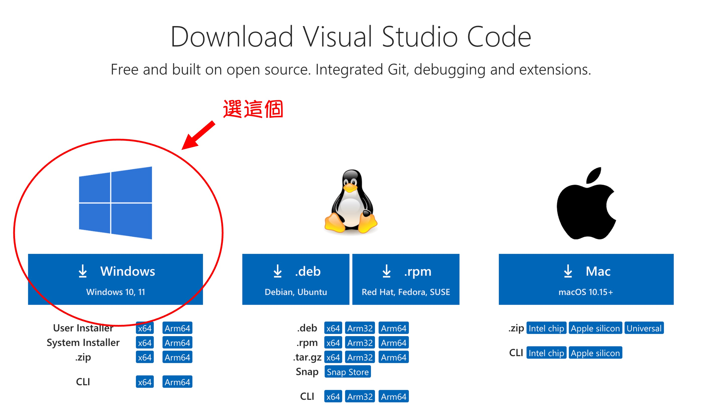

前陣子我收到一個必須基於 Windows 的系統進行開發的任務。

可真是久違了！距離上次使用 Windows 已經有好幾年了。

<!-- truncate -->

我先嘗試了幾個方法，最後決定使用 PowerShell 來配置 Python 環境。

本來想要使用 WSL 來配置，但這會把環境變成 Linux 環境...（？）

那我手邊就有 Linux 環境了，還要在 Windows 上配置幹嘛？

## 作業環境

這裡使用 Mac 所提供的虛擬環境工具：[**Parallels Desktop**](https://www.parallels.com/products/desktop/)。

透過 Parallels Desktop，大家都可以在 Mac 上順利地運行 Windows 系統，現在預設安裝的是 Windows 11。

:::tip
Apple M1 晶片是 ARM 架構，在剛推出時遇到許多相容性的問題，但過了幾年已經好很多了。
:::

## 安裝 Chocolatey

首先，我們需要啟動 PowerShell。

<div align="center">
<figure style={{"width": "70%"}}>

</figure>
</div>

Chocolatey 是一個基於 Windows 的包管理系統，它利用 NuGet 和 PowerShell 技術來自動化軟體的安裝、升級和管理過程。它類似於 Linux 上的 `apt-get` 或 `yum`，讓 Windows 用戶可以以一種簡單、一致的方式來管理軟體。

安裝 Chocolatey 相對簡單，只需要在以管理員身份運行的 PowerShell 中執行以下命令：

```powershell
Set-ExecutionPolicy Bypass -Scope Process -Force; [System.Net.ServicePointManager]::SecurityProtocol = [System.Net.ServicePointManager]::SecurityProtocol -bor 3072; iex ((New-Object System.Net.WebClient).DownloadString('https://community.chocolatey.org/install.ps1'))
```

安裝完成後，輸入以下命令驗證 Chocolatey 是否安裝成功：

```powershell
choco -v
```

如果看到 Chocolatey 的版本號，則表示安裝成功。

:::tip
上面這段指令的內容是這樣：

1. **Set-ExecutionPolicy Bypass -Scope Process -Force**:

   - 這段命令是設定 PowerShell 執行政策。
   - `Set-ExecutionPolicy` 用於更改執行政策，以允許或禁止執行 PowerShell 腳本。
   - `Bypass` 表示繞過所有執行政策，不進行任何限制。
   - `-Scope Process` 表示僅在當前 PowerShell 會話中應用此變更，不影響整個系統。
   - `-Force` 用於強制執行此操作而不提示確認。

2. **[System.Net.ServicePointManager]::SecurityProtocol = [System.Net.ServicePointManager]::SecurityProtocol -bor 3072**:

   - 這段命令是設定網路安全協議。
   - `[System.Net.ServicePointManager]::SecurityProtocol` 用於獲取或設置協議類型。
   - `-bor 3072` 表示將 TLS 1.2 (3072) 協議添加到現有的協議中。`-bor` 是位運算符，表示按位或操作，允許同時啟用多個協議。

3. **iex ((New-Object System.Net.WebClient).DownloadString('https://community.chocolatey.org/install.ps1'))**:
   - 這段命令是下載並執行 Chocolatey 的安裝腳本。
   - `iex` 是 `Invoke-Expression` 的縮寫，用於執行傳遞給它的字串內容。
   - `New-Object System.Net.WebClient` 用於創建一個新的 WebClient 對象，這個對象可以用來下載資料。
   - `.DownloadString('https://community.chocolatey.org/install.ps1')` 用於從指定的 URL 下載腳本內容。
   - 整體上，`iex ((New-Object System.Net.WebClient).DownloadString('https://community.chocolatey.org/install.ps1'))` 命令會下載並立即執行位於 'https://community.chocolatey.org/install.ps1' 的 PowerShell 腳本，該腳本負責安裝 Chocolatey。

簡單來說，這段指令的作用是：暫時設置 PowerShell 執行政策以允許腳本執行，配置網路安全協議以支持 TLS 1.2，然後下載並執行 Chocolatey 的安裝腳本。
:::

:::info
**Chocolatey 常用指令：**

- **安裝**
  ```powershell
  choco install <packageName>
  ```
- **升級**
  ```powershell
  choco upgrade <packageName>
  ```
- **列出已安裝的套件**
  ```powershell
  choco list --localonly
  ```
- **移除**
  ```powershell
  choco uninstall <packageName>
  ```
  :::

## 安裝 git

安裝完成後，繼續以管理員身份運行 PowerShell，並執行以下命令安裝 Git：

```powershell
choco install git -y
```

安裝完成後，輸入以下命令驗證 Git 是否安裝成功：

```powershell
git --version
# >>> git version 2.45.2.windows.1
```

## 安裝 Python

我們使用 pyenv 來管理 Python 版本。

:::tip
雖然市面上有很多選擇，例如 Anaconda、Miniconda、WinPython 等，但基於我的開發習慣，還是選擇了 pyenv。
:::

在 Windows 上安裝和使用 `pyenv` 通常不是直接進行的，因為 `pyenv` 是為 Unix-like 環境設計的。然而，可以使用 `pyenv-win` 這個項目，它是 `pyenv` 的一個 Windows 端口。

請跟著以下步驟：

### 步驟 1：安裝 `pyenv-win`

- [**參考資料： pyenv-win/docs/installation.md**](https://github.com/pyenv-win/pyenv-win/blob/master/docs/installation.md)

下載 `pyenv-win` 專案：

```powershell
Invoke-WebRequest -UseBasicParsing -Uri "https://raw.githubusercontent.com/pyenv-win/pyenv-win/master/pyenv-win/install-pyenv-win.ps1" -OutFile "./install-pyenv-win.ps1"; &"./install-pyenv-win.ps1"
```

如果你收到如下所示的任何 `UnauthorizedAccess` 錯誤，請使用「以管理員身分執行」選項啟動 Windows PowerShell 並執行：

```powershell
Set-ExecutionPolicy -ExecutionPolicy RemoteSigned -Scope LocalMachine
```

完成後，再重新執行上述安裝命令。

### 步驟 2：驗證安裝

1. **重啟 PowerShell**：

   - 關閉並重新打開 PowerShell 視窗，以應用環境變量更改。

2. **檢查 `pyenv` 安裝**：

   - 輸入以下命令檢查 `pyenv` 版本：

     ```powershell
     pyenv --version
     ```

### 步驟 3：使用 `pyenv` 安裝 Python 版本

1. **查看可用的 Python 版本**：

   - 使用以下命令列出所有可用的 Python 版本：

     ```powershell
     pyenv install --list
     ```

2. **安裝指定的 Python 版本**：

   - 例如，安裝 Python 3.10.11：

     ```powershell
     pyenv install 3.10.11
     ```

3. **設定全域 Python 版本**：

   - 這個步驟不是必要的，但是如果你想要在所有的 shell 中使用相同的 Python 版本，可以設置安裝的 Python 版本為全局默認版本：

     ```powershell
     pyenv global 3.10.11
     ```

4. **驗證 Python 安裝**：

   - 輸入以下命令驗證 Python 是否安裝成功：

     ```powershell
     python --version
     ```

## 安裝 VS Code

最後，我們安裝 Visual Studio Code 作為開發工具。

這邊可以到 [**VS Code 官網**](https://code.visualstudio.com/Download) 下載安裝程式，然後安裝就可以了。

<div align="center">
<figure style={{"width": "70%"}}>

</figure>
</div>

安裝完成之後，我們希望能夠在 PowerShell 中直接使用 `code` 命令來打開 VS Code。

所以現在需要把 VS Code 的安裝路徑加入到環境變量中，複製以下路徑：

```powershell
C:\Users\your_user_name\AppData\Local\Programs\Microsoft VS Code\bin
```

:::tip
記得將 `your_user_name` 替換為你的使用者名稱。
:::

## 題外話

其實我覺得 PowerShell 的展示畫面實在難以直視。

這個部分我會建議使用 [**oh-my-posh**](https://ohmyposh.dev/) 來美化 PowerShell 的外觀。

但這個部分不是本文的重點，有興趣的讀者請查看：

- [**教學課程 - 使用 Oh My Posh 設定 PowerShell 或 WSL 的自訂提示**](https://learn.microsoft.com/zh-tw/windows/terminal/tutorials/custom-prompt-setup)

## 結語

透過 PowerShell 可以快速地配置 Python 環境，並安裝開發工具。

當然，以上僅涵蓋了最基本的配置，留此文章作為參考。
