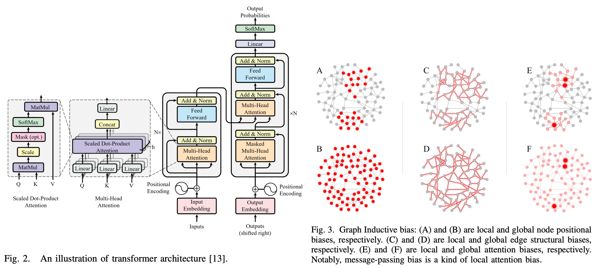

import GraphDemo from '@site/src/components/GraphDemo';
import GraphFeatureMatrixDemo from '@site/src/components/GraphFeatureMatrixDemo';

這篇文章也是因為在撰寫論文筆記時遇到了圖卷積網路。

篇幅實在太長了，只好單獨寫一篇來介紹一下。

<!-- truncate -->

拜 OpenAI 所賜，現在大家對 Transformer 非常熟悉。（應該吧？）

各種自注意力機制、多頭注意力機制、位置編碼等等，都是大家耳熟能詳的名詞。

所以在這裡借用一下 Transformer 的概念來解釋一下圖卷積網路。

## 圖卷積網路

圖卷積網路，原文為 Graph Convolutional Networks，又簡稱為 GCN。

它是一種在圖結構數據上進行深度學習的模型。與傳統的卷積神經網路（CNN）主要應用於規則網格數據（如圖像）不同，GCN 能夠處理不規則的圖結構數據，廣泛應用於社交網路、知識圖譜、生物信息學等領域。

圖的定義有兩個基本元素：

1. **節點（Node）**：代表數據中的實體，如人、物品或概念。
2. **邊（Edge）**：表示節點之間的關係，如朋友關係或物品相似性。

每個「節點」帶有各自的特徵向量，例如一個人，我們就會用身高、體重、年齡、性別、興趣等特徵來描述，這些特徵向量組成了「特徵矩陣（Feature Matrix）」。而「邊」的描述則是用「鄰接矩陣（Adjacency Matrix）」來表示。

鄰接矩陣是用來描述圖中節點之間連接關係的矩陣，對於一個有 $n$ 個節點的圖，鄰接矩陣 $A$ 是一個 $n \times n$ 的矩陣，其中：

- $A_{ij} = 1$ 表示節點 $i$ 和節點 $j$ 之間存在一條邊。
- $A_{ij} = 0$ 表示節點 $i$ 和節點 $j$ 之間不存在邊。

:::tip
到這邊先暫停一下，你有沒有覺得這個概念很熟悉？

- **這是不是像極了 Transformer 中注意力矩陣？**

所以我們往前類比一下，剛才我們說的：

- **節點（Node）**：就是 Transformer 中的 token。
- **邊（Edge）**：就是 token 之間的關係。
  :::

我們等一下再回來討論 Transformer 和 GCN 之間的對比，先繼續介紹 GCN 的基本概念：

鄰接矩陣性質與特點有：

- **對稱性**：如果圖是無向圖，則鄰接矩陣是對稱的，即 $A_{ij} = A_{ji}$。
- **自連接**：有些圖允許節點自連接，即 $A_{ii} = 1$，但在大多數情況下，通常設定為 $A_{ii} = 0$。

## 舉個例子

假設有三個人：Alice、Bob 和 Carol，他們的朋友關係如下：

- Alice 和 Bob 是朋友。
- Bob 和 Carol 是朋友。
- Alice 和 Carol 之間沒有直接的朋友關係。

這個關係可以表示為以下的鄰接矩陣：

$$
A =
\begin{bmatrix}
0 & 1 & 0 \\
1 & 0 & 1 \\
0 & 1 & 0
\end{bmatrix}
$$

在這個矩陣中：

- $A_{12} = A_{21} = 1$：表示 Alice 和 Bob 是朋友。
- $A_{23} = A_{32} = 1$：表示 Bob 和 Carol 是朋友。
- 其他元素為 0，表示沒有直接的朋友關係。

這個鄰接矩陣是「對稱的」，因此這個圖是一個「無向圖」。

轉成圖像的話，會長這樣：

<GraphDemo />

## 擴展鄰接矩陣

在實際應用中，鄰接矩陣還可以進一步擴展來表示更多信息，例如：

1. **加權鄰接矩陣**：

   如果朋友之間的關係強弱不同，我們可以用權重值來表示。例如，Alice 和 Bob 之間的互動次數為 3，Bob 和 Carol 之間的互動次數為 5，那麼加權鄰接矩陣可以表示為：

   $$
   A =
   \begin{bmatrix}
   0 & 3 & 0 \\
   3 & 0 & 5 \\
   0 & 5 & 0
   \end{bmatrix}
   $$

2. **有向鄰接矩陣**：

   如果朋友關係是有方向的（例如，Alice 主動聯繫 Bob，但 Bob 不主動聯繫 Alice），則鄰接矩陣會變為非對稱矩陣，例如：

   $$
   A =
   \begin{bmatrix}
   0 & 1 & 0 \\
   0 & 0 & 1 \\
   0 & 1 & 0
   \end{bmatrix}
   $$

   這裡 $A_{12} = 1$ 表示 Alice 主動聯繫了 Bob，而 $A_{21} = 0$ 表示 Bob 沒有主動聯繫 Alice。

## 特徵矩陣

除了鄰接矩陣，圖中的每個節點還可以包含一組特徵向量，這些特徵組成了**特徵矩陣（Feature Matrix）** $X$。

對於一個有 $n$ 個節點且每個節點有 $d$ 維特徵的圖，特徵矩陣 $X$ 是一個 $n \times d$ 的矩陣，其中第 $i$ 行表示節點 $i$ 的特徵向量。

假設每個人有兩個特徵：年齡和運動習慣（用 1 表示有，0 表示沒有），我們可以構造如下的特徵矩陣：

$$
X =
\begin{bmatrix}
35 & 1 \\
50 & 0 \\
22 & 1
\end{bmatrix}
$$

這裡的矩陣可以解讀為：

- 第一行 $[35, 1]$ 表示 Alice 年齡為 35 歲，有運動習慣。
- 第二行 $[50, 0]$ 表示 Bob 年齡為 50 歲，沒有運動習慣。
- 第三行 $[22, 1]$ 表示 Carol 年齡為 22 歲，有運動習慣。

我們用圓的大小來表示節點的年齡，用顏色來表示是否有運動習慣：

<GraphFeatureMatrixDemo />

## GCN 的數學

在了解了鄰接矩陣和特徵矩陣之後，我們可以深入探討圖卷積網路（GCN）的數學原理。

GCN 的核心思想是通過「卷積操作」在圖結構上進行資訊的傳遞和聚合，從而學習節點的表示（即嵌入向量）。

在傳統的卷積神經網路（CNN）中，卷積操作主要在圖像的空間結構上進行，利用卷積核在局部區域內提取特徵。同樣的，GCN 在圖的鄰域結構上進行操作，利用鄰接節點的信息來更新每個節點的特徵表示。

GCN 的每一層可以被視為一個**訊息傳遞機制**，其主要步驟包括：

1. **訊息聚合（Aggregation）**：從每個節點的鄰居節點收集資訊。
2. **訊息更新（Update）**：將聚合到的資訊與自身特徵結合，通過非線性函數進行更新。

GCN 的基本操作可以用以下公式來描述：

$$
H^{(l+1)} = \sigma\left(\hat{A} H^{(l)} W^{(l)}\right)
$$

其中：

- $H^{(l)}$ 是第 $l$ 層的節點特徵矩陣。對於第一層，$H^{(0)} = X$，即輸入的特徵矩陣。
- $W^{(l)}$ 是第 $l$ 層的可訓練權重矩陣。
- $\sigma$ 是非線性激活函數，如 ReLU。
- $\hat{A}$ 是**歸一化後的鄰接矩陣**，用於穩定訓練並考慮到節點的度（degree）。

直接使用原始的鄰接矩陣 $A$ 進行訊息傳遞可能導致特徵值過大或過小，影響模型的穩定性。

為此，我們對鄰接矩陣進行歸一化處理：

$$
\hat{A} = \tilde{D}^{-1/2} \tilde{A} \tilde{D}^{-1/2}
$$

其中：

- $\tilde{A} = A + I_n$，$I_n$ 是 $n \times n$ 的單位矩陣，這一步稱為**添加自連接**，即每個節點與自身相連。
- $\tilde{D}$ 是 $\tilde{A}$ 的度矩陣，對角線元素 $\tilde{D}_{ii} = \sum_j \tilde{A}_{ij}$。

這樣的歸一化確保了訊息傳遞時考慮到節點的度，避免某些節點因為度數過高或過低而影響整體學習效果。

我們繼續沿用上面提到的例子，鄰接矩陣 $A$ 和特徵矩陣 $X$ 的資訊如下：

$$
A =
\begin{bmatrix}
0 & 1 & 0 \\
1 & 0 & 1 \\
0 & 1 & 0
\end{bmatrix},
\quad
X =
\begin{bmatrix}
35 & 1 \\
50 & 0 \\
22 & 1
\end{bmatrix}
$$

- **步驟 1：添加自連接**

  首先，我們添加自連接，得到 $\tilde{A}$：

  $$
  \tilde{A} = A + I_3 =
  \begin{bmatrix}
  1 & 1 & 0 \\
  1 & 1 & 1 \\
  0 & 1 & 1
  \end{bmatrix}
  $$

- **步驟 2：計算度矩陣 $\tilde{D}$**

  $$
  \tilde{D} =
  \begin{bmatrix}
  2 & 0 & 0 \\
  0 & 3 & 0 \\
  0 & 0 & 2
  \end{bmatrix}
  $$

- **步驟 3：計算歸一化鄰接矩陣 $\hat{A}$**

  $$
  \hat{A} = \tilde{D}^{-1/2} \tilde{A} \tilde{D}^{-1/2} =
  \begin{bmatrix}
  \frac{1}{\sqrt{2}} & 0 & 0 \\
  0 & \frac{1}{\sqrt{3}} & 0 \\
  0 & 0 & \frac{1}{\sqrt{2}}
  \end{bmatrix}
  \begin{bmatrix}
  1 & 1 & 0 \\
  1 & 1 & 1 \\
  0 & 1 & 1
  \end{bmatrix}
  \begin{bmatrix}
  \frac{1}{\sqrt{2}} & 0 & 0 \\
  0 & \frac{1}{\sqrt{3}} & 0 \\
  0 & 0 & \frac{1}{\sqrt{2}}
  \end{bmatrix}
  $$

  計算結果為：

  $$
  \hat{A} \approx
  \begin{bmatrix}
  0.5 & \frac{1}{\sqrt{6}} & 0 \\
  \frac{1}{\sqrt{6}} & \frac{1}{3} & \frac{1}{\sqrt{6}} \\
  0 & \frac{1}{\sqrt{6}} & 0.5
  \end{bmatrix}
  $$

- **步驟 4：應用 GCN 層**

  假設我們有一個 GCN 層的權重矩陣 $W^{(0)}$：

  $$
  W^{(0)} =
  \begin{bmatrix}
  w_{11} & w_{12} \\
  w_{21} & w_{22}
  \end{bmatrix}
  $$

  則下一層的特徵矩陣 $H^{(1)}$ 為：

  $$
  H^{(1)} = \sigma\left(\hat{A} X W^{(0)}\right)
  $$

  具體計算過程如下：

  1.  **矩陣乘法**：首先計算 $\hat{A} X$：

      $$
      \hat{A} X \approx
      \begin{bmatrix}
      0.5 & \frac{1}{\sqrt{6}} & 0 \\
      \frac{1}{\sqrt{6}} & \frac{1}{3} & \frac{1}{\sqrt{6}} \\
      0 & \frac{1}{\sqrt{6}} & 0.5
      \end{bmatrix}
      \begin{bmatrix}
      35 & 1 \\
      50 & 0 \\
      22 & 1
      \end{bmatrix}
      =
      \begin{bmatrix}
      0.5 \times 35 + \frac{1}{\sqrt{6}} \times 50 + 0 \times 22 & 0.5 \times 1 + \frac{1}{\sqrt{6}} \times 0 + 0 \times 1 \\
      \frac{1}{\sqrt{6}} \times 35 + \frac{1}{3} \times 50 + \frac{1}{\sqrt{6}} \times 22 & \frac{1}{\sqrt{6}} \times 1 + \frac{1}{3} \times 0 + \frac{1}{\sqrt{6}} \times 1 \\
      0 \times 35 + \frac{1}{\sqrt{6}} \times 50 + 0.5 \times 22 & 0 \times 1 + \frac{1}{\sqrt{6}} \times 0 + 0.5 \times 1
      \end{bmatrix}
      $$

  2.  **應用權重矩陣 $W^{(0)}$**：將結果與 $W^{(0)}$ 相乘。

  3.  **應用非線性函數 $\sigma$**：通常使用 ReLU 函數，即 $\sigma(x) = \max(0, x)$。

通過這幾個步驟，GCN 能夠將每個節點的特徵與其鄰居的特徵結合起來，生成新的特徵表示。

這種訊息傳遞和聚合的機制使得 GCN 能夠捕捉圖結構中的局部和全局信息，從而在各種圖相關的任務中表現出色，如節點分類、圖分類和鏈接預測等。

在實際應用中，通常會堆疊多層 GCN，以捕捉更遠範圍的節點信息。

我們把每一層的輸出作為下一層的輸入，如此可以逐層提取更高層次的特徵表示。例如兩層 GCN 可以讓每個節點的表示包含其兩跳鄰居的信息，三層 GCN 則可以包含三跳鄰居的信息，以此類推。

## GCN vs Transformer

所以，回到我們一開始提到的問題：

圖神經網路和 Transformer 雖然它們的設計初衷和應用場景有所不同，但它們共享許多核心概念，例如節點、邊以及基於特徵矩陣進行的訊息傳遞與聚合，所以它們之間有什麼關係呢？

- **我們可以視 GCN 為 Transformer 的一種特例嗎？**

我們先回顧 GCN 和 Transformer 的核心公式：

- **GCN 的基礎更新公式**

  $$
  H^{(l+1)} = \sigma\left(\hat{A} H^{(l)} W^{(l)}\right)
  $$

  其中：

  - $H^{(l)}$：第 $l$ 層的節點特徵矩陣；
  - $\hat{A} = D^{-\frac{1}{2}} A D^{-\frac{1}{2}}$：加權正則化的鄰接矩陣；
  - $W^{(l)}$：第 $l$ 層的可學習權重矩陣；
  - $\sigma$：非線性激活函數。

  此公式通過鄰接矩陣 $\hat{A}$ 將節點特徵進行局部鄰域訊息的加權聚合，捕捉圖的結構信息與節點特徵。

- **Transformer 的自注意力機制公式**

  $$
  \text{Attention}(Q, K, V) = \text{softmax}\left(\frac{QK^\top}{\sqrt{d_k}}\right)V
  $$

  其中：

  - $Q, K, V$ 分別是查詢（Query）、鍵（Key）、值（Value）矩陣；
  - $d_k$ 是鍵向量的維度；
  - $\text{softmax}$ 用於正則化，確保權重和為 1。

  該公式實現了全局依賴學習，訊息聚合依賴於特徵之間的相似性動態計算，與固定的圖結構無關。

### 受限的注意力機制

若將 Transformer 的注意力矩陣限制於圖的鄰接矩陣（即 $\hat{A}$），並進一步假設注意力權重為固定值（由圖的靜態結構決定），則 Transformer 的自注意力公式可以簡化為：

$$
\text{Attention}(Q, K, V) = \text{softmax}\left(\frac{QK^\top}{\sqrt{d_k}}\right)V \rightarrow \text{softmax}(\hat{A}) V
$$

假設查詢、鍵和值矩陣 $Q, K, V$ 均來自相同的節點特徵矩陣 $H^{(l)}$，且權重矩陣 $W_Q = W_K = W_V = I$（單位矩陣），則公式變為：

$$
\text{Attention}(H^{(l)}, H^{(l)}, H^{(l)}) = \text{softmax}\left(\frac{H^{(l)} H^{(l)\top}}{\sqrt{d_k}}\right) H^{(l)}
$$

若進一步假設 $\text{softmax}\left(\frac{H^{(l)} H^{(l)\top}}{\sqrt{d_k}}\right) = \hat{A}$，即將注意力權重固定為經過正則化的鄰接矩陣，則自注意力公式簡化為：

$$
\text{Attention}(H^{(l)}, H^{(l)}, H^{(l)}) = \hat{A} H^{(l)}
$$

此時，Transformer 的更新公式變為：

$$
H^{(l+1)} = \sigma\left(\hat{A} H^{(l)} W^{(l)}\right)
$$

兩者對比之下，在 Transformer 中，自注意力機制允許每個節點與圖中所有其他節點進行訊息交互，形成全局依賴。這在數學上體現在注意力權重矩陣 $\text{softmax}\left(\frac{QK^\top}{\sqrt{d_k}}\right)$ 是一個全連接的權重矩陣，且權重是動態計算的。而在 GCN 中，訊息傳遞僅限於局部鄰域，權重矩陣 $\hat{A}$ 是稀疏且固定的。

### 權重學習的差異

在 Transformer 中，注意力權重是通過查詢和鍵的相似性動態學習的，具體的公式如下：

$$
\alpha_{ij} = \frac{\exp\left(\frac{Q_i K_j^\top}{\sqrt{d_k}}\right)}{\sum_{k} \exp\left(\frac{Q_i K_k^\top}{\sqrt{d_k}}\right)}
$$

其中 $\alpha_{ij}$ 表示節點 $i$ 對節點 $j$ 的注意力權重。這種動態計算允許模型根據不同的輸入數據自適應地調整權重，捕捉複雜的關聯性。

而在 GCN 中，權重由圖的鄰接結構決定，公式為：

$$
\hat{A}_{ij} = \frac{A_{ij}}{\sqrt{d_i d_j}}
$$

其中 $A_{ij}$ 是鄰接矩陣的元素，表示節點 $i$ 和節點 $j$ 是否相連，$d_i$ 和 $d_j$ 分別是節點 $i$ 和節點 $j$ 的度數。

這種固定的權重計算方式限制了模型的表達能力，但同時也降低了計算複雜度。

### 信息傳遞的範圍與效率

在 Transformer 中，信息可以跨越整個圖進行傳遞，這在數學上體現為全連接的注意力矩陣，計算複雜度為 $O(N^2)$，其中 $N$ 是節點數量。這使得 Transformer 在處理大規模圖時可能面臨計算瓶頸。

相比之下，GCN 的訊息傳遞僅限於局部鄰域，權重矩陣 $\hat{A}$ 是稀疏的，計算複雜度通常為 $O(N \cdot d)$，其中 $d$ 是節點的平均度數，這使得 GCN 在處理大規模圖時更加高效。

---

因此，從公式簡化的角度看：

1. **注意力矩陣受限於圖的鄰接矩陣 $\hat{A}$**：
   Transformer 原本的自注意力機制允許任意節點之間的訊息傳遞，而 GCN 則限制於圖的局部鄰域。這種限制意味著訊息傳遞範圍由圖的結構決定，而非動態學習。

2. **注意力權重為固定值**：
   Transformer 的自注意力權重是動態計算的，基於查詢和鍵的相似性。如果將其固定為 $\hat{A}$，即不再依賴於節點特徵的相似性，而完全依賴於圖的靜態結構，則這些權重變得不再可學習，而是固定的。

我們認為，基於以上兩個條件，GCN 確實可以被視為 Transformer 的特例。

:::tip
這裡要特別強調一下是：「我們認為」，這只是我們在學習的過程中的一種理解方式，謹代表個人觀點。

如果理解得不正確，歡迎指正！
:::

## 結論

圖卷積網路和 Transformer 有點像又不太像，各擅勝場。

在實際應用中，他們有各自的優勢，像是 Transformer 的自注意力機制允許模型根據數據特徵動態調整訊息傳遞的權重，這使其在處理複雜和多變的數據模式時具有無可比擬的優勢。而 GCN 的固定權重雖然在某些結構化數據中表現出色，但在需要動態關聯性的場景中則相對受限。

此外，GCN 更加適合處理具有明確圖結構的數據，如社交網路分析、知識圖譜、推薦系統等，能夠高效地利用圖的拓撲信息。而 Transformer 則在自然語言處理、計算機視覺等需要處理序列或高維數據的領域中表現優異，能夠捕捉長距離依賴和複雜模式。

圖卷積網路的主題非常龐大，還有各種變種和應用，我們在這裡只是介紹了一個基礎的概念。

希望通過這篇文章，能夠幫助你理解一些基本的圖卷積網路的原理和應用。

想知道更多關於 GCN 和 Transformer 的最新應用嗎？一起來看論文吧！

- [**[24.07] Graph Transformers: A Survey**](https://arxiv.org/abs/2407.09777)

   

   <figure style={{"width": "80%"}}>
   
   </figure>
   

:::tip
這篇論文裡面有兩百多篇參考文獻，每天看一篇，快樂一整年！（~並沒有~）
:::

## 參考文獻

- [**[16.09] Semi-Supervised Classification with Graph Convolutional Networks**](https://arxiv.org/abs/1609.02907)
- [**[17.06] Attention is All You Need**](https://arxiv.org/abs/1706.03762)
