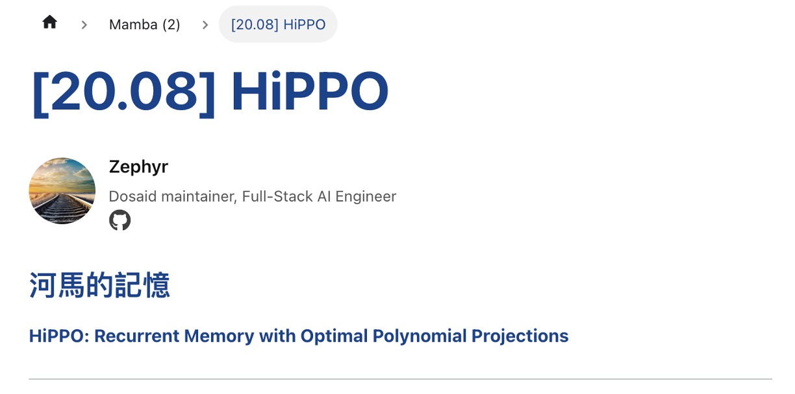

如果你也在用 Docusaurus 寫網站，那你一定知道 Docusaurus 有兩種主要的內容類型：

- 部落格使用的插件是：`@docusaurus/plugin-content-blog`
- 技術文件的部分則是: `@docusaurus/plugin-content-docs`

其中，只有 `blog` 有作者資訊的功能，而 `docs` 沒有。

哎呀，晴天霹靂！

<!-- truncate -->

## 先去問問原廠

我們首先到 Docusaurus 的 GitHub 上提出問題，看看原廠有沒有支援這個功能。

- [**How to add author info to docs? #10701**](https://github.com/facebook/docusaurus/discussions/10701)

    <div align="center">
    <figure style={{"width": "90%"}}>
    
    </figure>
    </div>

或許 Docusaurus 的作者可以大發慈悲，幫我們加上這個功能。

但等了一段時間，得到原廠的回覆：

<div align="center">
<figure style={{"width": "90%"}}>

</figure>
</div>

簡單來說，就是叫你自己想辦法，原廠不支援。

看來求人不如求己，我們只好硬著頭皮上了。

## 新增作者資訊

在原本的設計中，作者資訊放在 `blog/authors.yml` 這個檔案中，裡面內容大概長這樣：

```yml
Z. Yuan:
  name: Z. Yuan
  title: Dosaid maintainer, Full-Stack AI Engineer
  url: https://github.com/zephyr-sh
  image_url: https://github.com/zephyr-sh.png
  socials:
    github: "zephyr-sh"
```

我們先在相同路徑下，建立一個新的檔案 `blog/authors.json`，把同樣的內容改寫成 json 格式：

```json
{
  "Z. Yuan": {
    "name": "Z. Yuan",
    "title": "Dosaid maintainer, Full-Stack AI Engineer",
    "url": "https://github.com/zephyr-sh",
    "image_url": "https://github.com/zephyr-sh.png",
    "socials": {
      "github": "zephyr-sh"
    }
  }
}
```

:::info
我們在開發時，發現解析 YML 檔案的方式很麻煩，經過一輪測試，直接改 JSON 格式最簡單。
:::

:::tip
雖然這是要給 `docs` 用的檔案，但我們還是把它放在 `blog` 資料夾內，這樣更新時才會記得一起處理。
:::

## 提取 DocItem/Content

:::warning
從這個步驟開始，我們得去修改 Docusaurus 的原始碼。

之後 Docusaurus 若有破壞性的版本更新，該修改可能會導致網站無法正常運行，請確保你有維護網站的能力，再繼續進行。
:::

我們先把 `DocItemContent` 程式碼提取出來，請執行以下指令：

```shell
npx docusaurus swizzle @docusaurus/theme-classic DocItem/Content
```

執行後會遇到幾個問題：

1. **Which language do you want to use?**

   我們選擇 `JavaScript`。

2. **Which swizzle action do you want to do?**

   我們選擇 `Eject`.

3. **Do you really want to swizzle this unsafe internal component?**

   我們選擇 `YES: I know what I am doing!`.

---

現在你可以找到一個路徑： `src/theme/DocItem/Content`，裡面有一個 `index.js` 檔案，這就是我們要修改的地方。

- 這個程式的原始碼在這裡：[**docusaurus-theme-classic/src/theme/DocItem/Content**](https://github.com/facebook/docusaurus/blob/main/packages/docusaurus-theme-classic/src/theme/DocItem/Content)

修改後的程式碼如下：

```jsx
import { useDoc } from "@docusaurus/plugin-content-docs/client";
import { ThemeClassNames } from "@docusaurus/theme-common";
import DocItemAuthors from "@theme/DocItem/Authors";
import Heading from "@theme/Heading";
import MDXContent from "@theme/MDXContent";
import clsx from "clsx";
import React from "react";

function useSyntheticTitle() {
  const { metadata, frontMatter, contentTitle } = useDoc();
  const shouldRender =
    !frontMatter.hide_title && typeof contentTitle === "undefined";
  if (!shouldRender) {
    return null;
  }
  return metadata.title;
}

export default function DocItemContent({ children }) {
  const syntheticTitle = useSyntheticTitle();

  return (
    <div className={clsx(ThemeClassNames.docs.docMarkdown, "markdown")}>
      {syntheticTitle ? (
        <header>
          <Heading as="h1">{syntheticTitle}</Heading>
          <DocItemAuthors />
          <MDXContent>{children}</MDXContent>
        </header>
      ) : (
        <>
          <DocItemAuthors />
          <MDXContent>{children}</MDXContent>
        </>
      )}
    </div>
  );
}
```

主要新增一個模組

- `import DocItemAuthors from "@theme/DocItem/Authors";`

這個部分我們稍後實作。

## 實作 DocItem/Authors

現在我們來實作 `Authors` 這個元件，請執行以下指令：

```shell
mkdir -p src/theme/DocItem/Authors
touch src/theme/DocItem/Authors/index.js
touch src/theme/DocItem/Authors/styles.module.css
```

這個部分，我們是參考 `Blog` 的 `Authors` 元件，依樣畫葫蘆地實作出來。

- [**docusaurus-theme-classic/src/theme/Blog/Components/Author**](https://github.com/facebook/docusaurus/tree/main/packages/docusaurus-theme-classic/src/theme/Blog/Components/Author)

其中 `DocItem/Authors/index.js` 的程式碼如下：

```jsx
import { useDoc } from "@docusaurus/plugin-content-docs/client";
import authorsData from "@site/blog/authors.json";
import React from "react";
import {
  FaEnvelope,
  FaGithub,
  FaLinkedin,
  FaRss,
  FaStackOverflow,
  FaTwitter,
} from "react-icons/fa";
import styles from "./index.module.css";

function normalizeSocialLink(platform, handleOrUrl) {
  const isAbsoluteUrl =
    handleOrUrl.startsWith("http://") || handleOrUrl.startsWith("https://");
  if (isAbsoluteUrl) {
    return handleOrUrl;
  }
  switch (platform) {
    case "x":
      return `https://x.com/${handleOrUrl}`;
    case "github":
      return `https://github.com/${handleOrUrl}`;
    case "linkedin":
      return `https://www.linkedin.com/in/${handleOrUrl}/`;
    case "stackoverflow":
      return `https://stackoverflow.com/users/${handleOrUrl}`;
    case "newsletter":
      return handleOrUrl;
    case "email":
      return `mailto:${handleOrUrl}`;
    default:
      return handleOrUrl;
  }
}

const socialIconMap = {
  x: FaTwitter, // 使用 FaTwitter 代替 X 的圖示
  github: FaGithub,
  linkedin: FaLinkedin,
  stackoverflow: FaStackOverflow,
  email: FaEnvelope,
  newsletter: FaRss,
};

export default function DocItemAuthors() {
  const { frontMatter } = useDoc();
  let { authors } = frontMatter;

  if (!authors) {
    return null;
  }

  if (typeof authors === "string") {
    authors = [authors];
  }

  const resolvedAuthors = authors
    .map((authorKeyOrObj) => {
      if (typeof authorKeyOrObj === "string") {
        const authorInfo = authorsData[authorKeyOrObj];
        if (!authorInfo) {
          console.warn(
            `No author data found for key '${authorKeyOrObj}' in authors.json`
          );
          return null;
        }
        return {
          name: authorInfo.name,
          title: authorInfo.title,
          url: authorInfo.url,
          imageURL: authorInfo.image_url,
          socials: authorInfo.socials,
          description: authorInfo.description,
        };
      } else {
        const { name, title, url, image_url, imageURL, socials, description } =
          authorKeyOrObj;
        return {
          name,
          title,
          url,
          imageURL: imageURL || image_url,
          socials,
          description,
        };
      }
    })
    .filter(Boolean);

  if (resolvedAuthors.length === 0) {
    return null;
  }

  return (
    <div className={`${styles.docAuthors} margin-bottom--md`}>
      {resolvedAuthors.map((author, index) => {
        const { name, title, url, imageURL, socials, description } = author;
        return (
          <div key={index} className={styles.docAuthor}>
            {imageURL && (
              
            )}
            <div>
              <div className={styles.docAuthorName}>
                {url ? (
                  <a href={url} target="_blank" rel="noopener noreferrer">
                    {name}
                  </a>
                ) : (
                  name
                )}
              </div>
              {title && <div className={styles.docAuthorTitle}>{title}</div>}
              {description && (
                <div className={styles.docAuthorDesc}>{description}</div>
              )}

              {socials && (
                <div className={styles.docAuthorSocials}>
                  {Object.entries(socials).map(([platform, handleOrUrl]) => {
                    const SocialIcon = socialIconMap[platform] || FaEnvelope;
                    const normalizedUrl = normalizeSocialLink(
                      platform,
                      handleOrUrl
                    );
                    return (
                      <a
                        key={platform}
                        href={normalizedUrl}
                        target="_blank"
                        rel="noopener noreferrer"
                        className={styles.docAuthorSocialLink}
                      >
                        <SocialIcon size={20} />
                      </a>
                    );
                  })}
                </div>
              )}
            </div>
          </div>
        );
      })}
    </div>
  );
}
```

這裡有用到 `react-icons`，如果你沒有安裝，請執行以下指令：

```shell
yarn add react-icons
```

要注意到這裡有些地方我們是硬編碼的，例如：

```jsx
function normalizeSocialLink(platform, handleOrUrl) {
  const isAbsoluteUrl =
    handleOrUrl.startsWith("http://") || handleOrUrl.startsWith("https://");
  if (isAbsoluteUrl) {
    return handleOrUrl;
  }
  switch (platform) {
    case "x":
      return `https://x.com/${handleOrUrl}`;
    case "github":
      return `https://github.com/${handleOrUrl}`;
    case "linkedin":
      return `https://www.linkedin.com/in/${handleOrUrl}/`;
    case "stackoverflow":
      return `https://stackoverflow.com/users/${handleOrUrl}`;
    case "newsletter":
      return handleOrUrl;
    case "email":
      return `mailto:${handleOrUrl}`;
    default:
      return handleOrUrl;
  }
}

const socialIconMap = {
  x: FaTwitter, // 使用 FaTwitter 代替 X 的圖示
  github: FaGithub,
  linkedin: FaLinkedin,
  stackoverflow: FaStackOverflow,
  email: FaEnvelope,
  newsletter: FaRss,
};
```

如果這些社群網站的網址格式有變動，你可能需要修改這些地方。

最後是 `DocItem/Authors/styles.module.css` 的程式碼：

```css
.docAuthor {
  display: flex;
  align-items: center;
  margin-bottom: 2rem;
}

.docAuthorImg {
  width: 60px;
  height: 60px;
  border-radius: 50%;
  margin-right: 0.75rem;
  object-fit: cover;
}

.docAuthorName {
  font-weight: 600;
  font-size: 1rem;
  margin-bottom: 0.25rem;
  color: #111;
}

.docAuthorName a {
  text-decoration: none;
  color: inherit;
}

.docAuthorName a:hover {
  text-decoration: underline;
}

.docAuthorTitle {
  font-size: 0.85rem;
  color: #555;
  margin-bottom: 0.25rem;
  line-height: 1.2;
}

.docAuthorDesc {
  font-size: 0.85rem;
  color: #333;
  margin-bottom: 0.4rem;
  line-height: 1.4;
}

.docAuthorSocials {
  display: flex;
  gap: 0.5rem;
  flex-wrap: wrap;
  align-items: center;
}

.docAuthorSocialLink {
  display: inline-flex;
  align-items: center;
  text-decoration: none;
  color: inherit;
  line-height: 1;
}

.docAuthorSocialLink:hover {
  color: var(--ifm-color-primary);
}
```

這裡的實作方式就看個人風格了，我們測了幾次，這個樣式看起來還不錯。

你可以根據自己的需求，修改這些樣式。

## 調整文件的 FrontMatter

最後，為了讓 `docs` 的文件可以顯示作者資訊，我們需要在文件的 `FrontMatter` 中加入作者的資訊。

以我們的網站文章為例：[**[20.08] HiPPO: 河馬的記憶**](https://docsaid.org/papers/mamba/hippo)

這篇文章原本的寫法是這樣：

```mdx
# [20.08] HiPPO

## 河馬的記憶

[**HiPPO: Recurrent Memory with Optimal Polynomial Projections**](https://arxiv.org/abs/2008.07669)
```

現在為了加入作者資訊，我們「**不可以**」使用 `#` 作為標題，而是要使用 `FrontMatter` 來定義標題。

所以我們要修改成這樣：

```mdx
---
title: "[20.08] HiPPO"
authors: Z. Yuan
---

## 河馬的記憶

[**HiPPO: Recurrent Memory with Optimal Polynomial Projections**](https://arxiv.org/abs/2008.07669)
```

在 `authors` 的地方指定作者的名字，這樣就可以顯示作者資訊。

:::tip
請確保你的 `authors` 名字和 `authors.json` 中的名字一致，否則會顯示不出來。
:::

## 實作完成

最後，一起來看看網站上的效果：

<div align="center">
<figure style={{"width": "60%"}}>

</figure>
</div>

如上圖，我們終於成功的在 `docs` 的文件中加入了作者資訊，可喜可賀！

以上就是我們的實作過程，希望對你有所幫助。
