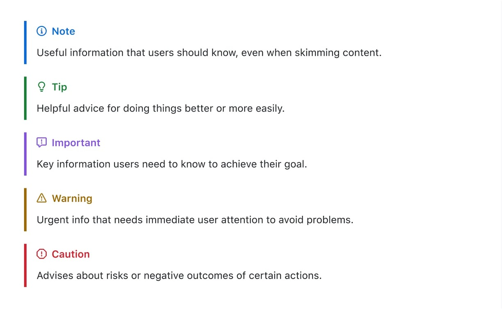

在 Github 上撰寫 README 檔案大家應該都不陌生，但大部分的時候，我們都只會用到一些基本的語法。

還有很多好看，好用的語法功能，不要就這樣錯過了！

<!-- truncate -->

## 基礎語法

我們花 10 秒時間，快速複習一下，常用的基礎語法大概有這些：

| 功能         | 語法                               | 範例                               |
| ------------ | ---------------------------------- | ---------------------------------- |
| **標題**     | `# 標題1`, `## 標題2`, `### 標題3` | `# 標題1`, `## 標題2`, `### 標題3` |
| **粗體**     | `**文字**` 或 `__文字__`           | `**加粗文字**`                     |
| **斜體**     | `*文字*` 或 `_文字_`               | `*斜體文字*`                       |
| **刪除線**   | `~~文字~~`                         | `~~刪除文字~~`                     |
| **引用文字** | `> 引用內容`                       | `> 這是一段引用`                   |
| **單行程式** | `` `代碼內容` ``                   | `` `print("Hello, World!")` ``     |
| **多行程式** | ```                                | `print("多行代碼")`                |
| **無序清單** | `- 項目` 或 `* 項目`               | `- 無序1` 或 `* 無序2`             |
| **有序清單** | `1. 項目`                          | `1. 有序1` <br /> `2. 有序2`       |
| **超連結**   | `[連結文字](網址)`                 | `[GitHub](https://github.com)`     |
| **分隔線**   | `---` 或 `***`                     | `---` 或 `***`                     |
| **表情符號** | `:表情代碼:`                       | `:smile:`, `:thumbsup:`            |

簡單！這些基礎語法大家都會。

除了上面這些，Markdown 其實還提供了不少進階用法，可以讓我們的文件更有條理。

以下我們來看幾個語法功能：

## 一、任務列表

任務列表可以將事項規劃、開發進度或待辦事項以核取方框的形式呈現。

尤其在多人協作時，能夠清楚顯示目前完成與未完成的項目，方便追蹤與分工。

### 寫法示範

```
- [x] 完成專案初始設定
- [ ] 撰寫使用者需求文件
- [ ] 整合前後端程式碼
```

以上範例中，`[x]` 代表已完成，`[ ]` 代表尚未完成。

在 GitHub 的 Issues、Pull Requests 或 Discussions 裏面，只要有人把某項工作核取完成，就能即時更新整個任務列表。

### 效果展示

- [x] 完成專案初始設定
- [ ] 撰寫使用者需求文件
- [ ] 整合前後端程式碼

---

## 二、警告訊息

警報可以在文件中呈現特殊的框線與圖示，用以顯示對讀者來說「不可忽視」的重要訊息。

此功能並非 Markdown 的原生語法，而是 GitHub 提供的擴充功能之一。

:::tip
由於是擴充功能，因此在其他 Markdown 編輯器或網站上可能無法正確顯示。

另外，這個部分跟 Docusaurus 的語法截然不同，因此在轉換時要特別注意。
:::

### 寫法示範

GitHub 提供五種不同的警報類型，分別是 `NOTE`、`TIP`、`IMPORTANT`、`WARNING` 與 `CAUTION`。

```markdown
> [!NOTE]
> Useful information that users should know, even when skimming content.

> [!TIP]
> Helpful advice for doing things better or more easily.

> [!IMPORTANT]
> Key information users need to know to achieve their goal.

> [!WARNING]
> Urgent info that needs immediate user attention to avoid problems.

> [!CAUTION]
> Advises about risks or negative outcomes of certain actions.
```

上述語法在 GitHub 上渲染後，就會呈現不同的底色與圖示，以區分註解、重要說明與警告等內容。

如果有多行內容需要加入警報框，只要在每行前面加上 `>` 符號即可，例如：

```markdown
> [!TIP]
> This is a tip.
>
> This is another tip.
```

### 效果展示

由於這裡無法直接展示效果，我們直接從 github 截圖來看：



## 三、腳註

在寫作長篇說明文件或論文式文本時，常需要加入參考來源或補充說明。

GitHub Markdown 提供了腳註功能，可在文件中以連結的方式呼叫補充資訊，讓文本保持整潔。

:::info
這個區塊是示範給自定錨點章節用的，不用理會。

[**點我，連到自定義的段落**](#my-custom-anchor)
:::

### 寫法示範

```markdown
在這個步驟中，我們會使用到特別的功能[^1]。

[^1]: 這裡可以寫更詳細的補充說明，也可以加入外部連結。
```

渲染後，文件正文中會有一個小型上標編號，讀者點擊後即可跳轉到文件下方的詳細註解。

### 效果展示

在這個步驟中，我們會使用到特別的功能[^1]。（👈 點點看那個小標）

[^1]: 示範給腳註章節用的補充說明。

## 四、跳脫字元

有些時候，我們希望在文件中顯示的某些字元恰好是 Markdown 的指令符號，例如星號（\*）、反引號（`）等。此時，就需要進行「跳脫」（Escaping），使這些符號不被解譯為 Markdown 語法。

### 寫法示範

```markdown
如果要顯示 `*` 號記號，可在前面加上反斜線：\*

Let's rename \*our-new-project\* to \*our-old-project\*.
```

### 效果展示

如果要顯示 `*` 號記號，可在前面加上反斜線：\*

Let's rename \*our-new-project\* to \*our-old-project\*.

## 五、自訂錨點

雖然標題都會自動生成錨點，方便直接連結到某一段內容，但有時我們可能希望在非標題處（例如特定段落或重要表格）也能提供超連結定位。這時可以利用手動插入的 HTML 錨點標籤。

### 寫法示範

1. 連到標題：

   ```markdown
   [連到「腳註」的章節](#三腳註footnotes)
   ```

2. 連到自定義的段落：

   ```markdown
   <a name="my-custom-anchor"></a>
   這裡是一個特別的段落，我們想要在文件內部能直接連過來。

   [連到自定義的段落](#my-custom-anchor)
   ```

無論是撰寫技術文件或教學指南，善用錨點都能有效提升使用者跳轉閱讀的效率。

### 效果展示

[**點我，連到「腳註」的章節**](#三腳註)

---

<a name="my-custom-anchor"></a>
**這裡是一個特別的段落，我們想要在文件內部能直接連過來。**

## 結語

透過這些功能，我們可以更加靈活地撰寫文件，並且提供更豐富的內容呈現方式。

希望這篇文章能夠幫助你更深入了解 GitHub Markdown 的進階語法，並且在撰寫文件時更加得心應手。

## 參考資料

- [**Basic writing and formatting syntax**](https://docs.github.com/en/get-started/writing-on-github/getting-started-with-writing-and-formatting-on-github/basic-writing-and-formatting-syntax)
