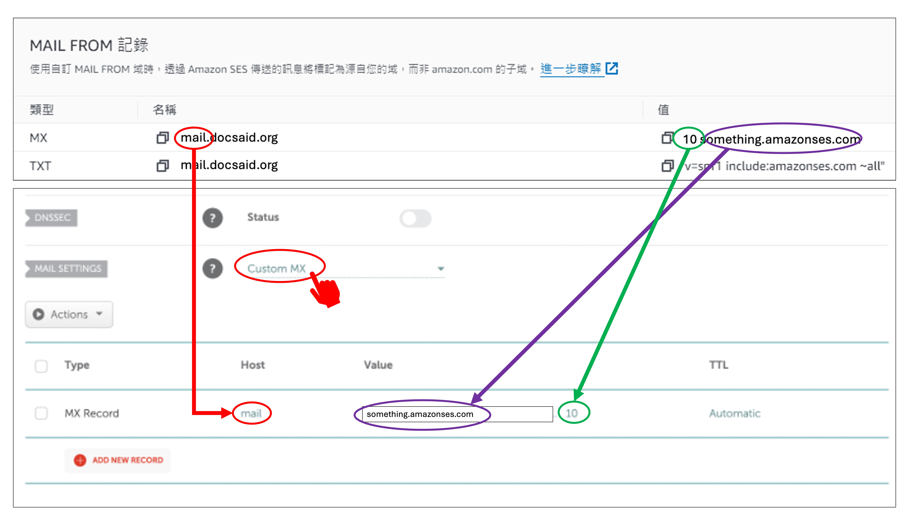
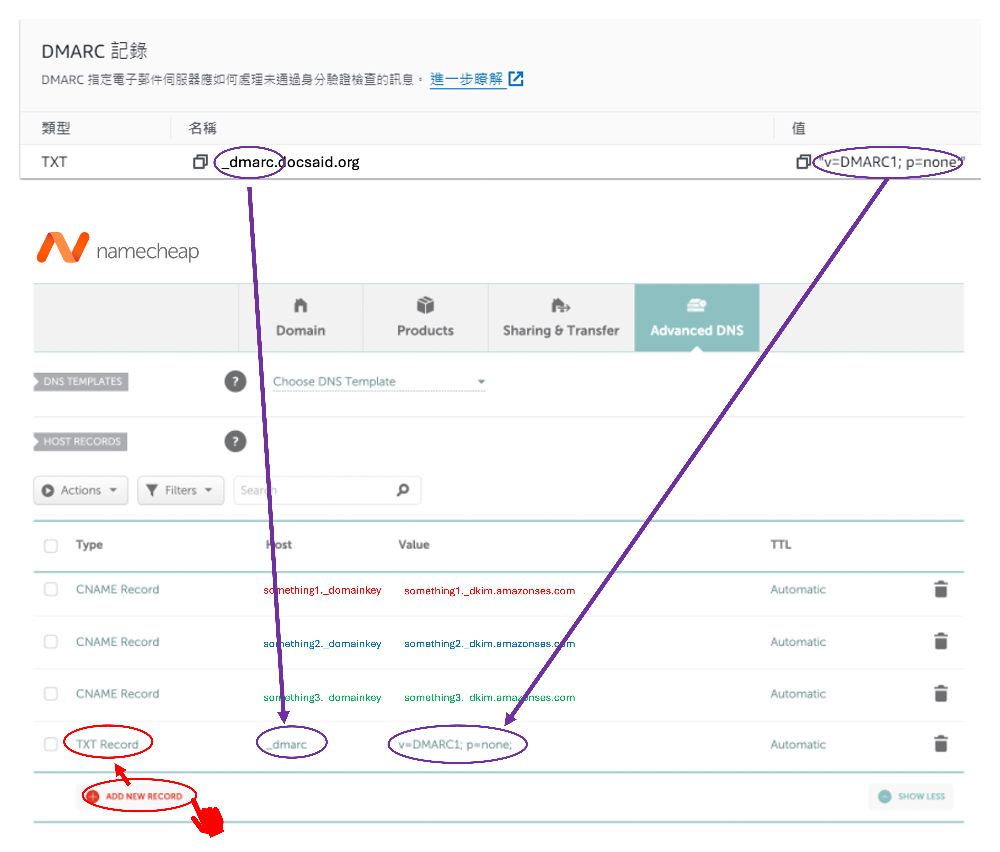

我們試著啟用 Amazon SES 服務，然後在驗證過程中，Amazon 要求我們設定 DNS 記錄。

這個過程花了我們好一陣子才找到正確的設定方法。(~半個小時~)

這裡紀錄一下，以便日後查詢。

<!-- truncate -->

## Amazon SES 設定

Amazon SES 設定已經有別人寫好的教學文章，內容完整，請參考這裡：

- [**Amazon SES 電子郵件服務，2024 最完整申請步驟教學**](https://www.quantsnote.com/amazon-ses-how-to-apply/)

我們一路順暢的走到「**驗證傳送網域**」這一步，然後卡住了。

因為我們使用的域名是在 Namecheap 購買的，所以我們需要在 Namecheap 上設定 DNS 記錄。

那麼，我們該怎麼設定呢？

## DNS Records

在 Amazon SES 的「**驗證傳送網域**」的卡片上，點選「**取得 DNS 紀錄**」，然後會出現一個提示框，裡面有一份詳細的 DNS 記錄，大概是長這樣：

這裡以我們自己的域名為例，上圖中的 `docsaid.org` 就是我們送去驗證的域名。

拿到這份 DNS 記錄後，我們就可以在 Namecheap 上設定了。

:::tip
每個欄位的原始資料我們稍作修改，保護一下我們自己的網站安全。
:::

## DKIM Records

打開 Namecheap 的網站，登入後，點選「**域名列表**」，然後找到我們要設定的域名，點選「**管理**」。

在域名管理頁面，找到「**Advanced DNS**」，點選進入。

如上圖，我們可以看到一個「**Add New Record**」的按鈕，點選，選擇「**CNAME Record**」。

把剛才我們看到的 DKIM 記錄輸入進去，輸入的時候有幾個注意事項：

1. DKIM 上的名稱要輸入到 `Host` 欄位，只要輸入域名前面的部分即可，不用包含域名。
2. 值要輸入到 `Value` 欄位，直接複製貼上即可。

## MAIL FROM Records

這個部分卡了我們最久，因為這個部分只需要輸入 MX 紀錄，另外一個可以不用管他。

在 Namecheap 的「**Advanced DNS**」頁面中，找到「**MAIL SETTINGS**」。然後在一旁的下拉選單中選擇「**Custom MX**」。

然後把 Amazon SES 提供的 MX 記錄輸入進去，有幾個注意事項：

1. 根據你在 Amazon SES 上所設定的子網域，輸入對應的 MX 記錄的 `Host` 欄位。在我們的範例中使用的是 `mail`，如果你使用的是其他的子網域，請輸入對應的子網域。
2. 值要輸入到 `Value` 欄位，這裡分為兩個部分：把 `10` 輸入到 `Priority` 欄位，後面剩下的部分輸入到 `Value` 欄位。

:::info
Namecheap 的 Mail Settings 只允許我們在 `Email Forwarding` 和 `Custom MX` 之間二選一：

- 如果啟用 `Email Forwarding`，Namecheap 會鎖住 MX 記錄，讓它只能指向自己的郵件轉發伺服器。
- 如果你啟用 `Custom MX`，我們就可以手動設定 Amazon SES 提供的 MX 記錄，這樣 Amazon SES 就可以處理退信。
  :::

## DMARC Records

這個部分設定最簡單，在 Namecheap 的「**Advanced DNS**」頁面中，找到「**Add New Record**」，選擇「**TXT Record**」。

然後把 Amazon SES 提供的 DMARC 記錄輸入進去，輸入的時候唯一的注意事項就是不要把 `"` 輸入進去。

## 小結

到這裡，我們就完成了 Amazon SES 在 Namecheap 上的 DNS 設定。

完成之後要稍待片刻，大約 30 分鐘左右，Amazon SES 就會自動驗證我們的 DNS 記錄。若一切正常，會收到來自 Amazon SES 的郵件通知，告訴我們驗證成功。

祝你好運！
