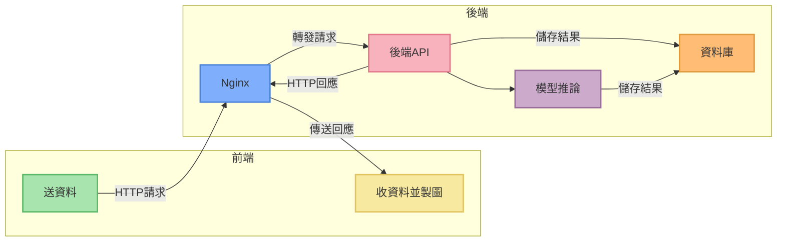
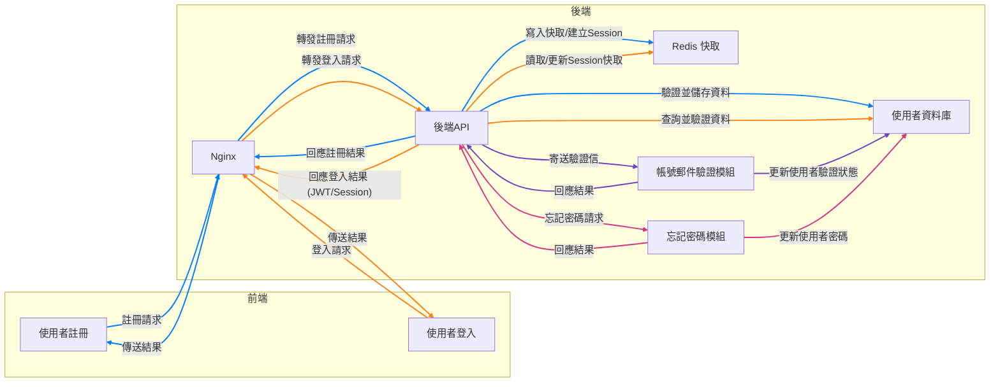
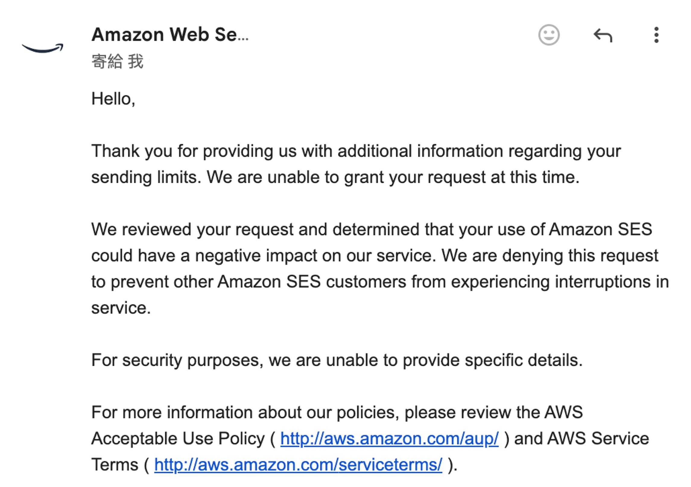
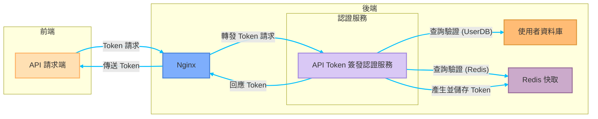
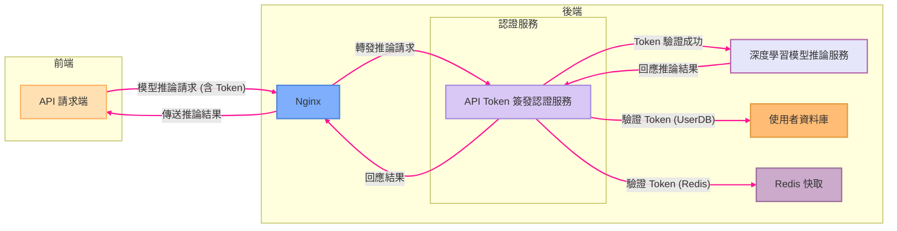

午安，或是晚安。

最近我在文章的更新上有點懈怠，先跟大家說聲抱歉。

因為我不務正業地跑去寫前後端了。

<!-- truncate -->

## 是不是吃飽撐著？

確實。

---

最近剛好放了個長假，終於可以騰出手來，整理以前沒時間解決的問題：

- **這個網站沒後台呀！**

你可能多少也知道一點，這個網站本身是基於 Docusaurus 框架所建立的靜態網站。當初我在架設這個網站時，只是抱持著偶爾寫點部落格、順手分享一些論文筆記的想法，並沒有特別的規劃或遠大的目標。

靜態網站和動態網站各自的優缺點應該不用我再多提，我之前也試著用 Wordpress 來架站，但走沒幾步就會跳出某個傢伙來跟你討錢，真的讓人倍感煩躁。最後嘗試幾輪之後又回到靜態網站的架構上。

有失有得，隨著網站內容逐漸累積，我開始收到越來越多來自讀者的來信，他們大多詢問的是模型使用上的問題，像是如何配置環境、安裝依賴套件，甚至是怎麼解決運行過程中碰到的奇怪錯誤。

這都是好解決的問題，請他們移駕去問 ChatGPT 就沒事了。（~也太隨便了吧？~）

比較棘手的需求是：有讀者希望可以直接呼叫我的後台 API 呀！

## 初代後台：極簡風

時間再往回推一點，寫了幾篇文章之後，我又總想要把模型開給大家玩，於是我做了幾個模型的 Demo，打造了第一代的後台：沒錯！就是這個網站的導航欄上面的「遊樂場」，如果你沒玩過的可以去玩玩看。

話說回來，想要讓模型在網頁上使用，一般來說有兩個解決方案：

- **1. 直接從網頁載入模型，然後用瀏覽器進行推論。**

  這個方案剛提出就被我自己否決了。

  因為這表示我得提供模型下載端點，後續衍生出來的流量問題就可以弄死我。

- **2. 提供後端服務，回傳推論結果。**

  這是我後來採用的方案。

  但也就意味著，不論如何我一定得手搓一個後端系統出來提供對應的服務。

---

由於前端已經用了 Docusaurus，這裡勢必得採用前後端分離的架構，在開始施工寫程式之前，先畫個架構圖。

其實我自己除了架構圖之外，還有開了一堆規格和系統操作流程，輸入輸出的細部設計等。不過在這裡就只畫架構圖就好，細節的部分太過於冗長，我就不贅述了。

這個架構做起來，應該要像這樣：

訂完規格後就是按圖施工，於是就成為現在網站上的「遊樂場」的背後運作邏輯。

到這邊，雖然看起來還算簡單，但還是可以聊一下我選用的技術線。

畢竟技術選型的背後，通常藏著一些看不見的小細節：

1. **Nginx**

   這邊常見的另外一個選擇是 Apache，它曾經是網頁伺服器界的王者，功能豐富、模組多樣、社群也龐大，用戶群非常廣泛。但 Apache 的設定稍顯複雜，而且對高併發連線的處理能力略遜於 Nginx。

   說實話，我並不覺得 Apache 不好，只是我實在太喜歡 Nginx 那種乾淨直觀的設定風格了。不論是靜態資源代理、反向代理還是負載均衡，Nginx 的設定方式總能直擊要害，一眼看懂。

   同時，Nginx 本身就是為了處理大量併發連線而設計的，穩定性與效能上也都經過了市場和時間的考驗，讓人用起來特別放心。

   ***

2. **FastAPI**

   會選擇使用 FastAPI，一部分原因確實是因為我自己比較熟悉 Python 的開發環境。如果現在突然轉去學 NodeJS 或其他語言的後端框架，對我來說會多出不少學習成本，可能會導致開發進度被拖延。

   除了熟悉度之外，FastAPI 的其他特性也讓我很難拒絕：它天然支援非同步（async）操作，非常適合用在後端模型推論這種耗時但又必須高效率處理併發請求的場景。再加上它內建了 Pydantic 驗證機制，可以直接自動生成 API 文件，甚至連測試介面都幫你準備好了，大幅減少了我在開發和維護 API 時的痛苦指數。

   更重要的是，FastAPI 的設計結構清晰、易懂，既不會像 Django 那樣笨重繁瑣，又不像 Flask 那樣自由得可能導致架構混亂，開發體驗可以說是剛剛好。

   ***

3. **PostgreSQL**

   說到資料庫，我以前更熟悉的是 MySQL。

   MySQL 在開發圈內的名聲當然不差，甚至是許多新手入門資料庫的首選，但自從 Oracle 收購之後，MySQL 的開源授權逐漸往商業化方向靠攏，讓整個生態系統的不確定性逐步提高，讓人有些擔心。

   相較之下，PostgreSQL 在開源社群裡卻呈現出一種穩定且逐步成長的良性狀態。除了持續的社群支持外，PostgreSQL 本身還支援許多強大的進階功能，比如原生的 JSON 資料類型、GIS 地理資訊處理等，讓它在複雜資料需求的情境下顯得更加靈活、實用。

   再加上 PostgreSQL 和 FastAPI 以及各種 ORM 工具（例如 SQLAlchemy）的整合非常順暢，使用起來的體驗相當愉快。不僅如此，PostgreSQL 在處理大量併發與高負載請求的能力也相當優秀，未來如果網站流量增加了，或後端需求變得更複雜了，至少不用擔心資料庫會成為瓶頸。

   ***

說這麼多，但這也不一定是最好的搭配，主要是可以足夠應付現階段的需求。

## 第二代後台：簡約風

回到開頭提到的問題，有讀者來信說想要直接透過程式呼叫我的後台 API。

原本設計的 API 單純提供網頁使用，沒有完整的安全機制和身份驗證流程，若直接對外開放，可能引來各種安全問題。因此，我必須自己動手建立了一套較為完整的 API 認證與授權系統。

但是我不懂啊！

雖然不懂，可是目標既然已經定了，還是要硬著頭皮上！

### 使用者登入系統

API 認證的前提，就是建立一個完整的使用者系統，包括使用者註冊、登入、權限管理、郵件驗證等功能。

除了原本就有的 FastAPI 和 PostgreSQL 資料庫之外，我又引入了 Redis 來處理 Session 快取和 Token 管理。為了使用者體驗更順暢，我也設計了郵件驗證及忘記密碼功能，使用 SMTP 服務寄送驗證郵件。

好的，到這裡又可以生出一張架構圖，我簡單畫一下：

這套使用者系統需要包含使用者資料庫、密碼加密、註冊郵件驗證、忘記密碼重設流程等各種細節。這裡還沒有考慮到串接第三方登入的服務，像是許多網站可以透過 Google 或是 Facebook 的帳號登入的功能。如果要串接第三方登入驗證的話，那又是一堆事情要做，暫時先留給未來的自己。

說到註冊郵件驗證的部分，這件事比想像中還要麻煩。

一開始我去申請 Amazon SES，結果等了一天之後，被對方拒絕，他們說覺得我看起來很可疑。（到底？）

<figure style={{"width": "60%"}}>

</figure>

好吧，那我自己架郵件伺服器總行了吧？

然後當我一頓操作把伺服器架好了之後，送出去的郵件直接被 Gmail 拒絕，他們也覺得我很可疑。（😭 😭 😭）

總之，經過一番波折，最後還是找了另外一個供應商搞定了這件事。

### API Token 簽發系統

搞定了使用者系統之後，終於可以來做 API Token 的功能了。

這邊我使用 JWT（JSON Web Token）機制來生成並驗證 Token。使用者透過登入驗證身份，而後系統產生 JWT 並儲存在 Redis。使用者發送 API 請求時，JWT 作為 Bearer Token 傳送至後端驗證身份。Token 驗證成功後，才能進一步存取後端的模型推論服務。

這裡就比較簡單，申請 Token 的架構圖畫起來長這樣：

當使用者拿到 Token 之後，就可以拿著這個 Token 來呼叫 API，這個部分的 Redis 用來作為限制流量和計算呼叫次數的元件。整體呼叫流程大致上是這樣：

## 技術堆疊小結

第二代後台主要就是做了以上兩個系統，使用者註冊和 API Token 簽發。

這一整套下來，技術堆疊變成了：

- **前端框架**：React（Docusaurus）
- **後端框架**：FastAPI（Python）
- **資料庫**：PostgreSQL
- **快取服務**：Redis
- **反向代理與負載均衡**：Nginx

其實除了 Redis 之外，這些東西在第一代後台內都有，只是沒有在前端配上一個頁面可以用來展示相關資訊。

趁著這次更新，也順便生出一份前端的後台頁面。

身為深度學習工程師，Python + FastAPI 就像家常便飯。這次只是把熟悉的工具拿來做個後台系統，說不上有多麼先進，但用起來確實順手不少。

在部署方面，我依然使用熟悉的 Docker Compose 搭配 Nginx 架設在自己的伺服器上。雖然我也想放到雲端主機上，但無奈成本太高，實在消費不起，只好先放在自己家裡的主機上將就一下。

總之，這個系統能用，先姑且這樣跑跑看吧。

## 最後

看論文雖然邏輯抽象，但只要讓我讀個幾次還是有機會能夠複現出來。

前端文件看似一目瞭然，但動手時每一步都可能暗藏陷阱，實在是奸詐無比。（~不熟就不熟，別怪東怪西！~）

以前深夜 Debug，是「loss 不收斂」、「GPU 又爆記憶體」這種 AI 工程師的常態，現在卻變成 React 一直報錯、表單按鈕不工作、後端取值規格對不上......

這還是在有 ChatGPT 可以問的情況下，要是回到上古時代（ChatGPT 發表前？），那這個後台能不能成功讓我做出來還真不好說。

之後我會再慢慢增加新的功能，如果你在使用上有遇到問題或是 Bug，基於安全保護，請私下寄信告訴我，我會非常感謝你。你可以附上圖片或是錯誤訊息，讓我可以快速定位問題，我會盡快解決。

如果你有什麼建議或心得，也歡迎在底下留言和我分享。

祝你在這裡玩得愉快。
