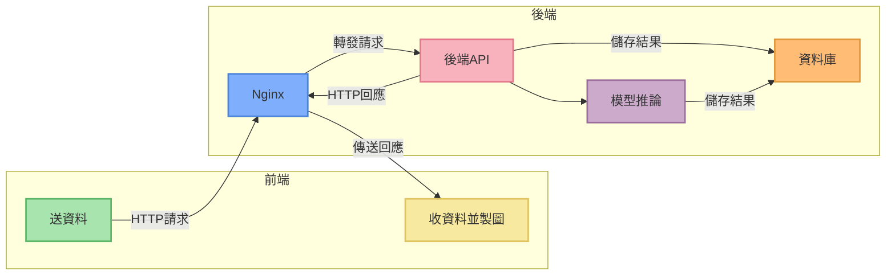
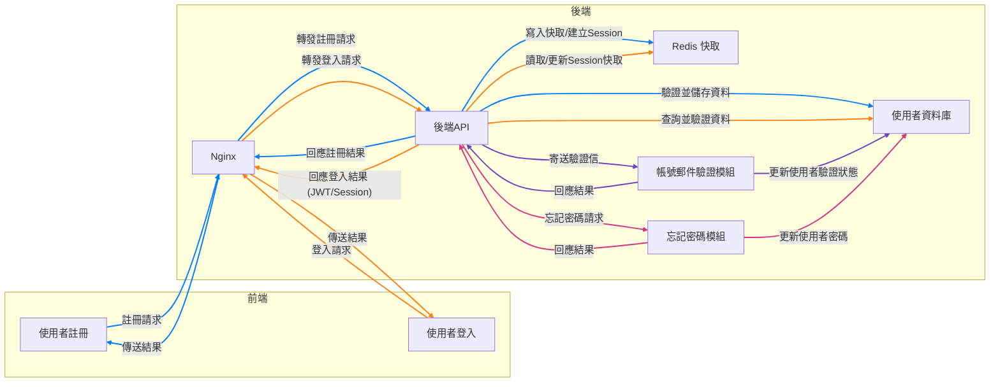
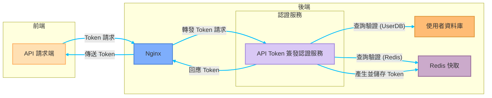
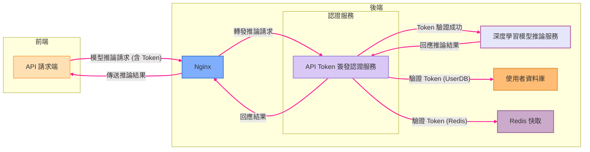
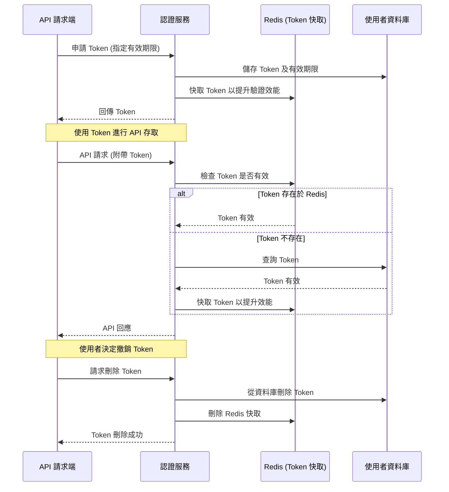
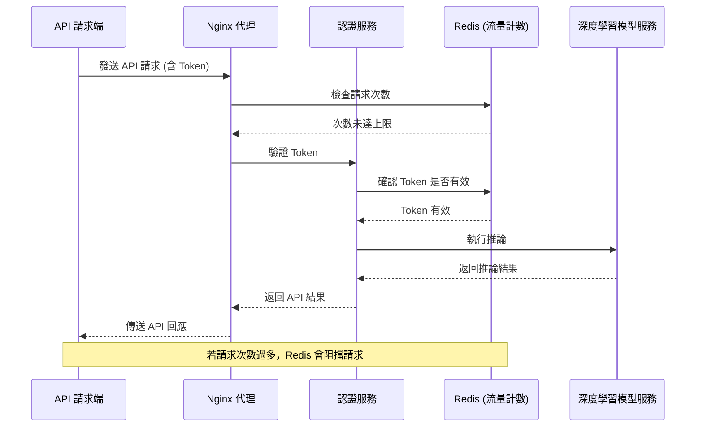

午安，或是晚安。

最近我在文章的更新上有點懈怠，先跟大家說聲抱歉。

因為我不務正業地跑去寫前後端了。

<!-- truncate -->

## 是不是吃飽撐著？

確實。

---

最近剛好放了個長假，終於可以騰出手來，整理以前沒時間解決的問題：

- **這個網站沒後台呀！**

你可能多少也知道一點，這個網站本身是基於 Docusaurus 框架所建立的靜態網站。當初我在架設這個網站時，只是抱持著偶爾寫點部落格、順手分享一些論文筆記的想法，並沒有特別的規劃或遠大的目標。

靜態網站和動態網站各自的優缺點應該不用我再多提，我之前也試著用 Wordpress 來架站，但走沒幾步就會跳出某個傢伙來跟你討錢，真的讓人倍感煩躁：

> **明明自己架站已經是件這麼收益微薄的事情了，怎麼還是有些人老是盯著我的荷包？**

而後又用 Wordpress 運行了一陣子，終究還是放棄了。

到也不全然是因為昂貴的付費服務，而是它的程式碼難以客製化......好吧，不推諉，我就承認我不會寫 PHP。

相比之下，還是前後端分離的架構要讓我覺得舒服多了。

後來的事情你也知道了，最後選了 Docusaurus 直到現在。繞了一圈，又回到靜態網站的架構上。

＊

隨著網站內容逐漸累積，我開始收到讀者的來信，通常是詢問的是模型使用上的問題：像是如何配置環境、安裝依賴套件，甚至是怎麼解決運行過程中碰到的奇怪錯誤。

這些都好解決，請他們移駕去問 ChatGPT 就沒事了。（~也太隨便了吧？~）

不隨便，現在的各種 AI 工具非常強，大多數的問題都可以直接問出答案，完全不需要浪費時間來跟我往來郵件。

當然，還是有 AI 無法解決的問題，例如：有讀者希望可以直接呼叫我的後台 API ！

嘿！看似很簡單的要求，實際執行起來的問題還不少，我們等等再聊。

## 初代後台：簡陋風

時間再往回推一點。

做了幾個模型之後，我又總想要把模型開給大家玩，那就像是你在海邊用沙子蓋了一座城牆，迫不急待地等待一個大浪來檢視你蓋的城牆是否堅固耐用？就算被浪花衝散了也無妨，至少有努力過了。

做模型也是一樣，我想應該沒有哪個工程師做完模型之後，會把它藏起來不讓大家知道......那還做它幹嘛？

於是我自己動手做了幾個模型的 Demo，打造了第一代的後台：沒錯！就是這個網站的導航欄上面的「遊樂場」，如果你沒玩過的可以去玩玩看。

你說做個 Demo 而已，哪需要什麼後台？

說得沒錯，一般來說，想要讓模型在網頁上使用，有兩個解決方案：

1.  **直接從網頁載入模型，然後用瀏覽器進行推論。**

    這個方案剛提出就被我自己否決了。

    在瀏覽器上面跑模型也不是不行，但是很麻煩，至少要支援三種以上瀏覽器，每一種的工作環境配置各有不同。這讓我想起了那些曾經被 WebAssembly 搞得半死的前端夥伴，如果他們知道我想這樣做，一定也會阻止我的。

2.  **提供後端服務，回傳推論結果。**

    這是我後來採用的方案。

    前端用來單純的收發資料，所有麻煩事都交給後端解決。但也就意味著，不論如何我一定得手搓一個後端系統出來提供對應的服務。

---

由於前端已經用了 Docusaurus，這裡勢必得採用前後端分離的架構。

在開始施工寫程式之前，先畫個圖。這個架構做起來，應該要像這樣：

其實除了架構圖之外，我開了一堆規格和系統操作流程，輸入輸出的細部設計等。不過太繁瑣了，我就不全部放在這裡，姑且只畫架構圖就好。

訂完規格後就是按圖施工，於是就成為現在網站上的「遊樂場」的背後運作邏輯。

到這邊，雖然看起來還算簡單，但還是可以聊一下我選用的技術線：

1. **Nginx**

   這邊常見的另外一個選擇是 Apache，它曾經是網頁伺服器界的王者，功能豐富、模組多樣、社群也龐大，用戶群非常廣泛。但 Apache 的設定稍顯複雜，而且對高併發連線的處理能力略遜於 Nginx。

   說實話，我並不覺得 Apache 不好，只是我比較喜歡 Nginx 那種乾淨直觀的設定風格。不論是靜態資源代理、反向代理還是負載均衡，Nginx 的設定方式比較容易理解。不過這個部分見仁見智，也是有人不喜歡這種設定風格。

   最後就是 Nginx 本身就是為了處理大量併發連線而設計的，穩定性與效能上也都經過了市場和時間的考驗，想來也是個不錯的選擇。

   ***

2. **FastAPI**

   後端框架常聽到的應該是 C# 或 NodeJS，但很遺憾地，我和他們都不熟。

   身為 AI 工程師，最熟悉的還是 Python 環境了。如果現在突然轉去學 NodeJS 或其他語言的後端框架，對我來說會多出不少學習成本，到時候開發進度再往後拖個幾個月也是很有可能。

   所以就選了 FastAPI 了。

   FastAPI 天然支援非同步操作，非常適合用在後端模型推論這種耗時但又必須高效率處理併發請求的場景。再加上它內建了 Pydantic 驗證機制，可以直接自動生成 API 文件，甚至連測試介面都幫你準備好了，大幅減少了我在開發和維護 API 時的痛苦指數。

   更重要的是，FastAPI 的設計結構清晰易懂，既不會像 Django 那樣笨重繁瑣，又不像 Flask 那樣自由得可能導致架構混亂，開發體驗可以說是剛剛好。

   ***

3. **PostgreSQL**

   說到資料庫，我其實更熟悉的是 MySQL。

   MySQL 在開發圈內的名聲當然不差，甚至是許多新手入門資料庫的首選，但自從 Oracle 收購之後，MySQL 的開源授權逐漸往商業化方向靠攏，讓整個生態系統的不確定性逐步提高，讓人有些擔心。

   相較之下，PostgreSQL 在開源社群裡卻呈現出一種穩定且逐步成長的良性狀態。除了持續的社群支持外，PostgreSQL 本身還支援許多強大的進階功能，比如原生的 JSON 資料類型、GIS 地理資訊處理等，讓它在複雜資料需求的情境下顯得更加實用。

   再加上 PostgreSQL 和 FastAPI 以及各種 ORM 工具（例如 SQLAlchemy）的整合非常順暢，使用起來的體驗相當愉快。不僅如此，PostgreSQL 在處理大量併發與高負載請求的能力也相當優秀，未來如果網站流量增加了，或後端需求變得更複雜了，至少不用擔心資料庫會成為瓶頸。

   ***

說這麼多，但這也不一定是最好的搭配，主要是可以足夠應付現階段的需求。

對我這個簡單的架構來說，足夠了。

## 第二代後台：簡約風

回到開頭提到的問題，有讀者來信說想要直接透過程式呼叫我的後台 API，而不需要透過網頁介面操作。這是一個有趣的需求，代表使用者可能希望以更自動化、更高效的方式與系統互動。

所以，直接開放 API 讓使用者自由呼叫，會衍生出什麼問題呢？

1. **會爆流量**

   當 API 直接對外開放，使用者可以透過程式高頻率地發送請求，這可能會導致伺服器流量激增，甚至超出負載能力。

   例如某些使用者可能不會設置適當的請求頻率，導致 API 在短時間內收到大量請求，影響其他使用者的正常存取。或是有人用爬蟲或惡意腳本來測試 API，伺服器的頻寬與運算資源可能會被大量佔用，影響服務穩定性。

   ***

2. **會有資安風險**

   開放 API 之後，如果沒有嚴格的身份驗證與存取控制，任何人都可能獲取不應該取得的資料，甚至執行危險操作。像是 API 沒有適當的身份驗證機制（如 OAuth、JWT），惡意人士可能透過簡單的請求模擬合法用戶，進而造成資安風險。

   ***

各種延伸的問題還可以再寫個兩千字，在此先略過不提。

總之就是不能直接開，因為我本人和我的主機可能會因此而往生。

所以為了要滿足開放 API 的需求，意味著我必須自己動手建立一套完整的使用者認證和 API 認證的授權系統。

好吧，那還是老話一句：工程師不怕菜，就怕不動手，我這就來寫程式吧！

### 使用者登入系統

一個完整的使用者系統，包括使用者註冊、登入、權限管理、郵件驗證等功能。

除了原本就有的 FastAPI 和 PostgreSQL 資料庫之外，我又引入了 Redis 來處理 Session 快取和 Token 管理；為了使用者體驗更順暢，我也設計了郵件驗證及忘記密碼功能，使用 SMTP 服務寄送驗證郵件。

好的，到這裡又可以生出一張架構圖，我簡單畫一下：

這套使用者系統需要包含使用者資料庫、密碼加密、註冊郵件驗證、忘記密碼重設流程等各種細節。這裡還沒有考慮到串接第三方登入的服務，像是許多網站可以透過 Google 或是 Facebook 的帳號登入的功能。如果要串接第三方登入驗證的話，那又是一堆事情要做，暫時先留給未來的自己。

說到註冊郵件驗證的部分，這件事比想像中還要麻煩。

一開始我去申請 Amazon SES，結果等了一天之後，被對方拒絕，他們說覺得我看起來很可疑。（到底？）

<figure style={{"width": "60%"}}>

</figure>

既然這樣，我自己架一台郵件伺服器總行了吧？

接著又是砰砰砰的一頓操作，耗時一天，終於架好了！

然後送出去的郵件卻還是被 Gmail 殘忍拒絕，因為他們也覺得我很可疑。（😭 😭 😭）

總之，經過一番波折，最後還是找了另外一個供應商搞定了這件事，就不再多提了。

就這樣花了一個多禮拜，終於把之前開出來的規格依序完成，儘管成果只是一個簡單的頁面，但還寫了上千行程式碼。感覺起來有種 CP 值很低的感覺。

程式寫到這裡，我已經可以理解為什麼不管在哪間公司內，前端跟後端總是會看對方不順眼，三天兩頭都在吵架和推卸責任了。只能說開規格真的很重要，哪怕都是我自己一個人寫，規格沒定好還是搞得自己灰頭土臉的。

### API Token 簽發系統

搞定了使用者系統之後，終於可以來做 API Token 的功能了。

目前較為常見的 Token 格式是 JWT（JSON Web Token），其中一個特性是 JWT 是自包含的（self-contained），只要驗證 Token 是否有效，就可以知道用戶的身份與權限，減少頻繁查詢資料庫的需求，提高效能。而且 JWT 內部可以存放用戶 ID、權限、有效期限等資訊，避免額外的 API 查詢。

所以我就直接拿來用了，使用者透過登入驗證身份，而後系統產生 JWT 並儲存在 Redis。使用者發送 API 請求時，JWT 作為 Bearer Token 傳送至後端驗證身份。Token 驗證成功後，才能進一步存取後端的模型推論服務。

這裡就比較簡單，申請 Token 的架構圖畫起來長這樣：

當使用者拿到 Token 之後，就可以拿著這個 Token 來呼叫 API，這個部分的 Redis 用來作為限制流量和計算呼叫次數的元件。整體呼叫流程大致上是這樣：

### API Token 管理機制

在設計 Token 時，我沒有做續期機制，而是讓使用者可以自行設定 Token 的有效期限，並提供手動撤銷與刪除機制，確保 API 存取權限的靈活性與安全性。

當使用者申請 Token 時，可以指定有效期限（例如 1 小時、1 天、7 天，甚至 1 年）。一旦 Token 到期，系統將自動失效，使用者需要重新申請新的 Token。

這樣的設計讓開發者可以根據自身需求選擇合適的 Token 期限，避免過於頻繁的重新授權。

使用者可以隨時撤銷或刪除 Token，如果發現 Token 洩漏或不再需要該 Token，可以直接刪除，立即失效。

Token 狀態儲存在 Redis，當使用者手動撤銷 Token，系統會立即將其標記為無效，後續 API 請求將被拒絕。這樣可以避免不必要的長期授權風險，並且確保系統的可控性。

這個流程的架構圖如下：

:::info
**為什麼不使用續期機制？**

- 讓使用者自行設定有效期限，可以提高 API 的彈性，避免系統過度干涉使用者的 Token 管理。
- 沒有續期機制，就能確保 Token 在設定的期限內是固定有效的，避免頻繁續期造成的額外驗證負擔。
- 手動撤銷 Token，確保當發現 Token 洩露或不再需要時，可以立即失效，提升安全性。

這樣的設計提供了一種簡單但可控的 Token 管理方式，適合需要長期存取但又希望保持安全性的使用者。
:::

### API 流量限制

有了 Token 之後，接下來的問題是：「如何防止惡意用戶濫用 API？」

由於 API 可能會涉及大量的推論請求（例如 AI 模型推論、批量查詢等），如果不做限制，很容易被惡意攻擊，甚至影響正常用戶的使用。因此，我在這裡引入 「Rate Limiting（速率限制）」 機制，透過 Redis 記錄請求次數，並在短時間內達到上限時，暫時阻擋請求。

這個流程的架構圖如下：

## 技術堆疊小結

這個網站的後台經過這次升級後，整體的技術堆疊更新如下：

- **前端框架**：React（Docusaurus）
- **後端框架**：FastAPI（Python）
- **資料庫**：PostgreSQL
- **快取服務**：Redis
- **反向代理與負載均衡**：Nginx

除了新加入的 Redis 之外，其實上述技術大多在第一代後台就已經存在，只是當時尚未有專門的前端頁面能夠清晰地呈現這些相關資訊。透過這次的改版，加入可以讓使用者動手操作的前端後台頁面，提供更多的服務和功能。

對我來說 Python 搭配 FastAPI 已是日常必備工具，雖然這套技術堆疊談不上特別創新，但確實大幅提升了開發效率與使用的順暢度。部署的部分，我還是使用自己熟悉的 Docker Compose 配合 Nginx，架設在家裡的主機上。雖然我也想放到雲端主機，但無奈成本太高（費用低的效能差），實在消費不起，只好先這樣將就一下。

總之，這個系統目前已經順利運轉，先跑跑看再持續觀察與改善吧。

## 最後

看論文時，雖然常常會覺得邏輯抽象，但只要反覆閱讀幾次，通常都還是能夠順利複現。（撇開算力不足的部分）

前端文件看似一目瞭然，但動手時每一步都可能暗藏陷阱，實在是奸詐無比。（~不熟就說！~）過去半夜 Debug 常常是在處理「Loss 無法收斂」、「GPU 記憶體不足」這些身為 AI 工程師的日常；現在反而變成了 React 頻繁報錯、表單按鈕失效，以及後端 API 規格對不上等等繁瑣問題。

更何況，這還是在有 ChatGPT 可以即時求救的狀態下完成的，要是回到上古時代（ChatGPT 發表前？），那這個後台能不能成功讓我做出來還真不好說。

之後我有空的話會再陸續增加更多功能，若你對此系統有其他建議或心得，歡迎隨時在留言區和我交流分享。

如果你在使用過程中發現了任何 Bug 或遭遇到問題，為了保護系統安全，請私下透過 Email 聯絡我，我會非常感激。如果還能提供詳細的錯誤訊息或畫面截圖，能讓我更快地定位並修復問題。

祝你在這裡玩得愉快！
