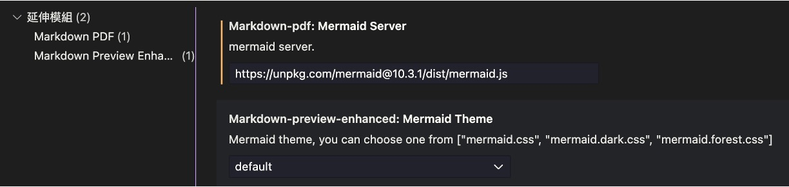

如果你想把 Markdown 文件轉成 PDF，那大概會找到幾個常見的工具。

我自己是在 VS Code 上使用 **Markdown PDF** 擴展來匯出 PDF。

<!-- truncate -->

## Markdown PDF

這個套件在我系統上長這樣：

<div align="center">
<figure style={{ "width": "70%"}}>

</figure>
</div>

Markdown PDF 優點在於：

- 直接呼叫 VS Code 的 **Command Palette → “Markdown PDF: Export (pdf)”** 即可產生 PDF，支援 HTML / PNG / JPEG 等多種輸出格式。
- 內建 _puppeteer_，能夠在無頭 Chrome 中渲染 HTML → PDF，因此數學式（KaTeX）、程式碼區塊高亮與 CSS 佈景都能完好保存。
- 允許自訂 **Mermaid Server** URL，這也是下面修復匯出錯誤的關鍵。

安裝後會在 `settings.json` 多出若干屬性，本篇聚焦 `markdown-pdf.mermaidServer`。

## Mermaid 匯出錯誤

當 Markdown 內含以下語法：

```text
graph TD
    A --> B
    A --> C
    B --> D
    C --> D
```

我借用一下本網站的基礎功能，把上面這一段渲染成 Mermaid 圖表，會長這樣：

<div align="center">

</div>

在使用上，其實一切正常，VS Code 預覽面板沒有任何錯誤，但 **匯出 PDF** 可能出現兩種情況：

1. **完全沒反應**：原本的 Mermaid 區塊在 PDF 中被解析為純文字，沒有圖表渲染。

   ```text
   graph TD
       A --> B
       A --> C
       B --> D
       C --> D
   ```

2. **炸彈圖示＋空白頁**：PDF  內只看得到 “💣” 或整頁空白，Mermaid 文字原樣出現。

我查了一下相關資料，大概的原因是 Markdown PDF 與最新版 Mermaid 之間的 **相容性衝突**。

自 Mermaid 10.4.0 起，官方改用 **ES Module** 發佈，舊版 puppeteer `evaluate()`  注入腳本無法正確執行，導致 “syntax error in text” 與空渲染現象。

## 解決方案

先講結論。

到設定頁面中，找到 `markdown-pdf.mermaidServer`，將其指向 **Mermaid 10.3.1** 的版本，如下圖：

<div align="center">
<figure style={{ "width": "90%"}}>

</figure>
</div>

把原本預設的網址：

```text
https://unpkg.com/mermaid/dist/mermaid.min.js
```

取代成：

```text
https://unpkg.com/mermaid@10.3.1/dist/mermaid.js
```

## 其他版本可行嗎？

我在 Github 翻了好一陣子，有找到幾個相關的 issue，像是：

- [**Markdown-pdf: Mermaid Server VSCode URL no longer resolves #312**](https://github.com/yzane/vscode-markdown-pdf/issues/312)
- [**[BUG] Mermaid Diagrams Not Rendered in Exported PDF #342**](https://github.com/yzane/vscode-markdown-pdf/issues/342)

以下兩則是蠻多人推薦的解決方案：

<div align="center">
<figure style={{ "width": "90%"}}>

</figure>
</div>

但經過我自己測試，只有 **10.3.1** 版本能正常轉換我所有圖表，包含 Graph、sequenceDiagram、gantt 這三種。至於其他圖表格式，像是 classDiagram、stateDiagram 等，可能需要你自己嘗試。

最後，如果你有什麼好方法或其他版本的成功經驗，歡迎在留言區告訴我。
