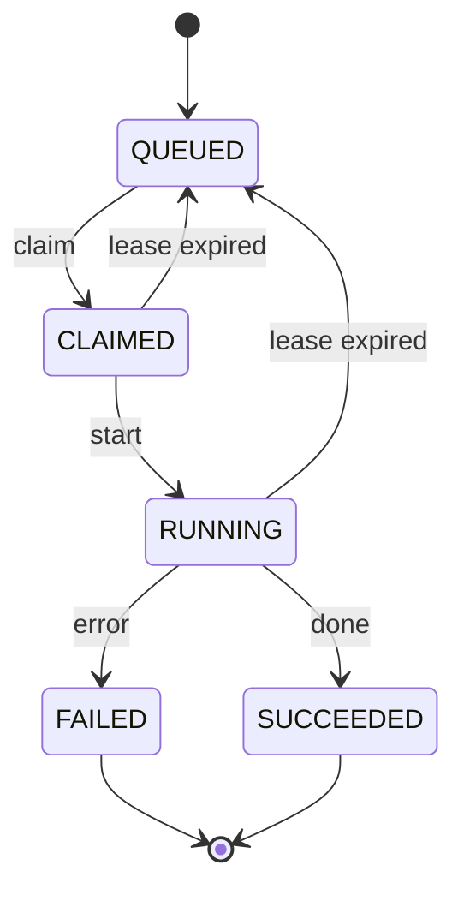

你以為 job queue 很簡單：

1. 撈一筆 `status = QUEUED`
2. 把它改成 `RUNNING`
3. 開始做事

直到某天你發現：

> **同一個 job，被跑了兩次。**

不是 log 重複，不是 UI 顯示錯誤，
是真的有兩個 worker，同時做了同一份工作。

很好，恭喜你，正式進入「併發的世界」。

<!-- truncate -->

## 問題其實不在 UPDATE

多數人第一個懷疑的是：

> UPDATE 不是會鎖資料嗎？
> 為什麼還能被同時改？

實際上，**真正的問題發生得更早**。

最常見、也最天真的寫法長這樣（示意）：

```text
worker A: SELECT ... LIMIT 1  -> 拿到 job_42
worker B: SELECT ... LIMIT 1  -> 也拿到 job_42
worker A: UPDATE job_42 -> RUNNING
worker B: UPDATE job_42 -> RUNNING
```

在你眼中，這是一個「合理順序」：

> 我先看，再改。

但在併發系統裡，這其實是兩個**完全獨立的世界線**。

關鍵不是 UPDATE 有沒有鎖住，
而是：

> **A 與 B 都在「還沒改之前」，就已經看到同一個事實。**

一旦這件事發生，後面再怎麼小心，其實都已經來不及了。

## 先把狀態機畫出來

如果你不把 job 的狀態機定義清楚，
後面所有邏輯都會變成：

> 「應該不會那麼剛好吧？」

這是一種極度危險的假設。

先給一個最基本、可維運的狀態機示意：

<div align="center">



</div>

你可以合併 `CLAIMED / RUNNING`，
也可以再拆出 `RETRYING / DEAD`。

這些都是設計選擇。

**但有一件事是不可妥協的**：

> **「claim」必須是原子的（atomic）。**

也就是說：

- 只能「完全成功」
- 或是「完全沒發生」
- 中間狀態不允許被其他 worker 觀察到

## 做法一

最穩定的方式是交易 + Compare-and-Swap。

這是最務實、最常見、也是最容易 debug 的做法。

核心思路只有兩個：

- 把 claim 包進一個**極短的 transaction**
- 用 `UPDATE ... WHERE old_state = ...` 當作 CAS

示意 SQL 如下（欄位請自行替換）：

```sql
BEGIN IMMEDIATE;

SELECT id
FROM jobs
WHERE queue = :queue
  AND status = 'QUEUED'
  AND retry_count < :max_retry
ORDER BY created_at ASC
LIMIT 1;

UPDATE jobs
SET status = 'CLAIMED',
    claimed_at = :now,
    retry_count = retry_count + 1
WHERE id = :id
  AND status = 'QUEUED';

COMMIT;
```

這裡真正重要的不是 SQL 長什麼樣，而是後面的判斷：

- 如果 `UPDATE` 影響筆數 **≠ 1**

  - 代表這筆 job 在你下手前，已經被別人搶走
  - 這時候應該要**當作 claim 失敗，重試即可**

這個 `AND status = 'QUEUED'`，
就是最便宜、但極度有效的 compare-and-swap。

## 做法二

如果你的 SQLite 版本夠新，可以把「選一筆 + 更新」濃縮成一個 `UPDATE … RETURNING` 的 statement：

```sql
UPDATE jobs
SET status = 'CLAIMED',
    claimed_at = :now,
    retry_count = retry_count + 1
WHERE id = (
  SELECT id
  FROM jobs
  WHERE queue = :queue
    AND status = 'QUEUED'
  ORDER BY created_at ASC
  LIMIT 1
)
RETURNING id;
```

好處很明確：

- 少一次 round-trip
- claim 語意集中在一個 SQL 裡
- 成功就是拿到 `id`，失敗就是空結果

但你仍然要記得：

> **它只是語法比較漂亮，本質仍然是在做 CAS。**

該有的索引、短交易、錯誤處理，一樣都不能少。

## 其他常見問題

1. **把 claim 包進大交易**

   claim 只是「占位」。

   如果你這樣寫：

   ```
   BEGIN;
   -- claim job
   -- 跑模型 / 打 API / 算半天
   -- 寫結果
   COMMIT;
   ```

   那你等於對所有 worker 宣告：

   > **「我會拿著寫鎖很久，請大家排隊。」**

   **對策**：
   claim 一個短 transaction；
   跑流程在交易外；
   寫結果再開新的短 transaction。

   ***

2. **忘了 worker 隔離**

   如果你有：

   - 不同 queue
   - 不同版本的處理邏輯
   - 不同優先級的 worker

   卻共用同一張 jobs 表，
   那你一定會遇到「撿到不該撿的 job」。

   **對策**：
   在 claim 的 `WHERE` 條件中，明確限制：

   - queue
   - version
   - capability

   讓 worker **只看到屬於自己的世界**。

   ***

3. **在 claim 時順便做清理**

   例如：

   - 順便掃過期 job
   - 順便 retry 失敗 job
   - 順便算統計

   這會讓 claim 的 critical section 不必要地變長。

   **對策**：
   「撿 job」與「掃垃圾」分成不同流程，
   不要讓它們互相影響。

## 小結

job queue 真正困難的地方，不在效能，而在正確性。

只要記住這三件事：

- **SELECT + UPDATE 不是原子操作**
- claim 必須用 CAS 思維設計
- 所有拿寫鎖的交易，都必須短到不能再短

做到這些，你就能避免掉那個直指靈魂的拷問：

> 「為什麼同一個 job 會跑兩次？」

## 參考資料

- [SQLite: Transactions](https://www.sqlite.org/lang_transaction.html)
- [SQLite: UPDATE (RETURNING clause)](https://www.sqlite.org/lang_update.html)
