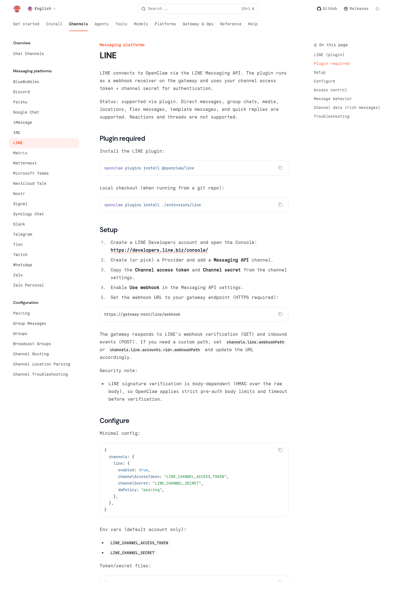
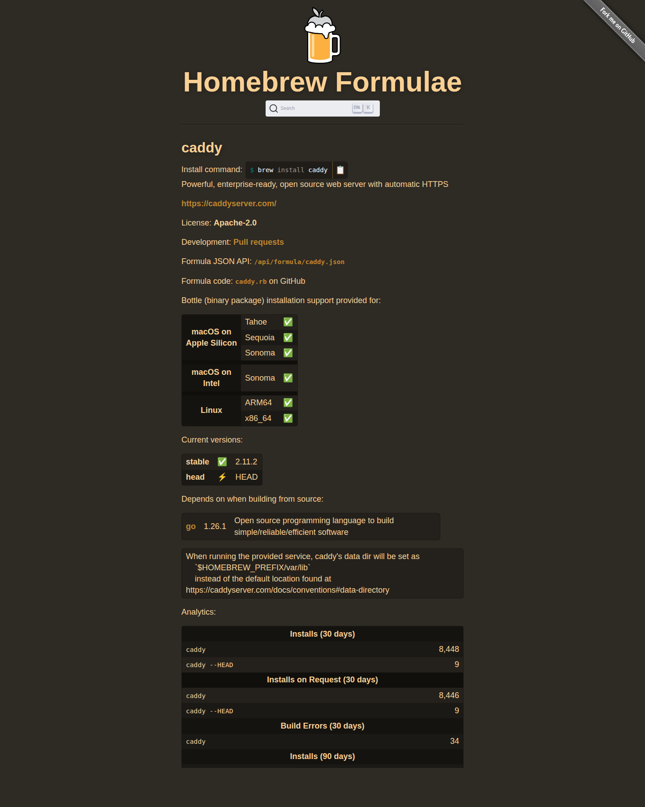
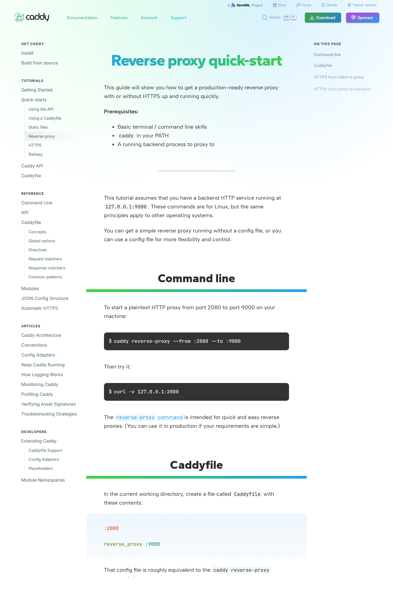
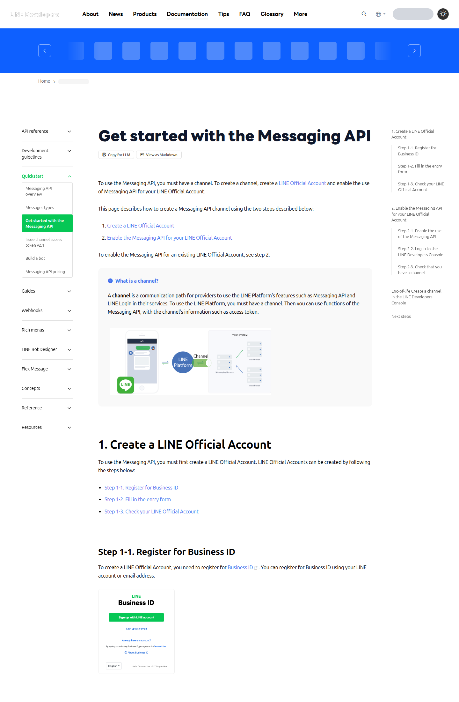

你如果已經把 OpenClaw 跑起來了，下一個很自然的想法通常是：

我不要每次都開 Dashboard。

我想直接在 LINE 找它。

這件事其實不難。

本質上就是把 **LINE 的 Webhook** 接到 **OpenClaw Gateway**，再把 **Channel access token** 和 **Channel secret** 填進 `~/.openclaw/openclaw.json`。

真正會卡住的，通常只有四個地方：

- LINE 現在的建立流程和以前不一樣。
- Webhook 一定要是公開的 `https://...`。
- `channelSecret`、`channelAccessToken` 很容易填錯位置。
- 你如果把整個 OpenClaw Dashboard 直接暴露到公網，風險會比你想像的大。

這篇就把完整流程拆開，一步一步做。

你照著做完，最後會得到這個結果：

- 你在 LINE 傳訊息給官方帳號
- LINE 把訊息丟到 OpenClaw 的 Webhook
- OpenClaw 交給 agent 回覆
- 你直接在 LINE 裡跟自己的 agent 對話

<!-- truncate -->

## 先確認 OpenClaw 這邊要開哪些能力

<div align="center">
<figure style={{"width": "92%"}}>

</figure>
</div>

*官方文件頁面截圖，擷取自 OpenClaw LINE docs（2026-03-14）。*

OpenClaw 官方的 LINE 文件，其實已經把最小可用設定講得很直接了：

- 先裝 `@openclaw/line`
- 在 `channels.line` 填 `channelAccessToken` 與 `channelSecret`
- 把 LINE Webhook 指到你的 gateway endpoint
- `dmPolicy` 可以先用 `pairing`

真正麻煩的通常不是 plugin 本身。

真正麻煩的是：

- 你的 OpenClaw 在本機
- LINE 需要公開的 HTTPS Webhook
- 你又不應該把整個 Dashboard 直接暴露出去

:::warning 不要把 Dashboard 直接公開到公網
OpenClaw 官方文件把 Dashboard 視為管理介面。它可以聊天、改設定、看 session，這不是應該直接對外開放的頁面。

正確做法是：

- Dashboard 只留在本機、SSH tunnel、Tailscale 或內網
- 對外只公開 `/line/webhook`
:::

## 你要先準備什麼

開始之前，先確認你有下面這些東西：

- 一台正在跑 OpenClaw 的主機
- 一個可用的公網 HTTPS 網址
- 一個 LINE 官方帳號
- 可以登入 LINE Official Account Manager 與 LINE Developers Console 的帳號

如果你還沒安裝 OpenClaw，官方目前建議的最短路徑是：

```bash
npm install -g openclaw@latest
openclaw onboard --install-daemon
openclaw gateway status
openclaw dashboard
```

如果 Dashboard 可以正常打開，代表 Gateway 已經起來了。

OpenClaw 官方文件目前也寫得很清楚：

- 設定檔在 `~/.openclaw/openclaw.json`
- Control UI 預設在 `http://127.0.0.1:18789/`

## 步驟 1：先把 LINE plugin 裝進 OpenClaw

LINE 不是 OpenClaw 核心內建通道，而是 plugin。

先在跑 Gateway 的那台機器上安裝：

```bash
openclaw plugins install @openclaw/line
```

裝完之後，重啟 Gateway：

```bash
openclaw gateway restart
```

如果你想先檢查 Gateway 狀態，可以再跑一次：

```bash
openclaw gateway status
```

## 步驟 2：如果 OpenClaw 跑在 mac 主機，反向代理要怎麼架？

這一段我重新拆清楚一點。

如果你的 OpenClaw 是跑在 mac 主機，尤其是家裡或辦公室那台 Mac，LINE 能不能打進來，通常要同時滿足四件事：

1. OpenClaw Gateway 仍然只聽本機 `127.0.0.1:18789`
2. 反向代理在 Mac 上接住外部 HTTPS
3. DNS 把你的網域指到正確的公網出口
4. 如果 Mac 在 NAT 後面，路由器要把 `TCP 443` 轉到這台 Mac

也就是說，**反向代理只是其中一層**。

如果你漏了第 3 或第 4 層，Caddy 寫得再漂亮，LINE 也還是打不到你。

### 2-1 先在 mac 上裝 Caddy

我這裡建議直接用 Homebrew，因為在 mac 上最省事。

<div align="center">
<figure style={{"width": "78%"}}>

</figure>
</div>

*官方頁面截圖，擷取自 Homebrew Formulae 的 `caddy` 頁面（2026-03-14）。*

先安裝：

```bash
brew install caddy
```

接著確認你的 Homebrew 前綴：

```bash
brew --prefix
```

大多數情況會是：

- Apple Silicon: `/opt/homebrew`
- Intel Mac: `/usr/local`

所以 `Caddyfile` 通常會落在：

```text
$(brew --prefix)/etc/Caddy/Caddyfile
```

如果你不想硬背路徑，直接用這個寫法就好。

### 2-2 Caddy 在這裡扮演什麼角色？

它只做一件事：

- 只放行 `/line/webhook`
- 其餘所有路徑直接 `404`

這樣你就不會把整個 OpenClaw 管理面暴露出去。

<div align="center">
<figure style={{"width": "92%"}}>

</figure>
</div>

*官方頁面截圖，擷取自 Caddy reverse proxy quick-start（2026-03-14）。*

### 2-3 實際 `Caddyfile` 怎麼寫？

先準備路徑：

```bash
BREW_PREFIX="$(brew --prefix)"
CADDYFILE="$BREW_PREFIX/etc/Caddy/Caddyfile"
mkdir -p "$(dirname "$CADDYFILE")"
```

然後把內容改成：

```caddy
{
    email you@example.com
}

line.example.com {
    @lineWebhook path /line/webhook

    reverse_proxy @lineWebhook 127.0.0.1:18789

    handle {
        respond "not found" 404
    }
}
```

這段設定的意思是：

- `line.example.com`：你打算給 LINE 用的公開網域
- `@lineWebhook path /line/webhook`：只匹配這條路徑
- `reverse_proxy @lineWebhook 127.0.0.1:18789`：只有這條路徑才轉給 OpenClaw
- `handle { respond "not found" 404 }`：其他任何網址都不要進 OpenClaw

你最後要交給 LINE 的網址會是：

```text
https://line.example.com/line/webhook
```

### 2-4 如果你的 Mac 在家裡網路，還要補兩個設定

很多人會卡在這裡。

如果你的 Mac 不在雲端主機，而是在家裡或辦公室，通常還要再做：

1. 把 `line.example.com` 的 DNS 記錄指到你的公網 IP
2. 在路由器上把 `TCP 443 -> 你的 Mac 區網 IP:443`

我建議你先把 Mac 固定成一個內網 IP，例如：

```text
192.168.1.50
```

不然哪天 DHCP 變了，路由器還在轉到舊 IP，Webhook 就會直接失效。

如果你發現自己是下面這幾種情況：

- 沒有自己的網域
- 沒辦法改 DNS
- 沒權限碰路由器
- ISP 給的是 CGNAT，根本不能做 inbound port forwarding

那就不要硬走「公網 IP + 443 轉發」這條路。

直接改走 tunnel 會更實際。

### 2-5 在 mac 上先用前景模式驗證一次

第一次不要急著做成常駐 service。

先直接在前景跑起來，確定路徑和憑證都對：

```bash
BREW_PREFIX="$(brew --prefix)"
CADDYFILE="$BREW_PREFIX/etc/Caddy/Caddyfile"

caddy validate --config "$CADDYFILE"
sudo caddy run --config "$CADDYFILE"
```

如果你看到 Caddy 開始申請憑證或已經開始 listening，先不要關掉這個 terminal。

開另一個 terminal 做檢查：

```bash
curl -i https://line.example.com/
curl -i https://line.example.com/line/webhook
```

你想看到的結果是：

- `https://line.example.com/` 回 `404 not found`
- `https://line.example.com/line/webhook` 不要回到你自己寫的 `404`

第二個請求因為你是用 `GET`，它有可能回：

- `400`
- `404` 以外的 OpenClaw / webhook 錯誤
- `405 Method Not Allowed`

這都沒關係。

重點是：**它必須真的打到 OpenClaw，而不是被你自己的 fallback 404 吃掉。**

等你確認沒問題之後，再決定要不要把 Caddy 做成常駐服務。

:::tip mac 主機的實務建議
如果你只是第一次接 LINE，我強烈建議：

1. 先讓 OpenClaw 正常跑在 `127.0.0.1:18789`
2. 先用 `sudo caddy run` 前景驗證
3. 確認 LINE Developers Console 的 `Verify` 會過
4. 最後再做成長期常駐服務

這樣排錯最省時間。
:::

## 步驟 3：建立 LINE 官方帳號與 Messaging API

這邊最容易踩到舊教學。

**目前的 LINE 流程和以前不同。**

依照 LINE 官方文件，**自 2024 年 9 月 4 日起**，你已經不能直接在 LINE Developers Console 裡新建 Messaging API channel。正確順序是：

1. 先到 LINE Official Account Manager 建立官方帳號
2. 再到 LINE Developers Console 看到對應的 Messaging API channel

### 3-1 建立 LINE 官方帳號

先到：

- `https://manager.line.biz/`

建立一個新的 LINE 官方帳號。

完成後，再登入：

- `https://developers.line.biz/console/`

挑選對應的 Provider，就會看到剛剛那個官方帳號綁定的 Messaging API channel。

### 3-2 打開 Messaging API 設定

如果你現在看到的頁面網址長這樣：

```text
https://developers.line.biz/console/channel/.../messaging-api
```

那代表你**已經在對的地方了**。

先別急著切頁。

你現在這個頁面裡，真正有用的欄位其實只有幾個。

<div align="center">
<figure style={{"width": "92%"}}>

</figure>
</div>

*官方文件頁面截圖，擷取自 LINE Messaging API getting started（2026-03-14）。實際 console 畫面會依你的帳號狀態略有差異。*

### 3-2-1 先講結論：哪些欄位要理，哪些不用理？

如果你現在頁面上看到的是這些欄位：

- `Bot basic ID`
- `QR code`
- `Webhook settings`
- `Allow bot to join group chats`
- `Auto-reply messages`
- `Greeting messages`
- `Channel access token (long-lived)`

那你可以直接這樣理解：

- `Bot basic ID`：先不用管
- `QR code`：先不用管
- `Webhook URL`：要填
- `Allow bot to join group chats`：先維持 `Disabled`
- `Auto-reply messages`：要關掉
- `Greeting messages`：要關掉
- `Channel access token (long-lived)`：要產生並複製

真正會讓人卡住的是這一點：

> **`Channel secret` 不在這個頁面。**

它通常在同一個 channel 左側的：

- `Basic settings`

也就是說，OpenClaw 需要的兩個值，LINE 是拆在兩個地方給你的：

- `Channel access token`：在你目前這個 `Messaging API` 頁
- `Channel secret`：在 `Basic settings` 頁

### 3-2-2 你現在這個 `Messaging API` 頁面，照這個順序做

先只做這四件事。

1. 在 `Webhook settings` 區塊找到 `Webhook URL`
2. 填上：

```text
https://line.example.com/line/webhook
```

如果你是用 nginx 那種前置代理，這裡就填你真正對外的網址，例如：

```text
https://api.docsaid.org/line/webhook
```

3. 儲存後按 `Verify`
4. 往下找到 `Channel access token (long-lived)`，按 `Issue` 或 `Reissue`，把 token 複製起來

如果 `Verify` 成功，代表 LINE 已經打得到你的 OpenClaw Webhook 入口。

如果 `Verify` 失敗，不要先懷疑 LINE。

先檢查：

- `https://.../line/webhook` 是否真的可從外網連到
- nginx / caddy 是否真的把 `/line/webhook` 轉到 OpenClaw
- OpenClaw 是否真的在目標主機上 listening

### 3-2-3 然後切到 `Basic settings`，把 `Channel secret` 複製下來

這一步是舊文章最容易讓人看不懂的地方。

很多人會一直在 `Messaging API` 頁面找 `Channel secret`，然後完全找不到。

那不是你眼殘。

是因為它本來就不在這頁。

你要做的是：

1. 在左側切到 `Basic settings`
2. 往下找 `Channel secret`
3. 按 `Issue`、`Show`、或複製按鈕
4. 把這個值存起來

到這裡為止，你才算真的拿齊 OpenClaw 需要的兩個憑證：

- `channelAccessToken`
- `channelSecret`

### 3-2-4 最後再回到 `Messaging API` 頁，處理官方帳號預設功能

你在目前這個頁面上，還會看到：

- Greeting messages
- Auto-reply messages

這兩個欄位旁邊通常會有 `Edit`。

按下去之後，LINE 會把你帶到 `LINE Official Account Manager`。

你要做的事情很單純：

- 把 `Greeting messages` 關掉
- 把 `Auto-reply messages` 關掉

不然你很容易看到這種情況：

- LINE 官方帳號先回一段預設文案
- OpenClaw 再回一段 agent 回覆

最後聊天室看起來像兩個 bot 在搶話。

### 3-3 如果你現在就卡在這個畫面，只要完成這份清單就夠了

你目前這個 `Messaging API` 畫面，請直接照這份 checklist：

1. `Webhook URL` 填 `https://你的網域/line/webhook`
2. 按 `Verify`
3. 在 `Channel access token (long-lived)` 產生 token 並複製
4. 點 `Edit` 去把 `Auto-reply messages` 關掉
5. 點 `Edit` 去把 `Greeting messages` 關掉
6. 再切去 `Basic settings` 複製 `Channel secret`

做完這六步，你就可以回到 OpenClaw 設定檔了。

## 步驟 4：把 LINE 憑證填進 OpenClaw

現在回到 OpenClaw 主機。

打開設定檔：

```bash
openclaw config file
```

預設通常會是：

```text
~/.openclaw/openclaw.json
```

在這個檔案裡加入最小可用設定：

```js
{
  channels: {
    line: {
      enabled: true,
      channelAccessToken: "LINE_CHANNEL_ACCESS_TOKEN",
      channelSecret: "LINE_CHANNEL_SECRET",
      dmPolicy: "pairing",
      groupPolicy: "disabled",
    },
  },
}
```

這裡幾個欄位的意思是：

- `enabled: true`：打開 LINE 通道
- `channelAccessToken`：LINE API 呼叫用的 token
- `channelSecret`：驗證 Webhook 簽章用的 secret
- `dmPolicy: "pairing"`：陌生人先拿配對碼，核准後才正式聊天
- `groupPolicy: "disabled"`：先不要讓群組直接打進來，簡化第一天的設定

如果你不想把 token 明文寫在設定檔，也可以改用檔案方式：

```js
{
  channels: {
    line: {
      enabled: true,
      tokenFile: "/Users/yourname/.secrets/line-token.txt",
      secretFile: "/Users/yourname/.secrets/line-secret.txt",
      dmPolicy: "pairing",
      groupPolicy: "disabled",
    },
  },
}
```

這對正式環境比較好。

## 步驟 5：驗證設定沒有寫壞

先驗證設定檔：

```bash
openclaw config validate
```

如果沒報錯，再重啟 Gateway：

```bash
openclaw gateway restart
openclaw gateway status
```

如果你是直接在本機編輯 `~/.openclaw/openclaw.json`，OpenClaw 多數情況會自動熱更新，但我還是建議第一次接 LINE 時手動重啟一次，省得卡在舊狀態。

## 步驟 6：做第一次對話測試

現在進入真正的測試。

1. 在 LINE 裡把你的官方帳號加入好友。
2. 傳一則簡單訊息，例如：`hello`
3. 因為你剛才把 `dmPolicy` 設成 `pairing`，OpenClaw 會先回你一組配對碼。

接著在 OpenClaw 主機上執行：

```bash
openclaw pairing list line
openclaw pairing approve line 482913
```

把上面的 `482913` 換成你實際收到的配對碼。

核准之後，再回 LINE 傳一次訊息。

如果一切正常，這次就會直接進到 agent 回覆了。

## 步驟 7：讓它真的比較像 LINE 原生機器人

做到這裡，基本聊天已經通了。

但 OpenClaw 的 LINE plugin 其實不只會收發純文字，它還支援：

- quick replies
- location
- Flex message
- template message

也就是說，你可以讓 agent 送出比較像 LINE Bot 的回覆，而不只是純文字段落。

例如，你可以在 channel message 裡加上 `quickReplies`：

```js
{
  text: "今天要做什麼？",
  channelData: {
    line: {
      quickReplies: ["狀態", "重跑", "幫助"],
    },
  },
}
```

或是做一張簡單的確認卡片：

```js
{
  text: "請確認",
  channelData: {
    line: {
      templateMessage: {
        type: "confirm",
        text: "要開始部署嗎？",
        confirmLabel: "開始",
        confirmData: "deploy_yes",
        cancelLabel: "取消",
        cancelData: "deploy_no",
      },
    },
  },
}
```

如果你只是想快速測一張卡片，OpenClaw 文件也提到 plugin 內建了 `/card` 指令：

```text
/card info "Welcome" "Thanks for joining!"
```

## 最常見的錯誤，幾乎都長這樣

### 1. Webhook Verify 失敗

先檢查四件事：

- 你填的是不是 `https://...`
- 路徑是不是 `/line/webhook`
- 反向代理是不是只轉到 `127.0.0.1:18789`
- `channelSecret` 有沒有複製錯

### 2. LINE 收得到，OpenClaw 沒反應

通常是：

- `@openclaw/line` plugin 沒裝
- Gateway 沒重啟
- `channels.line.enabled` 沒打開

### 3. 有兩份回覆

通常是：

- LINE Official Account Manager 的 Greeting messages 沒關
- Auto-reply messages 沒關

### 4. 第一句有回，後面不穩

LINE 官方文件提到，`replyToken` **只能使用一次**，而且**要在收到 webhook 後 1 分鐘內使用**。

所以第一次上線時，不要一開始就接超慢模型或超長工作流。

比較保險的做法是：

- 先用延遲穩定的模型
- 先把工具鏈縮短
- 確定往返正常後，再逐步加功能

## 正式上線前，我建議你再做這三件事

### 1. 不要再用全開測試設定

第一天你可以先用：

```js
dmPolicy: "pairing"
groupPolicy: "disabled"
```

等你確認只有自己要用，再決定要不要改成更嚴格的 allowlist 模式。

### 2. 把 token 改成檔案或 secret 管理

正式環境不要長期把 `channelAccessToken` 和 `channelSecret` 直接寫在 repo 或共享設定裡。

### 3. 把群組支援延後

OpenClaw 的 LINE plugin 確實支援 group chat，但群組一打開，問題會立刻變多：

- 誰可以叫它
- 要不要強制 mention
- 哪些群組能進來

如果你的目標只是「讓 OpenClaw 先能在 LINE 跟我單聊」，那就先把群組關掉。

## 最後整理一次

如果你想把這件事一次做對，順序就是：

1. OpenClaw 跑起來
2. 安裝 `@openclaw/line`
3. 只把 `/line/webhook` 用 HTTPS 對外公開
4. 在 LINE 建立官方帳號與 Messaging API channel
5. 複製 `Channel secret` 和 `Channel access token`
6. 填進 `~/.openclaw/openclaw.json`
7. 重啟 Gateway
8. 在 LINE 發第一則訊息
9. 用 pairing 核准自己

做完之後，你就不需要每次都打開 OpenClaw Dashboard 了。

你可以直接在 LINE 裡找它。

而且是你自己的 agent，不是別人的 SaaS bot。

## 參考資料

- [OpenClaw Getting Started](https://docs.openclaw.ai/quickstart)
- [OpenClaw LINE Channel Docs](https://docs.openclaw.ai/channels/line)
- [OpenClaw Configuration](https://docs.openclaw.ai/gateway/configuration)
- [OpenClaw Dashboard / Web Control UI](https://docs.openclaw.ai/web/dashboard)
- [LINE Messaging API Getting Started](https://developers.line.biz/en/docs/messaging-api/getting-started/)
- [LINE Build a Bot](https://developers.line.biz/en/docs/messaging-api/building-bot/)
- [LINE Messaging API Reference](https://developers.line.biz/en/reference/messaging-api/nojs/)
- [Caddy Reverse Proxy Quick-Start](https://caddyserver.com/docs/quick-starts/reverse-proxy)
- [Homebrew Formula: caddy](https://formulae.brew.sh/formula/caddy)
