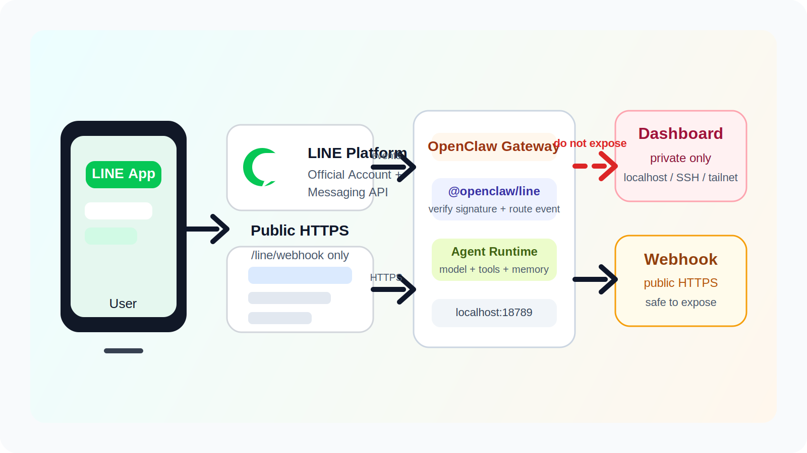
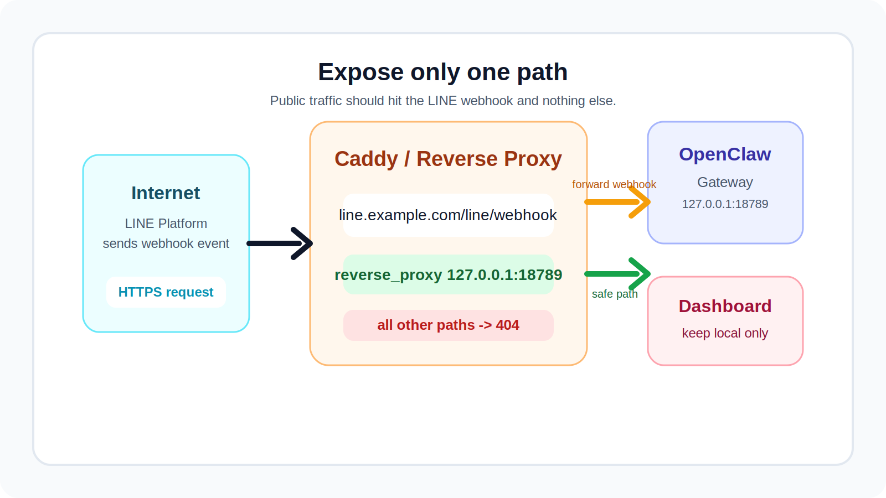
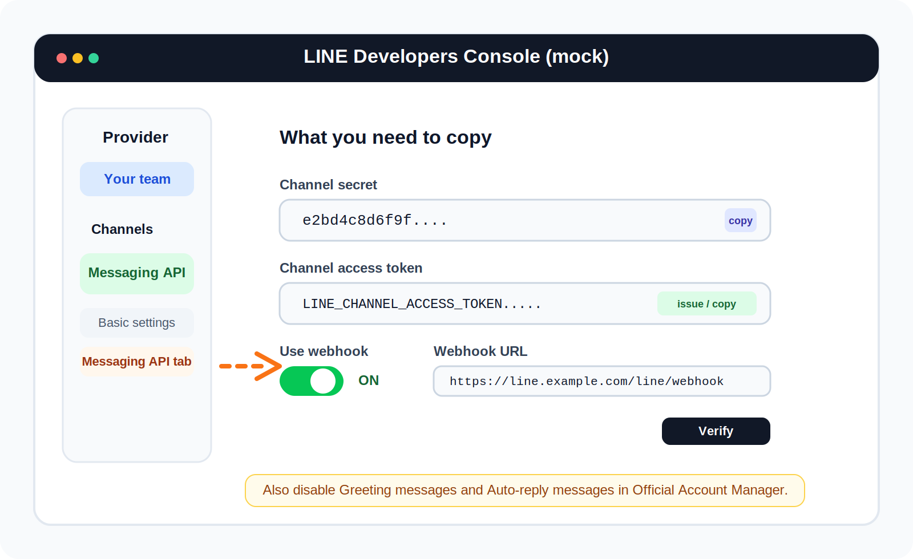
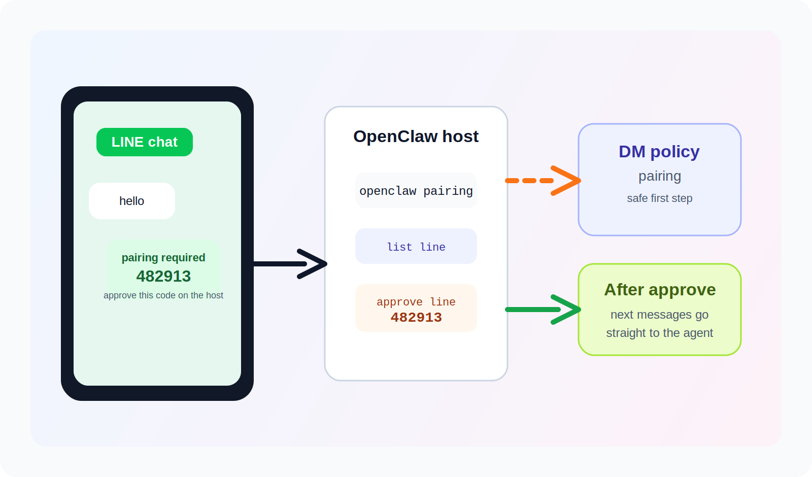

你如果已經把 OpenClaw 跑起來了，下一個很自然的想法通常是：

我不要每次都開 Dashboard。

我想直接在 LINE 找它。

這件事其實不難。

本質上就是把 **LINE 的 Webhook** 接到 **OpenClaw Gateway**，再把 **Channel access token** 和 **Channel secret** 填進 `~/.openclaw/openclaw.json`。

真正會卡住的，通常只有四個地方：

- LINE 現在的建立流程和以前不一樣。
- Webhook 一定要是公開的 `https://...`。
- `channelSecret`、`channelAccessToken` 很容易填錯位置。
- 你如果把整個 OpenClaw Dashboard 直接暴露到公網，風險會比你想像的大。

這篇就把完整流程拆開，一步一步做。

你照著做完，最後會得到這個結果：

- 你在 LINE 傳訊息給官方帳號
- LINE 把訊息丟到 OpenClaw 的 Webhook
- OpenClaw 交給 agent 回覆
- 你直接在 LINE 裡跟自己的 agent 對話

<!-- truncate -->

## 先看懂整體架構

<div align="center">
<figure style={{"width": "92%"}}>

</figure>
</div>

*示意圖：公開到外網的應該只有 `LINE webhook`，不是整個 OpenClaw Dashboard。*

整個資料流很單純：

1. 你在 LINE App 傳訊息給你的 LINE 官方帳號。
2. LINE Platform 觸發 Webhook，把事件送到你的 `https://your-host/line/webhook`。
3. OpenClaw Gateway 收到事件後，交給 `@openclaw/line` plugin。
4. Plugin 再把訊息送進 OpenClaw agent，最後把回覆送回 LINE。

:::warning 不要把 Dashboard 直接公開到公網
OpenClaw 官方文件把 Dashboard 視為管理介面。它可以聊天、改設定、看 session，這不是應該直接對外開放的頁面。

正確做法是：

- Dashboard 只留在本機、SSH tunnel、Tailscale 或內網
- 對外只公開 `/line/webhook`
:::

## 你要先準備什麼

開始之前，先確認你有下面這些東西：

- 一台正在跑 OpenClaw 的主機
- 一個可用的公網 HTTPS 網址
- 一個 LINE 官方帳號
- 可以登入 LINE Official Account Manager 與 LINE Developers Console 的帳號

如果你還沒安裝 OpenClaw，官方目前建議的最短路徑是：

```bash
npm install -g openclaw@latest
openclaw onboard --install-daemon
openclaw gateway status
openclaw dashboard
```

如果 Dashboard 可以正常打開，代表 Gateway 已經起來了。

OpenClaw 官方文件目前也寫得很清楚：

- 設定檔在 `~/.openclaw/openclaw.json`
- Control UI 預設在 `http://127.0.0.1:18789/`

## 步驟 1：先把 LINE plugin 裝進 OpenClaw

LINE 不是 OpenClaw 核心內建通道，而是 plugin。

先在跑 Gateway 的那台機器上安裝：

```bash
openclaw plugins install @openclaw/line
```

裝完之後，重啟 Gateway：

```bash
openclaw gateway restart
```

如果你想先檢查 Gateway 狀態，可以再跑一次：

```bash
openclaw gateway status
```

## 步驟 2：先把公開入口架好，而且只公開 Webhook

這一步很重要。

LINE 要求 Webhook 是**公開 HTTPS**，但 OpenClaw Dashboard 又不應該整個對外開。

所以最穩的做法是：

- Gateway 繼續只綁在本機 `127.0.0.1:18789`
- 由反向代理只轉發 `/line/webhook`

下面用 Caddy 做示範，因為它最好上手，也會自動處理 HTTPS。

<div align="center">
<figure style={{"width": "92%"}}>

</figure>
</div>

*示意圖：`/line/webhook` 進 OpenClaw，其他路徑直接 `404`。*

你的 `Caddyfile` 可以像這樣：

```caddy
line.example.com {
    @lineWebhook path /line/webhook

    reverse_proxy @lineWebhook 127.0.0.1:18789

    handle {
        respond "not found" 404
    }
}
```

做完之後，你要拿到這個公開網址：

```text
https://line.example.com/line/webhook
```

這個網址等等會填進 LINE Developers Console。

:::tip 只想快速驗證可不可用？
Cloudflare 的 Quick Tunnel 確實可以很快把 localhost 暴露出去，但它比較適合短時間測試，不適合拿來當正式入口。

如果你只是做一次性驗證，務必在測完後關掉，而且不要把它當正式部署方案。
:::

## 步驟 3：建立 LINE 官方帳號與 Messaging API

這邊最容易踩到舊教學。

**目前的 LINE 流程和以前不同。**

依照 LINE 官方文件，**自 2024 年 9 月 4 日起**，你已經不能直接在 LINE Developers Console 裡新建 Messaging API channel。正確順序是：

1. 先到 LINE Official Account Manager 建立官方帳號
2. 再到 LINE Developers Console 看到對應的 Messaging API channel

### 3-1 建立 LINE 官方帳號

先到：

- `https://manager.line.biz/`

建立一個新的 LINE 官方帳號。

完成後，再登入：

- `https://developers.line.biz/console/`

挑選對應的 Provider，就會看到剛剛那個官方帳號綁定的 Messaging API channel。

### 3-2 打開 Messaging API 設定

進到你的 channel 後，重點只看這幾個欄位：

<div align="center">
<figure style={{"width": "92%"}}>

</figure>
</div>

*示意圖：你真正需要抄下來的，只有 `Channel secret`、`Channel access token` 和 `Webhook URL`。*

你要做的事如下：

1. 找到 `Channel secret`，先複製起來。
2. 產生或複製 `Channel access token`。
3. 把 `Use webhook` 打開。
4. 在 `Webhook URL` 填上：

```text
https://line.example.com/line/webhook
```

5. 按 `Verify` 驗證。

如果驗證成功，代表 LINE 已經打得到你的 OpenClaw Webhook 入口。

### 3-3 把自動回應先關掉

LINE 官方也建議：如果訊息要交給 Messaging API 處理，最好把 LINE Official Account Manager 裡的：

- Greeting messages
- Auto-reply messages

先關掉。

不然你很容易看到這種情況：

- LINE 官方帳號先回一段預設文案
- OpenClaw 再回一段 agent 回覆

最後聊天室看起來像兩個 bot 在搶話。

## 步驟 4：把 LINE 憑證填進 OpenClaw

現在回到 OpenClaw 主機。

打開設定檔：

```bash
openclaw config file
```

預設通常會是：

```text
~/.openclaw/openclaw.json
```

在這個檔案裡加入最小可用設定：

```js
{
  channels: {
    line: {
      enabled: true,
      channelAccessToken: "LINE_CHANNEL_ACCESS_TOKEN",
      channelSecret: "LINE_CHANNEL_SECRET",
      dmPolicy: "pairing",
      groupPolicy: "disabled",
    },
  },
}
```

這裡幾個欄位的意思是：

- `enabled: true`：打開 LINE 通道
- `channelAccessToken`：LINE API 呼叫用的 token
- `channelSecret`：驗證 Webhook 簽章用的 secret
- `dmPolicy: "pairing"`：陌生人先拿配對碼，核准後才正式聊天
- `groupPolicy: "disabled"`：先不要讓群組直接打進來，簡化第一天的設定

如果你不想把 token 明文寫在設定檔，也可以改用檔案方式：

```js
{
  channels: {
    line: {
      enabled: true,
      tokenFile: "/home/ubuntu/secrets/line-token.txt",
      secretFile: "/home/ubuntu/secrets/line-secret.txt",
      dmPolicy: "pairing",
      groupPolicy: "disabled",
    },
  },
}
```

這對正式環境比較好。

## 步驟 5：驗證設定沒有寫壞

先驗證設定檔：

```bash
openclaw config validate
```

如果沒報錯，再重啟 Gateway：

```bash
openclaw gateway restart
openclaw gateway status
```

如果你是直接在本機編輯 `~/.openclaw/openclaw.json`，OpenClaw 多數情況會自動熱更新，但我還是建議第一次接 LINE 時手動重啟一次，省得卡在舊狀態。

## 步驟 6：做第一次對話測試

現在進入真正的測試。

1. 在 LINE 裡把你的官方帳號加入好友。
2. 傳一則簡單訊息，例如：`hello`
3. 因為你剛才把 `dmPolicy` 設成 `pairing`，OpenClaw 會先回你一組配對碼。

配對流程大概會像這樣：

<div align="center">
<figure style={{"width": "92%"}}>

</figure>
</div>

*示意圖：第一次 DM 不會直接放行，而是先走 pairing。*

接著在 OpenClaw 主機上執行：

```bash
openclaw pairing list line
openclaw pairing approve line 482913
```

把上面的 `482913` 換成你實際收到的配對碼。

核准之後，再回 LINE 傳一次訊息。

如果一切正常，這次就會直接進到 agent 回覆了。

## 步驟 7：讓它真的比較像 LINE 原生機器人

做到這裡，基本聊天已經通了。

但 OpenClaw 的 LINE plugin 其實不只會收發純文字，它還支援：

- quick replies
- location
- Flex message
- template message

也就是說，你可以讓 agent 送出比較像 LINE Bot 的回覆，而不只是純文字段落。

例如，你可以在 channel message 裡加上 `quickReplies`：

```js
{
  text: "今天要做什麼？",
  channelData: {
    line: {
      quickReplies: ["狀態", "重跑", "幫助"],
    },
  },
}
```

或是做一張簡單的確認卡片：

```js
{
  text: "請確認",
  channelData: {
    line: {
      templateMessage: {
        type: "confirm",
        text: "要開始部署嗎？",
        confirmLabel: "開始",
        confirmData: "deploy_yes",
        cancelLabel: "取消",
        cancelData: "deploy_no",
      },
    },
  },
}
```

如果你只是想快速測一張卡片，OpenClaw 文件也提到 plugin 內建了 `/card` 指令：

```text
/card info "Welcome" "Thanks for joining!"
```

## 最常見的錯誤，幾乎都長這樣

### 1. Webhook Verify 失敗

先檢查四件事：

- 你填的是不是 `https://...`
- 路徑是不是 `/line/webhook`
- 反向代理是不是只轉到 `127.0.0.1:18789`
- `channelSecret` 有沒有複製錯

### 2. LINE 收得到，OpenClaw 沒反應

通常是：

- `@openclaw/line` plugin 沒裝
- Gateway 沒重啟
- `channels.line.enabled` 沒打開

### 3. 有兩份回覆

通常是：

- LINE Official Account Manager 的 Greeting messages 沒關
- Auto-reply messages 沒關

### 4. 第一句有回，後面不穩

LINE 官方文件提到，`replyToken` **只能使用一次**，而且**要在收到 webhook 後 1 分鐘內使用**。

所以第一次上線時，不要一開始就接超慢模型或超長工作流。

比較保險的做法是：

- 先用延遲穩定的模型
- 先把工具鏈縮短
- 確定往返正常後，再逐步加功能

## 正式上線前，我建議你再做這三件事

### 1. 不要再用全開測試設定

第一天你可以先用：

```js
dmPolicy: "pairing"
groupPolicy: "disabled"
```

等你確認只有自己要用，再決定要不要改成更嚴格的 allowlist 模式。

### 2. 把 token 改成檔案或 secret 管理

正式環境不要長期把 `channelAccessToken` 和 `channelSecret` 直接寫在 repo 或共享設定裡。

### 3. 把群組支援延後

OpenClaw 的 LINE plugin 確實支援 group chat，但群組一打開，問題會立刻變多：

- 誰可以叫它
- 要不要強制 mention
- 哪些群組能進來

如果你的目標只是「讓 OpenClaw 先能在 LINE 跟我單聊」，那就先把群組關掉。

## 最後整理一次

如果你想把這件事一次做對，順序就是：

1. OpenClaw 跑起來
2. 安裝 `@openclaw/line`
3. 只把 `/line/webhook` 用 HTTPS 對外公開
4. 在 LINE 建立官方帳號與 Messaging API channel
5. 複製 `Channel secret` 和 `Channel access token`
6. 填進 `~/.openclaw/openclaw.json`
7. 重啟 Gateway
8. 在 LINE 發第一則訊息
9. 用 pairing 核准自己

做完之後，你就不需要每次都打開 OpenClaw Dashboard 了。

你可以直接在 LINE 裡找它。

而且是你自己的 agent，不是別人的 SaaS bot。

## 參考資料

- [OpenClaw Getting Started](https://docs.openclaw.ai/quickstart)
- [OpenClaw LINE Channel Docs](https://docs.openclaw.ai/channels/line)
- [OpenClaw Configuration](https://docs.openclaw.ai/gateway/configuration)
- [OpenClaw Dashboard / Web Control UI](https://docs.openclaw.ai/web/dashboard)
- [LINE Messaging API Getting Started](https://developers.line.biz/en/docs/messaging-api/getting-started/)
- [LINE Build a Bot](https://developers.line.biz/en/docs/messaging-api/building-bot/)
- [LINE Messaging API Reference](https://developers.line.biz/en/reference/messaging-api/nojs/)
