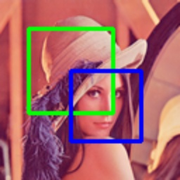

# draw_boxes

> [draw_boxes(img: np.ndarray, boxes: Union[Boxes, np.ndarray], color: \_Colors = (0, 255, 0), thickness: \_Thicknesses = 2) -> np.ndarray](https://github.com/DocsaidLab/Capybara/blob/975d62fba4f76db59e715c220f7a2af5ad8d050e/capybara/vision/visualization/draw.py#L70)

- **說明**：在影像上繪製多個 Bounding Box。

- **參數**

  - **img** (`np.ndarray`)：要繪製的影像，為 NumPy 陣列。
  - **boxes** (`Union[Boxes, np.ndarray]`)：要繪製的 Bounding Box，可以是 Box 物件的列表或 NumPy 陣列形式的 [[x1, y1, x2, y2], ...]。
  - **color** (`_Colors`)：要繪製的框的顏色。可以是單一顏色或顏色列表。預設為 (0, 255, 0)。
  - **thickness** (`_Thicknesses`)：要繪製的框線的粗細。可以是單一粗細或粗細列表。預設為 2。

- **傳回值**

  - **np.ndarray**：繪製了框的影像。

- **範例**

  ```python
  import capybara as cb

  img = cb.imread('lena.png')
  boxes = [cb.Box([20, 20, 100, 100]), cb.Box([150, 150, 200, 200])]
  boxes_img = cb.draw_boxes(img, boxes, color=[(0, 255, 0), (255, 0, 0)], thickness=2)
  ```

  
