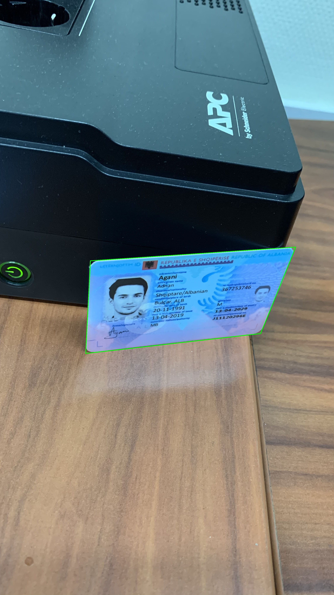

# 資料集說明

在本章節中，我們簡單介紹我們所使用的資料集。

這些資料集包含了各種不同的文件影像，用於訓練和測試我們的模型。

## SmartDoc 2015

Smartdoc 2015 - Challenge 1 資料集最初是為 Smartdoc 2015 競賽創建的，重點是評估使用智慧型手機的文件影像擷取方法。 Challenge 1 特別在於偵測和分割從智慧型手機預覽串流中擷取的視訊畫面中的文件區域。

- **URL**: [**SmartDoc 2015**](https://github.com/jchazalon/smartdoc15-ch1-dataset)

## MIDV-500/2019

MIDV-500 由 50 個不同身分證明文件類型的 500 個影片片段組成，包括 17 個身分證、14 個護照、13 個駕照和 6 個不同國家的其他身分證明文件，並具有真實性，可以對各種文件分析問題進行廣泛的研究。MIDV-2019 資料集包含扭曲和低光影像。

- **URL**: [**MIDV**](https://github.com/fcakyon/midv500)

## MIDV-2020

MIDV-2020 包含 10 種文件類型，其中包括 1000 個帶註釋的影片剪輯、1000 個掃描影像和 1000 個獨特模擬身分文件的 1000 張照片，每個文件都具有唯一的文字欄位值和唯一的人工生成的面孔。

- **URL**: [**MIDV2020**](http://l3i-share.univ-lr.fr/MIDV2020/midv2020.html)

## CORD v0

該資料集由數千張印尼收據組成，其中包含用於 OCR 的圖像文字註釋，以及用於解析的多層語義標籤。所提出的資料集可用於解決各種 OCR 和解析任務。

- **URL**: [**CORD**](https://github.com/clovaai/cord)

## Synthetic Dataset

考慮到資料集的不足，我們使用動態合成影像技術。

簡單來說，我們先收集了一份各類文本的資料集，其中包含了從網路上找到的各類證件和文件的影像。接著，我們找來了 Indoor 資料集作為背景，然後將文本的資料合成到背景上。此外，MIDV-500/MIDV-2019/CORD 資料集中，也都有對應的 Polygon 資料，秉持著不浪費的精神，我們也會將各種圖片合成到這些資料集上，以增加資料集的多樣性。
