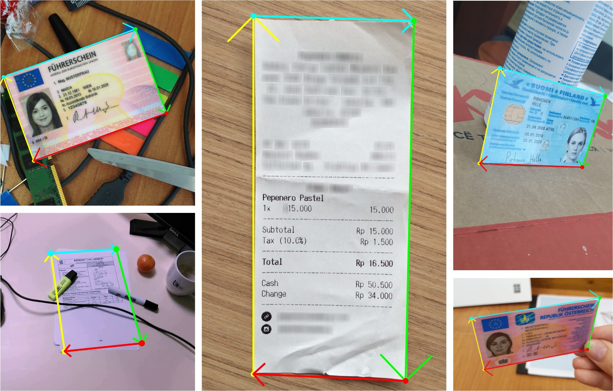

# DocAligner

本專案的核心功能稱為「**文件定位（Document Localization）**」。

- [**DocAligner Github**](https://github.com/DocsaidLab/DocAligner)

---



---

```mdx-code-block
import DocCardList from '@theme/DocCardList';

<DocCardList />
```
