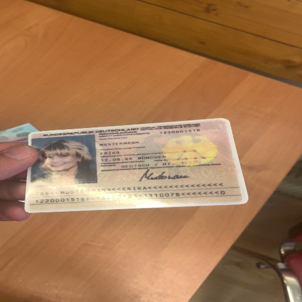
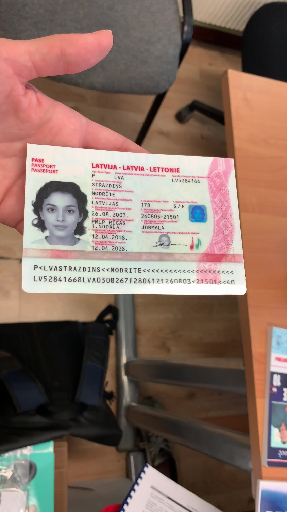

# 快速開始

我們提供了一個簡單的模型推論介面，其中包含了前後處理的邏輯。

首先，你需要導入所需的相關依賴並創建 `DocAligner` 類別。

## 模型推論

以下是一個簡單的範例，展示如何使用 `DocAligner` 進行模型推論：

```python
from docaligner import DocAligner

model = DocAligner()
```

啟動模型之後，接著要準備一張圖片進行推論：

:::tip
你可以使用 `DocAligner` 提供的測試圖片：

下載連結：[**run_test_card.jpg**](https://github.com/DocsaidLab/DocAligner/blob/main/docs/run_test_card.jpg)
:::

```python
import docsaidkit as D

img = D.imread('path/to/run_test_card.jpg')
```

或是你可以直接透過 URL 進行讀取：

```python
import cv2
from skimage import io

img = io.imread('https://github.com/DocsaidLab/DocAligner/blob/main/docs/run_test_card.jpg?raw=true')
img = cv2.cvtColor(img, cv2.COLOR_RGB2BGR)
```



接著，我們可以使用 `model` 進行推論：

```python
result = model(img)
```

你得到的推論結果是經過我們包裝的 [**Document**](../docsaidkit/funcs/objects/document) 類型，它包含了文件的多邊形、OCR 文字資訊等等。在這個模組中，我們不會用到 OCR 相關的功能，因此我們只會使用 `image` 和 `doc_polygon` 屬性。獲取到推論結果後，你可以進行多種後處理操作。

:::tip
`DocAligner` 已經用 `__call__` 進行了封裝，因此你可以直接呼叫實例進行推論。
:::

:::info
我們有設計了自動下載模型的功能，當你第一次使用 `DocAligner` 時，會自動下載模型。
:::

## 輸出結果

### 1. 繪製多邊形

繪製並保存帶有文件多邊形的圖像。

```python
# draw
result.draw_doc(
    folder='path/to/save/folder',
    name='output_image.jpg'
)
```

或是不指定路徑，直接輸出：

```python
# 預設的輸出路徑為當前目錄
# 預設的輸出檔名會調用當前時刻，為 f"output_{D.now()}.jpg"。
result.draw_doc()
```


### 2. 取得 NumPy 圖像

如果你有其他需求，可以使用 `gen_doc_info_image` 方法，之後再自行處理。

```python
img = result.gen_doc_info_image()
```

### 3. 提取攤平後的圖像

如果你知道文件的原始大小，即可以使用 `gen_doc_flat_img` 方法，將文件圖像根據其多邊形邊界轉換為矩形圖像。

```python
H, W = 1080, 1920
flat_img = result.gen_doc_flat_img(image_size=(H, W))
```

如果是一個未知的影像類別，也可以不用給定 `image_size` 參數，此時將會根據文件多邊形的邊界自動計算出『**最小的矩形**』圖像，並將最小矩形的長寬設為 `H` 和 `W`。

```python
flat_img = result.gen_doc_flat_img()
```

:::tip
當你的文件在圖像中呈現大幅度傾斜時，可能會算出較扁平的最小矩形，此時進行攤平會有一定的形變。因此，建議在這種情況下，使用 `image_size` 參數進行手動設定。
:::

## 為何模型偵測不到文件？

這是個難以立即回答的問題，我們必須逐一拆解。

以下我們用 MIDV-2020 的一張圖像作為範例說明，讀者可以自行下載這張圖像進行測試：



### 圖像中的文件尺寸

第一個要考慮的是圖像中的文件的大小，文件過大或過小都可能導致模型無法偵測。

我們檢視過訓練資料，文件的尺度大約落在 1/2 ~ 1/8 之間，請參考下圖示意：


意思就是說，如果你的文件尺寸在圖片中，小於上圖 1/8 尺度的「單一網格」的大小，那麼該文件大概率會被模型忽略，模型可能會認為那是背景。

我們認為檢測文件是為了後續的下游任務，因此檢測出太小的文件在實際應用場景中可能沒有意義，所以在設計訓練資料時，我們保留了這個特性。

### 文件角點缺失

文件尺寸過大通常不會影響模型，但這種情況中，文件角點可能會切齊圖像邊緣，或超出圖像。

由於該模型的主要功能其實是角點偵測，因此當文件的角點缺失時，模型會產出不穩定的估計結果，若是角點缺失的位置在文件的邊緣，則模型會傾向判定為無效文件，不會輸出 Polygon 結果，如下圖：


### 圖像中的文件模糊

另外一個造成偵測失敗的原因是文件模糊，模糊的文件可能會讓模型無法找到文件的邊界，進而導致偵測失敗，如下圖：


### 模型不認識的文件

我們訓練的模型規模有限，大約就 5MB 至 20 MB 的區間，雖然模型已經具有一定的泛化能力，但對於一些沒有在訓練資料集內的特殊的文件可能無法偵測。

例如：我們假設下圖中的藍色計算機是一種「特殊的文件」：


這張圖送給模型，就會得到一個空的 Polygon，因為模型不認識「計算機」這種文件，這個解決方式只有對這個「特殊的文件」進行訓練手動標注，然後加入訓練資料微調模型。

## 模型可視化

我們沒有封裝這個功能，因為其實只是一個中間過程，後面還有經過其他影像後處理步驟。

但如果你真的想看，那我們來寫一段展示用的程式碼。假設你使用的是熱圖模型，可以透過以下方式來可視化模型的輸出：

```python
import cv2
import docsaidkit as D
import numpy as np
from docaligner import DocAligner
from docaligner.heatmap_reg.infer import preprocess

model = DocAligner()

img = D.imread('midv2020_example.jpg')

img_infos = preprocess(
    img=img,
    img_size_infer=(256, 256)
)

heatmap = model.detector.model(**img_infos['input'])['heatmap'][0].sum(0)
heatmap = np.uint8(heatmap * 255)
heatmap = D.imresize(heatmap, size=img.shape[:2])
heatmap = cv2.applyColorMap(heatmap, cv2.COLORMAP_JET)
output = cv2.addWeighted(img, 0.5, heatmap, 0.5, 0)
D.imwrite(output)
```


透過上面的程式碼，你可以看到模型的輸出，這是一個熱圖，顏色越深代表該區域越可能是文件的角點。在偵測失敗的情況下，你有一定的機會可以在這張圖中找到可能的問題。

## 聯絡我們

如果上面都不是你要的答案，或許你可以把認為有問題的影像透過電子郵件寄給我們，我們有時間會幫你檢查看看。

請透過電子郵件與我們聯繫：**docsaidlab@gmail.com**
