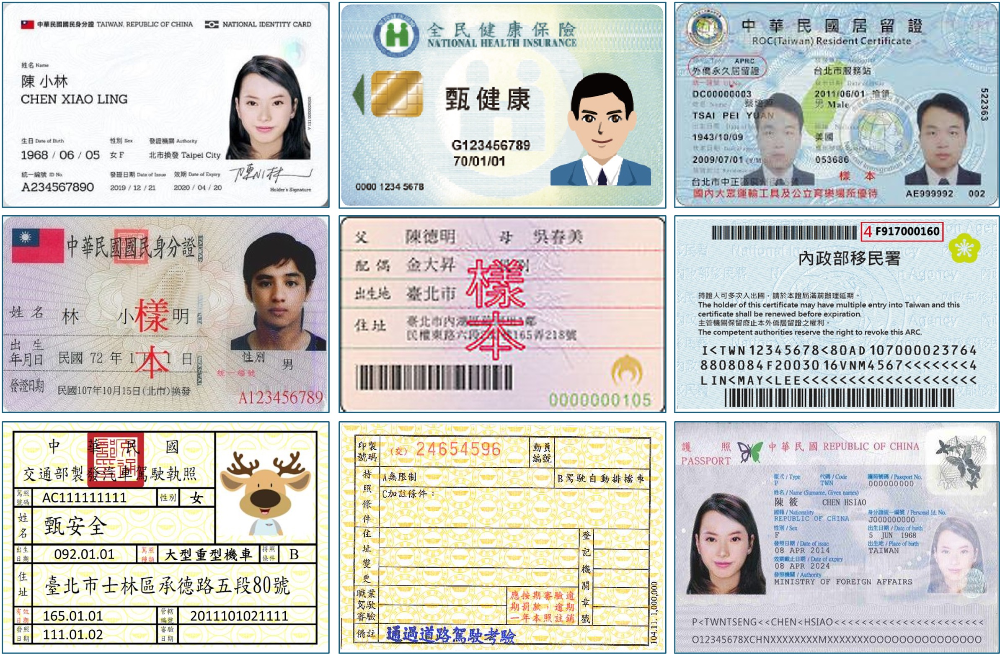

# 快速開始

我們提供了一個簡單的模型推論介面，其中包含了前後處理的邏輯。

首先，你需要導入所需的相關依賴並創建 `DocClassifier` 類別。

## 註冊資料

在開始講模型之前，我們先來談談註冊資料。

---

在推論的資料夾目錄中，有一個 `register` 資料夾，裡面包含了所有的註冊資料，你可以在其中放置你的註冊資料，在推論時 `DocClassifier` 會自動讀取資料夾中的所有資料。如果你要使用自己的資料集，在創建 `DocClassifier` 時，請指定 `register_root` 參數，並且將其設定為你的資料集根目錄。

我們在模組內預設放了幾個文件圖像的註冊資料，你可以參考這些資料，並且自行擴充。同時，我們也強烈建議使用你自己的資料集，以確保模型能夠適應你的應用場景。



:::tip
我們建議資料使用滿版的圖像，盡量減少背景的干擾，以提高模型的穩定性。
:::

:::danger
我們預先放在資料夾內的許多影像都是網路上蒐集的，其解析度都很低，只能用來展示用而沒有落地部署的價值。請善用 `register_root` 參數代入你自己的資料集，以確保模型能夠適應你的應用場景。
:::

## 重複註冊

這個問題分為兩種情況：

- **情況一：重複檔案名稱**

    在我們實作的邏輯中，註冊資料夾內的檔案名稱，就會作為資料的查詢索引。

    因此當檔案名稱重複時，後面的檔案會覆蓋前面的檔案。

    這種情況的問題不大，就是被覆蓋掉的檔案不會被使用到而已，不會影響模型的推論。

- **情況二：重複檔案內容**

    相同的檔案，卻註冊了一次以上。

    假設使用者註冊了三張相同的圖片，但不同的標籤。在推論的時候，排序相似性的過程中分數會相同，但總會有一個排在最前面。這樣的情況下，模型不能保證每次都會返回同一個標籤。

    這種情況的問題也不大，只是模型會有不確定性，然後你會找不到原因。（~喂！~）

:::tip
總之，請認真對待註冊資料。
:::

## 模型推論

確保註冊資料已經準備好之後，我們就可以開始進行模型推論。

以下是一個簡單的範例，首先是啟動模型：

```python
from docclassifier import DocClassifier

model = DocClassifier()
```

接著，載入一張圖像：

```python
import docsaidkit as D

img = D.imread('path/to/test_driver.jpg')
```

:::tip
你可以使用 `DocClassifier` 提供的測試圖片：

下載連結：[**test_driver.jpg**](https://github.com/DocsaidLab/DocClassifier/blob/main/docs/test_driver.jpg)


:::

或是直接透過 URL 進行讀取：

```python
import cv2
from skimage import io

img = io.imread('https://github.com/DocsaidLab/DocClassifier/blob/main/docs/test_driver.jpg?raw=true')
img = cv2.cvtColor(img, cv2.COLOR_RGB2BGR)
```

最後，我們可以使用 `model` 進行推論：

```python
most_similar, max_score = model(img)
print(f'most_similar: {most_similar}, max_score: {max_score:.4f}')
# >>> most_similar: None, max_score: 0.0000
```

在預設的情況下，這個範例會返回 `None` 和 `0.0000`，這是因為我們預設的註冊資料和輸入圖片差異非常大。因此模型判斷這張圖片和註冊資料之間的相似性非常低。

:::tip
預設註冊的駕照資料是一頭麋鹿；而輸入的辨識圖片是一張空白的駕照。（差異略大）
:::

這種時候你可以考慮降低 `threshold` 參數：

```python
from docclassifier import DocClassifier

model = DocClassifier(
    threshold=0.6
)

# 重新進行推論
most_similar, max_score = model(img)
print(f'most_similar: {most_similar}, max_score: {max_score:.4f}')
# >>> most_similar: 台灣駕照正面, max_score: 0.6116
```

這次你就會得到一個標籤名稱和一個分數：`台灣駕照正面` 和 `0.6116`。這個分數代表了輸入圖片和註冊資料之間的相似性。

:::tip
`DocClassifier` 已經用 `__call__` 進行了封裝，因此你可以直接呼叫實例進行推論。
:::

:::info
我們有設計了自動下載模型的功能，當你第一次使用 `DocClassifier` 時，會自動下載模型。
:::

## 閾值設定

我們在評估模型的能力上，採用 TPR@FPR=1e-4 的標準，但實際上這個標準相對嚴格，且在部署時候會要成比較不好的使用者體驗。因此我們建議在部署時，可以採用 TPR@FPR=1e-1 或 TPR@FPR=1e-2 的閾值設定。

目前我們預設的閾值是採用 `TPR@FPR=1e-2` 的標準，這個閾值是經過我們的測試和評估後，認為是一個比較適合的閾值。詳細的閾值設定表如下列：

- **lcnet050_cosface_f256_r128_squeeze_imagenet_clip_20240326 results**

    - **Setting `model_cfg` to "20240326"**
    - **TPR@FPR=1e-4: 0.912**

        |    FPR    |  1e-05  |  1e-04  |  1e-03  |  1e-02  |  1e-01  |   1     |
        | :-------: | :-----: | :-----: | :-----: | :-----: | :-----: | :-----: |
        |    TPR    |  0.856  |  0.912  |  0.953  |  0.980  |  0.996  |   1.0   |
        | Threshold |  0.705  |  0.682  |  0.657  |  0.626  |  0.581  |  0.359  |
