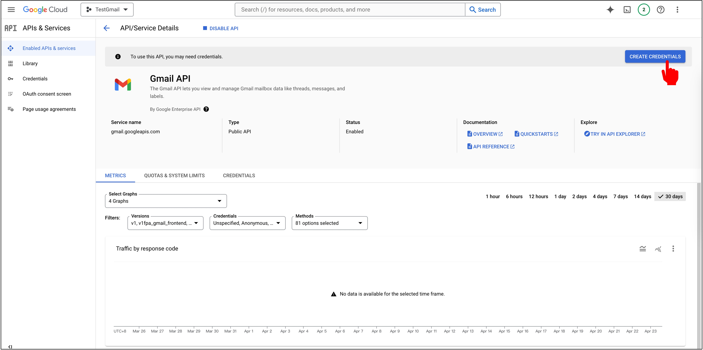
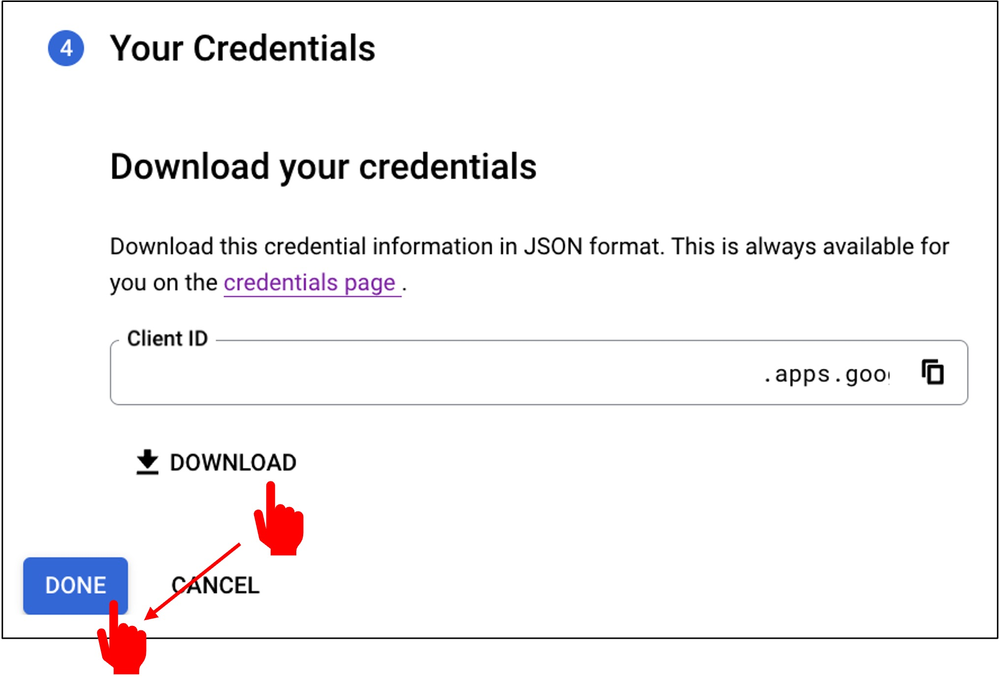
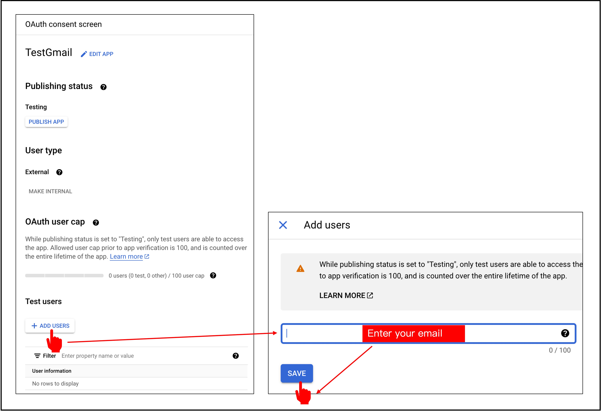

# Gmail API 憑證

在啟動 GmailAPI 之後，你會立刻看到系統要求你申請憑證，我們直接往下看。

## 申請憑證

點選「Create credentials」。

第一步是設定憑證的類型，我們選擇「User Data」，然後點選「Next」。

接著是 OAuth Consent Screen，這裡輸入你喜歡的應用程式名稱還有你的 email，然後點選「Save and Continue」。

:::warning
最後一個開發者聯絡資訊是當 Google 有問題時，他們會聯絡你的方式，如果你寫錯了，那麼你可能會收不到通知。
:::

接著是「Scopes」，這裡選擇「Add or Remove Scopes」，選擇「ReadOnly」的權限，然後點選「Update」。

接著是「OAuth Client ID」，這裡選擇「Desktop App」，然後點選「Create」。

完成憑證的申請，點選「Download」，然後點選「Done」。

下載的憑證是一個 JSON 檔案，我們將它命名為 `credentials.json`，然後放在專案的根目錄下。

## 設定 OAuth 2.0

完成設定後，回到 GmailAPI 的頁面，點選「OAuth consent screen」。

由於我們只是要查找自己的 Gmail，所以不需要發布，只需要加入測試使用者即可。

到這邊，我們已經完成了 GmailAPI 的憑證設定。