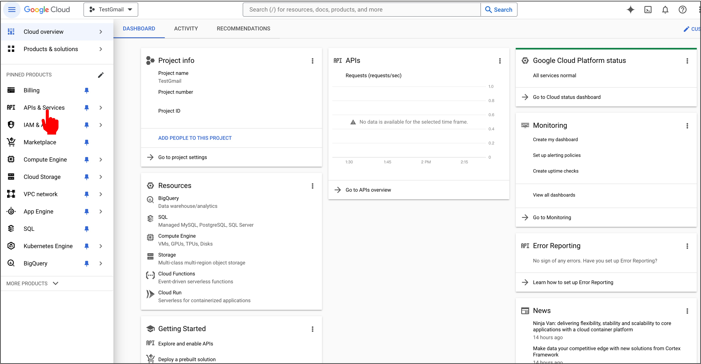
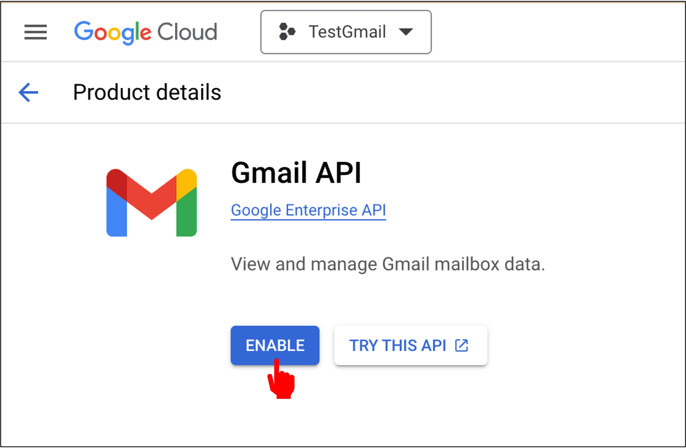
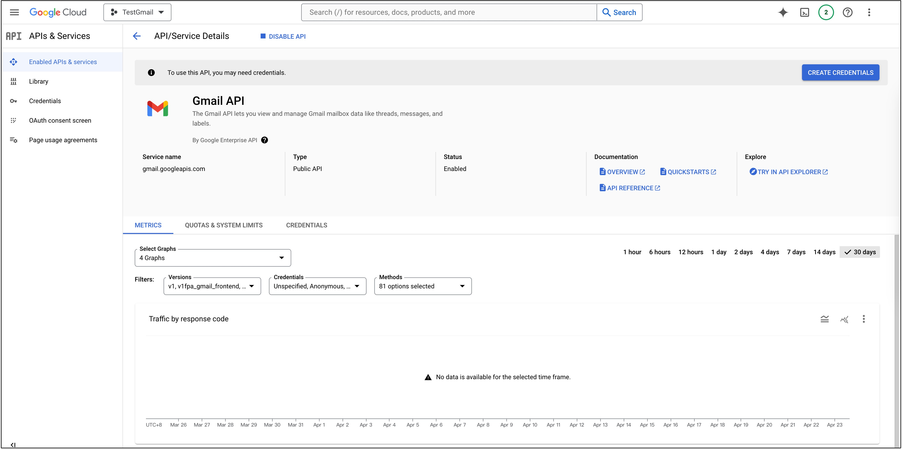

# Gmail API 啟用

這是一個有時效性的章節，因為 GmailAPI 的使用方式可能會隨著 Google 的更新而有所變化。

在閱讀時，請注意查看最新的官方文件：[**GmailAPI**](https://developers.google.com/gmail/api)。

## 概述

Gmail API 是一個基於 REST 架構的應用程式介面，允許開發者訪問 Gmail 郵箱並發送郵件。對於大多數網絡應用來說，Gmail API 提供了對用戶 Gmail 數據的授權訪問，非常適合各種應用場景，例如：

- 僅讀取模式的郵件提取、索引和備份
- 自動化或程式化地發送消息
- 郵件帳戶的遷移
- 包括過濾和排序消息在內的郵件組織
- 在整個組織中標準化電子郵件簽名

:::warning
Gmail API 不應被用來替代 IMAP 開發完整的電子郵件客戶端。相反地，對於完整的電子郵件客戶端開發，應參考 IMAP、POP 和 SMTP 標準。
:::

在 Gmail API 中常用的術語包括：

- **消息（Message）**：包含發件人、收件人、主題和正文的電子郵件消息。消息一旦創建，就不能更改。每條消息都由一個消息資源來表示。
- **主題串（Thread）**：相關消息的集合形成的對話。在電子郵件客戶端應用中，當一個或多個收件人對一條消息回覆自己的消息時，就形成了一個主題串。
- **標籤（Label）**：用於組織消息和主題串的機制。例如，可以創建標籤“稅務”，並將其應用於所有與用戶稅務相關的消息和主題串。標籤分為兩類：
  - **系統標籤**：內部創建的標籤，如收件箱（INBOX）、垃圾郵件（TRASH）或垃圾郵件（SPAM）。這些標籤不能被刪除或修改。然而，某些系統標籤，如收件箱，可以應用於消息和主題串，或從中移除。
  - **用戶標籤**：由用戶創建的標籤。這些標籤可以由用戶或應用程序刪除或修改。用戶標籤由標籤資源表示。
- **草稿（Draft）**：未發送的消息。草稿中的消息可以被替換。發送草稿會自動刪除草稿並創建帶有已發送（SENT）系統標籤的消息。草稿由草稿資源表示。

## 登入帳戶

在開始之前，請確保你已經有一個帳戶：[**Google Cloud**](https://cloud.google.com/)。

接著，你需要在 Google Cloud Console 中創建一個專案，點選「Console」。

## 建立專案

進入 Console 後，點選「建立專案」。

接著點選「建立新專案」

輸入專案名稱，並點選「建立」。

## 啟用 Gmail API

在專案建立完成後，從主選單選擇專案。

然後你就會進到一個儀表板，點選「API 和服務」。

接著點選「啟用 API 和服務」。

從搜尋框中輸入「Gmail」，並點選「Gmail API」。

點選「啟用」。

到這邊，你已經成功啟用 Gmail API。

