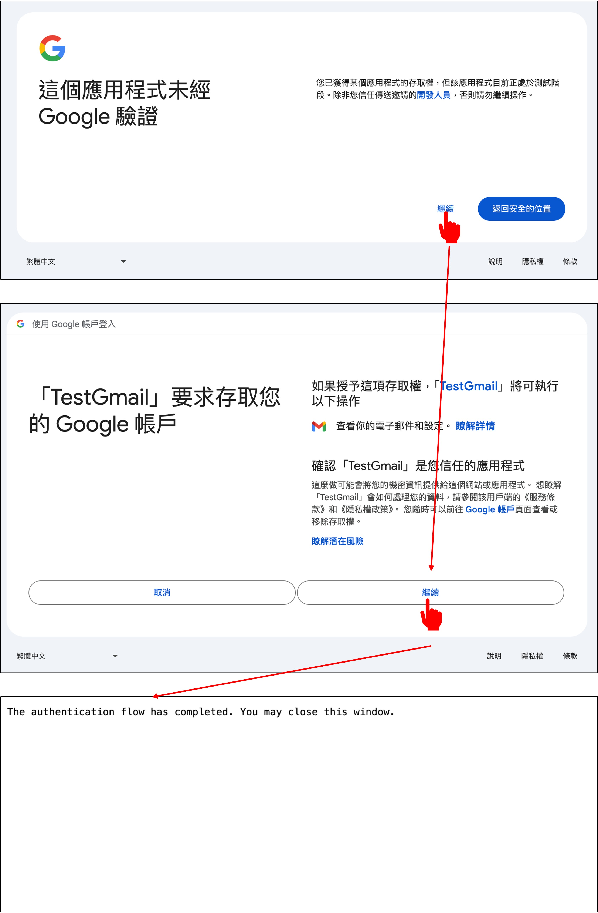

# Gmail API 呼叫

完成設定後，我們就可以開始使用 GmailAPI 了。

先找到你剛才下載的 `credentials.json` 檔案，然後將它放在專案的根目錄下。

接著，我們打開 Google 提供的教學文件：[**Python quickstart**](https://developers.google.com/gmail/api/quickstart/python)

## 安裝套件

你必須要安裝適用於 Python 的 Google 用戶端程式庫：

```bash
pip install -U google-api-python-client google-auth-httplib2 google-auth-oauthlib
```

## 配置範例

1. 在你的工作目錄中，建立一個名為 `quickstart.py`.

   - 可以直接參考 Google 提供的原始碼：[**source code**](https://github.com/googleworkspace/python-samples/blob/main/gmail/quickstart/quickstart.py)

2. 將以下程式碼包含在 `quickstart.py`:

   ```python title="quickstart.py"
   import os.path

   from google.auth.transport.requests import Request
   from google.oauth2.credentials import Credentials
   from google_auth_oauthlib.flow import InstalledAppFlow
   from googleapiclient.discovery import build
   from googleapiclient.errors import HttpError

   # If modifying these scopes, delete the file token.json.
   SCOPES = ["https://www.googleapis.com/auth/gmail.readonly"]


   def main():
   """Shows basic usage of the Gmail API. Lists the user's Gmail labels."""
   creds = None
   # The file token.json stores the user's access and refresh tokens, and is
   # created automatically when the authorization flow completes for the first
   # time.
   if os.path.exists("token.json"):
       creds = Credentials.from_authorized_user_file("token.json", SCOPES)
   # If there are no (valid) credentials available, let the user log in.
   if not creds or not creds.valid:
       if creds and creds.expired and creds.refresh_token:
           creds.refresh(Request())
       else:
           flow = InstalledAppFlow.from_client_secrets_file(
               "credentials.json", SCOPES
           )
           creds = flow.run_local_server(port=0)
       # Save the credentials for the next run
       with open("token.json", "w") as token:
           token.write(creds.to_json())

   try:
       # Call the Gmail API
       service = build("gmail", "v1", credentials=creds)
       results = service.users().labels().list(userId="me").execute()
       labels = results.get("labels", [])

       if not labels:
           print("No labels found.")
           return
       print("Labels:")
       for label in labels:
           print(label["name"])

   except HttpError as error:
       # TODO(developer) - Handle errors from gmail API.
       print(f"An error occurred: {error}")

   if __name__ == "__main__":
       main()
   ```

## 執行範例

執行 `quickstart.py`:

```bash
python quickstart.py
```

當你第一次執行 `quickstart.py` 時，它會要求你進行授權。請點擊「Allow」。



你將看到一個類似於以下的輸出：

```bash
Labels:
CHAT
SENT
INBOX
IMPORTANT
TRASH
DRAFT
SPAM
CATEGORY_FORUMS
CATEGORY_UPDATES
CATEGORY_PERSONAL
CATEGORY_PROMOTIONS
CATEGORY_SOCIAL
STARRED
UNREAD
```

同時，會取回一個 `token.json` 檔案，這個檔案將用於下次執行 `quickstart.py` 時，不再需要進行授權。

## 開始使用

接下來，我們將開始使用 GmailAPI 來解析郵件內容。

我們實作了三個部分，分別是：創建用戶端、取得郵件和郵件解析。

先引入需要的套件：

```python
from base64 import urlsafe_b64decode
from datetime import datetime, timedelta
from typing import Dict, List

import pytz
from google.oauth2.credentials import Credentials
from googleapiclient.discovery import build
```

### 創建用戶端

在建立 GmailAPI 的用戶端時，會載入 `token.json` 存儲了用戶的訪問令牌和刷新令牌，並在訪問令牌到期時自動刷新。

```python
def build_service():
    creds = None
    token_file = 'token.json'
    creds = Credentials.from_authorized_user_file(
        token_file, scopes=['https://www.googleapis.com/auth/gmail.readonly'])
    service = build('gmail', 'v1', credentials=creds)
    return service
```

### 取得郵件

接下來，我們先定義一個函數，用來從用戶端取得郵件內容：

```python
def get_messages(
    service,
    user_id='me',
    after_date=None,
    subject_filter: str = None,
    max_results: int = 500
) -> List[Dict[str, str]]:

    tz = pytz.timezone('Asia/Taipei')
    if not after_date:
        now = datetime.now(tz)
        after_date = (now - timedelta(days=1)).strftime('%Y/%m/%d')

    messages = []
    try:
        query = ''
        if after_date:
            query += f' after:{after_date}'
        if subject_filter:
            query += f' subject:("{subject_filter}")'

        response = service.users().messages().list(
            userId=user_id, q=query, maxResults=max_results).execute()

        messages.extend(response.get('messages', []))

        # Handle pagination with nextPageToken
        while 'nextPageToken' in response:
            page_token = response['nextPageToken']
            response = service.users().messages().list(
                userId=user_id, q=query, maxResults=max_results, pageToken=page_token).execute()
            messages.extend(response.get('messages', []))

    except Exception as error:
        print(f'An error occurred: {error}')

    if not messages:
        print("No messages found.")

    return messages
```

### 解析郵件

取回資料後，內容存在大量的 metadata，我們需要將它解析成易讀的格式。

```python
def parse_message(service, msg_id, user_id='me'):

    try:
        message = service.users().messages().get(
            userId=user_id, id=msg_id, format='full').execute()
        headers = message['payload']['headers']
        parts = message['payload'].get('parts', [])
        email_data = {
            'Date': None,
            'Subject': None,
            'Text': None
        }

        # 解析頭信息以獲取寄件時間、主旨、寄件者和收件者
        for header in headers:
            if header['name'] == 'Date':
                email_data['Date'] = header['value']
            elif header['name'] == 'Subject':
                email_data['Subject'] = header['value']

        # 解析郵件正文
        for part in parts:
            if part['mimeType'] == 'text/plain' or part['mimeType'] == 'text/html':
                data = part['body']['data']
                text = urlsafe_b64decode(data.encode('ASCII')).decode('UTF-8')
                email_data['Text'] = text
                break  # 只取第一個符合條件的部分

        return email_data

    except Exception as error:
        print(f'An error occurred: {error}')
        return None
```

## 小結

到這邊，我們已經把 GmailAPI 的基本使用方法介紹完畢。

先不要執行它，因為還需要一些準備工作。

我們得去串接 OpenAI 的 API，這樣才能將郵件內容傳送給 ChatGPT 進行分析。
