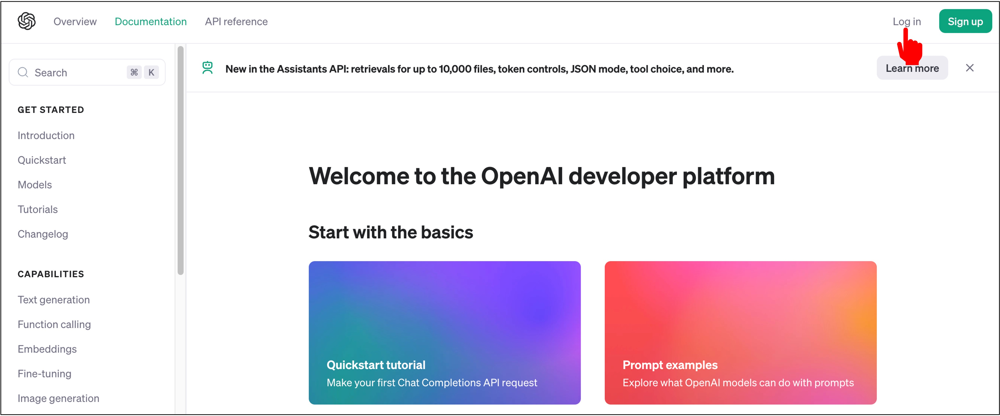

# OpenAI API 啟用

這一章我們要到 [OpenAI API](https://platform.openai.com/docs/overview) 官網註冊帳號，並且取得 API 金鑰。

:::info
OpenAI 提供的讓使用者輸入文字的 ChatGPT 和透過 API 調用的 GPT 等服務，是不一樣的系統！就算你有在使用付費版的 ChatGPT，來到 API 呼叫的這一個系統中還是要重新付費唷！
:::

## 註冊帳號

這裡就沒有像 GmailAPI 那邊這麼多步驟了，就從官網上按到指示進行註冊即可。

## 取得 API 金鑰

註冊完成後，點選側邊欄的「API Keys」，接著點選「Create new secret key」。

取一個你喜歡的名字，然後點選「Create」。

接著你就可以看到你的 API 金鑰了，複製下來，這個金鑰會在你的專案中使用。

## 開始使用？

不行！要先付錢。

點選「Billing」，然後你可以自行選擇「儲值」多少錢（美金），這個錢會用在你的 API 呼叫上。

這樣就完成了 OpenAI API 的註冊與啟用，接下來我們就可以開始使用 OpenAI API 了！
