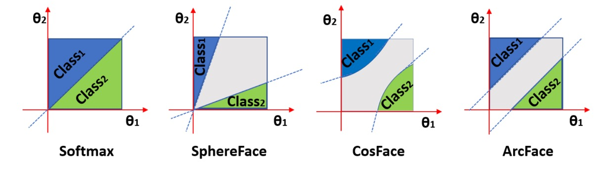
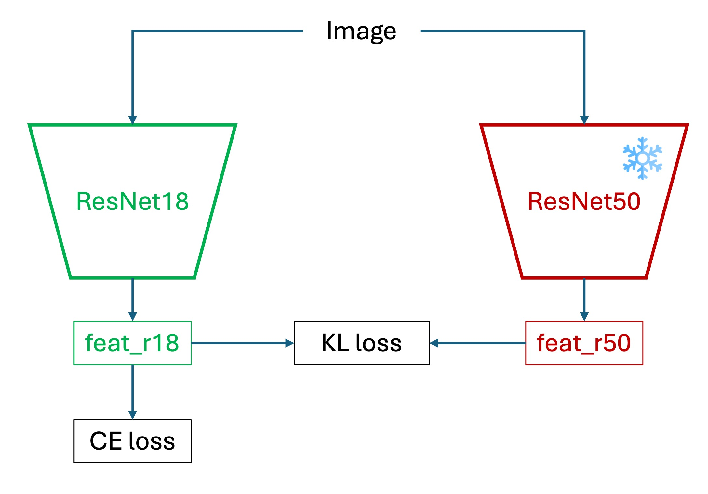

# CIFAR-100

## 過擬合的不眠之夜

此專案提供一個簡潔的 PyTorch 訓練範例，使用 CIFAR-100 影像分類任務讓初學者可以快速上手。同時也提供了一些彈性調整與擴充的範例程式碼，讓你能更輕鬆地因應不同實驗需求。

話不多說，這就開始吧。

:::info
本專案的程式碼可以在 Github 上取得： [**cifar100_training_demo**](https://github.com/DocsaidLab/cifar100_training_demo) 上。
:::

## 下載本專案

專案前期準備已完成，請直接使用下列指令取得程式碼：

```bash
git clone https://github.com/DocsaidLab/cifar100-training-demo.git
```

## 建置訓練環境（Ubuntu 22.04/24.04）

:::tip
**為什麼使用 Docker？**

1. **一致性**：保證「我的電腦跑得動，你的也一樣」。
2. **免汙染**：所有相依套件封裝在映像檔內，不會把你原本的 Python/conda 弄亂。
3. **易重製**：出錯時 `docker rm` + `docker run` 整個環境瞬間歸零。
   （若你對 venv/conda 更熟悉，亦可自行建環境；本專案將以 Docker 為主。）
   :::

### 建置 Docker 環境

這個章節在我們的基礎工具箱專案中有詳細說明，請參考：

- [**Docsaid Capybara #進階安裝**](https://docsaid.org/docs/capybara/advance)

### 下載並建置映像檔

```bash
cd cifar100-training-demo
bash docker/build.bash
```

- 基底：`nvcr.io/nvidia/pytorch:25.03-py3`
- 版本詳細資訊：[**PyTorch Release 25.03**](https://docs.nvidia.com/deeplearning/frameworks/pytorch-release-notes/rel-25-03.html#rel-25-03)
- 首次建置下載量 ~20 GB，時間大約 5–20 分鐘，如果你的網速不算太慢的話。

完成後可確認映像檔：

```bash
docker images | grep cifar100_train
```

## 建構資料集

在 PyTorch 中，CIFAR-100 資料集已經內建於 `torchvision` 中，因此我們可以直接使用：

```python
from torchvision.datasets import CIFAR100

train_dataset = CIFAR100(root='data/', train=True, download=True)
test_dataset = CIFAR100(root='data/', train=False, download=True)
```

不過，等一下！

既然是要練習，我們不妨試看自己下載和建構資料集，這樣可以更好地控制資料處理流程。

首先從官方網站下載 CIFAR-100 資料集，並解壓縮：

```bash
wget https://www.cs.toronto.edu/\~kriz/cifar-100-python.tar.gz
tar xvf cifar-100-python.tar.gz
```

執行完之後，你可以在你的工作目錄中看到一個名為 `cifar-100-python` 的資料夾，裡面包含了訓練和測試資料。

其中的結構大概長這樣：

```text
cifar-100-python/
├── train
|-- test
├── meta
|-- file.txt~
```

這個不是影像檔，而是已經打包成 Python 的 pickle 檔案格式。因此，我們等一下在使用的時候，需要使用 `pickle` 模組來讀取這些資料。

## 撰寫資料集

有了資料集之後，我們需要來寫一份 PyTorch 的資料集類別來讀取這些資料。

我們簡單實作一個 `CIFAR100DatasetSimple` 類別：

```python
import pickle

import capybara as cb
import numpy as np

DIR = cb.get_curdir(__file__)

class CIFAR100DatasetSimple:

    def __init__(
        self,
        root: str=None,
        mode: str='train',
        image_size: int=32,
        return_tensor: bool=False,
        image_aug_ratio: float=0.5,
    ):

        if mode not in ['train', 'test']:
            raise ValueError("mode must be either 'train' or 'test'")

        if root is None:
            self.root = DIR / 'cifar-100-python'
        else:
            self.root = root

        self.image_size = image_size
        self.return_tensor = return_tensor

        # 讀取資料檔案
        with open(f'{self.root}/{mode}', 'rb') as f:
            data = pickle.load(f, encoding='bytes')
            self.images = data[b'data']
            self.labels = data[b'fine_labels']
            self.filenames = data[b'filenames']

        # shape: (N, 3, 32, 32)
        self.images = self.images.reshape(-1, 3, 32, 32)

    def __len__(self):
        return len(self.labels)

    def __getitem__(self, idx):
        img = self.images[idx]
        label = self.labels[idx]

        img = np.transpose(img, (1, 2, 0)) # (C, H, W) -> (H, W, C)
        img = cb.imresize(img, size=self.image_size)

        if self.return_tensor:
            img = np.transpose(img, (2, 0, 1))  # (H, W, C) -> (C, H, W)
            img = img.astype(np.float32) / 255.  # 直接簡單歸一化到 [0, 1]
            label = np.array(label, dtype=np.int64)
            return img, label

        return img, label
```

這個類別有幾個功能：

1. 可以指定輸出影像的大小（`image_size`），預設為 32。
2. 可以選擇是否將影像轉換為 PyTorch Tensor 格式（`return_tensor`）。
3. 可以指定資料集的模式（`mode`），分為訓練集（`train`）和測試集（`test`）。

更複雜的功能等等再說，現在讓我們先來 Train 第一個 Baseline 模型吧。

## 第一個模型：Acc=44.26%

你可以在 `config` 資料夾內找到一些預設的配置檔案，我們會透過這些配置檔案來控制訓練流程。第一個檔案我們使用 `resnet18_baseline.yaml`，使用大家耳熟能詳的 ResNet-18 作為基礎模型。

訓練之前，我們先退回上層目錄：

```bash
cd ..
```

接著，我們可以使用以下指令來開始訓練：

```bash
bash cifar100-training-demo/docker/train.bash resnet18_baseline
```

既然是第一個模型，我們可以仔細看一下參數的配置。

### 關鍵配置說明

在 `config/resnet18_baseline.yaml` 中，主要配置如下：

1. **Batch Size**：設為 250，能整除 50000 筆訓練資料，簡化訓練週期。

   :::tip
   一般來說，我們會選擇 32 的倍數作為 batch size，這樣可以更好地利用 GPU 的計算資源。不過既然我們使用的是小資料集，大可不管這個限制，直接使用 250。這樣每個 epoch 只需要跑 200 次迭代（50000 / 250 = 200）。
   :::

2. **Image Size**：設定為 32，符合 CIFAR-100 的原始影像大小，如果沒有特別說明，後續實驗都會使用這個大小。
3. **模型配置**

   ```yaml
   model:
     name: CIFAR100ModelBaseline
     backbone:
       name: Backbone
       options:
         name: timm_resnet18
         pretrained: False
         features_only: True
     head:
       name: Baseline
       options:
         num_classes: 100
   ```

   - 使用 `timm_resnet18` 不帶預訓練權重 (pretrained=False)，方便了解模型從頭學習的過程。
   - `Baseline` 負責將 backbone 輸出轉換為 100 類別預測。

4. **訓練 Epoch 數**：設定為 200。經多次嘗試，超過 200 時改善幅度不明顯。
5. **優化器**： 採用 `AdamW`，學習率（`lr`）為 0.001，整體訓練表現相對穩定。
6. **Weight Decay**： 設為 0.0001；小型模型本身自帶正則化，可適度降低此值。

---

最終，這個模型在第 186 個 epoch 時，test-set 的準確率達到了 44.26%。

但 train-set 的準確率已經達到了 100％，這就是典型的過擬合現象。

## 調整訓練超參數

所謂的「過擬合」，就是模型把訓練資料背得滾瓜爛熟，卻沒辦法能套用在其他資料上。

在 CIFAR-100 這類小型資料集上，這種現象尤其常見，因為類別多、樣本少，模型很容易記住細節而不是學習規則。

### 常見的解法有幾個

1. **減少模型容量**：改用較小的模型，減少過度擬合的風險。
2. **資料增強（Data Augmentation）**：隨機裁切、翻轉、亮度調整，讓模型看更多圖，增加泛化能力。
3. **正則化（Regularization）**：使用 Dropout、Weight Decay 等手法，讓模型在學習時保持「克制」。
4. **提早停止（Early Stopping）**：當驗證集準確率不再上升時，提早結束訓練，避免過度擬合。
5. **使用預訓練模型（Pretrained Model）**：若允許，可以從大型資料集（如 ImageNet）微調過來，而非從頭訓練。
6. **學習率與 Batch Size 調整**：學習率太高或太低都會導致模型不穩，batch size 也會影響梯度更新穩定性。

---

Early Stopping 的部分我們就不討論了，反正固定跑 200 個 epoch，然後挑最高分數來報告。

資料增強是個常見的技巧，接著我們先來試試看。

## 資料增強：Acc=36.48%

我們來試試看使用資料增強的方式來改善模型的泛化能力。

這裡我們引入 `albumentations` 這個資料增強庫，加入一些基本的資料增強操作。

```python
import albumentations as A

class DefaultImageAug:

    def __init__(self, p=0.5):
        self.aug = A.OneOf([
            A.ShiftScaleRotate(),
            A.CoarseDropout(),
            A.ColorJitter(),
            A.HorizontalFlip(),
            A.VerticalFlip(),
        ], p=p)

    def __call__(self, img: np.ndarray):
        img = self.aug(image=img)['image']
        return img
```

這邊選用的增強方法包括：

- **ShiftScaleRotate**：隨機平移、縮放和旋轉影像。
- **CoarseDropout**：隨機遮罩影像的一部分，模擬資料缺失。
- **ColorJitter**：隨機調整影像的亮度、對比度和飽和度。
- **HorizontalFlip**：隨機水平翻轉影像。
- **VerticalFlip**：隨機垂直翻轉影像。

經驗上，這些增強方法能有效提升模型的泛化能力。

接著，我們在 `config/resnet18_augment.yaml` 中加入這個增強方法：

```yaml
dataset:
  train_options:
    name: CIFAR100AugDataset
    options:
      mode: train
      return_tensor: True
      image_aug_ratio: 1.0
  valid_options:
    name: CIFAR100AugDataset
    options:
      mode: test
      return_tensor: True
```

結果卻讓人大失所望。

測試集的準確率只有 36.48%，遠低於之前的 44.26%。

這是因為在 CIFAR-100 這種解析度僅有 32×32 的小圖像中，若一次套用過多高強度增強（如旋轉 ±45°、大範圍遮蔽或垂直翻轉），會嚴重破壞圖像原始語意，模型無法穩定學習基本特徵。

## 強正則化：Acc=40.12%

接下來，我們嘗試使用正則化的方式改善模型的泛化能力。

一般來說，在訓練 CNN 模型時，由於卷積結構本身具備一定的平移不變性與參數共享特性，因此具有基本的正則化效果。相較於 Transformer 模型在訓練初期容易過擬合的特性，CNN 通常不需額外施加過強的正則化。

不過，我們還是可以試試看。

這裡將 `weight_decay` 提高至 0.1，觀察其對模型學習與泛化能力的影響。

在 `config/resnet18_baseline_wd01.yaml` 中修改 `weight_decay` 的設定：

```yaml
optimizer:
  name: AdamW
  options:
    lr: 0.001
    betas: [0.9, 0.999]
    weight_decay: 0.1
    amsgrad: False
```

實驗結果如預期所示：模型在測試集上的準確率下降至 40.12%，低於原始設定的 44.26%。

這反映出一個常見現象：

- 對於像 CIFAR-100 這類小型資料集而言，施加過強的正則化可能會壓抑模型在訓練階段對資料分布的充分擬合，導致模型尚未學會足夠區分性的特徵就過早收斂，最終影響泛化效果。

## Label Smoothing：Acc=44.81%

我們來試試看使用 Label Smoothing 的方式來改善模型的泛化能力。

Label Smoothing 的基本概念是將每個類別的標籤從 one-hot 編碼轉換為一個平滑的分布，這樣可以減少模型對訓練資料的過度擬合。

我們使用 `config/resnet18_baseline_lbsmooth.yaml` 來配置這個模型：

使用方式很簡單，只需要在損失函數中加入 `label_smoothing` 的參數即可。

```python
loss_fn = nn.CrossEntropyLoss(label_smoothing=0.1)
```

實驗結果顯示，模型在第 59 個 epoch 時，test-set 的準確率達到了 44.81%，比之前的 44.26% 有所提升之外，也提早 100 多個 epoch 達到這個準確率。

這顯示出 Label Smoothing 在這個任務上能有效減少模型對訓練資料的過度擬合，並提升泛化能力。

## 終究還是資料不足

實驗進行到這裡，我們大致可以得到一個現實的結論：

> **有些問題，光靠模型設計或超參數微調是解決不了的。**

以 CIFAR-100 為例：雖然樣本數不少，但解析度低、語意訊息稀薄，每個類別的樣本數也有限。這樣的資料特性，使模型難以學得具泛化能力的判別特徵。

從實務角度看，最直接的解法就是：**增加資料**。

然而，資料蒐集往往是一項高成本工程。

在許多應用場景中，資料難以取得，標註又費時費力，這早已成為深度學習落地的核心瓶頸。因此，實務界更常見也更務實的選擇是：**遷移學習（Transfer Learning）**。

透過遷移學習，我們不必從零開始訓練模型，而是善用在大規模資料集（如 ImageNet）上預訓練的模型作為 backbone，接著在目標任務上進行微調（fine-tune）。

這樣的策略具備多重優勢：

- **加速收斂**：初始權重已蘊含語意特徵，模型可更快找到學習方向
- **提升表現**：即使目標資料有限，亦能充分利用通用表示
- **降低過擬合**：預訓練模型為訓練提供穩定起點，泛化效果更佳

於是我們接下來就使用 `timm` 提供的預訓練模型來實際測試看看。

:::info
**什麼是 timm？**

這個套件在深度學習領域遠近馳名。

`timm` 是一個 PyTorch 的模型庫，提供了大量的預訓練模型和工具，方便用戶快速實現各種深度學習任務。它包含了許多最新的模型架構和訓練技巧，特別適合用於圖像分類、物體檢測等任務。

- [**Timm GitHub**](https://github.com/huggingface/pytorch-image-models)
  :::

## 預訓練權重：Acc = 56.70%

延續 Baseline 的設定，暫時不使用 `label_smoothing` 或其他正則化技巧，專注於 backbone 的預訓練權重。

這次我們使用 `resnet18_pretrained.yaml` 作為設定檔，主要調整的是 backbone 的部分，將 `pretrained` 選項設為 `True`，以啟用來自 ImageNet 的預訓練權重。

```yaml
model:
  name: CIFAR100ModelBaseline
  backbone:
    name: Backbone
    options:
      name: timm_resnet18
      pretrained: True
      features_only: True
  head:
    name: Baseline
    options:
      num_classes: 100
```

在第 112 個 epoch 時，模型於 test set 上達到 56.70% 的準確率，相比原本的 44.26%，提升了 **12.44%**。

可說是效果顯著，比剛才所有調參的技巧都來得有用得多！

不過，遷移學習也非萬能。當預訓練資料與目標任務之間差異過大時，模型不僅可能無法有效遷移，甚至會產生所謂的「**負遷移（Negative Transfer）**」。例如，將影像預訓練模型應用於自然語言任務，幾乎無法發揮正面效益。

但在我們這個例子中，CIFAR-100 屬於標準的影像分類任務，與 ImageNet 的語境相近，遷移學習的效果自然也表現得相當理想。

## Margin Loss：Acc = 57.92%

事情進展到這裡，我們解題的策略得換個方向。

如果單純依靠現有的 cross-entropy 損失函數已無法進一步提升準確率，也許可以嘗試**主動增加訓練難度**，迫使模型學習更具區別性的特徵表示。而這正是 Margin Loss 所要處理的議題。

### 為什麼要 Margin？

在傳統分類任務中，cross-entropy 損失會鼓勵模型將正確類別的 logit 分數拉高，但**並不會強制要求它與其他錯誤類別分數之間有足夠的間距（margin）**。換句話說，只要正確答案最高就行，不管高多少。

這樣的設計雖然足以完成分類任務，但在樣本分佈接近、資料雜訊大或類別間相似度高的情況下，往往會導致模型的判斷邊界模糊，泛化能力不穩定。

Margin Loss 就是為了解決這個問題而設計：

> **不只要對，還要對得很有把握。**

### Margin Loss 是什麼？

Margin Loss 的基本精神是：

> **在 logit space 或特徵空間中，拉大正負樣本之間的距離，縮小同類樣本間的內部變異。**

常見的 Margin Loss 包括：

- **Large Margin Softmax (L-Softmax)**
- **ArcFace / CosFace / SphereFace**
- **Triplet Loss / Contrastive Loss**

這些方法多半會在 softmax 前加入一個角度或幅度的 margin，使模型學到的 embedding 在特徵空間中有更清晰的分類界線。以下是以角度 margin 為例的概念圖：



圖中可以看到，Margin Loss 會將同一類的特徵拉得更緊，類別之間的邊界拉得更遠，提升分類的信心與穩定性。

### 與幾何空間的關係

在實作這類損失函數時，經常會將特徵投影到單位超球面上，也就是將 embedding 向量進行 L2 normalization，並強制其分佈在半徑為 1 的球面上。

這麼做有幾個好處：

- **移除特徵長度的干擾，專注比較方向（角度）**
- **便於控制 margin 對角度的影響**
- **數學上可將分類任務轉換為角度分類問題**

這也是為什麼許多基於 Margin 的方法，最後都是在 cosine similarity 的基礎上施加 margin，而非直接對 logit 值進行操作。

### 實驗結果

同樣使用預訓練的 ResNet-18 作為 backbone，我們在 `config/resnet18_pretrained_arcface.yaml` 中加入 Margin Loss 的設定。

我們嘗試了兩個實作，`ArcFace` 和 `CosFace`，分別使用不同的 margin 設定。

```python
class ArcFace(nn.Module):

    def __init__(self, s=64.0, m=0.5):
        super(ArcFace, self).__init__()
        self.s = s
        self.margin = m
        self.cos_m = math.cos(m)
        self.sin_m = math.sin(m)
        self.theta = math.cos(math.pi - m)
        self.sinmm = math.sin(math.pi - m) * m
        self.easy_margin = False

    def forward(self, logits: torch.Tensor, labels: torch.Tensor):
        index = torch.where(labels != -1)[0]
        target_logit = logits[index, labels[index].view(-1)]
        with torch.no_grad():
            target_logit.arccos_()
            logits.arccos_()
            final_target_logit = target_logit + self.margin
            logits[index, labels[index].view(-1)] = final_target_logit
            logits.cos_()
        logits = logits * self.s
        return logits


class CosFace(nn.Module):

    def __init__(self, s=64.0, m=0.40):
        super(CosFace, self).__init__()
        self.s = s
        self.m = m

    def forward(self, logits: torch.Tensor, labels: torch.Tensor):
        index = torch.where(labels != -1)[0]
        logits[index, labels[index].view(-1)] -= self.m
        logits *= self.s
        return logits
```

做了幾次實驗後，發現兩者效果差異不大，但 ArcFace 的分數要略高一些。

所以我們最後報告了 ArcFace 的結果：在第 199 個 epoch 時，模型於 test set 上達到 57.92% 的準確率。比起一般的 Softmax 損失，提升了 1.22%。

這個結果顯示，Margin Loss 在提升模型的判別能力上確實有其價值，尤其在類別間相似度較高的情況下，能有效減少過擬合並提升泛化能力。

## 輸入影像加大：Acc=79.57%

保持 Margin Loss 的設定，我們接下來嘗試將輸入影像的尺寸加大，看看能否進一步提升模型的準確率。

在 `config/resnet18_pretrained_arcface_224x224.yaml` 中，我們將 `image_size` 設定為 224：

```yaml
global_settings:
  image_size: [224, 224]
```

加大輸入影像的大小後，在 29 個 epoch 時，test-set 的準確率達到最高 79.57% 的準確度，比之前的 57.92% 提升了 **21.65%**。

這個結果讓人驚訝：

- **明明只是把原本 $32 \times 32$ 的影像放大到 $224 \times 224$，卻能讓模型表現大幅提升？**

原因有幾個：

1. **解析度強行對齊預訓練習慣**

   ResNet-50 與多數 ImageNet 模型在設計時，都是基於 $224 \times 224$ 進行預訓練。也因此，若直接餵 $32 \times 32$，這些卷積核幾乎「一眼看穿」整張圖，導致層級特徵表徵被壓縮，難以分辨細節。將解析度放大後，卷積層得以在更合理的視野大小內逐層萃取紋理與局部結構。

2. **空間取樣點數暴增**

   $32^2$ → $224^2$，像素數提升 **49 倍**。即使中間經過雙線性插值帶來平滑，模型仍可捕捉到更多邊緣、紋理與顏色分布，增強判別信號。

3. **避免早期訊號失真與混疊（aliasing）**

   在低解析度下，物體細節經多層 stride / pooling 後容易被卷積核平均掉；放大影像則讓關鍵特徵在下採樣前仍保有辨識度。同時，較高解析度可減少卷積步幅對高頻訊號的不當折疊，保持特徵穩定性。

---

雖然準確度有明顯地提高，但是我們可以看出其中仍有一些問題。

首先，計算量大幅增加，訓練時間從原本的 3 分鐘左右，變成大約 2 小時（基於 RTX 4090）。

其次，模型在前 30 個 epoch 就達到約 80% 的準確率，這表示模型在訓練初期就已經學到了大部分的特徵，但後續的提升幅度卻不大，這可能是因為該資料集的資訊差不多就這樣了，後續幾百個 epoch 的訓練無法再找出更有價值的資訊。

## 模型加大：Acc = 61.76%

那如果我們不改變輸入影像的大小，而是改變模型的容量呢？

一般來說，模型容量越大，理論上能學到的特徵也越多，但同時也更容易過擬合。

我們剛才引入了 Margin Loss，過擬合的風險應該會降低一些，因此我們可以嘗試將模型容量加大。這裡我們使用 `resnet50_pretrained_arcface.yaml` 作為設定檔，將 backbone 改為 ResNet-50，同時輸入影像大小仍然保持在 32x32。

```yaml
model:
  name: CIFAR100ModelMargin
  backbone:
    name: Backbone
    options:
      name: timm_resnet50
      pretrained: True
      features_only: True
  head:
    name: MarginHead
    options:
      hid_dim: 512
      num_classes: 100
```

訓練結果顯示，模型在第 199 個 epoch 時，test-set 的準確率達到了 61.76%，比之前的 57.92% 提升了 3.84%。而代價是增加近一倍的參數量。

這告訴我們，當輸入尺寸無法調整時，增加模型容量仍然能有效提升性能，尤其在使用 Margin Loss 的情況下，模型能更好地學習到類別間的邊界。

## 輸入影像加大：Acc=81.21%

最後，我們同時加大模型與輸入影像的尺寸，看看能否達到更好的效果。

在 `config/resnet50_pretrained_arcface_224x224.yaml` 中，我們將 `image_size` 設定為 224：

```yaml
global_settings:
  image_size: [224, 224]
```

加大輸入影像的大小後，模型在前五個 epoch 時就達到 80% 以上的準確度，最後是在 174 個 epoch 時，test-set 的準確率達到最高 81.21% 的準確率。

結果跟之前的 ResNet-18 + 224x224 的結果相當接近，但參數量卻增加了近一倍。顯然這個資料集已經達到某種飽和點，模型容量的提升，都無法再帶來顯著的性能增益。

## 知識蒸餾：Acc=57.37%

在維持 ResNet-18 與 $32 \times 32$ 輸入尺寸的前提下，若需進一步提升效能，可採用知識蒸餾（KD）框架，將大型教師模型在高解析度下學得的判別能力，轉移至輕量學生模型。

其核心思想是：藉由大型模型（Teacher）在訓練階段所學得的判別知識，輔助小型模型（Student）進行學習，進而提升其泛化能力與收斂效率。

與傳統的監督學習不同，知識蒸餾並不僅依賴真實標籤（hard labels），而是同時引入教師模型所產生的機率分布（soft labels）作為額外的監督訊號。這些 soft labels 提供了類別間的相對關係資訊，能夠引導學生模型學習更具區辨性的特徵空間。

蒸餾損失的定義如下：

$$
\mathcal{L}_{\text{distill}} = (1 - \alpha)\,\mathcal{L}_{\text{CE}}(y, p_s) + \alpha T^2 \cdot \mathrm{KL}(p_t^{(T)} \,||\, p_s^{(T)})
$$

- $\mathcal{L}_{\text{CE}}$：學生模型對真實標籤的 cross-entropy。
- $\mathrm{KL}$：教師與學生在 softmax 溫度 $T$ 下的機率分布間之 Kullback–Leibler 散度。
- $\alpha$：調節真實標籤與蒸餾信號的比例（常見設為 0.5–0.9）。
- $T$：溫度參數，放大 logits，以強化非主類別的差異資訊。

---

在本實驗中，我們以預先於 224 × 224 輸入上訓練完成的 ResNet-50 作為教師模型，並將學生模型設定為 ResNet-18，輸入維持在 CIFAR-100 的原始尺寸 32 × 32。教師模型於訓練期間處於 frozen 狀態，不參與反向傳播，僅提供軟標籤作為輔助監督。

訓練架構與流程如下：

<div align="center">
<figure style={{ "width": "60%"}}>

</figure>
</div>

1. 預先訓練教師模型，取得其 logit 輸出。
2. 對教師與學生模型的 logit 分別施加 softmax with temperature，得到軟標籤。
3. 使用 KD loss 作為損失函數，訓練學生模型。
4. 最終部署時，僅保留學生模型，無需教師參與。

### 實驗結果

在 `config/resnet18_pretrained_arcface_kd.yaml` 中，我們設定了知識蒸餾的相關參數。首先我們載入已經訓練好的 ResNet-50，且基於 224 x 224 的輸入尺寸的模型作為教師模型：

```yaml
common:
  batch_size: 250
  image_size: [32, 32]
  is_restore: True
  restore_ind: "2025-05-26-00-49-22"
  restore_ckpt: "epoch=177-step=35600.ckpt"
  preview_batch: 1000
```

結果顯示效果和原本 Margin Loss 的結果差不多，test-set 的準確率約 57.37%。

可以說教師模型在這個地分並沒有如我們預期的那麼有用。

這裡分析一下可能的原因：

1. **模型表達能力不足**：ResNet-18 的表示空間本來就遠小於 ResNet-50，再加上蒸餾的是高精度老師的邊界決策，可能壓力太大，學生無法模擬老師那麼細緻的決策邊界。

2. **輸入資料尺寸**：教師模型在 224 × 224 上訓練，而學生模型僅在 32 × 32 上學習，這樣的解析度差異可能導致學生無法充分捕捉到教師模型所學的特徵。

當然可能還有其他原因，不過這是我們認為最主要的兩個。

## 實驗與結果總覽

以下以表格方式整理各實驗設定及其最終在 CIFAR-100 測試集上的準確率：

<div style={{
  whiteSpace: 'nowrap',
  overflowX: 'auto',
  fontSize: '1rem',
  lineHeight: '0.8',
  justifyContent: 'center',
  display: 'flex',
}}>

| 配置檔案                                   | Accuracy | 設定說明                                                             |
| ------------------------------------------ | -------- | -------------------------------------------------------------------- |
| `resnet18_baseline.yaml`                   | 44.26%   | ResNet-18，無預訓練，AdamW (lr=0.001)，WD=0.0001                     |
| `resnet18_augment.yaml`                    | 36.48%   | 加入 Albumentations 資料增強（旋轉、遮罩、翻轉等）                   |
| `resnet18_baseline_wd01.yaml`              | 40.12%   | ResNet-18，無預訓練，Weight Decay 設為 0.1                           |
| `resnet18_baseline_lbsmooth.yaml`          | 44.81%   | ResNet-18，無預訓練， Label Smoothing=0.1                            |
| `resnet18_pretrained.yaml`                 | 56.70%   | ResNet-18，**使用 ImageNet 預訓練**                                  |
| `resnet18_pretrained_arcface.yaml`         | 57.92%   | ResNet-18 預訓練 + Margin Loss (ArcFace)                             |
| `resnet18_pretrained_arcface_224x224.yaml` | 79.57%   | ResNet-18 預訓練 + Margin Loss，輸入影像放大至 224 × 224             |
| `resnet50_pretrained_arcface.yaml`         | 61.76%   | ResNet-50 預訓練 + Margin Loss，輸入影像仍為 32 × 32                 |
| `resnet50_pretrained_arcface_224x224.yaml` | 81.21%   | ResNet-50 預訓練 + Margin Loss，224 × 224 輸入                       |
| `resnet18_pretrained_arcface_kd.yaml`      | 57.37%   | 知識蒸餾（Teacher: ResNet-50 224 × 224；Student: ResNet-18 32 × 32） |

</div>

## 還有更多

以上我們集中在基於 Resnet18 的實驗，並固定輸入影像大小為 32x32。

但要提高資料集的準確率並非只有這些方法。事實上，在 [Paper with Code](https://paperswithcode.com/sota/image-classification-on-cifar-100) 的排行榜上，CIFAR-100 的最佳結果已經達到 96% 以上。

這些模型大多結合了如下幾種策略：

- 使用大型 ViT 架構或自訂設計的 CNN 網路
- 高解析度輸入
- 預訓練遷移學習與資料增強策略（如 RandAugment、MixUp、CutMix）
- 更長週期的訓練，搭配 Cosine Annealing 或 One-Cycle 策略
- 使用 Label Smoothing、Sharpness-Aware Minimization 等新式正則化技術
- 多模型蒸餾與 ensemble 技術進行最終推論

這些方法不一定適用於所有開發場景，特別是資源受限的部署環境。但我們可以從中看到一個清楚的訊號：

> **性能的上限來自整個訓練策略的設計，並不限於模型本身。**

如果你也正在使用 CIFAR-100 做為訓練實驗的場域，別忘了試試不同的架構與策略組合。

最後，祝你在深度學習的旅程中能有更多的收穫與樂趣！
