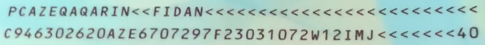

# 進階設定

調用 `MRZScanner` 模型時，你可以透過傳遞參數來進行進階設定。

## Initialization

以下是在初始化階段的進階設定選項：

### 1. Backend

Backend 是一個列舉類型，用於指定 `MRZScanner` 的運算後端。

它包含以下選項：

- **cpu**：使用 CPU 進行運算。
- **cuda**：使用 GPU 進行運算（需要適當的硬體支援）。

```python
from capybara import Backend

model = MRZScanner(backend=Backend.cuda) # 使用 CUDA 後端
#
# 或是
#
model = MRZScanner(backend=Backend.cpu) # 使用 CPU 後端
```

我們是使用 ONNXRuntime 作為模型的推論引擎，雖然 ONNXRuntime 支援了多種後端引擎（包括 CPU、CUDA、OpenCL、DirectX、TensorRT 等等），但限於平常使用的環境，我們稍微做了一點封裝，目前只提供了 CPU 和 CUDA 兩種後端引擎。此外，使用 cuda 運算除了需要適當的硬體支援外，還需要安裝相應的 CUDA 驅動程式和 CUDA 工具包。

如果你的系統中沒有安裝 CUDA，或安裝的版本不正確，則無法使用 CUDA 運算後端。

:::tip

1. 如果你有其他需求，請參考 [**ONNXRuntime 官方文件**](https://onnxruntime.ai/docs/execution-providers/index.html) 進行自定義。
2. 關於安裝依賴相關的問題，請參考 [**ONNXRuntime Release Notes**](https://onnxruntime.ai/docs/execution-providers/CUDA-ExecutionProvider.html#requirements)
   :::

### 2. ModelType

ModelType 是一個列舉類型，用於指定 `MRZScanner` 使用的模型類型。

目前包含以下選項：

- **spotting**：使用端到端的模型架構，僅會載入一個模型。
- **two_stage**：使用二階段的模型架構，會載入兩個模型。
- **detection**：僅載入 MRZ 的偵測模型。
- **recognition**：僅載入 MRZ 的辨識模型。

你可以透過 `model_type` 參數來指定使用的模型。

```python
from mrzscanner import MRZScanner

model = MRZScanner(model_type=MRZScanner.spotting)
```

### 3. ModelCfg

你可以透過 `list_models` 來查看所有可用的模型。

```python
from mrzscanner import MRZScanner

print(MRZScanner().list_models())
# {
#    'spotting': ['20240919'],
#    'detection': ['20250222'],
#    'recognition': ['20250221']
# }
```

選定你要的版本，並透過 `spotting_cfg`、`detection_cfg`、`recognition_cfg` 等參數，搭配 `ModelType` 來指定使用的模型。

1. **spotting**：

   ```python
   model = MRZScanner(
      model_type=ModelType.spotting,
      spotting_cfg='20240919'
   )
   ```

2. **two_stage**：

   ```python
   model = MRZScanner(
      model_type=ModelType.two_stage,
      detection_cfg='20250222',
      recognition_cfg='20250221'
   )
   ```

3. **detection**：

   ```python
   model = MRZScanner(
      model_type=ModelType.detection,
      detection_cfg='20250222'
   )
   ```

4. **recognition**：

   ```python
   model = MRZScanner(
      model_type=ModelType.recognition,
      recognition_cfg='20250221'
   )
   ```

你也可以完全不指定，反正我們都有配置每個模型的預設版本。

## ModelType.spotting

這個模型是端到端的模型，會直接偵測 MRZ 的位置並進行辨識，缺點是準確度較低，而且不會回傳 MRZ 的座標。

使用範例如下：

```python
import cv2
from skimage import io
from mrzscanner import MRZScanner, ModelType

# 建立模型
model = MRZScanner(
   model_type=ModelType.spotting,
   spotting_cfg='20240919'
)

# 讀取線上影像
img = io.imread('https://github.com/DocsaidLab/MRZScanner/blob/main/docs/test_mrz.jpg?raw=true')
img = cv2.cvtColor(img, cv2.COLOR_RGB2BGR)

# 模型推論
result = model(img, do_center_crop=True, do_postprocess=False)

# 輸出結果
print(result)
# {
#    'mrz_polygon': None,
#    'mrz_texts': [
#        'PCAZEQAOARIN<<FIDAN<<<<<<<<<<<<<<<<<<<<<<<<<',
#        'C946302620AZE6707297F23031072W12IMJ<<<<<<<40'
#    ],
#    'msg': <ErrorCodes.NO_ERROR: 'No error.'>
# }
```

## ModelType.two_stage

這個模型是二階段的模型，會先偵測 MRZ 的位置，再進行辨識，優點是準確度較高，而且會回傳 MRZ 的座標。

使用範例如下，最後我們還能畫出 MRZ 的位置：

```python
import cv2
from skimage import io
from mrzscanner import MRZScanner, ModelType

# 建立模型
model = MRZScanner(
   model_type=ModelType.two_stage,
   detection_cfg='20250222',
   recognition_cfg='20250221'
)

# 讀取線上影像
img = io.imread('https://github.com/DocsaidLab/MRZScanner/blob/main/docs/test_mrz.jpg?raw=true')
img = cv2.cvtColor(img, cv2.COLOR_RGB2BGR)

# 模型推論
result = model(img, do_center_crop=True, do_postprocess=False)

# 輸出結果
print(result)
# {
#     'mrz_polygon':
#         array(
#             [
#                 [ 158.536 , 1916.3734],
#                 [1682.7792, 1976.1683],
#                 [1677.1018, 2120.8926],
#                 [ 152.8586, 2061.0977]
#             ],
#             dtype=float32
#         ),
#     'mrz_texts': [
#         'PCAZEQAQARIN<<FIDAN<<<<<<<<<<<<<<<<<<<<<<<<<',
#         'C946302620AZE6707297F23031072W12IMJ<<<<<<<40'
#     ],
#     'msg': <ErrorCodes.NO_ERROR: 'No error.'>
# }

# 畫出 MRZ 的位置
from capybara import draw_polygon, imwrite, centercrop

poly_img = draw_polygon(img, result['mrz_polygon'], color=(0, 0, 255), thickness=5)
imwrite(centercrop(poly_img))
```

<div align="center" >
<figure style={{width: "70%"}}>

</figure>
</div>

## ModelType.detection

這個模型僅會偵測 MRZ 的位置，不會進行辨識。

使用範例如下：

```python
import cv2
from skimage import io
from mrzscanner import MRZScanner, ModelType

# 建立模型
model = MRZScanner(
   model_type=ModelType.detection,
   detection_cfg='20250222',
)

# 讀取線上影像
img = io.imread('https://github.com/DocsaidLab/MRZScanner/blob/main/docs/test_mrz.jpg?raw=true')
img = cv2.cvtColor(img, cv2.COLOR_RGB2BGR)

# 模型推論
result = model(img, do_center_crop=True)

# 輸出結果
print(result)
# {
#     'mrz_polygon':
#         array(
#             [
#                 [ 158.536 , 1916.3734],
#                 [1682.7792, 1976.1683],
#                 [1677.1018, 2120.8926],
#                 [ 152.8586, 2061.0977]
#             ],
#             dtype=float32
#         ),
#     'mrz_texts': None,
#     'msg': <ErrorCodes.NO_ERROR: 'No error.'>
# }
```

這裡 MRZ 定位的結果和剛才一樣，我們就不再重複畫出來了。

## ModelType.recognition

這個模型僅會進行 MRZ 的辨識，不會偵測 MRZ 的位置。

要執行這個模型，你得先準備好 MRZ 裁切後的影像，並且將其傳入模型。

我們先準備一下 MRZ 裁切後的影像，直接取用剛才定位的座標：

```python
import numpy as np
from skimage import io
from capybara import imwarp_quadrangle, imwrite

polygon = np.array([
    [ 158.536 , 1916.3734],
    [1682.7792, 1976.1683],
    [1677.1018, 2120.8926],
    [ 152.8586, 2061.0977]
], dtype=np.float32)

img = io.imread('https://github.com/DocsaidLab/MRZScanner/blob/main/docs/test_mrz.jpg?raw=true')
img = cv2.cvtColor(img, cv2.COLOR_RGB2BGR)

mrz_img = imwarp_quadrangle(img, polygon)
imwrite(mrz_img)
```

執行上面程式後，我們可以取出 MRZ 裁切後的影像：

<div align="center" >
<figure style={{width: "90%"}}>

</figure>
</div>

有了影像之後，我們就可以單獨執行辨識模型：

```python
from mrzscanner import MRZScanner, ModelType

# 建立模型
model = MRZScanner(
   model_type=ModelType.recognition,
   recognition_cfg='20250221'
)

# 輸入 MRZ 裁切後的影像
result = model(mrz_img, do_center_crop=False)


# 輸出結果
print(result)
# {
#     'mrz_polygon':None,
#     'mrz_texts': [
#         'PCAZEQAQARIN<<FIDAN<<<<<<<<<<<<<<<<<<<<<<<<<',
#         'C946302620AZE6707297F23031072W12IMJ<<<<<<<40'
#     ],
#     'msg': <ErrorCodes.NO_ERROR: 'No error.'>
# }
```

:::warning
要注意這裡的參數設定是 `do_center_crop=False`，因為我們已經裁切好了。
:::
