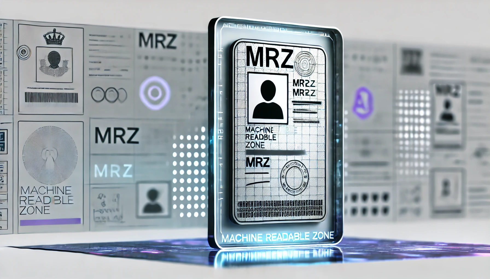

# MRZScanner

本專案的核心功能為「MRZ 文字辨識」。

- [**MRZScanner Github**](https://github.com/DocsaidLab/MRZScanner)

---



---

```mdx-code-block
import DocCardList from '@theme/DocCardList';

<DocCardList />
```
