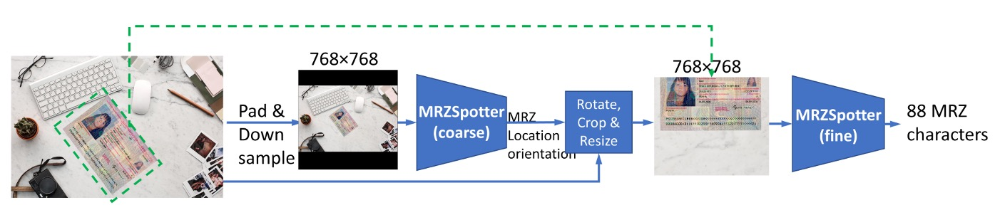

# 參考文獻

這個主題的論文比較少，我們把一些比較有代表性的論文列出來，用來作為研究的基礎材料。

## 研究論文

- [**[20.03] Machine-Readable Zones Detection in Images Captured by Mobile Devices’ Cameras**](https://www.researchgate.net/publication/344847851_Machine-Readable_Zones_Detection_in_Images_Captured_by_Mobile_Devices'_Cameras)

  - 本文提出了一種基於連通區塊排列的機器可讀區（MRZ）偵測方法，透過分析黑色連通區塊的中心分布來獲取文件方向，實現旋轉不變性。演算法搜尋符合 MRZ 特徵的路徑，分群後選擇最一致的群集，並以包圍該群集的方形作為結果。測試顯示，該方法相比現有技術有顯著提升，且計算複雜度低，可在行動裝置上即時運行。

- [**[20.09] MRZ code extraction from visa and passport documents using convolutional neural network**](https://arxiv.org/abs/2009.05489)

  - 本文提出了一種基於卷積神經網路（CNN）的模型，用於從任意方向和大小的護照數位影像中成功提取機器可讀區（MRZ）資訊。傳統的電腦視覺方法，如光學字符辨識（OCR），難以準確提取護照上的 MRZ 資訊，而該模型克服了這一問題。在護照與簽證資料集上，模型達到了 100%的 MRZ 偵測率以及 98.36%的字符辨識 Macro-F1 分數，顯示出其在驗證文件真偽上的卓越表現。

    

- [**[22.12] Hough Encoder for Machine Readable Zone Localization**](https://www.researchgate.net/profile/Vladimir-Arlazarov/publication/366599215_Hough_Encoder_for_Machine_Readable_Zone_Localization/links/64e58a6f0453074fbda7a98c/Hough-Encoder-for-Machine-Readable-Zone-Localization.pdf)

  - 本文提出結合神經網路與影像處理的方法，具備輕量且高精度的特性。該網路被訓練來處理輸入影像，生成 MRZ 字符的熱圖，並透過連通區分析將字符合併為行，進一步評估 MRZ 的邊界框。我們採用了 Hough 編碼器的輕量化版本，該架構專為處理投影變形影像設計。與典型自編碼器相比，我們的網路體積縮小了 100 倍，且在開放的合成資料集上表現出色，參數量比常見的 Unet 解決方案更少。

    

- [**[23.06] MobileMRZNet: Ecient and Lightweight MRZ Detection for Mobile Devices**](https://www.researchgate.net/figure/MRZ-region-in-simulated-Turkish-ID-document-and-decomposition-of-the-MRZ-region_fig1_371323943)

  - 本文提出了一種名為 MobileMRZNet 的快速輕量化方法，基於 BlazeFace 模型，專為移動圖形處理單元（GPU）設計，實現快速精確的 MRZ 區域偵測。該模型在由真實與模擬資料組成的土耳其國民身份證數據集上進行訓練，展現出優異的泛化能力。在測試中，模型達到了約 81%的 IoU 準確率，並在三幀內實現 100%的字符辨識準確率。該模型大小約 400 KB，在移動設備上運行時間低於 10 毫秒，顯示出其相較於現有 MRZ 偵測方法的速度、輕量性和穩健性。

    

## ICAO 9303

- [**Part 1: Introduction**](https://www.icao.int/publications/Documents/9303_p1_cons_en.pdf)
- [**Part 2: Specifications for the Security of the Design, Manufacture and Issuance of MRTDs**](https://www.icao.int/publications/Documents/9303_p2_cons_en.pdf)
- [**Part 3: Specifications Common to all MRTDs**](https://www.icao.int/publications/Documents/9303_p3_cons_en.pdf)
- [**Part 4: Specifications for Machine Readable Passports (MRPs) and other TD3 Size MRTDs**](https://www.icao.int/publications/Documents/9303_p4_cons_en.pdf)
- [**Part 5: Specifications for TD1 Size Machine Readable Official Travel Documents (MROTDs)**](https://www.icao.int/publications/Documents/9303_p5_cons_en.pdf)
- [**Part 6: Specifications for TD2 Size Machine Readable Official Travel Documents (MROTDs)**](https://www.icao.int/publications/Documents/9303_p6_cons_en.pdf)
- [**Part 7: Machine Readable Visas**](https://www.icao.int/publications/Documents/9303_p7_cons_en.pdf)
- [**Part 8: Emergency Travel Documents**](https://www.icao.int/publications/Documents/9303_p8_cons_en.pdf)
- [**Part 9: Deployment of Biometric Identification and Electronic Storage of Data in MRTDs**](https://www.icao.int/publications/Documents/9303_p9_cons_en.pdf)
- [**Part 10: Logical Data Structure (LDS) for Storage of Biometrics and Other Data in the Contactless Integrated Circuit (IC)**](https://www.icao.int/publications/Documents/9303_p10_cons_en.pdf)
- [**Part 11: Security Mechanisms for MRTDs**](https://www.icao.int/publications/Documents/9303_p11_cons_en.pdf)
- [**Part 12: Public Key Infrastructure for MRTDs**](https://www.icao.int/publications/Documents/9303_p12_cons_en.pdf)
- [**Part 13: Visible Digital Seals**](https://www.icao.int/publications/Documents/9303_p13_cons_en.pdf)

## 檢查碼

機讀區 (MRZ, Machine-Readable Zone) 是護照、簽證及其他證件中，讓機器快速讀取關鍵信息的一部分。為了確保這些資料的正確性和完整性，MRZ 中的數據通常會附帶檢查碼 (Check Digit)。檢查碼是一個基於數字和字母的驗證機制，用來檢查輸入或讀取過程中的錯誤。檢查碼的計算過程雖然看似複雜，但其基本原理可以分解為一系列有規律的步驟。

### 檢查碼的計算步驟

1. **字符轉換為數值**
   檢查碼的計算首先要將機讀區的字符轉換為數值。不同的字符對應不同的數值，轉換規則如下：

   - **數字（0-9）**：數字本身即為其數值。例如，`0` 對應數值 `0`，`9` 對應數值 `9`。
   - **字母（A-Z）**：字母按照英文字母表中的順序，轉換為對應的數值。例如，`A` 對應數值 `10`，`B` 對應數值 `11`，依此類推，`Z` 對應數值 `35`。
   - **特殊符號**：在 MRZ 中，通常只會用到 `<` 符號，這個符號被視為占位符，對應數值 `0`。

2. **權重的應用**
   檢查碼的計算過程中，必須將每個字符的數值乘以預設的權重。這個權重按照固定的循環順序進行：

   - 第 1 位字符的數值乘以 `7`。
   - 第 2 位字符的數值乘以 `3`。
   - 第 3 位字符的數值乘以 `1`。
   - 第 4 位字符再乘以 `7`，依此類推。

   這樣的權重循環模式保證每一位字符的重要性都有不同的權重考量，防止簡單錯誤的發生。

3. **加總所有的乘積**
   每個字符的數值乘以其對應的權重後，將所有的乘積加總得到一個總值。

4. **模數運算**
   最後，將總和對 `10` 取模，即除以 `10` 取餘數，這個餘數就是檢查碼。如果結果是 `0`，那麼檢查碼就是 `0`；如果結果是 `1` 到 `9`，那麼該結果即為檢查碼。

### 檢查碼計算的範例

我們可以用一個具體的例子來說明。

假設有以下的 MRZ 字符串：`123ABC<`。

1. **字符轉換為數值**：

   - `1` -> 1
   - `2` -> 2
   - `3` -> 3
   - `A` -> 10
   - `B` -> 11
   - `C` -> 12
   - `<` -> 0

2. **應用權重**：

   - 第 1 位字符 `1`，數值為 `1`，乘以 `7` 得到：1 × 7 = 7。
   - 第 2 位字符 `2`，數值為 `2`，乘以 `3` 得到：2 × 3 = 6。
   - 第 3 位字符 `3`，數值為 `3`，乘以 `1` 得到：3 × 1 = 3。
   - 第 4 位字符 `A`，數值為 `10`，乘以 `7` 得到：10 × 7 = 70。
   - 第 5 位字符 `B`，數值為 `11`，乘以 `3` 得到：11 × 3 = 33。
   - 第 6 位字符 `C`，數值為 `12`，乘以 `1` 得到：12 × 1 = 12。
   - 第 7 位字符 `<`，數值為 `0`，乘以 `7` 得到：0 × 7 = 0。

3. **加總所有的乘積**：

   - 7 + 6 + 3 + 70 + 33 + 12 + 0 = 131。

4. **對 10 取餘數**：

   - 將總和 131 對 10 取模，131 % 10 = 1。

   因此，檢查碼為 `1`。

檢查碼被設計用來幫助檢測資料輸入的錯誤。在護照、簽證等證件的機讀區中，通常會有數個關鍵字段配有檢查碼，例如護照號、出生日期、效期等。每一個關鍵字段後面都會附帶一位檢查碼，這樣在證件被機器讀取時，系統可以通過計算檢查碼來驗證讀取的數據是否正確。如果檢查碼不匹配，則說明可能存在讀取錯誤或是數據被篡改。
