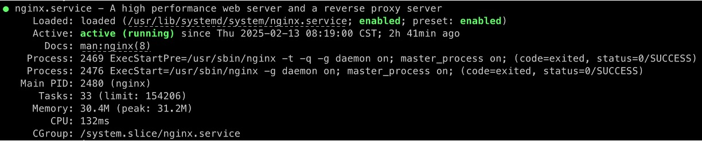

# Nginx 安裝與配置

我們用 Ubuntu 作為舉例說明的對象，來安裝 Nginx 並設定基本的配置。

其他作業系統的部分，請參考官方文件或其他資源進行安裝。

## 安裝 Nginx

首先，更新軟體庫並安裝 Nginx：

```bash
sudo apt update
sudo apt install -y nginx
```

安裝完成後，Nginx 服務會自動啟動。

我們用 `systemctl` 來確認 Nginx 是否正常運行：

```bash
sudo systemctl status nginx
```

若顯示 `active (running)`，表示 Nginx 已成功啟動。

<div align="center">
<figure style={{"width": "90%"}}>

</figure>
</div>

:::warning
若伺服器啟用了防火牆（例如 UFW），請確保允許 HTTP 與 HTTPS 流量：

```bash
sudo ufw allow 'Nginx Full'
```

:::

## Nginx 配置結構介紹

### 主配置檔案

Nginx 的主配置檔案是 **`/etc/nginx/nginx.conf`**。

詳細的使用方式，請參考我們的補充說明文件：[**nginx.conf**](./supplementary/nginx-conf-intro.md)

:::tip
考慮到篇幅的問題，我們將詳細的說明另外寫，請務必要點進去看看。⬆ ⬆ ⬆
:::

### 站點配置檔案

針對每個網站或服務，我們通常會在兩個資料夾內進行配置：

- **`/etc/nginx/sites-available/`**：建立獨立的配置檔。
- **`/etc/nginx/sites-enabled/`**：透過符號連結啟用站點。

Nginx 使用 `sites-available` 和 `sites-enabled` 目錄來管理多個站點的配置。

詳細的使用方式，請參考我們的補充說明文件：[**sites-available/default**](./supplementary/sites-available-intro.md)

:::tip
同樣地，說明文件要記得先去看看。⬆ ⬆ ⬆
:::

## 基本配置範例

以下是一個基本的 Nginx 配置範例，說明如何將所有請求轉發至後端 API。

我們先在 `sites-available` 目錄下建立一個配置檔：

```bash
sudo vim /etc/nginx/sites-available/temp_api.example.com
```

在檔案中加入以下內容：

```nginx
server {
    listen 80;
    server_name temp_api.example.com;

    location / {
        proxy_pass http://127.0.0.1:8000;
        proxy_set_header Host $host;
        proxy_set_header X-Real-IP $remote_addr;
        proxy_set_header X-Forwarded-For $proxy_add_x_forwarded_for;
        proxy_set_header X-Forwarded-Proto $scheme;
    }
}
```

此配置將針對 `temp_api.example.com` 的 HTTP 請求，轉發至本機 8000 埠上運行的後端 API（請改成你的真正的 API 路徑），並同時保留客戶端資訊，方便後端記錄與處理。

接著，將此配置文件連結到 `sites-enabled` 目錄：

```bash
sudo ln -s /etc/nginx/sites-available/temp_api.example.com /etc/nginx/sites-enabled/
```

## 測試與驗證

完成配置後，需要驗證設定是否正確：

1. **檢查 Nginx 配置語法**

   ```bash
   sudo nginx -t
   ```

   若顯示 `syntax is ok` 與 `test is successful`，表示配置無誤。

2. **重新載入 Nginx，使新配置生效**

   ```bash
   sudo systemctl reload nginx
   ```

3. **驗證服務**

   使用瀏覽器或 `curl` 訪問 `http://temp_api.example.com/test`，確認是否能取得預期回應。

:::tip
請注意，這裡的 `http://temp_api.example.com/test` 是根據我們在上一章節中自行假設的 API 端點。

你應該要根據實際情況修改配置檔中的 `server_name` 與 `proxy_pass` 設定。
:::

:::info
**常用指令筆記**

```bash
# 啟動 Nginx
sudo systemctl start nginx

# 停止 Nginx
sudo systemctl stop nginx

# 重新啟動 Nginx（通常用於重大配置變更後）
sudo systemctl restart nginx

# 重新載入 Nginx（建議用於輕微配置變更）
sudo systemctl reload nginx
```

:::

## 多站點配置

Nginx 使用 `server` 區塊來定義虛擬主機，並根據請求的 **`Host`** 及 **`listen` 監聽埠** 來決定應處理的站點。當用戶發送 HTTP 請求時，Nginx 會先比對請求的「主機域名（Host）」與「埠號（Port）」，然後匹配對應的 `server` 區塊進行處理。

通常，每個站點會透過 `listen` 指令指定監聽的埠（如 80 或 443），並使用 `server_name` 指令來對應特定的域名。例如，`example.com` 和 `api.example.com` 可分別設定不同的 `server_name`，Nginx 會依據 Host 標頭選擇適當的配置來處理請求。

接下來，我們來看看一個典型的多站點配置範例：

```nginx title="/etc/nginx/sites-available/example.com"
server {
    listen 80;
    server_name example.com;
    root /var/www/example.com;
    index index.html;
}

server {
    listen 80;
    server_name api.example.com;
    location / {
        proxy_pass http://localhost:5000/;
        proxy_set_header Host $host;
        proxy_set_header X-Real-IP $remote_addr;
        proxy_set_header X-Forwarded-For $proxy_add_x_forwarded_for;
        proxy_set_header X-Forwarded-Proto $scheme;
    }
}
```

- 第一個 `server` 區塊處理 `example.com` 的靜態資源。
- 第二個 `server` 區塊處理 `api.example.com`，並將請求代理至本機 `5000` 埠的 API 服務。

舉例來說，當使用者訪問 `http://example.com` 時，Nginx 會將請求導向 `/var/www/example.com` 目錄下的 `index.html` 檔案；而訪問 `http://api.example.com` 時，則會將請求轉發至本機 `5000` 埠的 API 服務。

## 預設主機配置

我們可以在配置文件中設定 `default_server`，當請求的 `server_name` 無匹配時，Nginx 會使用預設主機處理：

```nginx
server {
    listen 80 default_server;
    server_name _;
    return 404;
}
```

此設定可防止未指定的請求進入錯誤的站點。

## 常見錯誤與排查

最後一段我們來看看遇到問題時，如何進行排查。

1.  **檢查 Nginx 配置是否正確**

    ```bash
    sudo nginx -t
    ```

    如果有錯誤訊息，請根據提示修正配置。

2.  **檢查 Nginx 服務狀態**

    ```bash
    sudo systemctl status nginx
    ```

    若 `active (running)`，表示 Nginx 正常運行；若 `failed`，則需檢查錯誤日誌。

3.  **查看錯誤日誌**

    ```bash
    sudo journalctl -u nginx --no-pager --lines=30
    ```

    或直接查看 `error.log`：

    ```bash
    sudo tail -f /var/log/nginx/error.log
    ```

    這些日誌有助於找出 404、502、403 等錯誤的具體原因。

## 結論

本章介紹了如何在 Ubuntu 安裝 Nginx，並配置基本站點、反向代理與多站點管理。

此外，我們學習了如何測試與驗證配置，確保網站能夠正常運作。透過這些基礎設定，Nginx 能夠滿足大部分靜態網站與 API 代理的需求。

下一章我們來看看 HTTPS 配置方式以及 Let's Encrypt 的使用方法。
