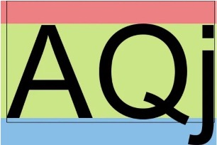
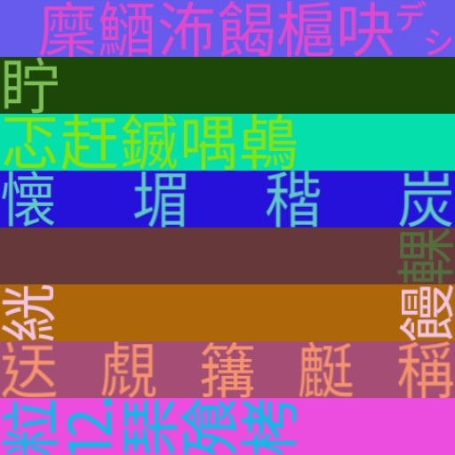

# 進階用法

除了基本的使用方法外，`WordCanvas` 還提供了一些進階的設定，讓你可以更靈活地控制輸出的文字圖像。在這裡我們引入隨機性的設定，這些特性主要被用來訓練模型。

## 隨機字型

使用 `random_font` 參數啟用隨機字型的功能。當 `random_font` 設定為 `True` 時，參數 `font_bank` 才會生效，同時，`font_path` 會被忽略。

你應該要指定 `font_bank` 參數到你的字型庫中，因為預設值為套件底下的目錄 `fonts`，為了範例說明，我們預先在 `fonts` 目錄下放了兩個字型，因此如果你沒有修改 `font_bank` 的話，就只會隨機選擇這兩個字型。

```python
import numpy as np
from wordcanvas import WordCanvas

gen = WordCanvas(
    random_font=True,
    output_size=(64, 512),
    font_bank="path/to/your/font/bank"
)

imgs = []
for _ in range(8):
    text = 'Hello, World!'
    img, infos = gen(text)
    imgs.append(img)

# 結合所有圖片一起輸出
img = np.concatenate(imgs, axis=0)
```


## 隨機文字內容

你可能不知道要生成什麼文字，這時候可以使用 `random_text` 參數。

當 `random_text` 設定為 `True` 時，原本輸入的 `text` 會被忽略。

```python
import numpy as np
from wordcanvas import WordCanvas

gen = WordCanvas(
    random_text=True,
    output_size=(64, 512),
)

imgs = []
for _ in range(8):
    text = 'Hello!World!' # 這個輸入會被忽略
    img, infos = gen(text)
    imgs.append(img)

# 結合所有圖片一起輸出
img = np.concatenate(imgs, axis=0)
```


## 指定字串長度

當啟用 `random_text` 時，你可以使用：

- `min_random_text_length`: 最小文字長度
- `max_random_text_length`: 最大文字長度

這兩個參數來指定文字的長度範圍。

```python
import numpy as np
from wordcanvas import WordCanvas

# 固定生成 5 個字元的文字
gen = WordCanvas(
    random_text=True,
    min_random_text_length=5,
    max_random_text_length=5,
    output_size=(64, 512),
)

imgs = []
for _ in range(8):
    img, infos = gen()
    imgs.append(img)

# 結合所有圖片一起輸出
img = np.concatenate(imgs, axis=0)
```


## 隨機背景顏色

使用 `random_background_color` 參數啟用隨機背景顏色的功能。

```python
import numpy as np
from wordcanvas import WordCanvas

gen = WordCanvas(
    random_background_color=True,
    output_size=(64, 512),
)

imgs = []
for _ in range(8):
    text = 'Hello, World!'
    img, infos = gen(text)
    imgs.append(img)

# 結合所有圖片一起輸出
img = np.concatenate(imgs, axis=0)
```


## 隨機文字顏色

使用 `random_text_color` 參數啟用隨機文字顏色的功能。

```python
import numpy as np
from wordcanvas import WordCanvas

gen = WordCanvas(
    random_text_color=True,
    output_size=(64, 512),
)

imgs = []
for _ in range(8):
    text = 'Hello, World!'
    img, infos = gen(text)
    imgs.append(img)

# 結合所有圖片一起輸出
img = np.concatenate(imgs, axis=0)
```


## 隨機文字對齊

使用 `random_align_mode` 參數啟用隨機文字對齊的功能。

```python
import numpy as np
from wordcanvas import WordCanvas

gen = WordCanvas(
    random_align_mode=True,
    output_size=(64, 512),
)

imgs = []
for _ in range(8):
    text = 'Hello, World!'
    img, infos = gen(text)
    imgs.append(img)

# 結合所有圖片一起輸出
img = np.concatenate(imgs, axis=0)
```


:::warning
特別注意到 `AlignMode.Scatter`，單字 "World!" 的尺寸比 "Hello," 大。

導致這個情況的具體細節跟 pillow 內的 `ImageFont` 有關。

簡單來說，我們在渲染文字時，會計算字串內的上下左右的邊界，然後將文字放在這個範圍內，如下圖：

[](https://sean22492249.medium.com/%E7%94%A8-python-%E5%9C%A8%E5%9C%96%E5%83%8F%E4%B8%8A%E5%AF%AB%E5%AD%97-d62a431ea727)

當有些文字需要下方的藍色空間，例如 ","，整體的對齊就會往上偏移。除了分散對齊之外，其他對齊方式都是整體文字一起計算，所以不會有對齊錯位的問題。但在分散對齊的情況下，每個字元都是獨立計算的，因此在這個例子中，"Hello," 計算出來的邊界會比 "World!" 的邊界高，所以你會看到 "World!" 往下沉。

這其實可以修復，概念上就是將所有文字的邊界計算一次，然後將所有文字的中心點對齊，但就是有點麻煩。實際上，這個專案應用場景在於 OCR 模型的訓練上，這種稍微不對齊的情況反而有助於模型的訓練。

所以，這不是 BUG，是 Feature。
:::

## 隨機文字方向

使用 `random_direction` 參數啟用隨機文字方向的功能。

建議將這個參數與 `output_direction` 一起使用，方便輸出影像。

```python
import numpy as np
from wordcanvas import WordCanvas, OutputDirection

gen = WordCanvas(
    random_direction=True,
    output_direction=OutputDirection.Horizontal,
    output_size=(64, 512),
)

imgs = []
for _ in range(8):
    text = '午安，或是晚安。'
    img, infos = gen(text)
    imgs.append(img)

# 結合所有圖片一起輸出
img = np.concatenate(imgs, axis=0)
```


## 全隨機

如果你想要所有的設定都是隨機的，可以使用 `enable_all_random` 參數。

啟用這個參數，開啟群魔亂舞模式。

```python
import numpy as np
from wordcanvas import WordCanvas

gen = WordCanvas(
    enable_all_random=True,
    output_size=(64, 512),
)

imgs = []
for _ in range(20):
    img, infos = gen()
    imgs.append(img)

# 結合所有圖片一起輸出
img = np.concatenate(imgs, axis=0)
```



:::warning
這個參數不會調整 `reinit` 系列的參數，例如 `random_font`、`random_text` 等，這些參數都需要自行設定。
:::

## 儀表板

我們再次回到儀表板。


在隨機性的相關參數啟用時，True 的參數會被標示為綠色，False 的參數會被標示為紅色。

我們希望可以透過這個設計，來讓你快速地確認相關設定。

## 小結

在開發工具的過程中，我們的目標是創建一個能夠靈活地生成各種文字圖像的工具，特別是為了機器學習模型的訓練。隨機性的引入旨在模擬現實世界中的各種情況，這對於提高模型的適應性和泛化能力有極大的幫助。
