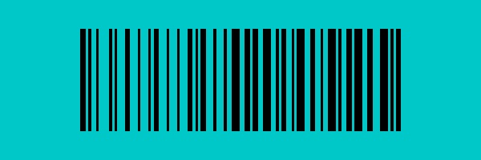

# 條碼生成

這個功能其實是我們日常實作的小功能，單獨開一個專案也不太合適，因此我們將其放在這裡。

我們實作了 Code 39 和 Code 128 兩種格式的條碼生成器。

## Code 39

Code39（也稱為 Alpha39、Code 3 of 9、Code3/9、Type 39、USS Code39 或 USD-3）是 ISO/IEC 16388:2007 中定義的一種不固定長度的條碼。可以表示 43 個字元，包含大寫拉丁字母（A 到 Z）、數字（0 到 9）和幾個特殊字元（-、.、$，/、+、％與空格）。另有一個外加符號作為終止符號（標示為「\*」）。每個字元由九個部份組成：五條線與和四個空格，當中三個部份較寬（二進位 1），六個較窄。窄與寬之間的比例並不重要，在 1:2 和 1:3 之間都可。

:::info
以上資訊節錄自 [**Wikipedia: Code39**](https://zh.wikipedia.org/wiki/Code39)
:::

使用方式如下：

```python
from wordcanvas import Code39Generator

gen = Code39Generator(
    width_rate=2,
    color=(0, 0, 0)
)

img = gen('123456789', w=400, h=128)
```

- `width_rate` 用來設定窄與寬的比例，預設為 2，建議比例介於 1:2 和 1:3 之間。
- `color` 用來設定條碼的顏色，預設為黑色。

繪製條碼結果如下圖：


## Code 128

Code 128 是一種高密度的一維條碼，於 1981 年由 Computer Identics 公司開發，專為編碼多樣化字元集而設計。與 Code 39 相比，Code 128 具有更高的編碼效率和更大的數據容量，因此在需要編碼較長數據和多樣字元的應用中更為適用。

Code 128 條碼可以編碼全部 128 個 ASCII 字元，包含數字、大小寫字母以及各種特殊字元。它分為三個子集：A、B 和 C。子集 A 包含控制字元和大寫字母，子集 B 包含大小寫字母和特殊字元，子集 C 主要用於壓縮數字數據，每兩位數字編碼成一個字元。

與 Code 39 相比，Code 128 使用更少的元素來表示更多的字元，因此在相同數據量的情況下，條碼更短更緊湊。Code 128 條碼以特定的起始字元開始，這些字元標識使用的子集（A、B 或 C），並以一個特殊的停止字元結束。每個 Code 128 條碼都包含一個校驗碼，以確保條碼數據的準確性。校驗碼是基於條碼內容計算出的，用於檢測讀取錯誤。

使用方式如下：

```python
from wordcanvas import Code128Generator, CodeType

# 直接使用預設值即可
gen = Code128Generator(
    code_type=CodeType.Code128_B,
    color=(0, 0, 0)
)

barcode_img = gen("ABCD1234", w=400, h=128)
```


## 進階製圖

接著我們設想一個更複雜的情境：

要在 200 x 600 尺寸上，繪製一個 128 x 400 的 Code39 條碼，並將其放置在 (36, 100) 的位置上，背景色設定為 (200, 200, 0)。則可以參考以下的程式碼：

```python
import numpy as np
from wordcanvas import Code39Generator

gen = Code39Generator()

# 設定底圖尺寸和背景色
output_img = np.zeros((200, 600, 3), dtype=np.uint8) + (200, 200, 0)

# 設定條碼尺寸
x, y, w, h = np.array([100, 36, 400, 128])

# 生成條碼，尺寸為 400 x 128
barcode_img = gen("ABCD1234", w=400, h=128)

# 將條碼放置在底圖上
slice_x = slice(x, x+w)
slice_y = slice(y, y+h)
output_img[slice_y, slice_x] = \
np.where(barcode_img > 0, output_img[slice_y, slice_x], barcode_img)
```


---

同理可推，我們換成 Code128 也可以得到相同的效果：

```python
from wordcanvas import Code128Generator

gen = Code128Generator()

# ... 以下相同

```



## 總結

有了這個功能，我們之後就可以用來訓練一個條碼定位和解析的模型了。

雖然這種功能聽起來很沒用，但是用來練練手感還是挺不錯的。
