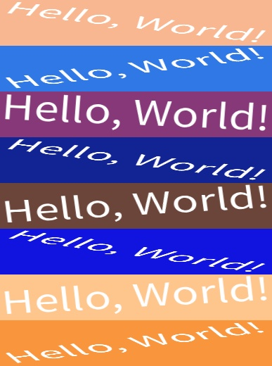

# 圖像增強

我們沒有把圖像增強的功能做在 `WordCanvas` 內，因為我們認為這是一個非常「客製化」的需求，不同的應用場景可能需要不同的增強方式。但我們提供了一些簡單的範例，說明該如何實現圖像增強的流程。

我們習慣使用 [**albumentations**](https://github.com/albumentations-team/albumentations) 這個套件來實現圖像增強，但是你可以使用任何你喜歡的庫。

## 範例一：剪切變換

生成文字圖像後，再套用自定義的操作。

首先，我們示範套用剪切變換，以下以 `Shear` 為例：

`Shear` 類負責對圖像進行剪切變換。剪切會改變圖像的幾何形狀，創造出水平的傾斜，這可以幫助模型學習在不同的方向和位置辨識對象。

- **參數**

  - max_shear_left：向左的最大剪切角度。默認值為 20 度。
  - max_shear_right：向右的最大剪切角度。默認值同樣為 20 度。
  - p：操作概率。默認為 0.5，意味著任何給定的圖像有 50% 的概率會被剪切。

- **使用方式**

  ```python
  from wordcanvas import Shear, WordCanvas

  gen = WordCanvas()
  shear = Shear(max_shear_left=20, max_shear_right=20, p=0.5)

  img, _ = gen('Hello, World!')
  img = shear(img)
  ```

  

## 範例二：旋轉變換

為了實作旋轉變換，我們從 `albumentations` 中引入 `SafeRotate` 類。

使用 `Shift`、`Scale`或 `Rotate` 相關的操作時，會遇到背景色填充的問題。

這時應該調用 `infos` 資訊來獲取背景色。

```python
from wordcanvas import ExampleAug, WordCanvas
import albumentations as A

gen = WordCanvas(
    background_color=(255, 255, 0),
    text_color=(0, 0, 0)
)

aug =  A.SafeRotate(
    limit=30,
    border_mode=cv2.BORDER_CONSTANT,
    value=infos['background_color'],
    p=1
)

img, infos = gen('Hello, World!')
img = aug(image=img)['image']
```


## 範例三：修改類別行為

程式寫到這裡，你可能會注意到：

- 如果每次 `WordCanvas` 生成圖像都帶有隨機背景色，那麼每次都需要重新初始化 `albumentations` 的類別，是不是不科學？

或許我們可以修改 `albumentations` 的行為，讓它只需要一次初始化就可以一直使用？

```python
import albumentations as A
import cv2
import numpy as np
from wordcanvas import WordCanvas


gen = WordCanvas(
    random_background_color=True
)

aug = A.SafeRotate(
    limit=30,
    border_mode=cv2.BORDER_CONSTANT,
    p=1
)

imgs = []
for _ in range(8):
    img, infos = gen('Hello, World!')

    # 修改 albu 類別行為
    aug.value = infos['background_color']

    img = aug(image=img)['image']

    imgs.append(img)

# 顯示結果
img = np.concatenate(imgs, axis=0)
```



:::danger
我們還是會建議使用範例二的方式（儘管那樣看起來有點蠢），因為如果你直接修改 `albumentations` 的類別行為，在多執行緒的訓練環境中會出現問題，請務必注意！
:::

## 範例四：加上背景

你可能不滿足於單純的文字圖像，想要加上背景，來提高模型的泛化能力。

這時你得先自己準備一包背景圖像，然後參考以下範例：

```python
import albumentations as A
import cv2
import numpy as np
from wordcanvas import WordCanvas
from albumentations import RandomCrop

gen = WordCanvas(
    random_text_color=True,
    random_background_color=True
)

# 生成一張隨機顏色文字圖
img, infos = gen('Hello, World!')
```


接著，載入一張背景圖像：

```python
bg = cv2.imread('path/to/your/background.jpg')
```

[](https://www.lccnet.com.tw/lccnet/article/details/2274)

最後，我們從背景上隨機裁切一塊區域，並將文字圖像放在上面：

```python
bg = RandomCrop(img.shape[0], img.shape[1])(image=bg)['image']

result_img = np.where(img == infos['background_color'], bg, img)
```


## 範例五：透視變換

透視變換是一種將圖像投影到新視平面的變換，這種變換可以模擬物體在不同角度和距離下的外觀。

我們延續上一個範例，改成對圖像進行透視變換後再疊加背景：

```python
from albumentations import Perspective

aug = A.Perspective(
    keep_size=True,
    fit_output=True,
    pad_val=infos['background_color'],
)

img = aug(image=img)['image']
result_img = np.where(img == infos['background_color'], bg, img)
```


:::tip
針對「空間改變」的影像增強操作，我們建議的順序是先對原圖進行透視變換，再疊加背景圖像，這樣背景圖才不會出現奇怪的黑邊。
:::

## 範例六：強光反射

一般文字也容易有強光反射的問題，這時我們可以使用 `RandomSunFlare` 來模擬這種情況：

```python
from albumentations import RandomSunFlare

aug = A.RandomSunFlare(
    src_radius=128,
    src_color=(255, 255, 255),
)

result_img = aug(image=result_img)['image']
```


:::tip
針對「像素改變」的影像增強操作，我們建議的順序是先疊加背景圖像，再進行影像增強變換，這樣才不會丟失背景資訊，以致於出現雜亂斑點。
:::

## 結語

本專案的介紹到此結束，如果你任何問題或建議，歡迎在底下留言，我們會盡快回覆。

又或者，你不確定某個操作該如何實現，也同樣歡迎留言，我們會盡力提供幫助。

祝你使用愉快！
