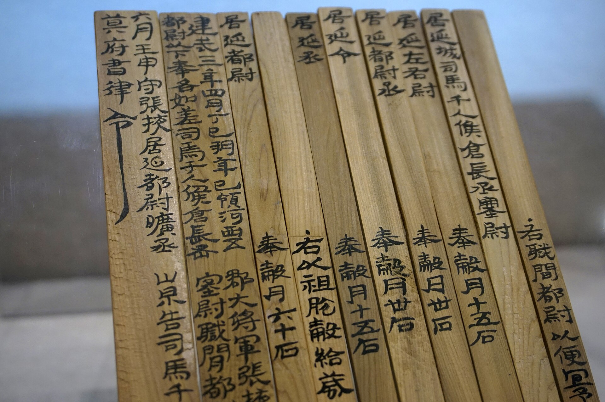

# 介紹

在目前的光學字元辨識（OCR）領域的研究中，模型的準確度取決於資料集的品質和多樣性。

在此，我們列舉幾個現行研究面臨的問題：

1. **資料量不足**：現有的資料集規模有限，無法涵蓋所有可能的情境和樣本。
2. **類別不平衡**：某些類別的樣本過少，長尾分布的情況嚴重。
3. **缺乏多樣性**：現有資料集中的樣本過於單一，無法涵蓋現實世界中的多樣情境。
4. **合成資料與真實資料差異**：合成資料集與真實應用場景中的資料存在差異。

此外，比起只有數十個至數百個拉丁字母來說，漢字的數量根本就是個災難。（~喂！放尊重點！~）

在中文 OCR 的研究中，除了得面臨上述問題外，還衍生出更多獨特的困難點：

### 字符多樣性與數量

中文包含數千個常用字，和近十萬個生僻字。且從常用到生僻的字的分布非常不均。

:::tip
近十萬？你是不是在唬我？

這個數字是根據：[**維基百科 Unicode 擴充漢字**](https://zh.wikipedia.org/zh-tw/Wikipedia:Unicode%E6%89%A9%E5%B1%95%E6%B1%89%E5%AD%97) 的資料統計而來。目前大約有九萬多個漢字，並且持續增加中。
:::

### 複雜的字形結構及語意依賴

漢字由多個筆劃組成，筆劃的形狀和排列方式多變，很多相似字只能通過上下文來區分。

:::tip
例如：(口，囗)、(日，曰)、(木，朩) 等。
:::

### 書寫風格

書寫風造成的困難不限於單一文字，每種文字都可以衍生出大量相異的字型。但在漢字的龐大基數下，不同的字體和書寫風格（如楷書、行書、草書等）會進一步增加辨識的難度。

### 豎排文本和混排問題

中文經常出現豎排文本，特別是在傳統文化相關的應用場景中更是如此。此外，中英文混排也是常見情況，這些都給文字的定位和辨識帶來額外挑戰。

### 標注資源有限

高品質的資料集需要大量精準的標注，但這既耗時又昂貴。

:::tip
先不說找不到素材的問題，就算找到了，標注人員根本也不認得那些生僻字。
:::

## 目標

本專案的目標是解決上述問題。

好吧，問題太大，至少我們可以先解決一部分。

＊

我們透過合成資料的方式，生成大量多樣性的中文文字圖像，以應對資料量不足、類別不平衡、缺乏多樣性等問題。

對此我們參考了一些現有的文字合成工具，詳細資料請參考：

- [**相關資源**](./tools)

他們的設計方式帶給了我們很多啟發，讓我們決定從零開始創建了一個新的文字圖像生成器。

其中，我們的生成模組不是基於一個預定義的文字編碼表，而是基於字型。

也就是說，我們可以生成任何字型的文字圖像，並且支援多種文字方向、對齊方式、文字長度、文字顏色、背景顏色等設定。

- **只要你找得到字型，我們就能用來生成圖像。**

## 設計理念

在設計上，我們考慮過「函數導向設計」還是「物件導向設計」的方式。

最後我們選擇了後者，因爲不管怎麼選，你都會覺得很難用。（？？？）

事實上，**大量的可選參數都會對使用者造成困擾**，而物件導向的設計可以更好地將這些參數組織起來，對此我們設計了一個儀表版（如下圖），希望你可以像是駕駛汽車一樣，透過儀表板來了解目前的設定，並且進行調整。

＊

整體而言，我們在這個專案中，完成了幾項功能：

1. **儀表板**：了解目前的設定和調整。
2. **圖像生成**：生成多樣的文字圖像。
3. **輸出對齊**：支援四種對齊方式。
4. **輸出方向**：支援水平和垂直兩種輸出方向。
5. **壓扁文字**：支援壓扁文字功能。
6. **標準化輸出大小**：支援輸出圖像的標準化大小。
7. **隨機字體**：支援隨機選擇字體。
8. **隨機文字**：支援隨機選擇文字。
9. **隨機文字長度**：支援隨機選擇文字長度。
10. **隨機文字顏色**：支援隨機選擇文字顏色。
11. **隨機背景顏色**：支援隨機選擇背景顏色。
12. **隨機文字方向**：支援隨機選擇文字方向。
13. **隨機對齊方式**：支援隨機選擇對齊方式。
14. **隨機最小文字長度**：支援指定最小文字長度。
15. **隨機最大文字長度**：支援指定最大文字長度。

## 最後

如果你還有其他需求，歡迎在下方留言。

緣分到了，我們會依照你的需求加入新功能。
