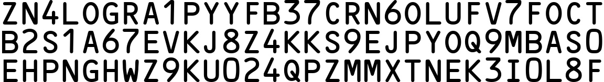
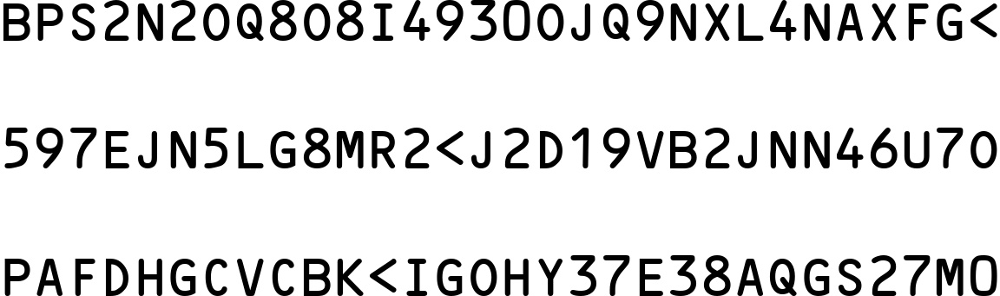

# MRZ 生成

完成 `WordCanvas` 的開發之後，我們可以利用這個工具來做點其他事情。

在本章節中，我們開發一個生成「**機器閱讀區域（Machine Readable Zone, MRZ）**」的功能。

## 什麼是 MRZ？

MRZ（Machine Readable Zone，機器可讀區）指護照、簽證、身分證等旅行證件上的一段特定區域，該區域內的資訊可以被機器快速讀取。 MRZ 依照國際民航組織（ICAO）第 9303 號文件的規定進行設計和生成，用於加快邊境檢查和提高資訊處理的準確性。

- [**ICAO Doc9309**](https://www.icao.int/publications/Documents/9303_p1_cons_en.pdf)

MRZ 的結構因不同類型的證件而有所不同，主要包括以下幾種：

1. **TD1（身分證等）：**

   - 由三行每行 30 個字元組成，共 90 個字元。
   - 包含的資訊：證件類型、國家代碼、證件號碼、出生日期、性別、有效期限、國籍、姓氏、名稱、可選資料 1、可選資料 2。

2. **TD2（護照卡等）：**

   - 由兩行每行 36 個字元組成，共 72 個字元。
   - 包含的資訊：證件類型、國家代碼、姓氏、名稱、證件號碼、國籍、出生日期、性別、有效期限、可選資料。

3. **TD3（護照等）：**

   - 由兩行每行 44 個字元組成，共 88 個字元。
   - 包含的資訊：證件類型、國家代碼、姓氏、名稱、證件號碼、國籍、出生日期、性別、有效期限、可選資料。

4. **MRVA（簽證類型 A）：**

   - 由兩行每行 44 個字元組成，共 88 個字元。
   - 包含的資訊：證件類型、國家代碼、姓氏、名稱、證件號碼、國籍、出生日期、性別、有效期限、可選資料。

5. **MRVB（簽證類型 B）：**

   - 由兩行每行 36 個字元組成，共 72 個字元。
   - 包含的資訊：證件類型、國家代碼、姓氏、名稱、證件號碼、國籍、出生日期、性別、有效期限、可選資料。

## 合成影像

當我們要訓練一個 MRZ 的檢測模型時，我們需要大量的資料集，但顯然地，這些資料都帶有個人隱私，因此難以收集。為了解決這個問題，我們可以使用 `WordCanvas` 來合成 MRZ 影像。

相關功能我們已經完成，請直接參考以下範例，調用 `MRZGenerator`：

```python
from wordcanvas import MRZGenerator

mrz_gen = MRZGenerator(
    text_color=(0, 0, 0),
    background_color=(255, 255, 255),
)

output_infos = mrz_gen()
img = output_infos['image']
```

在這個設定中，你可以手動指定文字顏色、背景顏色，以及分隔符號。由於 MRZ 的文字是 2~3 行，分隔符號統一設定為 `\n`。

完成設定後，直接當成函數來呼叫即可，我們已經實作了 `__call__` 方法：

```python
output_infos = mrz_gen()
```

這樣就可以得到一張合成的 MRZ 影像，資料輸出格式為：

- `typ`：MRZ 類型。
- `text`：MRZ 文字。
- `points`：MRZ 每個文字的座標。
- `image`：MRZ 影像。

在輸出時，若沒有給定參數，則會隨機決定 MRZ 類型（TD1、TD2、TD3）。接著隨機生成 MRZ 文字，並且將其合成影像。

以下為輸出影像範例：



## 展示每個文字的座標

你可能對每個文字的位置感興趣，這樣可以幫助你訓練文字檢測模型。我們已經提供了這個功能，只需要調用 `points` 屬性就可以得到，我們直接畫張圖來看看：

```python
import cv2
from capybara import draw_points
from wordcanvas import MRZGenerator

mrz_gen = MRZGenerator(
    text_color=(0, 0, 0),
    background_color=(255, 255, 255),
)

output_infos = mrz_gen()

img = output_infos['image']
points = output_infos['points']
points_img = draw_points(img, points, scales=5)
```


## 修改文字背景顏色和間距

透過 `text_color` 和 `background_color` 參數，我們可以修改文字和背景的顏色：

```python
mrz_gen = MRZGenerator(
    text_color=(255, 0, 0),
    background_color=(0, 127, 127),
)

output_infos = mrz_gen()
img = output_infos['image']
```


---

使用 `spacing` 參數可以調整文字之間的間距：

```python
mrz_gen = MRZGenerator(
    spacing=100,
)

output_infos = mrz_gen()
img = output_infos['image']
```



## 指定 MRZ 文字

如果你想要指定 MRZ 文字，可以在呼叫時傳入 `mrz_type` 和 `mrz_text` 參數，在函數中我們有做一些基本的檢查，例如文字長度和類型是否匹配上之類的。

:::warning
請注意，我們沒有做 Hash 檢查，本功能只是為了合成影像，不需要真實有效的 MRZ 文字。
:::

```python
mrz_gen = MRZGenerator(spacing=32)

output_infos = mrz_gen(
    mrz_type='TD1',
    mrz_text=[
        "I<SWE59000002<8198703142391<<<",
        "8703145M1701027SWE<<<<<<<<<<<8",
        "SPECIMEN<<SVEN<<<<<<<<<<<<<<<<"
    ]
)

img = output_infos['image']
```


## 延伸閱讀

- [**Arg0s1080/mrz**](https://github.com/Arg0s1080/mrz)
- [**Detecting machine-readable zones in passport images**](https://pyimagesearch.com/2015/11/30/detecting-machine-readable-zones-in-passport-images/)
- [**ultimateMRZ-SDK**](https://github.com/DoubangoTelecom/ultimateMRZ-SDK)
- [**QKMRZScanner**](https://github.com/Mattijah/QKMRZScanner)
- [**PassportScanner**](https://github.com/evermeer/PassportScanner)
