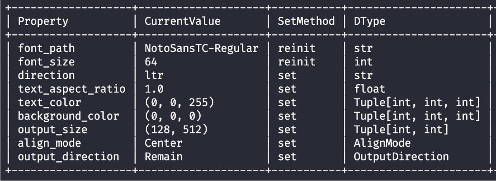

# 快速開始

萬事起頭難，所以我們需要一個簡單的開始。

## 從一個字串開始

先給定一個基本宣告，然後就可以開始使用了。

```python
from wordcanvas import WordCanvas

gen = WordCanvas()
```

全部使用預設功能，直接調用函數即可生成文字圖像。

```python
text = "你好！Hello, World!"
img, infos = gen(text)
print(img.shape)
# >>> (67, 579, 3)
```


:::tip
在預設模式下，輸出影像的尺寸取決於：

1. **字型大小**：預設為 64，隨著字型大小的增加，影像尺寸也會增加。
2. **文字長度**：文字越長，影像寬度也會增加，具體長度由 `pillow` 決定。
:::

## 指定特定字型

使用 `font` 參數可以指定自己喜歡的字型。

```python
gen = WordCanvas(
    font_path="/path/to/your/font/OcrB-Regular.ttf"
)

text = 'Hello, World!'
img, infos = gen(text)
```


當字型不支援輸入文字時，會出現豆腐字。

```python
text = 'Hello, 中文!'
img, infos = gen(text)
```


:::tip
**檢查字型是否支援的方法：**

目前我沒有這種需求，所以我留下了一個基礎的方法。這個方法是一個簡單的檢查，每次只能檢查一個字元，所以需要遍歷所有的字元。如果你有其他需求，請自行擴展。

```python title="check_font.py"
from wordcanvas import is_character_supported, load_ttfont

target_text = 'Hello, 中文!'

font = load_ttfont("/path/to/your/font/OcrB-Regular.ttf")

for c in target_text:
    status = is_character_supported(font, c)
    if not status:
        print(f"Character: {c}, Not Supported!")

# >>> Character: 中, Not Supported!
# >>> Character: 文, Not Supported!
```
:::

## 設定影像尺寸

使用 `output_size` 參數可以調整影像尺寸。

```python
gen = WordCanvas(output_size=(64, 1024)) # 高度 64，寬度 1024
img, infos = gen(text)
print(img.shape)
# >>> (64, 1024, 3)
```


當設定的尺寸小於文字圖像的尺寸時，會自動縮放文字圖像。

也就是說，文字會擠在一起，變成長方形，例如：

```python
text = '你好' * 10
gen = WordCanvas(output_size=(64, 512))  # 高度 64，寬度 512
img, infos = gen(text)
```


## 調整背景顏色

使用 `background_color` 參數可以調整背景顏色。

```python
gen = WordCanvas(background_color=(255, 0, 0)) # 藍色背景
img, infos = gen(text)
```


## 調整文字顏色

使用 `text_color` 參數可以調整文字顏色。

```python
gen = WordCanvas(text_color=(0, 255, 0)) # 綠色文字
img, infos = gen(text)
```


## 調整文字對齊

:::warning
還記得剛才提到的影像尺寸嗎？在預設的情況下，**設定文字對齊是沒有意義的**。你必須讓文字影像有多餘的空間，才能看到對齊的效果。
:::

使用 `align_mode` 參數可以調整文字對齊模式。

```python
from wordcanvas import AlignMode, WordCanvas

gen = WordCanvas(
    output_size=(64, 1024),
    align_mode=AlignMode.Center
)

text = '你好！ Hello, World!'
img, infos = gen(text)
```

- **中間對齊：`AlignMode.Center`**

    

- **靠右對齊：`AlignMode.Right`**

    

- **靠左對齊：`AlignMode.Left`**

    

- **分散對齊：`AlignMode.Scatter`**

    

    :::tip
    在分散對齊的模式中，不是每個字元都會分散開來，而是以單詞為單位進行分散。在中文中，單詞的單位是一個字；在英文中，單詞的單位是一個空格。

    以上圖為例：輸入文字是 "你好！ Hello, World!"。這個字串會被拆分為：

    - ["你", "好", "！", "Hello,", "World!"]

    並忽略空白後，再進行分散對齊。

    另外，當輸入文字只能拆分出一個單詞的時候，中文單詞的分散對齊等價於置中對齊，英文單詞則會被拆分成單字後，再進行分散對齊。

    這個部分我們使用的邏輯是：

    ```python
    def split_text(text: str):
        """ Split text into a list of characters. """
        pattern = r"[a-zA-Z0-9<\p{P}\u3000-\u303F\uFF00-\uFFEF]+|."
        matches = regex.findall(pattern, text)
        # If the text is a single character, split it into a list
        if len(matches) == 1:
            matches = list(text)
        return matches
    ```
    :::

## 調整文字方向

使用 `direction` 參數可以調整文字方向。

- **輸出橫向文字**

    ```python
    text = '你好！'
    gen = WordCanvas(direction='ltr') # 從右到左的橫向文字
    img, infos = gen(text)
    ```

    

- **輸出直向文字**

    ```python
    text = '你好！'
    gen = WordCanvas(direction='ttb') # 從上到下的直向文字
    img, infos = gen(text)
    ```

    

- **輸出直向文字且分散對齊**

    ```python
    text = '你好！'
    gen = WordCanvas(
        direction='ttb',
        align_mode=AlignMode.Scatter,
        output_size=(64, 512)
    )
    img, infos = gen(text)
    ```

    

## 調整輸出方向

使用 `output_direction` 參數可以調整輸出方向。

:::tip
**這個參數的使用時機是**：當你選擇：「輸出直向文字」時，卻又希望可以用水平的方式查看文字圖像時，可以使用這個參數。
:::

- **直向文字，水平輸出**

    ```python
    from wordcanvas import OutputDirection, WordCanvas

    gen = WordCanvas(
        direction='ttb',
        output_direction=OutputDirection.Horizontal
    )

    text = '你好！'
    img, infos = gen(text)
    ```

    

- **橫向文字，垂直輸出**

    ```python
    from wordcanvas import OutputDirection, WordCanvas

    gen = WordCanvas(
        direction='ltr',
        output_direction=OutputDirection.Vertical
    )

    text = '你好！'
    img, infos = gen(text)
    ```

    

## 壓扁文字

有些場景的文字會特別扁，這時候可以使用 `text_aspect_ratio` 參數。

```python
gen = WordCanvas(
    text_aspect_ratio=0.25, # 文字高度 / 文字寬度 = 1/4
    output_size=(32, 1024),
)  # 壓扁文字

text="壓扁測試"
img, infos = gen(text)
```


:::info
需要注意的是，當壓扁後的文字尺寸大於 `output_size` 時，圖像會進入自動縮放的流程。因此，你可能壓扁了圖像，卻又被縮放回來，結果什麼事情都沒發生。
:::

## 儀表板

基礎功能大致上就是這樣。

最後我們介紹一下儀表板的功能。

```python
gen = WordCanvas()
print(gen)
```

你也可以不需要 `print`，直接輸出就好，因為我們有實作 `__repr__` 方法。

輸出後可以看到一個簡單的儀表板。



你可以看到：

- 第一個 column 是 Property，是所有的設定參數。
- 第二個 column 是 Current Value，是參數「此時此刻」的值。
- 第三個 column 是 SetMethod，是參數的設定方法。寫著 `set` 的參數，可以直接指定修改；寫著 `reinit` 的參數，則是需要重新初始化 `WordCanvas` 物件。
- 第四個 column 是 DType，是參數的資料型態。
- 第五個 column 是 Description，是參數的描述。

沒錯，參數大部分可以直接設定，這表示當你需要修改輸出特性時，不需要重新建立一個 `WordCanvas` 物件，只需要直接設定即可。會需要使用 `reinit` 的參數，通常是涉及到字型格式的初始化，例如文字高度 `text_size` 之類的。所以請注意，不是所有的參數都可以直接設定。

```python
gen.output_size = (64, 1024)
gen.text_color = (0, 255, 0)
gen.align_mode = AlignMode.Center
gen.direction = 'ltr'
gen.output_direction = OutputDirection.Horizontal
```

設定完之後，直接調用，就可以得到新的文字圖像。

如果你設定了 `reinit` 的參數，那你會收到錯誤：

```python
gen.text_size = 128
# >>> AttributeError: can't set attribute
```

:::danger
當然，你還是可以強硬地進行參數設定，同樣身為 Python 使用者，我阻止不了你：

```python
gen._text_size = 128
```

但是這樣會出錯呀！不要這麼堅持，重新初始化一個 `WordCanvas` 物件吧。
:::

## 小結

還有許多功能沒有提到，但是基本功能已經介紹完畢。

以上就是 `WordCanvas` 的基本使用方法，希望對你有所幫助，祝你使用愉快！
