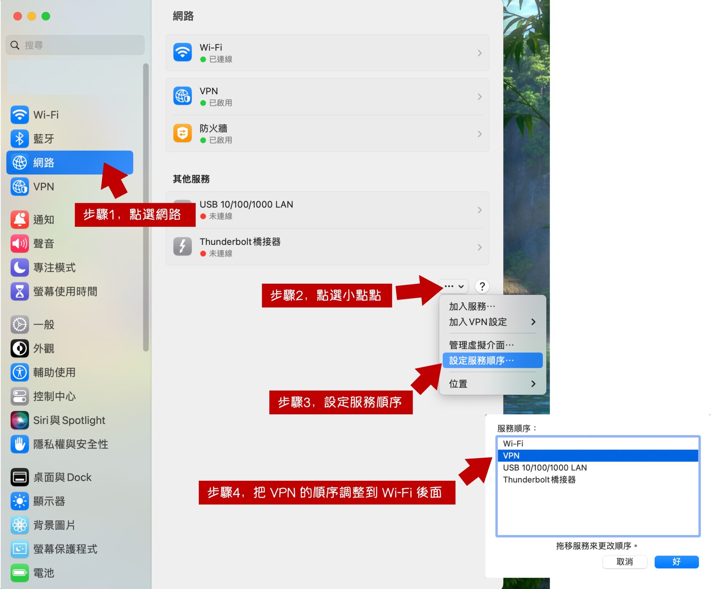

Working remotely using a company-configured VPN, but still wanting to use other machines on your local network.

<!-- truncate -->

## Configuration Guide

This guide uses macOS as the operating system.

## Problem Description

For example:

- **Company VPN subnet**: 192.168.25.XXX
- **Home subnet**: 192.168.1.XXX

When you connect to the VPN, all traffic is routed through the company's subnet, which means you won’t be able to connect to other machines on the same home network.

Not only that, but while you were watching a funny video at home, the company’s network administrator might have been laughing along with you. (???)

Something seems off, right?

So what we need to do is: **Route only the company's subnet through the VPN, and let all other traffic use the local network.**

:::tip
Here, we assume that you've already configured the VPN and it's working correctly, and now we’re only addressing the traffic routing issue.

If the VPN isn’t working correctly yet, please check that your VPN settings are properly configured first.
:::

## Solution

Step one: First, identify the company’s internal subnet, such as:

- 192.168.25.XXX

This indicates that you're working with the 25 subnet. Now, let’s open a file:

```bash
sudo vim /etc/ppp/ip-up
```

Enter the following content, but be sure to replace it with your actual subnet:

:::warning
Please note, this example assumes the VPN subnet is 192.168.25.XXX. Modify it according to your actual setup.
:::

```bash
#!/bin/sh
/sbin/route add -net 192.168.25.0/24 -interface ppp0
```

Let’s explain what the command above does:

1. **/sbin/route**: This is the path to the route command, which is used to configure network routes.
2. **-net 192.168.25.0/24**: The parameter specifies that this is a network route, not a host route.
    - 192.168.25.0/24 represents the network address and subnet mask, covering the IP range from 192.168.25.0 to 192.168.25.255.
3. **-interface ppp0**: Specifies the network interface through which the route should be set.
    - In this example, it's ppp0 (point-to-point protocol interface 0).

The whole command adds a route through the ppp0 interface to the 192.168.25.0/24 network.

When your system tries to access any IP address in the 192.168.25.0/24 network, it will route the traffic through the ppp0 interface.

---

After finishing the setup, save and exit the file, then give the file the correct permissions:

```bash
sudo chmod 755 /etc/ppp/ip-up
```

## Is it still not working?

At this point, some machines may still be unable to access the internet. So, let’s move on:

Open the System Preferences on macOS and go to Network, as shown in the image below:

<div align="center">
<figure style={{"width": "80%"}}>

</figure>
</div>

- Step 1: Open System Preferences and click on "Network."
- Step 2: Click on the small options button next to the VPN connection.
- Step 3: Select "Set Service Order."
- Step 4: Drag the VPN service below Wi-Fi in the list.

---

Many users, after setting up the VPN, move the VPN service to the top of the list, meaning all traffic is routed through the VPN by default.

So here, we need to move the VPN down, which will allow the network settings above it to take effect.

Once that’s done, you're all set. If you need other traffic to go through the VPN in the future, simply add the necessary routes to the `ip-up` file.

## References

1. [shalyf/vpn_route.md](https://gist.github.com/shalyf/d50b0bbf30a4b5020d2b84f4ae8eb4e0)
2. [How to selectively route network traffic through VPN on Mac OS X Leopard?](https://superuser.com/questions/4904/how-to-selectively-route-network-traffic-through-vpn-on-mac-os-x-leopard)
