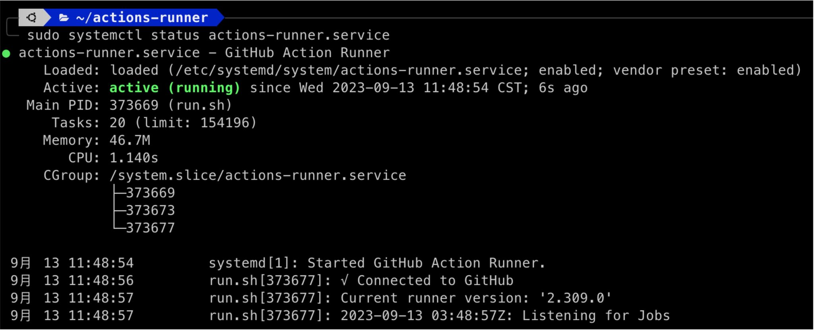

When collaborating with GitHub, we often use private hosts for CI/CD tasks.

GitHub provides documentation to guide users through the initial installation steps, and following the steps will successfully configure the setup.

<!-- truncate -->

<div align="center">
<figure style={{"width": "80%"}}>

</figure>
<figcaption>Documentation</figcaption>
</div>

## Problem Description

However, your host will often need to reboot. If no configuration is set up, the Runner service will fall asleep indefinitely. This issue can be forgotten until someone notices there’s no response or receives a complaint, which may have already been days later.

This kind of problem can happen repeatedly and become very annoying!

Therefore, we need to make it run automatically!

## Configuration Process

To automatically run a task after the host boots, we can use systemd.

1. **Create a new systemd service file:**

   ```bash
   sudo vim /etc/systemd/system/actions-runner.service
   ```

2. **Paste the following content into the file:**

   ```bash {7-9} title="/etc/systemd/system/actions-runner.service"
   [Unit]
   Description=GitHub Action Runner
   After=network.target

   [Service]
   Type=simple
   User=your-username
   WorkingDirectory=/home/your-username/actions-runner
   ExecStart=/home/your-username/actions-runner/run.sh
   Restart=always
   RestartSec=5

   [Install]
   WantedBy=multi-user.target
   ```

   Pay attention to the highlighted areas:

   - `User`, `ExecStart`, and `WorkingDirectory` should be changed to your own username.

3. **Tell systemd to reload the new service configuration:**

   ```bash
   sudo systemctl daemon-reload
   ```

4. **Enable the service so it starts automatically when the host boots:**

   ```bash
   sudo systemctl enable actions-runner.service
   ```

5. **Now you can manually start the service or reboot to test it:**

   ```bash
   sudo systemctl start actions-runner.service
   ```

With this method, the actions-runner will automatically run in the background when your host boots.

If you want to stop the service, you can use the following command:

```bash
sudo systemctl stop actions-runner.service
```

:::warning
Make sure that `run.sh` has executable permissions.
:::

## Check the Status

When managing a service with systemd, you can check the logs to understand its current status.

Use the following command:

```bash
sudo journalctl -u actions-runner.service -f
```

Explanation of the parameters:

- `-u actions-runner.service`: Only show logs for the service named actions-runner.
- `-f`: This option makes journalctl follow the latest logs, so you can see the new output in real time.

Additionally, if you want to check the current status of the service, you can use:

```bash
sudo systemctl status actions-runner.service
```

This will display the current status of the `actions-runner` service, including whether it's running and the most recent log output:

<div align="center">
<figure style={{"width": "80%"}}>

</figure>
</div>

## Reconfigure

This part is off-topic and unrelated to auto-running.

If the original Runner is missing (usually due to switching a repository between Public and Private), or the Runner hasn’t been invoked in a long time and got lost!

In this case, you’ll need to reconfigure:

1. Obtain a new Token from your GitHub account.
2. Go to your actions-runner folder (or another folder you named) and delete the `.runner` file, then run the configuration command:

   ```bash
   ./config.sh --url ... (use the new Token configuration)
   ```

The other steps are the same, and after configuring, just restart the service.