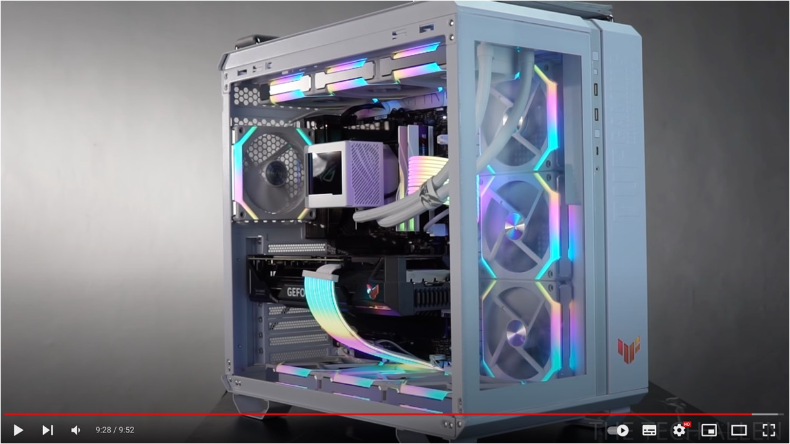

We suddenly decided to buy a new computer.

The main reason? To use an RTX 4090 for model training.

<!-- truncate -->

## Disclaimer

We were busy and decided to build a training rig, so we documented the process.

1. If you assemble a computer based on this documentation and encounter any issues or losses, we are not responsible.
2. This article is for personal documentation purposes only and is not intended as a recommendation or advertisement.
3. All products or brands mentioned in the article are for documentation purposes only and do not represent any commercial cooperation or endorsement.

## Purchase Details

Below is the list of items we purchased:

| Item           | Description                                                                        | Quantity | Total Price (NTD) |
| -------------- | ---------------------------------------------------------------------------------- | -------- | ----------------- |
| CPU            | Intel i9-13900K 【24 cores/32 threads】3.0GHz-5.8GHz 36MB LGA1700 125W             | 1        | $ 19,500          |
| Motherboard    | Gigabyte Z790 AORUS ELITE (ATX/Realtek 2.5Gb) 16+1+2 Power Phases                  | 1        | $ 7,990           |
| Graphics Card  | Gigabyte RTX 4090 AERO OC 24G White Windforce Cooling Metal Backplate              | 1        | $ 60,990          |
| Memory         | Kingston 64 GB (Dual Channel 32GBx2) DDR5 6000 CL36 FURY Beast White               | 2        | $ 12,258          |
| SSD            | Micron Crucial P5 Plus 2TB (Gen4 M.2 PCIe 4.0) NVMe SSD (Read 6600M / Write 5500M) | 2        | $ 7,800           |
| Liquid Cooling | NZXT Kraken 360 RGB White                                                          | 1        | $ 7,990           |
| Case           | ASUS TUF Gaming GT502 White ATX                                                    | 1        | $ 5,490           |
| Case Fans      | ASUS TUF Gaming TF120 ARGB White Triple Fan Pack (Case Gift)                       | 1        | -                 |
| Case Fans      | ASUS TUF Gaming TF120 ARGB White Triple Fan Pack (Additional Purchase)             | 1        | $ 1,690           |
| Case Fans      | ASUS TUF Gaming TF120 ARGB White Single Fan (Additional Purchase)                  | 4        | $ 2,196           |
| PSU            | FSP HYDRO PTM PRO 1200W ATX3.0 Platinum Fully Modular                              | 1        | $ 5,790           |
| Cables         | SilverStone 1 to 4 A.RGB Splitter Cable (SST-CPL03)                                | 2        | $ 250             |

- **Total Price (including tax)**: NT$131,944, approximately $4,100 USD
- **Date**: September 2023

:::info
We checked the prices of pre-built computers with similar specs, which were around NT$180,000.
:::

## RTX 4090

It all started with this.

We first checked out some options at a local retailer and found that there were a few brands offering the RTX 4090: ASUS, Gigabyte, and MSI.

Then we watched a review video:

- [**MSI RTX 4090 Suprim X vs. RTX 4090 Gaming X Trio, Thermals, Power & Overclocking**](https://www.youtube.com/watch?v=uyMnMPLYk2w)

It seemed that MSI’s cards ran particularly hot, while the other two brands had similar temperatures.

Next, we found a relevant article:

- [**[Info] 6 RTX 4090 Cooling Comparisons**](https://forum.gamer.com.tw/C.php?bsn=60030&snA=615853)

Overall, Gigabyte performed the best, so we chose the best-looking white Windforce version from their lineup:

Specifications:

- Item: GIGABYTE RTX 4090 AERO OC 24G White Windforce Cooling Metal Backplate
- Price: NT$60,900 from the local retailer
- Length: 34.2 cm

  

:::tip
This generation of GPUs also involves the ATX standard, which we’ll discuss further in the PSU section.
:::

## Motherboard

After deciding on the graphics card, the next step was the motherboard.

Here we encountered the issue of "socket compatibility," as different motherboards support different CPUs. So we did some research:

- Intel 12th Gen pairs with 600 series motherboards, using the 1700 socket.
- Intel 13th Gen pairs with 700 series motherboards, using the 1700 socket.
- Intel 14th Gen pairs with 700 series motherboards, using the 1700 socket.

It seems that the 1700 socket is a more long-term choice, so we went with a 700 series motherboard:

### 1700 Socket

According to [**Wikipedia’s description of LGA 1700**](https://zh.wikipedia.org/zh-tw/LGA_1700):

LGA 1700 is a socket designed by Intel for its Alder Lake microarchitecture (12th Gen Intel Core) and Raptor Lake microarchitecture (13th and 14th Gen Intel Core) desktop processors, launched in 2021. It replaces the LGA 1200 and supports DDR5 memory. Due to the increased number of contact points, previous heatsinks compatible with LGA 1200 and LGA 1151 (37.5 mm x 37.5 mm) are incompatible with LGA 1700 (45.0 mm x 37.5 mm).

### Chipset Specifications

During our research, we also came across various motherboards like B660, H670, Z690, etc. So we dug deeper:

  
Click to expand

| **Feature**                                                   | **H610**                                     | **B660**                                     | **H670**                                     | **Z690**                                     | **W680**                                     | **Z790**                                     |
| ------------------------------------------------------------- | -------------------------------------------- | -------------------------------------------- | -------------------------------------------- | -------------------------------------------- | -------------------------------------------- | -------------------------------------------- |
| **CPU Overclocking**                                          | No                                           | No (Supports memory overclocking)            | No (Supports memory overclocking)            | Yes                                          | Yes                                          | Yes                                          |
| **Bus Interface**                                             | DMI 4.0 x4                                   | DMI 4.0 x8                                   | DMI 4.0 x8                                   | DMI 4.0 x8                                   | DMI 4.0 x8                                   | DMI 4.0 x8                                   |
| **Supported CPUs**                                            | Alder Lake, Raptor Lake, Raptor Lake Refresh | Alder Lake, Raptor Lake, Raptor Lake Refresh | Alder Lake, Raptor Lake, Raptor Lake Refresh | Alder Lake, Raptor Lake, Raptor Lake Refresh | Alder Lake, Raptor Lake, Raptor Lake Refresh | Alder Lake, Raptor Lake, Raptor Lake Refresh |
| **Supported Memory**                                          | Up to 64GB, DDR4 3200 / DDR5 4800            | Up to 128GB, DDR4 3200 / DDR5 4800           | Up to 128GB, DDR4 3200 / DDR5 4800           | Up to 128GB, DDR4 3200 / DDR5 4800           | Up to 128GB, DDR4 3200 / DDR5 4800           | Up to 128GB, DDR4 3200 / DDR5 4800           |
| **Maximum DIMM Slots**                                        | 2                                            | 4                                            | 4                                            | 4                                            | 4                                            | 4                                            |
| **Maximum USB 2.0 Ports**                                     | 10                                           | 12                                           | 14                                           | 14                                           | 14                                           | 14                                           |
| **USB 3.2 Gen 1 (5 Gbit/s)**                                  | Up to 4                                      | Up to 6                                      | Up to 8                                      | Up to 10                                     | Up to 10                                     | Up to 10                                     |
| **USB 3.2 Gen 2 (10 Gbit/s)**                                 | Up to 1                                      | Up to 2                                      | Up to 4                                      | Up to 4                                      | Up to 4                                      | Up to 10                                     |
| **USB 3.2 Gen 2x2 (20 Gbit/s)**                               | No                                           | Up to 2                                      | Up to 4                                      | Up to 4                                      | Up to 4                                      | Up to 5                                      |
| **Maximum SATA 3.0 Ports**                                    | 4                                            | 4                                            | 8                                            | 8                                            | 8                                            | 8                                            |
| **Processor PCI Express 5.0 Configuration**                   | 1x16                                         | 1x16+1x4                                     | 1x16+1x4 or 2x8+1x4                          | 1x16+1x4 or 2x8+1x4                          | 1x16+1x4 or 2x8+1x4                          | 1x16 or 2x8                                  |
| **PCH PCI Express 4.0 Configuration**                         | No                                           | 6                                            | 12                                           | 16                                           | 16                                           | 16                                           |
| **PCH PCI Express 3.0 Configuration**                         | 8                                            | 12                                           | 12                                           | 12                                           | 12                                           | 12                                           |
| **Built-in Display Support (Digital Ports/Pipelines)**        | 3                                            | 4                                            | 4                                            | 4                                            | 4                                            | 4                                            |
| **Built-in Wireless (802.11ax / Wi-Fi 6E)**                   | Yes                                          | Yes                                          | Yes                                          | Yes                                          | Yes                                          | Yes                                          |
| **SATA RAID 0/1/5/10 Support**                                | No                                           | Yes                                          | Yes                                          | Yes                                          | Yes                                          | Yes                                          |
| **Intel Optane Memory Support**                               | No                                           | Yes                                          | Yes                                          | Yes                                          | Yes                                          | Yes                                          |
| **Intel Smart Sound Technology**                              | Yes                                          | Yes                                          | Yes                                          | Yes                                          | Yes                                          | Yes                                          |
| **Intel Active Management, Trusted Execution & vPro Support** | No                                           | No                                           | No                                           | No                                           | Yes                                          | No                                           |
| **Chipset TDP**                                               | 6W                                           | 6W                                           | 6W                                           | 6W                                           | 6W                                           | 6W                                           |
| **Release Date**                                              | Q1 2022                                      | Q1 2022                                      | Q1 2022                                      | Q4 2021                                      | Q2 2022                                      | Q4 2022                                      |

Whoa! That’s a lot of information. In short, we went with the best option and chose a Z790!

Specifications:

- Item: GIGABYTE Z790 AORUS ELITE (ATX/Realtek 2.5Gb) 16+1+2 Power Phases
- Price: NT$7,990 from the local retailer

  

## CPU

We’ve heard that Intel’s 13th and 14th Gen CPUs have some peculiar issues.

But since we’re not overclocking, it shouldn’t be a big deal. So, we decided to go with the 13th Gen Intel CPU!

Specifications:

- Item: Intel i9-13900K 【24 cores/32 threads】3.0GHz-5.8GHz 36MB 1700 Socket 125W
- Price: NT$19,500 from the local retailer

:::tip
We’re running Ubuntu, and we did experience some crashes initially.

However, after a system update, the issue disappeared, so we’re not sure if it was a CPU defect.
:::

## Memory

We believe that the three major memory manufacturers are Micron, Kingston, and Adata. Since we’re not hardcore gamers, we decided to stick with one of these three.

Capacity is key here. Since this rig is for model training, filling it up with 128GB is a basic requirement, right?

Specifications:

- Item: Kingston 64 GB (Dual Channel 32GBx2) DDR5 6000 CL36 FURY Beast White
- Price: NT$6,129 per set from the local retailer
- Quantity: 2 sets

  

## SSD

For this part, we found a guide from a storage expert on PTT:

- [**SSD (Solid State Drive) Purchasing Guide**](https://www.ptt.cc/bbs/PC_Shopping/M.1675587557.A.3D3.html)

There’s a lot of extended reading and comparisons of various manufacturers, but honestly, there’s too much technical knowledge here.

While we were getting overwhelmed, we seemed to catch a conclusion that recommended Micron, so we went with that! (~Seems a bit too casual?~)

---

After some more research, we concluded that we should avoid QLC SSDs due to their slower write speeds and shorter lifespan. On the other hand, PCIe 5 SSDs seem to have some issues (link below), so we chose TLC technology and PCIe 4.0 SSDs.

- [**Crucial, Corsair PCIe 5.0 SSDs running hot, throttling, and shutting down without heatsink**](https://www.neowin.net/news/crucial-corsair-pcie-50-ssds-running-hot-throttling-and-shutting-down-without-heatsink/?fbclid=IwAR0aM7igqoPCImgSMKCtPTNLRw5nOeGJPxLN3HYN89CsTSFEEtl2YsDqbCU)

:::tip
However, technology advances quickly, so these issues might not be a concern in the near future! It’s always best to check the latest information.
:::

---

Since we’re training models, we opted for 4TB of storage to accommodate the datasets.

Specifications:

- Item: Micron Crucial P5 Plus 2TB PCIe 4.0 NVMe SSD (Read 6600M / Write 5500M) TLC
- Price: NT$3,900 per unit from the local retailer
- Quantity: 2 units

  

## Liquid Cooling

In this category, there are brands like ASUS, MSI, Corsair, and NZXT. Although there seemed to be plenty of choices, we couldn’t find any particularly reliable comparison reviews online, so our focus shifted to warranty duration.

Most brands offer a 3-year warranty, but NZXT offers 6+1 years, so we chose NZXT.

Specifications:

- Item: NZXT Kraken 360 RGB White
- Price: NT$7,990 from the local retailer
- Thickness: 5.6 cm

  

:::tip
If you’re an expert in this field, feel free to provide us with more professional advice. We’ll prioritize it when building our next rig.
:::

## Case and Fans

For this part, we just chose a case that could fit everything and then bought some additional fans to install.

Specifications:

- Items:
  - ASUS TUF Gaming GT502 White ATX
  - TUF Gaming TF120 ARGB White Triple Fan Pack (Case Gift) x1
  - TUF Gaming TF120 ARGB White Triple Fan Pack (Additional Purchase) x1
  - TUF Gaming TF120 ARGB White Single Fan (Additional Purchase) x4
- Prices:

  - Case with Gift: NT$5,490 from the local retailer
  - Additional Triple Fan Pack: NT$1,690 per set from the local retailer
  - Additional Single Fan: NT$549 per fan from the local retailer

    

## Power Supply Unit

For this part, we just searched online for recommended power supply brands of the year.

Any brand that appeared on the lists seemed reliable to us, so we focused on warranty duration and price and went with FSP.

Specifications:

- Item: FSP HYDRO PTM PRO 1200W ATX3.0 Platinum Fully Modular
- Price: NT$5,790 from the local retailer

  

---

Continuing the discussion about the GPU, we need to add some information about the ATX 3.0 standard:

- [**ATX 3.0 Standard**](https://zh.wikipedia.org/zh-tw/ATX%E8%A6%8F%E6%A0%BC)

  The ATX 3.0 standard was released in February 2022. It includes a new 16-Pin 12VHPWR power interface, capable of delivering up to 600W of power to the graphics card. These components contain data lines used to negotiate power functions with the power supply unit, ensuring they do not consume more power than the PSU can provide. The standard also has stricter requirements for handling power spikes.

To meet the power demands of the RTX 4090, it’s important to consider ATX 3.0 compatibility when selecting a power supply. Shortly after the RTX 4090’s release, many cases of power issues were reported, mostly due to insufficient power supply, causing instability in the system.

## Completion

After buying all these components, we weren’t entirely confident in our ability to assemble everything correctly, so we entrusted the final assembly to a technician at the store. Our photography skills aren’t great, but you can check out the video below to see what the final product looks like—it’s quite similar, except our graphics card and all four memory sticks are also white.

- [**ASUS TUF GT502 CUSTOM SETUP | Black & White PC BUILD | i9-13900k | ASUS TUF RTX 4070TI | ProArt Z790**](https://www.youtube.com/watch?v=puMYF4wpzTQ)

  

---

That wraps up the assembly process. Now it’s time to enjoy training some models with our new rig!

## Afterword 1

:::info
Updated in June 2024
:::

Loaded with model training, based on Taiwan's residential electricity meter billing, the monthly electricity bill is about NT$5,000.

## Afterword 2

:::info
Updated in October 2024
:::

After using it for a year, I feel that buying a 4TB hard drive is too conservative:

1. The WebFace42M dataset requires 0.9TB.
2. The ImageNet 21k dataset requires 1.3TB.
3. ...

There are other large-scale datasets, and 4TB is simply not enough. Next time, I need to buy at least 16TB.
