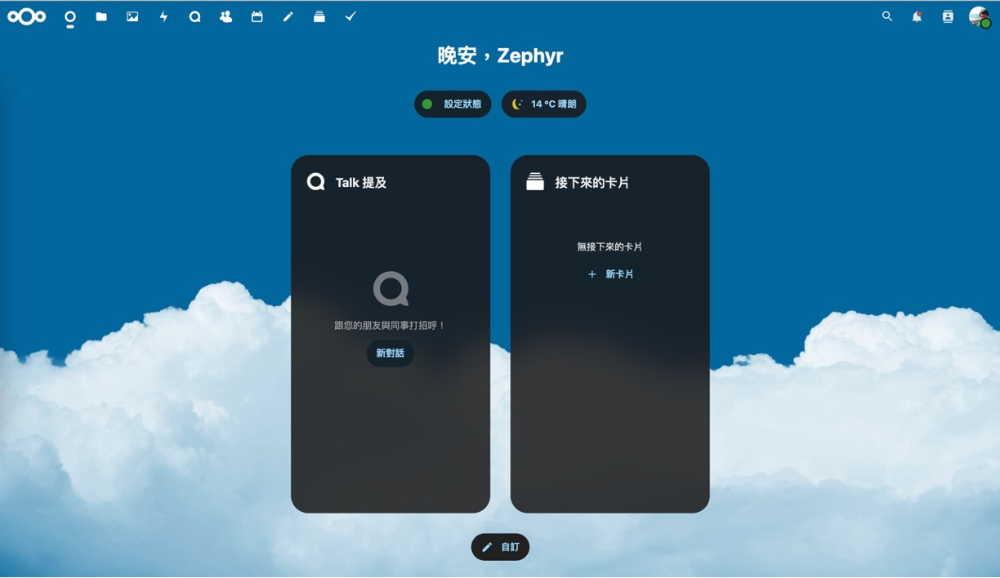

<figure>

<figcaption>Cover Image: Automatically generated by GPT-4 after reading this article</figcaption>
</figure>

---

Previously, I used to store files on Google Drive and would download them using the wget command. However, one day, the download command suddenly stopped working. So, I decided to give Nextcloud a try.

Below, we'll go through the setup process based on Ubuntu 22.04.

:::tip
Before we begin, make sure you have a domain name ready and pointed to your server.

If you're unsure how to do this, simply Google search "how to use namecheap".
:::

## Installing Nextcloud

**First Question: Why use Nextcloud?**

- I wanted a private cloud where I could store files without relying on someone else's servers.

**Second Question: What's the difference between Nextcloud and Owncloud?**

- Nextcloud forked from Owncloud, offering similar functionalities, but Nextcloud's development pace is faster.

**Third Question: How do you install Nextcloud?**

- This is a bit complex because Nextcloud offers various installation methods, each with its pros and cons.
- In this article, I only recommend using Docker for installation.

## Configuring Nextcloud All-in-One

- Reference the official documentation: [**Nextcloud All-in-One**](https://github.com/nextcloud/all-in-one)

First, ensure you've installed Docker and Docker Compose. If not, Google search "Docker & Docker Compose installation methods".

Next, create a NextCloud folder and write a Docker Compose configuration file `docker-compose.yml`:

```bash
mkdir nextcloud
vim nextcloud/docker-compose.yml
```

Paste the following content into `docker-compose.yml`:

```yaml
services:
  nextcloud-aio-mastercontainer:
    image: nextcloud/all-in-one:latest
    init: true
    restart: always
    container_name: nextcloud-aio-mastercontainer
    volumes:
      - nextcloud_aio_mastercontainer:/mnt/docker-aio-config
      - /var/run/docker.sock:/var/run/docker.sock:ro
    ports:
      - 80:80
      - 8080:8080
      - 8443:8443
volumes:
  nextcloud_aio_mastercontainer:
    name: nextcloud_aio_mastercontainer
```

Here's a brief explanation of the commands:

- `--init`: Ensures no zombie processes are created.
- `--name nextcloud-aio-mastercontainer`: Sets the container name, which shouldn't be changed to avoid update failures.
- `--restart always`: Sets the container's restart policy to always accompany the Docker daemon.
- `--publish 80:80`, `--publish 8080:8080`, `--publish 8443:8443`: Publishes container ports to host ports.
- `--volume nextcloud_aio_mastercontainer:/mnt/docker-aio-config`: Sets where the mastercontainer files are stored.
- `--volume /var/run/docker.sock:/var/run/docker.sock:ro`: Mounts Docker socket into the container.

For more detailed configurations, refer to the official documentation: [compose.yaml](https://github.com/nextcloud/all-in-one/blob/main/compose.yaml)

## Configuring System Services

```bash
sudo vim /etc/systemd/system/nexcloud.service
```

Paste the following content:

```bash
[Unit]
Description=NextCloud Docker Compose
Requires=docker.service
After=docker.service

[Service]
WorkingDirectory=/home/[YourName]/nextcloud
ExecStart=/usr/bin/docker compose up --remove-orphans
ExecStop=/usr/bin/docker compose down
Restart=always

[Install]
WantedBy=multi-user.target
```

## Starting Nextcloud

```bash
sudo systemctl enable nextcloud
sudo systemctl start nextcloud
```

## Setting Up Nextcloud

1. **Accessing Nextcloud AIO Interface**:

   - After initial setup, access Nextcloud AIO interface via `https://ip.address.of.this.server:8080`, replacing `ip.address.of.this.server` with your server's IP address.
   - It's important to use the IP address instead of the domain name to avoid HTTP Strict Transport Security (HSTS) issues.

2. **Using Self-Signed Certificates**:

   - Accessing port 8080 might use a self-signed certificate, which browsers might flag as untrusted. You'll need to manually accept this certificate in your browser to proceed.

3. **Automating Certificate Acquisition**:

   - If your firewall or router has ports 80 and 8443 open or forwarded and you've pointed a domain to your server, accessing `https://your-domain-that-points-to-this-server.tld:8443` will automatically fetch a trusted certificate from a CA, enhancing security and convenience.

4. **Opening Ports for Nextcloud Talk**:

   - To ensure Nextcloud Talk features like video calls and messages work, it's crucial to open ports 3478/TCP and 3478/UDP for the Talk container in your firewall or router. These ports are essential for handling NAT traversal, a technique allowing devices inside and outside a network to connect directly, crucial for real-time communication applications.

- **Common Issues**:

  - **Dynamic IP for Home Network**: If you have a dynamic IP, services like No-IP or obtaining a static IP from your ISP might be solutions.
  - **Alternative Installation Methods**: You can install Nextcloud directly, but be prepared to handle dependencies on your own.
  - **Can't Connect After Setup**: If your firewall isn't the issue, it might be your router blocking connections.

---

Upon entering the setup URL, you'll find yourself in what can be called an admin panel's admin panel.


At this point, you might panic, realizing you don't have a password!

To retrieve the password, use the following command:

```bash
sudo grep password /var/lib/docker/volumes/nextcloud_aio_mastercontainer/_data/data/configuration.json
```

After logging in, you'll encounter a setup screen:


This setup screen reflects my completed configuration. For your first login, enter your prepared domain. The system will prompt you to download additional docker images, which it will then automatically launch.

Once launched, you can start using Nextcloud.

## Conclusion

After completing the above steps, entering your domain in the address bar will lead you to a beautifully designed interface, your private cloud.



This interface offers numerous functionalities for file management and sharing. Additionally, you can download the Nextcloud app on your mobile device for file management on-the-go.

With Nextcloud, you no longer need to worry about Google Drive's storage limitations.
