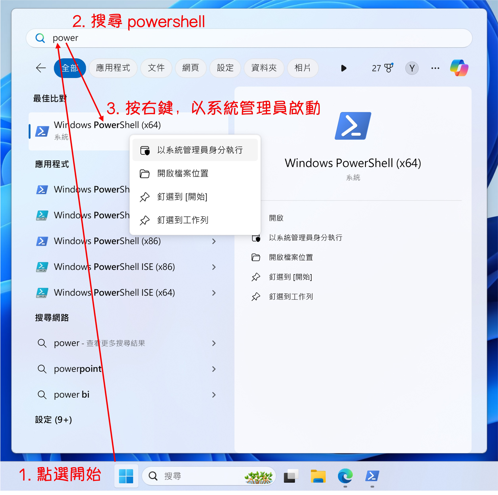

We recently received a task that required development on a Windows-based system.

It's been a long time! It's been several years since we last used Windows.

<!-- truncate -->

We tried a few methods and finally settled on using PowerShell to set up the Python environment.

We initially thought about using WSL for configuration, but that would turn the environment into a Linux environment... (?)

If we already have a Linux environment at hand, why bother configuring one on Windows?

## Operating Environment

We're using the virtual environment tool provided by Mac: [**Parallels Desktop**](https://www.parallels.com/products/desktop/).

With Parallels Desktop, we can smoothly run a Windows system on Mac, and the currently installed one is Windows 11.

:::tip
The Apple M1 chip is ARM-based, and it faced many compatibility issues when it was first launched, but it has improved a lot over the years.
:::

## Installing Chocolatey

First, we need to launch PowerShell.

<div align="center">
<figure style={{"width": "70%"}}>

</figure>
</div>

Chocolatey is a package manager for Windows. It automates the process of installing, upgrading, and managing software using NuGet and PowerShell technologies. It's similar to `apt-get` or `yum` on Linux, allowing Windows users to manage software in a simple and consistent way.

Installing Chocolatey is relatively simple. Just run the following command in PowerShell with administrative privileges:

```powershell
Set-ExecutionPolicy Bypass -Scope Process -Force; [System.Net.ServicePointManager]::SecurityProtocol = [System.Net.ServicePointManager]::SecurityProtocol -bor 3072; iex ((New-Object System.Net.WebClient).DownloadString('https://community.chocolatey.org/install.ps1'))
```

After installation, enter the following command to verify if Chocolatey was installed successfully:

```powershell
choco -v
```

If you see the version number of Chocolatey, it means the installation was successful.

:::tip
Here's what the above command does:

1. **Set-ExecutionPolicy Bypass -Scope Process -Force**:

   - This command sets the PowerShell execution policy.
   - `Set-ExecutionPolicy` is used to change the execution policy to allow or disallow the execution of PowerShell scripts.
   - `Bypass` means bypassing all execution policies without any restrictions.
   - `-Scope Process` means applying this change only to the current PowerShell session, not affecting the entire system.
   - `-Force` is used to forcefully execute this operation without prompting for confirmation.

2. **[System.Net.ServicePointManager]::SecurityProtocol = [System.Net.ServicePointManager]::SecurityProtocol -bor 3072**:

   - This command sets the network security protocol.
   - `[System.Net.ServicePointManager]::SecurityProtocol` is used to get or set the protocol type.
   - `-bor 3072` adds the TLS 1.2 (3072) protocol to the existing protocols. `-bor` is a bitwise operator, indicating a bitwise OR operation, allowing multiple protocols to be enabled simultaneously.

3. **iex ((New-Object System.Net.WebClient).DownloadString('https://community.chocolatey.org/install.ps1'))**:
   - This command downloads and executes the Chocolatey installation script.
   - `iex` is shorthand for `Invoke-Expression`, used to execute the content passed to it as a string.
   - `New-Object System.Net.WebClient` is used to create a new WebClient object, which is used for downloading data.
   - `.DownloadString('https://community.chocolatey.org/install.ps1')` is used to download the script content from the specified URL.
   - Overall, the command `iex ((New-Object System.Net.WebClient).DownloadString('https://community.chocolatey.org/install.ps1'))` downloads and immediately executes the PowerShell script located at 'https://community.chocolatey.org/install.ps1', which is responsible for installing Chocolatey.

In simple terms, the purpose of this command is: temporarily set the PowerShell execution policy to allow script execution, configure the network security protocol to support TLS 1.2, and then download and execute the Chocolatey installation script.
:::

:::info
**Common Chocolatey Commands:**

- **Install**
  ```powershell
  choco install <packageName>
  ```
- **Upgrade**
  ```powershell
  choco upgrade <packageName>
  ```
- **List installed packages**
  ```powershell
  choco list --localonly
  ```
- **Uninstall**
  ```powershell
  choco uninstall <packageName>
  ```
  :::

## Installing git

After installation, continue running PowerShell as an administrator, and execute the following command to install Git:

```powershell
choco install git -y
```

After installation, enter the following command to verify if Git was installed successfully:

```powershell
git --version
# >>> git version 2.45.2.windows.1
```

## Installing Python

We use pyenv to manage Python versions.

:::tip
Although there are many choices on the market, such as Anaconda, Miniconda, WinPython, etc., we still chose pyenv.

Because we often develop on Linux, seeing pyenv feels familiar.
:::

Installing and using `pyenv` on Windows is not usually straightforward because `pyenv` is designed for Unix-like environments. However, you can use the `pyenv-win` project, which is a Windows port of `pyenv`.

Follow these steps:

### Step 1: Installing `pyenv-win`

- [**Reference: pyenv-win/docs/installation.md**](https://github.com/pyenv-win/pyenv-win/blob/master/docs/installation.md)

Download the `pyenv-win` project:

```powershell
Invoke-WebRequest -UseBasicParsing -Uri "https://raw.githubusercontent.com/pyenv-win/pyenv-win/master/pyenv-win/install-pyenv-win.ps1" -OutFile "./install-pyenv-win.ps1"; &"./install-pyenv-win.ps1"
```

If you encounter any `UnauthorizedAccess` errors as shown below, please launch Windows PowerShell with the "Run as Administrator" option and execute:

```powershell
Set-ExecutionPolicy -ExecutionPolicy RemoteSigned -Scope LocalMachine
```

After completion, rerun the installation command above.

### Step 2: Verify Installation

1. **Restart PowerShell**:

   - Close and reopen the PowerShell window to apply the environment variable changes.

2. **Check `pyenv` installation**:

   - Enter the following command to check the `pyenv` version:

     ```powershell
     pyenv --version
     ```

### Step 3: Use `pyenv` to install Python versions

1. **View available Python versions**:

   - List all available Python versions with the following command:

     ```powershell
     pyenv install --list
     ```

2. **Install a specific Python version**:

- For example, to install Python 3.10.11:

  ```powershell
  pyenv install 3.10.11
  ```

3. **Set a global Python version**:

   - This step is not necessary, but if you want to use the same Python version across all shells, you can set the installed Python version as the global default:

     ```powershell
     pyenv global 3.10.11
     ```

4. **Verify Python installation**:

   - Enter the following command to verify if Python was installed successfully:

     ```powershell
     python --version
     ```

## Installing VS Code

Finally, we install Visual Studio Code as our development tool.

Here, we'll go to the [**VS Code official website**](https://code.visualstudio.com/Download) to download the installer and then proceed with the installation.

<div align="center">
<figure style={{"width": "70%"}}>

</figure>
</div>

After installation, we want to be able to use the `code` command directly in PowerShell to open VS Code.

So, we need to add the installation path of VS Code to the environment variables. Copy the following path:

```powershell
C:\Users\your_user_name\AppData\Local\Programs\Microsoft VS Code\bin
```

:::tip
Remember to replace `your_user_name` with your username.
:::

## Side Note

Actually, we find the PowerShell display screen really hard to look at.

For this part, we suggest using [**oh-my-posh**](https://ohmyposh.dev/) to beautify the appearance of PowerShell.

But this part is not the focus of this article. Interested readers can check out:

- [**Tutorial - Customize Your Prompt with Oh My Posh for PowerShell or WSL**](https://learn.microsoft.com/en-us/windows/terminal/tutorials/custom-prompt-setup)

## Conclusion

Through PowerShell, we can quickly set up the Python environment and install development tools.

Of course, the above only covers the most basic configurations, leaving this article as a reference.
