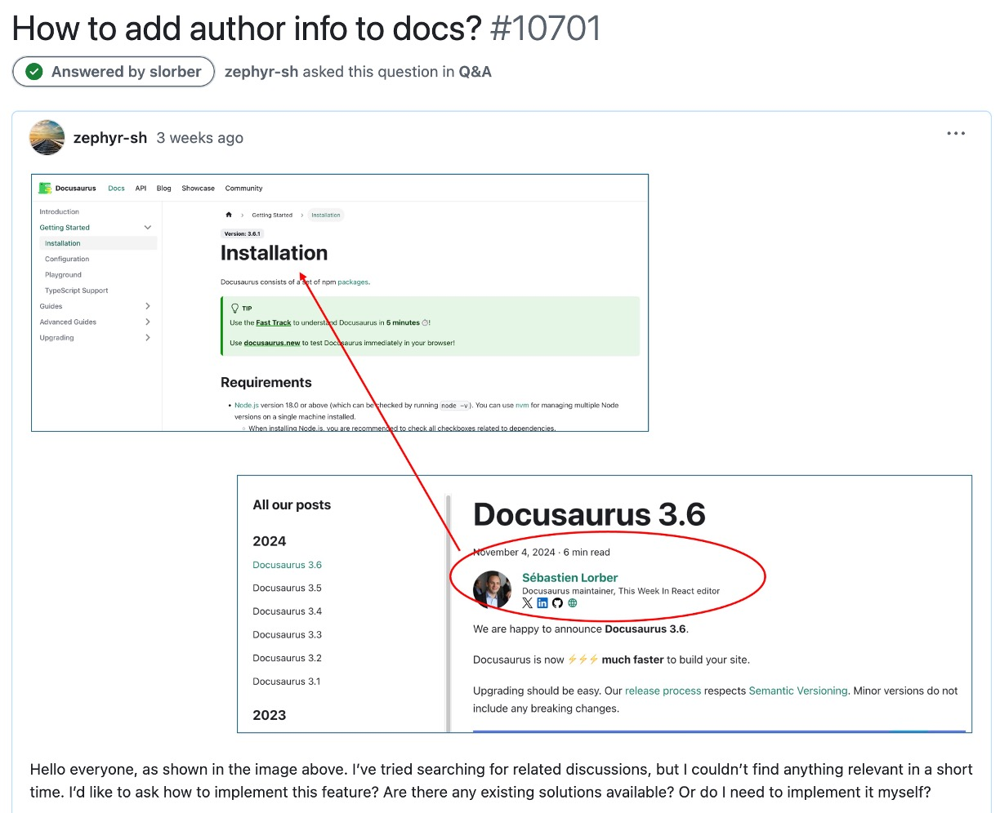
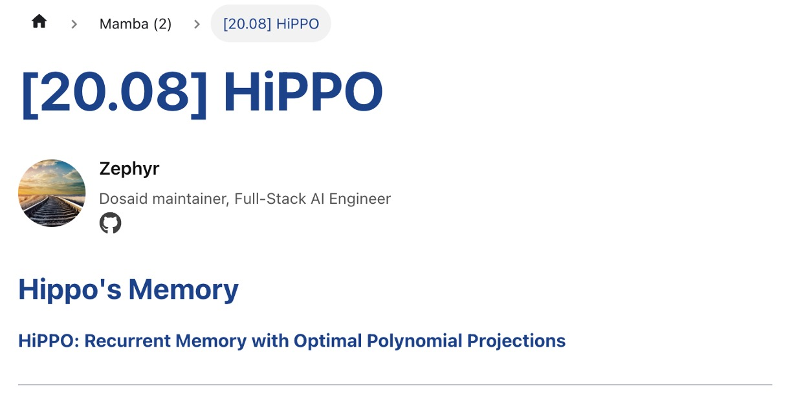

If you're also using Docusaurus to write a website, then you must be aware that Docusaurus has two main content types:

- The plugin used for blogs is: `@docusaurus/plugin-content-blog`
- The part for technical documentation is: `@docusaurus/plugin-content-docs`

Among them, only `blog` has author info functionality, while `docs` does not.

Oh no, what a shock!

<!-- truncate -->

## First, Ask the Official Team

We first went to the Docusaurus GitHub to ask about this feature and see if the official team supports it.

- [**How to add author info to docs? #10701**](https://github.com/facebook/docusaurus/discussions/10701)

    <div align="center">
    <figure style={{"width": "90%"}}>
    
    </figure>
    </div>

Maybe the Docusaurus authors would show some mercy and help us add this feature.

But after waiting for a while, we got a reply from the official team:

<div align="center">
<figure style={{"width": "90%"}}>

</figure>
</div>

In short, they tell you to figure it out yourself; the official team doesn’t support it.

It looks like it's better to rely on ourselves, so we had no choice but to forge ahead.

## Add Author Info

In the original design, the author info is placed in the `blog/authors.yml` file, and the content looks something like this:

```yml
Zephyr:
  name: Zephyr
  title: Dosaid maintainer, Full-Stack AI Engineer
  url: https://github.com/zephyr-sh
  image_url: https://github.com/zephyr-sh.png
  socials:
    github: "zephyr-sh"
```

We first create a new file `blog/authors.json` in the same path and rewrite the same content into JSON format:

```json
{
  "Zephyr": {
    "name": "Zephyr",
    "title": "Dosaid maintainer, Full-Stack AI Engineer",
    "url": "https://github.com/zephyr-sh",
    "image_url": "https://github.com/zephyr-sh.png",
    "socials": {
      "github": "zephyr-sh"
    }
  }
}
```

:::info
During development, we found that parsing YML files was cumbersome, and after some testing, we decided that using JSON format is the easiest.
:::

:::tip
Although this file is meant for `docs`, we still place it in the `blog` folder so that we remember to update it when making changes.
:::

## Extract DocItem/Content

:::warning
From this step onward, we need to modify the Docusaurus source code.

If there are future breaking updates to Docusaurus, this modification may cause the website to malfunction. Make sure you have the ability to maintain the website before proceeding.
:::

First, we extract the `DocItemContent` code. Please run the following command:

```shell
npx docusaurus swizzle @docusaurus/theme-classic DocItem/Content
```

After running the command, you will encounter a few questions:

1. **Which language do you want to use?**

   We select `JavaScript`.

2. **Which swizzle action do you want to do?**

   We select `Eject`.

3. **Do you really want to swizzle this unsafe internal component?**

   We select `YES: I know what I am doing!`.

---

Now, you can find a path: `src/theme/DocItem/Content`, where there is an `index.js` file. This is where we need to make changes.

- The original code for this program is here: [**docusaurus-theme-classic/src/theme/DocItem/Content**](https://github.com/facebook/docusaurus/blob/main/packages/docusaurus-theme-classic/src/theme/DocItem/Content)

The modified code is as follows:

```jsx
import { useDoc } from "@docusaurus/plugin-content-docs/client";
import { ThemeClassNames } from "@docusaurus/theme-common";
import DocItemAuthors from "@theme/DocItem/Authors";
import Heading from "@theme/Heading";
import MDXContent from "@theme/MDXContent";
import clsx from "clsx";
import React from "react";

function useSyntheticTitle() {
  const { metadata, frontMatter, contentTitle } = useDoc();
  const shouldRender =
    !frontMatter.hide_title && typeof contentTitle === "undefined";
  if (!shouldRender) {
    return null;
  }
  return metadata.title;
}

export default function DocItemContent({ children }) {
  const syntheticTitle = useSyntheticTitle();

  return (
    <div className={clsx(ThemeClassNames.docs.docMarkdown, "markdown")}>
      {syntheticTitle ? (
        <header>
          <Heading as="h1">{syntheticTitle}</Heading>
          <DocItemAuthors />
          <MDXContent>{children}</MDXContent>
        </header>
      ) : (
        <>
          <DocItemAuthors />
          <MDXContent>{children}</MDXContent>
        </>
      )}
    </div>
  );
}
```

The key addition is a new module:

- `import DocItemAuthors from "@theme/DocItem/Authors";`

This part will be implemented later.

## Implement DocItem/Authors

Now, let's implement the `Authors` component. Please run the following commands:

```shell
mkdir -p src/theme/DocItem/Authors
touch src/theme/DocItem/Authors/index.js
touch src/theme/DocItem/Authors/styles.module.css
```

For this part, we refer to the `Authors` component in `Blog` and replicate it.

- [**docusaurus-theme-classic/src/theme/Blog/Components/Author**](https://github.com/facebook/docusaurus/tree/main/packages/docusaurus-theme-classic/src/theme/Blog/Components/Author)

The code for `DocItem/Authors/index.js` is as follows:

```jsx
import { useDoc } from "@docusaurus/plugin-content-docs/client";
import authorsData from "@site/blog/authors.json";
import React from "react";
import {
  FaEnvelope,
  FaGithub,
  FaLinkedin,
  FaRss,
  FaStackOverflow,
  FaTwitter,
} from "react-icons/fa";
import styles from "./index.module.css";

function normalizeSocialLink(platform, handleOrUrl) {
  const isAbsoluteUrl =
    handleOrUrl.startsWith("http://") || handleOrUrl.startsWith("https://");
  if (isAbsoluteUrl) {
    return handleOrUrl;
  }
  switch (platform) {
    case "x":
      return `https://x.com/${handleOrUrl}`;
    case "github":
      return `https://github.com/${handleOrUrl}`;
    case "linkedin":
      return `https://www.linkedin.com/in/${handleOrUrl}/`;
    case "stackoverflow":
      return `https://stackoverflow.com/users/${handleOrUrl}`;
    case "newsletter":
      return handleOrUrl;
    case "email":
      return `mailto:${handleOrUrl}`;
    default:
      return handleOrUrl;
  }
}

const socialIconMap = {
  x: FaTwitter,
  github: FaGithub,
  linkedin: FaLinkedin,
  stackoverflow: FaStackOverflow,
  email: FaEnvelope,
  newsletter: FaRss,
};

export default function DocItemAuthors() {
  const { frontMatter } = useDoc();
  let { authors } = frontMatter;

  if (!authors) {
    return null;
  }

  if (typeof authors === "string") {
    authors = [authors];
  }

  const resolvedAuthors = authors
    .map((authorKeyOrObj) => {
      if (typeof authorKeyOrObj === "string") {
        const authorInfo = authorsData[authorKeyOrObj];
        if (!authorInfo) {
          console.warn(
            `No author data found for key '${authorKeyOrObj}' in authors.json`
          );
          return null;
        }
        return {
          name: authorInfo.name,
          title: authorInfo.title,
          url: authorInfo.url,
          imageURL: authorInfo.image_url,
          socials: authorInfo.socials,
          description: authorInfo.description,
        };
      } else {
        const { name, title, url, image_url, imageURL, socials, description } =
          authorKeyOrObj;
        return {
          name,
          title,
          url,
          imageURL: imageURL || image_url,
          socials,
          description,
        };
      }
    })
    .filter(Boolean);

  if (resolvedAuthors.length === 0) {
    return null;
  }

  return (
    <div className={`${styles.docAuthors} margin-bottom--md`}>
      {resolvedAuthors.map((author, index) => {
        const { name, title, url, imageURL, socials, description } = author;
        return (
          <div key={index} className={styles.docAuthor}>
            {imageURL && (
              
            )}
            <div>
              <div className={styles.docAuthorName}>
                {url ? (
                  <a href={url} target="_blank" rel="noopener noreferrer">
                    {name}
                  </a>
                ) : (
                  name
                )}
              </div>
              {title && <div className={styles.docAuthorTitle}>{title}</div>}
              {description && (
                <div className={styles.docAuthorDesc}>{description}</div>
              )}

              {socials && (
                <div className={styles.docAuthorSocials}>
                  {Object.entries(socials).map(([platform, handleOrUrl]) => {
                    const SocialIcon = socialIconMap[platform] || FaEnvelope;
                    const normalizedUrl = normalizeSocialLink(
                      platform,
                      handleOrUrl
                    );
                    return (
                      <a
                        key={platform}
                        href={normalizedUrl}
                        target="_blank"
                        rel="noopener noreferrer"
                        className={styles.docAuthorSocialLink}
                      >
                        <SocialIcon size={20} />
                      </a>
                    );
                  })}
                </div>
              )}
            </div>
          </div>
        );
      })}
    </div>
  );
}
```

Here, we're using `react-icons`. If you haven't installed it yet, please run the following command:

```shell
yarn add react-icons
```

Please note that some parts are hardcoded here, for example:

```jsx
function normalizeSocialLink(platform, handleOrUrl) {
  const isAbsoluteUrl =
    handleOrUrl.startsWith("http://") || handleOrUrl.startsWith("https://");
  if (isAbsoluteUrl) {
    return handleOrUrl;
  }
  switch (platform) {
    case "x":
      return `https://x.com/${handleOrUrl}`;
    case "github":
      return `https://github.com/${handleOrUrl}`;
    case "linkedin":
      return `https://www.linkedin.com/in/${handleOrUrl}/`;
    case "stackoverflow":
      return `https://stackoverflow.com/users/${handleOrUrl}`;
    case "newsletter":
      return handleOrUrl;
    case "email":
      return `mailto:${handleOrUrl}`;
    default:
      return handleOrUrl;
  }
}

const socialIconMap = {
  x: FaTwitter,
  github: FaGithub,
  linkedin: FaLinkedin,
  stackoverflow: FaStackOverflow,
  email: FaEnvelope,
  newsletter: FaRss,
};
```

If the URLs change, you may need to modify these areas.

Finally, here is the code for `DocItem/Authors/styles.module.css`:

```css
.docAuthor {
  display: flex;
  align-items: center;
  margin-bottom: 2rem;
}

.docAuthorImg {
  width: 60px;
  height: 60px;
  border-radius: 50%;
  margin-right: 0.75rem;
  object-fit: cover;
}

.docAuthorName {
  font-weight: 600;
  font-size: 1rem;
  margin-bottom: 0.25rem;
  color: #111;
}

.docAuthorName a {
  text-decoration: none;
  color: inherit;
}

.docAuthorName a:hover {
  text-decoration: underline;
}

.docAuthorTitle {
  font-size: 0.85rem;
  color: #555;
  margin-bottom: 0.25rem;
  line-height: 1.2;
}

.docAuthorDesc {
  font-size: 0.85rem;
  color: #333;
  margin-bottom: 0.4rem;
  line-height: 1.4;
}

.docAuthorSocials {
  display: flex;
  gap: 0.5rem;
  flex-wrap: wrap;
  align-items: center;
}

.docAuthorSocialLink {
  display: inline-flex;
  align-items: center;
  text-decoration: none;
  color: inherit;
  line-height: 1;
}

.docAuthorSocialLink:hover {
  color: var(--ifm-color-primary);
}
```

The implementation approach here depends on personal style. After testing several times, this design looks quite good.

You can modify these styles according to your own needs.

## Adjust the FrontMatter of the Document

Finally, in order to display the author info in the `docs` files, we need to add the author's information to the `FrontMatter` of the document.

For example, in our website article: [**[20.08] HiPPO: Hippo's Memory**](https://docsaid.org/en/papers/mamba/hippo)

The original article looked like this:

```mdx
# [20.08] HiPPO

## Hippo's Memory

[**HiPPO: Recurrent Memory with Optimal Polynomial Projections**](https://arxiv.org/abs/2008.07669)
```

Now, in order to include author information, we **cannot** use `#` for the title; instead, we need to define the title using `FrontMatter`.

So we modify it to:

```mdx
---
title: "[20.08] HiPPO"
authors: Zephyr
---

## Hippo's Memory

[**HiPPO: Recurrent Memory with Optimal Polynomial Projections**](https://arxiv.org/abs/2008.07669)
```

In the `authors` field, specify the author's name so that the author information will be displayed.

:::tip
Make sure that the name in `authors` matches the name in `authors.json`, otherwise, the author information will not be shown.
:::

## Implementation Complete

Finally, let's take a look at the effect on the website:

<div align="center">
<figure style={{"width": "60%"}}>

</figure>
</div>

As shown in the image above, we have successfully added author information to the `docs` files. Cheers!

This concludes our implementation process. We hope it is helpful to you.
