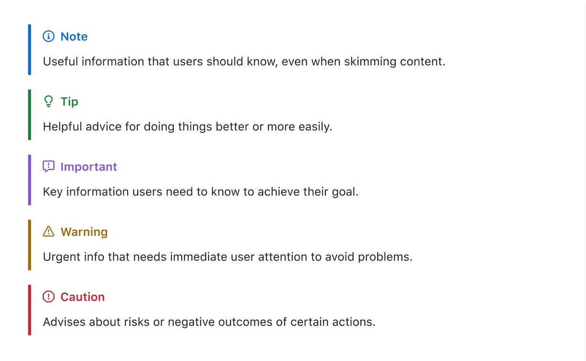

Writing README files on GitHub is likely a familiar task, but most of the time, we only use basic syntax.

There are many appealing and practical features you shouldn't miss out on!

<!-- truncate -->

## Basic Syntax

Let's take 10 seconds to quickly review some commonly used basic syntax:

| Function            | Syntax                                         | Example                                        |
| ------------------- | ---------------------------------------------- | ---------------------------------------------- |
| **Heading**         | `# Heading 1`, `## Heading 2`, `### Heading 3` | `# Heading 1`, `## Heading 2`, `### Heading 3` |
| **Bold**            | `**text**` or `__text__`                       | `**bold text**`                                |
| **Italic**          | `*text*` or `_text_`                           | `*italic text*`                                |
| **Strikethrough**   | `~~text~~`                                     | `~~strikethrough text~~`                       |
| **Blockquote**      | `> blockquote`                                 | `> This is a quote`                            |
| **Inline Code**     | `` `code` ``                                   | `` `print("Hello, World!")` ``                 |
| **Code Block**      | ```                                            | `print("Code block")`                          |
| **Unordered List**  | `- item` or `* item`                           | `- unordered 1` or `* unordered 2`             |
| **Ordered List**    | `1. item`                                      | `1. ordered 1` <br /> `2. ordered 2`           |
| **Hyperlink**       | `[link text](URL)`                             | `[GitHub](https://github.com)`                 |
| **Horizontal Rule** | `---` or `***`                                 | `---` or `***`                                 |
| **Emoji**           | `:emoji_code:`                                 | `:smile:`, `:thumbsup:`                        |

Easy! Everyone knows these basics.

Besides these, Markdown offers numerous advanced features that can make your documents more organized.

Here are a few syntax examples:

## 1. Task Lists

Task lists display plans, development progress, or to-dos in a checkbox format.

In collaborative projects, they clearly show completed and pending tasks, simplifying tracking and delegation.

### Writing Example

```
- [x] Complete initial project setup
- [ ] Write user requirements document
- [ ] Integrate front-end and back-end code
```

In the example above, `[x]` represents completed tasks, while `[ ]` represents pending tasks.

In GitHub's Issues, Pull Requests, or Discussions, tasks are updated in real-time once someone checks off an item.

### Visual Output

- [x] Complete initial project setup
- [ ] Write user requirements document
- [ ] Integrate front-end and back-end code

---

## 2. Alerts

Alerts provide highlighted frames and icons in documents to display critical information.

This feature isn't native to Markdown but is an extension provided by GitHub.

:::tip
Since this is an extension, it might not render correctly on other Markdown editors or platforms.

Additionally, it differs significantly from Docusaurus syntax, so be cautious when converting content.
:::

### Writing Example

GitHub offers five types of alerts: `NOTE`, `TIP`, `IMPORTANT`, `WARNING`, and `CAUTION`.

```markdown
> [!NOTE]
> Useful information for skimming users.

> [!TIP]
> Tips for better or easier implementation.

> [!IMPORTANT]
> Essential details for achieving a goal.

> [!WARNING]
> Critical info requiring immediate attention.

> [!CAUTION]
> Warnings about risks or negative outcomes.
```

For multi-line content, add `>` at the start of each line:

```markdown
> [!TIP]
> This is a tip.
>
> Here is another tip.
```

### Visual Output

Due to limitations here, refer to a GitHub screenshot for results:



## 3. Footnotes

For long-form documents or academic-style texts, footnotes allow for referencing sources or adding supplementary information.

GitHub Markdown supports footnotes, linking supplementary details to the text while keeping it clean.

:::info
This section demonstrates custom anchors.

If you're not reading this for that purpose, feel free to ignore it.

[**Click here for the custom anchor section**](#my-custom-anchor)
:::

### Writing Example

```markdown
In this step, we use a special feature[^1].

[^1]: Detailed notes or external links can be added here.
```

Rendered, it places a superscript number in the text that links to detailed notes at the bottom.

### Visual Output

In this step, we use a special feature[^1]. (👈 Click on the superscript to check it out.)

[^1]: This is a footnote for demonstration.

## 4. Escaping Characters

Sometimes, you want certain symbols like asterisks (\*) or backticks (`) displayed as-is, rather than interpreted as Markdown syntax. In such cases, use escaping.

### Writing Example

```markdown
To display a `*` symbol, add a backslash: \*

Let's rename \*our-new-project\* to \*our-old-project\*.
```

### Visual Output

To display a `*` symbol, add a backslash: \*

Let's rename \*our-new-project\* to \*our-old-project\*.

## 5. Custom Anchors

While headings automatically generate anchors for navigation, sometimes you need to link non-heading content. You can manually insert HTML anchor tags.

### Writing Example

1. Link to a heading:

   ```markdown
   [Link to the "Footnotes" section](#3-footnotes)
   ```

2. Link to a custom paragraph:

   ```markdown
   <a name="my-custom-anchor"></a>
   This is a special paragraph for internal linking.

   [Link to this paragraph](#my-custom-anchor)
   ```

### Visual Output

[**Click here to link to the "Footnotes" section**](#3-footnotes)

---

<a name="my-custom-anchor"></a>
**This is a special paragraph for internal linking.**

## Conclusion

These features provide more flexibility in document writing and offer richer presentation options.

We hope this article helps you better understand advanced GitHub Markdown syntax and enhances your document writing experience.

## References

- [**Basic writing and formatting syntax**](https://docs.github.com/en/get-started/writing-on-github/getting-started-with-writing-and-formatting-on-github/basic-writing-and-formatting-syntax)
