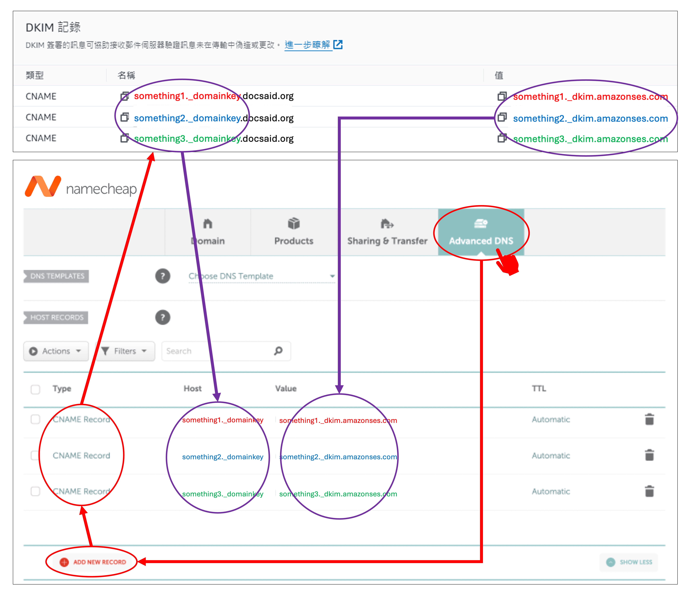

We attempted to enable Amazon SES, and during the verification process, Amazon required us to set up DNS records.

It took us quite some time to find the correct configuration (~about half an hour~).

Here, we document the process for future reference.

<!-- truncate -->

## Amazon SES Setup

There are already comprehensive tutorials available on setting up Amazon SES. Please refer to this guide:

- [**Amazon SES Email Service: The Most Complete Application Guide for 2024**](https://www.quantsnote.com/amazon-ses-how-to-apply/)

We followed the steps smoothly until we reached the **"Verify a Sending Domain"** stage—then we got stuck.

Since our domain was purchased from Namecheap, we needed to configure DNS records there.

So, how should we set it up?

## DNS Records

In the Amazon SES **"Verify a Sending Domain"** card, click **"Get DNS Records"**, and a pop-up window will appear containing a detailed list of DNS records, which looks something like this:

Using our domain as an example, `docsaid.org` in the image represents the domain we are verifying.

Once we obtain these DNS records, we can proceed with the setup in Namecheap.

:::tip
The original values in each field have been slightly modified to protect our website security.
:::

## DKIM Records

Go to the Namecheap website, log in, and navigate to **"Domain List"**. Locate the domain you need to configure and click **"Manage"**.

In the domain management page, find **"Advanced DNS"** and enter the section.

As shown in the image, there is an **"Add New Record"** button. Click it and select **"CNAME Record"**.

Now, enter the DKIM records obtained earlier. Pay attention to the following details:

1. The **DKIM name** should be entered in the `Host` field. Only enter the part before the domain name; do not include the domain itself.
2. The **value** should be entered in the `Value` field—simply copy and paste it.

## MAIL FROM Records

This part took us the longest time because only the MX record needs to be added—the other one can be ignored.

In the **"Advanced DNS"** section of Namecheap, locate **"MAIL SETTINGS"**. In the dropdown menu, select **"Custom MX"**.

Then, enter the MX record provided by Amazon SES, keeping in mind the following:

1. Depending on the subdomain you configured in Amazon SES, enter the corresponding MX record in the `Host` field. In our example, we used `mail`, but if you chose a different subdomain, enter the corresponding value.
2. Enter the **value** in the `Value` field. There are two parts:
   - Enter `10` in the **"Priority"** field.
   - Enter the remaining part of the value in the **"Value"** field.

:::info
Namecheap's Mail Settings allow only one of the following options:

- If **"Email Forwarding"** is enabled, Namecheap locks the MX records, restricting them to its own forwarding servers.
- If **"Custom MX"** is enabled, you can manually configure the MX records provided by Amazon SES, allowing it to handle bounced emails.
  :::

## DMARC Records

This is the easiest part to configure. In Namecheap's **"Advanced DNS"** section, click **"Add New Record"** and select **"TXT Record"**.

Enter the DMARC record provided by Amazon SES. The only thing to keep in mind is **not to include quotation marks (`"`)** in the value.

## Summary

At this point, we have completed the Amazon SES DNS setup on Namecheap.

After completing the setup, wait for about **30 minutes**. Amazon SES will automatically verify your DNS records. If everything is set up correctly, you will receive an email notification from Amazon SES confirming a successful verification.

Good luck!
