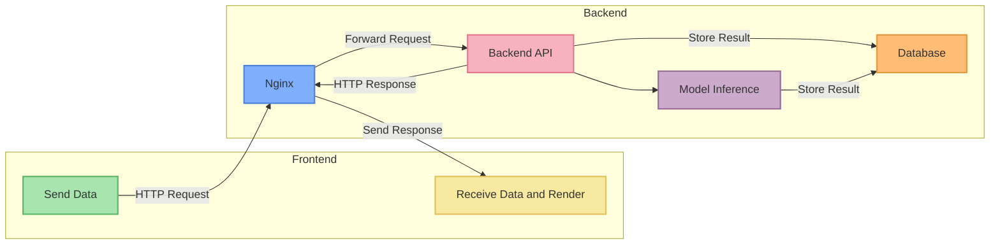
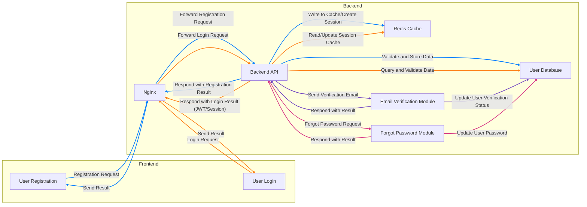
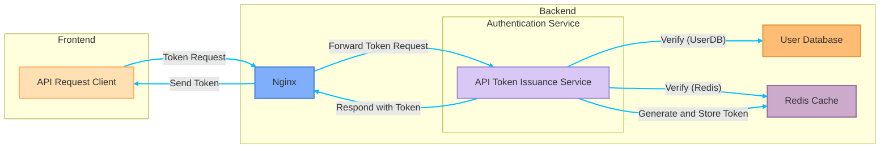
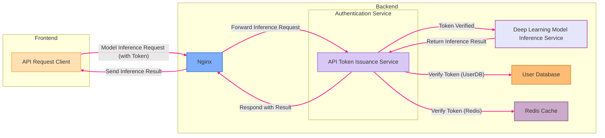

Good afternoon, or good evening.

Recently, I've been a bit slack in updating articles, so I owe everyone an apology.

The reason is that I've been sidetracked into writing both front-end and back-end code.

<!-- truncate -->

## Are You Just Bored?

Well, yes.

---

I just had a long vacation recently and finally had the time to tackle some problems I hadn’t been able to solve before:

- **This website doesn't have a backend!**

You might know that this website is built on the Docusaurus framework as a static site. When I first set up the website, I just wanted to occasionally write some blog posts and share some paper notes, without any specific planning or grand goals.

The pros and cons of static websites versus dynamic websites are something I don't need to explain. I had tried using WordPress to set up a site before, but after a few steps, some guy would pop up asking for money, which was really annoying. After trying a few rounds, I went back to the static site setup.

There are pros and cons to everything, and as the content of the site gradually accumulated, I started receiving more and more emails from readers, most of which were about how to use the models—questions like how to configure the environment, install dependencies, or solve strange errors encountered during execution.

These are easy problems to solve; I just tell them to ask ChatGPT, and it’s all good. (~Isn’t that too casual?~)

The trickier request was: some readers wanted to directly call my backend API!

## The First Generation Backend: Minimalist Style

Going back a little further in time, after writing a few articles, I wanted to make the models available for everyone to try, so I created a few model demos and built the first generation of the backend: yes! It’s the "Playground" on the navigation bar of this website. If you haven’t tried it, you can give it a go.

That said, if you want to use the models on a webpage, generally there are two solutions:

- **1. Load the model directly from the webpage and perform inference in the browser.**

  I rejected this solution immediately.

  Because it would mean I would have to provide a model download endpoint, and the traffic issues that would arise could potentially bring me down.

- **2. Provide a backend service that returns the inference results.**

  This was the solution I ended up adopting.

  But this also meant that, one way or another, I had to handcraft a backend system to provide the corresponding service.

---

Since I was already using Docusaurus for the front-end, I had to adopt a decoupled architecture for the front-end and back-end. Before starting to code, I drew an architecture diagram.

In fact, aside from the architecture diagram, I also wrote a bunch of specifications, system operation flows, and detailed input/output designs, etc. But here, I'll just show the architecture diagram, as the details would be too long to explain.

The architecture should look something like this:

After finalizing the specifications, I followed the diagram to implement the system, which is now the operational logic behind the "Playground" feature on the website.

Up to this point, although it looks simple, it's worth discussing the technologies I chose to use.

After all, behind every technology choice, there are often unseen little details:

1. **Nginx**

   Another common choice here is Apache, which was once the king of web servers, rich in features, with many modules, a large community, and a very broad user base. But Apache's configuration is a bit more complex, and its ability to handle high concurrency connections is somewhat inferior to Nginx.

   To be honest, I don’t think Apache is bad, it’s just that I really like the clean and intuitive configuration style of Nginx. Whether it’s static resource proxying, reverse proxying, or load balancing, Nginx’s setup always gets straight to the point, and it’s easy to understand at a glance.

   Moreover, Nginx was specifically designed to handle a large number of concurrent connections, and its stability and performance have been tested by the market and time, making it particularly reliable to use.

   ***

2. **FastAPI**

   The reason I chose FastAPI is partly because I’m more familiar with the Python development environment. If I suddenly switched to learn NodeJS or another backend framework, it would involve a lot of learning costs, potentially delaying the development process.

   Besides familiarity, FastAPI’s other features also made it hard to resist: it natively supports asynchronous (async) operations, which are perfect for backend model inference scenarios that are time-consuming but require high efficiency in handling concurrent requests. Plus, it has Pydantic validation built-in, which automatically generates API documentation and even prepares a test interface for you, greatly reducing the pain during API development and maintenance.

   More importantly, FastAPI’s design structure is clear and easy to understand. It’s neither as heavy and cumbersome as Django nor as free-form as Flask, which might lead to chaotic architecture. The development experience is just right.

   ***

3. **PostgreSQL**

   Speaking of databases, I used to be more familiar with MySQL.

   MySQL certainly has a good reputation in the development community and is the go-to choice for many newcomers to databases, but since Oracle acquired it, MySQL’s open-source license has gradually shifted toward commercialization, increasing the uncertainty of its ecosystem, which makes me a bit worried.

   In contrast, PostgreSQL has shown a stable and gradually growing healthy state in the open-source community. Apart from ongoing community support, PostgreSQL also supports many powerful advanced features, such as native JSON data types and GIS geographic information processing, which make it more flexible and practical in situations where complex data requirements are needed.

   Additionally, PostgreSQL integrates seamlessly with FastAPI and various ORM tools (like SQLAlchemy), providing a smooth and enjoyable experience. Not to mention, PostgreSQL performs excellently when handling a large number of concurrent and high-load requests, so if the website traffic increases or the backend requirements become more complex in the future, at least I won’t have to worry about the database becoming a bottleneck.

   ***

I’ve said a lot, but this may not necessarily be the best combination; it’s mainly sufficient to meet the current needs.

## Second Generation Backend: Minimalist Style

Back to the issue I mentioned at the beginning, a reader emailed asking to directly call my backend API through their program.

The originally designed API was simply intended for web use and did not include a complete security mechanism or authentication process. Exposing it publicly could lead to various security issues. Therefore, I had to build a more complete API authentication and authorization system by myself.

But I don’t understand it!

Although I didn’t understand it, since the goal was set, I had to dive in and do it anyway!

### User Login System

The prerequisite for API authentication is building a complete user system, including user registration, login, permission management, email verification, and other features.

In addition to the existing FastAPI and PostgreSQL database, I introduced Redis to handle session caching and token management. To enhance user experience, I also designed email verification and password recovery features, sending verification emails via an SMTP service.

Now, I can draw another architecture diagram. Let me sketch it out:

This user system needs to include a user database, password encryption, registration email verification, password reset flow, and various other details. I haven’t considered integrating third-party login services yet, like allowing users to log in via Google or Facebook accounts. If I were to integrate third-party login verification, that would be a whole other task, which I’ll leave for the future.

Speaking of registration email verification, it turned out to be more troublesome than I expected.

At first, I applied for Amazon SES, but after a day of waiting, they rejected me, saying that I looked suspicious. (What?)

<figure style={{"width": "60%"}}>

</figure>

Fine, then I thought I could just set up my own email server, right?

But after I set up the server, the emails I sent were rejected by Gmail, and they too thought I was suspicious. (😭 😭 😭)

Anyway, after some setbacks, I finally found another supplier to sort this out.

### API Token Issuance System

After completing the user system, I finally got to work on the API Token functionality.

Here, I used the JWT (JSON Web Token) mechanism to generate and verify tokens. The user logs in to authenticate their identity, and the system generates a JWT that is stored in Redis. When the user sends an API request, the JWT is sent as a Bearer Token to the backend for identity verification. Once the token is validated successfully, the user can access the backend model inference service.

This part is fairly simple, so here’s an architecture diagram for the token request flow:

Once the user has the token, they can use it to call the API. Redis is used to limit traffic and track the number of calls. The general flow for API requests looks like this:

## Technical Stack Summary

The second-generation backend mainly introduced two core features: the user registration system and the API token issuance mechanism.

After this upgrade, the overall tech stack is clearer and more complete, as listed below:

- **Frontend Framework**: React (Docusaurus)
- **Backend Framework**: FastAPI (Python)
- **Database**: PostgreSQL
- **Cache Service**: Redis
- **Reverse Proxy and Load Balancing**: Nginx

Aside from the newly added Redis, most of these technologies were already part of the first generation of the backend. However, at that time, there wasn’t a dedicated frontend page to clearly present this information. Through this update, I created a dedicated frontend backend page, making management more intuitive and efficient.

As a deep learning engineer, Python with FastAPI is an essential tool for me. While this tech stack isn't particularly innovative, it significantly improves development efficiency and smoothness, as familiar tools allow for faster implementation.

For deployment, I continue to use Docker Compose with Nginx, hosted on my personal server. Although I would prefer to use a cloud server, the cost is too high, and I can't afford it, so I have to settle with hosting it on my home machine for now.

In terms of development insights, I believe that clearly defining backend specifications early on is a crucial step. Well-defined input/output endpoints greatly reduce integration friction between the frontend and backend. Since I handled this project by myself, I avoided many of the communication issues common in cross-team collaboration. In practical terms, if developed by a separated frontend and backend team, simply clarifying responsibilities and interface specifications could lead to weeks of discussion.

In conclusion, the system is now running smoothly, and I’ll continue to observe and improve it as it runs.

## Final Thoughts

While reading papers, the logic often feels abstract, but after reading through them a few times, I usually manage to replicate them successfully.

Frontend documentation might seem clear at first glance, but each step in practice could hide pitfalls—truly deceptive. (~Not familiar with it? Don’t blame everything else!~)

In the past, late-night debugging was often about issues like "loss not converging" or "GPU memory running out," which are everyday challenges for AI engineers. Now, it’s more about React throwing frequent errors, form buttons not working, and backend API specifications not matching, among other tedious problems.

What’s more, this was done with the help of ChatGPT for immediate assistance. If it had been the pre-ChatGPT era, I’m not sure whether I would have been able to successfully build this backend.

I will continue adding more features in the future and keep improving the user experience. If you encounter any bugs or problems while using the system, for security reasons, please contact me via email. I’d greatly appreciate it if you could provide detailed error messages or screenshots to help me locate and fix the problem more quickly.

Also, if you have any suggestions or feedback on the system, feel free to share them in the comments.

I hope you enjoy your time here!
