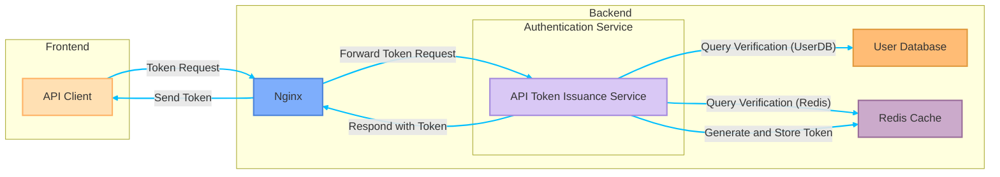
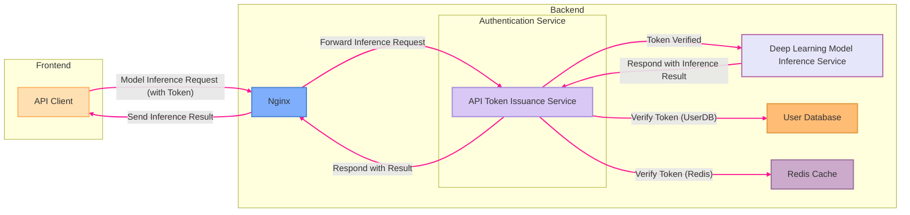
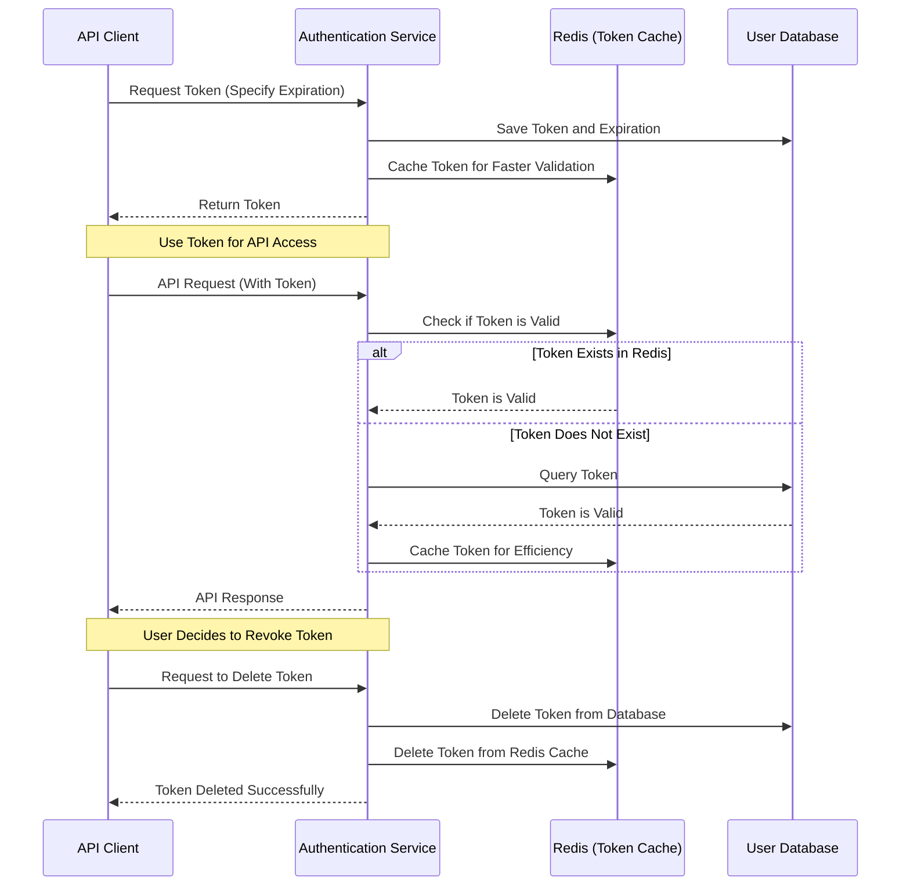
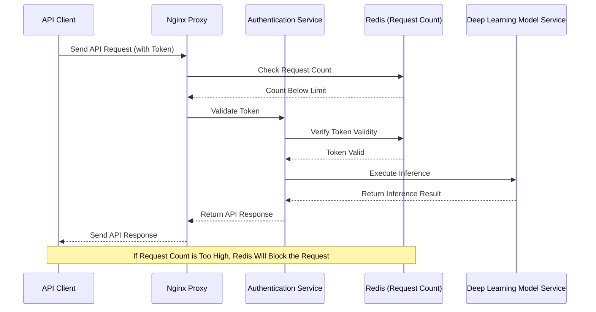

Good afternoon, or good evening.

I've been a bit slack on updating articles lately, so I want to apologize to everyone.

Because I’ve been busy doing something unrelated to my main work: I’ve been working on both the frontend and backend.

<!-- truncate -->

## Are You Just Bored?

Well, yes.

---

Recently, I had a long holiday, and finally had time to deal with some unresolved issues:

- **This website doesn’t have a backend!**

You might know a bit about it, but this website is built on the Docusaurus framework, which is a static site. When I first set up this website, my idea was just to occasionally write some blogs and share paper notes; there wasn’t any special planning or grand goal behind it.

The pros and cons of static vs. dynamic websites are probably not new to you. I even tried using WordPress to set up a site, but after a short while, I was greeted by someone asking for money, which was really frustrating:

> **Building a site myself already brings minimal returns, so why do some people always target my wallet?**

I ended up using WordPress for a while but eventually gave it up.

It wasn’t just because of expensive paid services, but because its code was hard to customize... okay, I admit it: I just can’t write PHP.

In contrast, I prefer the frontend-backend separation architecture, which is much more comfortable.

You know what happened after that—I chose Docusaurus and stuck with it. After all that, I ended up back with a static site architecture.

＊

As the content of the website accumulated, I started receiving emails from readers, mostly asking about model usage: such as how to configure environments, install dependencies, or even how to resolve strange errors that appeared during execution.

These were easy to handle; I just told them to ask ChatGPT, and that was it. (~Too casual, huh?~)

Not casual at all! With the power of AI tools these days, most problems can be resolved directly by asking, saving a lot of time compared to emailing back and forth.

Of course, there are still problems AI can't solve, like when readers asked if they could directly call my backend API!

Hey! At first glance, it sounds like a simple request, but when you try to implement it, the issues pile up. Let’s talk about it in a moment.

## The First Version of the Backend

Let’s rewind a bit.

After working on a few models, I wanted to make them available for everyone to try. It's like building a sandcastle by the sea and eagerly waiting for a big wave to test how sturdy your wall is. Even if the wave washes it away, at least you tried.

It’s the same with models. I don’t think any engineer would build a model and then hide it away... what would be the point of that?

So, I made a few model demos myself and built the first generation of the backend: that’s right! The "Playground" section in the navigation bar of this site. If you haven’t tried it yet, feel free to explore.

You might ask, why would you need a backend just for a demo?

That’s a fair point. Generally, there are two solutions if you want to use a model on a website:

1. **Load the model directly in the browser and run inference in the browser.**

   I rejected this solution immediately.

   Running models in the browser is technically possible but very cumbersome. At the very least, it needs to support three or more browsers, each with different configuration environments. This reminded me of the frontend colleagues who struggled with WebAssembly. If they knew I was considering this, they would definitely stop me.

2. **Provide a backend service to return inference results.**

   This is the solution I chose.

   The frontend simply handles data input and output, leaving all the troublesome work to the backend. But that means I have to build a backend system to provide the necessary services.

---

Since I was already using Docusaurus for the frontend, I had to adopt a frontend-backend separation architecture.

Before starting the coding, I drew a diagram. This is what the architecture should look like:

Apart from the architecture diagram, I also created lots of specifications and system operation processes, as well as detailed input and output designs. But it’s too tedious to include everything here, so I’ll just share the architecture diagram.

Once the specifications were ready, I started working based on the diagram, and that’s how the backend logic for the current "Playground" on the site was built.

At this point, although it seems relatively simple, let’s talk about the technologies I chose:

1. **Nginx**

   Another common choice here is Apache, which was once the king of web servers, with rich features, many modules, and a large community. But Apache’s configuration can be complex, and it’s not as good at handling high-concurrency connections as Nginx.

   Honestly, I don’t think Apache is bad, but I prefer Nginx’s clean and intuitive configuration style. Whether it’s for static resource proxying, reverse proxying, or load balancing, Nginx’s setup is easier to understand. But of course, this is subjective—some people may not like this style.

   Ultimately, Nginx was designed to handle a large number of concurrent connections, and its stability and performance have been tested over time. It seems like a solid choice.

   ***

2. **FastAPI**

   The backend frameworks I hear most about are C# and NodeJS, but unfortunately, I’m not familiar with them.

   As an AI engineer, I’m most comfortable in the Python environment. If I suddenly switched to learning NodeJS or other backend frameworks, I’d incur a lot of additional learning costs, which could delay development for several months.

   So, I chose FastAPI.

   FastAPI natively supports asynchronous operations, making it perfect for backend model inference, where requests need to be processed efficiently even if they are time-consuming. Plus, it has Pydantic built-in for validation and can automatically generate API documentation and testing interfaces, which greatly reduces the pain of developing and maintaining the API.

   More importantly, FastAPI’s design is clean and easy to understand. It’s not as bulky and complex as Django, nor as free-form as Flask, which could lead to architectural chaos. The development experience is just right.

   ***

3. **PostgreSQL**

   When it comes to databases, I’m actually more familiar with MySQL.

   MySQL has a great reputation in the developer community and is the go-to choice for many beginners. But since Oracle acquired MySQL, its open-source license has gradually become more commercial, which raises some concerns about the ecosystem’s uncertainty.

   In contrast, PostgreSQL has maintained a stable and steadily growing presence in the open-source community. In addition to continuous community support, PostgreSQL also supports powerful advanced features, such as native JSON data types and GIS for geographical information processing, making it more useful in complex data scenarios.

   Furthermore, PostgreSQL integrates smoothly with FastAPI and various ORM tools (like SQLAlchemy), making for a pleasant user experience. It also handles high-concurrency and high-load requests very well, so if traffic increases or backend requirements get more complex in the future, I won’t have to worry about the database becoming a bottleneck.

   ***

I’ve mentioned a lot, but this might not necessarily be the best combination—it’s just enough to handle the current needs.

For this simple architecture, it works well enough.

## Second Generation Backend

Returning to the issue mentioned at the beginning, a reader emailed me asking if they could directly call my backend API via code, instead of interacting through the web interface. This is an interesting request, indicating that the user may want a more automated and efficient way to interact with the system.

So, what issues arise when we open the API directly for users to call?

1. **It Could Overload the Traffic**

   When an API is exposed externally, users can send high-frequency requests via code, which could lead to a sudden surge in server traffic and potentially exceed its load capacity.

   For example, some users may fail to set appropriate request frequencies, causing the API to receive a large number of requests in a short period of time, which can affect other users’ ability to access the system normally. Or someone might use a crawler or malicious script to test the API, occupying the server’s bandwidth and computational resources, which could affect service stability.

   ***

2. **Security Risks**

   Once the API is open, if there is no strict authentication and access control, anyone could obtain data they shouldn't have access to or even execute dangerous operations. If the API lacks proper authentication mechanisms (such as OAuth or JWT), malicious individuals might simulate legitimate users through simple requests, leading to potential security risks.

   ***

There are many other extended problems that could be discussed in detail, but I’ll skip over those for now.

In conclusion, I can’t open the API directly, because both I and my server could face significant risks.

So, to meet the demand for open APIs, I had to build a complete user authentication and API authorization system myself.

Alright, here we go again: engineers aren’t afraid of being inexperienced, they’re just afraid of not taking action. Time to write some code!

### User Login System

A complete user system includes features like user registration, login, permission management, and email verification.

In addition to FastAPI and the PostgreSQL database that I was already using, I also integrated Redis for session caching and token management. To enhance the user experience, I designed email verification and password recovery features, using SMTP services to send verification emails.

Now, I can create a new architecture diagram for this part—let me sketch it out simply:

This user system needs to include a user database, password encryption, registration email verification, forgotten password reset processes, and other details. I haven’t considered integrating third-party login services yet, such as logging in via Google or Facebook accounts. If I were to add third-party login verification, that would involve a lot more work, which I’ll leave for my future self.

Speaking of registration email verification, this turned out to be more troublesome than expected.

I first applied for Amazon SES, but after waiting for a day, they rejected me, saying I looked suspicious. (What?)

<figure style={{"width": "60%"}}>

</figure>

Since that didn’t work, I thought maybe I could set up my own mail server.

After a day of setup and troubleshooting, I finally got it working!

But then, the emails I sent were still rejected by Gmail because they also thought I looked suspicious. (😭 😭 😭)

In the end, after some twists and turns, I found another provider who helped me get it sorted out, but I’ll spare you the details.

After more than a week of work, I finally completed the specifications I set out to do. Although the result is just a simple page, I still wrote over a thousand lines of code. It feels like a very low-effort payoff.

By the time I reached this point in the coding process, I finally understood why frontend and backend developers often don’t see eye to eye and end up arguing and shifting blame all the time. I can only say that setting clear specifications is really important—though it was just me doing everything, without clear specifications, I’d still end up in a messy situation.

### API Token Issuance System

After finishing the user system, I finally got around to implementing the API Token functionality.

The most common token format these days is JWT (JSON Web Token), and one of its key features is that JWT is self-contained. As long as we verify that the token is valid, we can know the user's identity and permissions, reducing the need for frequent database queries and improving performance. JWT can store information like the user ID, permissions, and expiration date, thus avoiding additional API queries.

So I decided to use JWT directly. Users verify their identity through login, after which the system generates a JWT and stores it in Redis. When the user sends an API request, the JWT is sent to the backend as a Bearer Token for authentication. Once the token is verified successfully, the user can proceed to access the backend model inference services.

The architecture for applying for a token is quite simple, and here’s the diagram for it:

Once the user receives the token, they can use this token to call the API. For this part, Redis is used to limit traffic and calculate the number of calls. The overall calling process is as follows:

### API Token Management Mechanism

After designing the Token, I didn’t implement a renewal mechanism. Instead, I allowed users to set the token's expiration time and provided manual revocation and deletion mechanisms to ensure flexibility and security in API access permissions.

When users request a token, they can specify its expiration time (e.g., 1 hour, 1 day, 7 days, or even 1 year). Once the token expires, the system will automatically invalidate it, and users will need to request a new token.

This design allows developers to choose an appropriate token validity period based on their needs, avoiding frequent reauthorization.

Users can revoke or delete their tokens at any time. If a token is compromised or is no longer needed, it can be deleted immediately, rendering it inactive.

Token status is stored in Redis. When a user manually revokes a token, the system will immediately mark it as invalid, and subsequent API requests will be rejected. This avoids unnecessary long-term authorization risks and ensures control over the system.

Here is the architecture diagram for this process:

:::info
**Why Not Use a Renewal Mechanism?**

- Allowing users to set expiration times increases API flexibility, avoiding the system from overly interfering with user token management.
- Without a renewal mechanism, we can ensure that the token remains valid within the set period, preventing the additional verification burden caused by frequent renewals.
- Manual token revocation ensures that if a token is compromised or no longer needed, it can be invalidated immediately, enhancing security.

This design provides a simple yet controlled token management approach, ideal for users who need long-term access but still want to maintain security.
:::

### API Rate Limiting

With tokens in place, the next challenge is: "How to prevent malicious users from abusing the API?"

Since the API could involve a large number of inference requests (e.g., AI model inference, batch queries), if not limited, it could easily be attacked or affect regular users' experience. Therefore, I introduced a "Rate Limiting" mechanism, which uses Redis to track the number of requests and temporarily blocks requests when the limit is reached within a short time.

Here’s the architecture diagram for this process:

## Technology Stack Summary

After upgrading the backend of this website, the overall technology stack is now updated as follows:

- **Frontend Framework**: React (Docusaurus)
- **Backend Framework**: FastAPI (Python)
- **Database**: PostgreSQL
- **Cache Service**: Redis
- **Reverse Proxy and Load Balancer**: Nginx

Apart from the newly added Redis, most of the technologies above were already present in the first-generation backend. It’s just that, at the time, there wasn’t a dedicated frontend page to clearly present this related information. With this upgrade, I’ve added a frontend backend page where users can interact with it and access more services and features.

For me, Python with FastAPI is an everyday essential tool. While this technology stack isn’t necessarily groundbreaking, it has significantly increased development efficiency and the smoothness of usage. As for deployment, I’m still using Docker Compose combined with Nginx and hosting it on my own machine. While I would have liked to move it to the cloud, the cost is too high (low-cost options have poor performance), so I have to make do with what I have.

In summary, the system is now running smoothly. I’ll continue observing and improving it as I go.

## Final Thoughts

When reading papers, I often find the logic abstract, but after reading several times, I can usually reproduce it successfully (ignoring issues with insufficient computing power).

Frontend documentation seems straightforward, but every step when implementing it can hide traps—it’s incredibly tricky. (~Just admit it, you’re not familiar with it!~) In the past, late-night debugging often involved dealing with issues like “Loss not converging” or “GPU memory insufficient,” which are daily struggles for an AI engineer. Now, I’m facing frequent React errors, form button malfunctions, and backend API mismatches—such tedious problems.

Moreover, all of this was done with ChatGPT available for instant help. If this were before ChatGPT’s release, I’m not so sure if I would have been able to make this backend system work.

If I have time in the future, I will add more features. If you have any suggestions or feedback on this system, feel free to share them with me in the comment section.

If you encounter any bugs or issues while using it, please contact me privately via email to protect the system’s security. I would really appreciate it. If you can provide detailed error messages or screenshots, it would help me quickly locate and fix the issue.

I hope you enjoy using this system!
