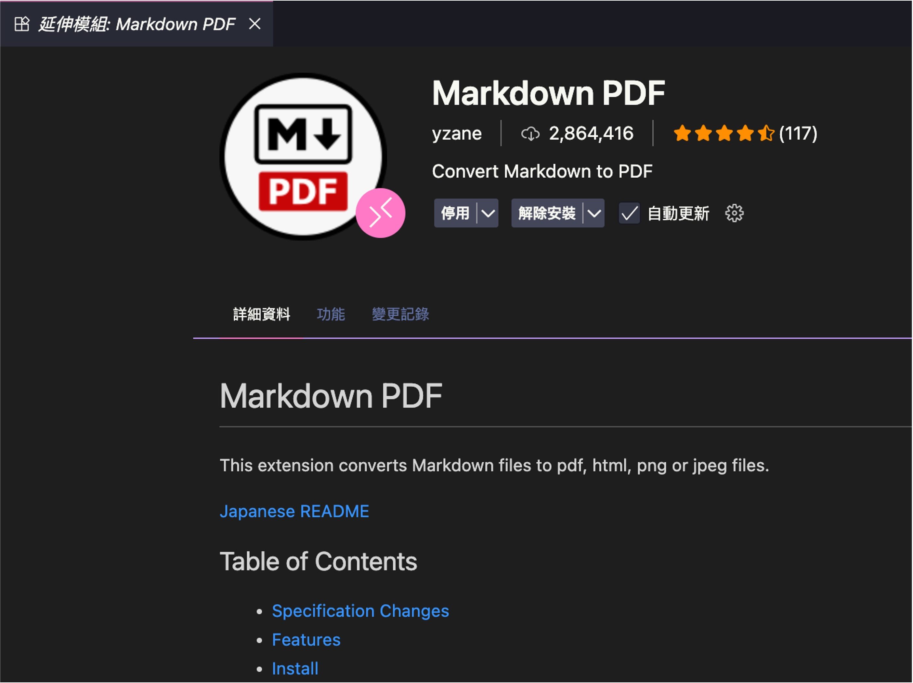
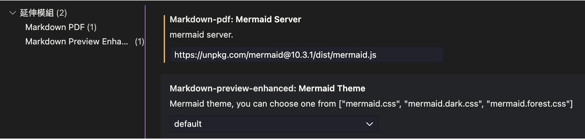
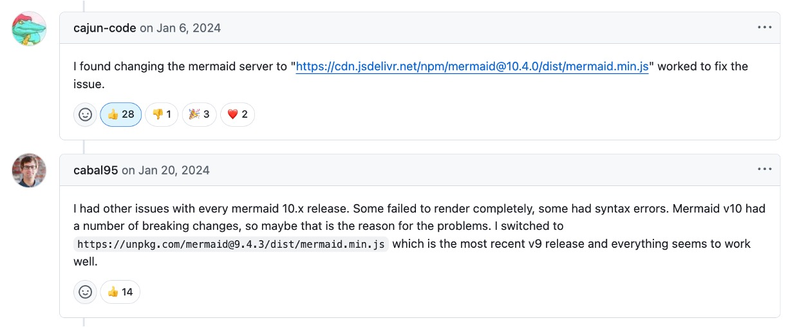

If you want to convert Markdown files to PDF, you will probably come across a few common tools.

I personally use the **Markdown PDF** extension in VS Code to export PDFs.

<!-- truncate -->

## Markdown PDF

This extension looks like this on my system:

<div align="center">
<figure style={{ "width": "70%"}}>

</figure>
</div>

The advantages of Markdown PDF include:

- Directly call VS Code’s **Command Palette → “Markdown PDF: Export (pdf)”** to generate PDFs, supporting multiple output formats such as HTML / PNG / JPEG.
- Built-in _puppeteer_, which can render HTML → PDF in headless Chrome, so math formulas (KaTeX), code block highlighting, and CSS themes are all preserved perfectly.
- Allows customizing the **Mermaid Server** URL, which is the key to fixing the export error below.

After installation, several properties appear in `settings.json`. This article focuses on `markdown-pdf.mermaidServer`.

## Mermaid Export Error

When the Markdown contains the following syntax:

```text
graph TD
    A --> B
    A --> C
    B --> D
    C --> D
```

Using this site’s built-in feature to render the above as a Mermaid diagram looks like this:

<div align="center">

</div>

Functionally, everything works fine — the VS Code preview panel shows no errors. However, **exporting to PDF** may result in two situations:

1. **No response at all**: The original Mermaid block is parsed as plain text in the PDF, without any diagram rendering.

   ```text
   graph TD
       A --> B
       A --> C
       B --> D
       C --> D
   ```

2. **Bomb icon + blank page**: The PDF shows only a “💣” icon or a blank page, with the Mermaid text appearing as-is.

After researching, the main cause seems to be a **compatibility conflict** between Markdown PDF and the latest Mermaid version.

Since Mermaid 10.4.0, the official release uses **ES Module**, and the old puppeteer `evaluate()` script injection fails to run properly, causing “syntax error in text” and empty rendering.

## Solution

Here is the conclusion first:

Go to the settings page, find `markdown-pdf.mermaidServer`, and point it to **Mermaid 10.3.1** version, as shown below:

<div align="center">
<figure style={{ "width": "90%"}}>

</figure>
</div>

Replace the original default URL:

```text
https://unpkg.com/mermaid/dist/mermaid.min.js
```

with:

```text
https://unpkg.com/mermaid@10.3.1/dist/mermaid.js
```

## Are other versions feasible?

I searched GitHub for a while and found some related issues, such as:

- [**Markdown-pdf: Mermaid Server VSCode URL no longer resolves #312**](https://github.com/yzane/vscode-markdown-pdf/issues/312)
- [**[BUG] Mermaid Diagrams Not Rendered in Exported PDF #342**](https://github.com/yzane/vscode-markdown-pdf/issues/342)

Below are two commonly recommended solutions:

<div align="center">
<figure style={{ "width": "90%"}}>

</figure>
</div>

But from my own tests, only version **10.3.1** can correctly convert all my diagrams, including Graph, sequenceDiagram, and gantt. As for other diagram types like classDiagram, stateDiagram, etc., you may need to try them yourself.

Finally, if you have any good methods or successful experiences with other versions, feel free to share them in the comments.
