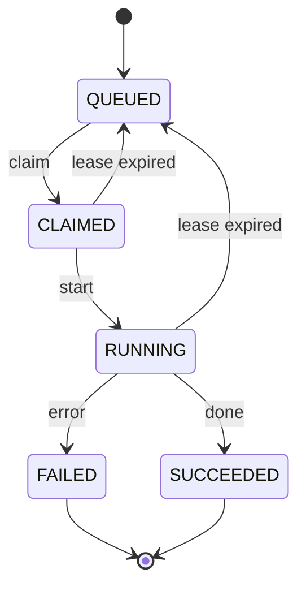

You think a job queue is simple:

1. Fetch one row with `status = QUEUED`
2. Change it to `RUNNING`
3. Start working

Until one day you notice:

> **The same job ran twice.**

Not duplicate logs, not a UI glitch —
two workers actually processed the exact same job at the same time.

Congrats. Welcome to the world of concurrency.

<!-- truncate -->

## The Problem Isn’t `UPDATE`

Most people’s first suspicion is:

> Doesn’t `UPDATE` lock rows?
> How can it still be updated at the same time?

In reality, **the real problem happens earlier**.

The most common (and most naive) approach looks like this (illustration):

```text
worker A: SELECT ... LIMIT 1  -> gets job_42
worker B: SELECT ... LIMIT 1  -> also gets job_42
worker A: UPDATE job_42 -> RUNNING
worker B: UPDATE job_42 -> RUNNING
```

In your head, this is a “reasonable order”:

> I read first, then I write.

But in a concurrent system, this is actually two **completely independent timelines**.

The key isn’t whether UPDATE acquired a lock.
It’s that:

> **A and B both saw the same fact before either of them changed it.**

Once that happens, no matter how careful you are afterwards, it’s already too late.

## Draw the State Machine First

If you don’t define your job state machine clearly,
all your logic turns into:

> “It probably won’t happen that perfectly, right?”

That’s a dangerously optimistic assumption.

Here’s a minimal, maintainable state machine:

<div align="center">



</div>

You can merge `CLAIMED / RUNNING`,
or split into `RETRYING / DEAD`.

Those are design choices.

**But one thing is non-negotiable**:

> **“claim” must be atomic.**

Meaning:

- it either succeeds completely
- or it doesn’t happen at all
- no intermediate state may be observed by other workers

## Approach 1

The most robust approach is a transaction + Compare-and-Swap.

It’s the most pragmatic, the most common, and the easiest to debug.

There are only two core ideas:

- wrap claim in a **very short transaction**
- use `UPDATE ... WHERE old_state = ...` as CAS

Example SQL (adjust columns as needed):

```sql
BEGIN IMMEDIATE;

SELECT id
FROM jobs
WHERE queue = :queue
  AND status = 'QUEUED'
  AND retry_count < :max_retry
ORDER BY created_at ASC
LIMIT 1;

UPDATE jobs
SET status = 'CLAIMED',
    claimed_at = :now,
    retry_count = retry_count + 1
WHERE id = :id
  AND status = 'QUEUED';

COMMIT;
```

What matters isn’t the exact SQL, but what you check afterwards:

- If the `UPDATE` affected row count is **≠ 1**

  - it means the job was taken before you got to it
  - treat the claim as failed and retry

This `AND status = 'QUEUED'` is the cheapest — yet extremely effective — compare-and-swap.

## Approach 2

If your SQLite version is new enough, you can compress “pick one + update” into a single `UPDATE … RETURNING` statement:

```sql
UPDATE jobs
SET status = 'CLAIMED',
    claimed_at = :now,
    retry_count = retry_count + 1
WHERE id = (
  SELECT id
  FROM jobs
  WHERE queue = :queue
    AND status = 'QUEUED'
  ORDER BY created_at ASC
  LIMIT 1
)
RETURNING id;
```

The benefits are clear:

- one fewer round-trip
- claim semantics live in a single SQL statement
- success returns an `id`; failure returns an empty result

But remember:

> **It’s just prettier syntax. Fundamentally, it’s still CAS.**

The indexes you need, the short transactions, and the error handling still matter just as much.

## Other Common Pitfalls

1. **Wrapping claim in a big transaction**

   Claim is just “reserving a spot”.

   If you write:

   ```
   BEGIN;
   -- claim job
   -- run model / call API / crunch for a long time
   -- write results
   COMMIT;
   ```

   then you’re effectively telling every worker:

   > **“I’m going to hold a write lock for a long time. Please queue up.”**

   **Fix**:
   claim in a short transaction;
   run the work outside the transaction;
   write results in another short transaction.

   ***

2. **Forgetting worker isolation**

   If you have:

   - multiple queues
   - different versions of processing logic
   - workers with different priorities

   but all share the same `jobs` table,
   you will eventually “pick up jobs you shouldn’t have”.

   **Fix**:
   in the claim `WHERE` clause, explicitly constrain:

   - queue
   - version
   - capability

   so a worker **only sees its own world**.

   ***

3. **Doing cleanup during claim**

   For example:

   - sweeping expired jobs
   - retrying failed jobs
   - computing stats

   This makes the critical section unnecessarily longer.

   **Fix**:
   separate “picking jobs” from “taking out the trash”;
   don’t let them interfere with each other.

## Summary

The hardest part of a job queue isn’t performance — it’s correctness.

Just remember these three things:

- **SELECT + UPDATE is not atomic**
- claim must be designed with CAS thinking
- any transaction that takes a write lock must be as short as possible

Do that, and you can avoid the soul-piercing question:

> “Why did the same job run twice?”

## References

- [SQLite: Transactions](https://www.sqlite.org/lang_transaction.html)
- [SQLite: UPDATE (RETURNING clause)](https://www.sqlite.org/lang_update.html)
