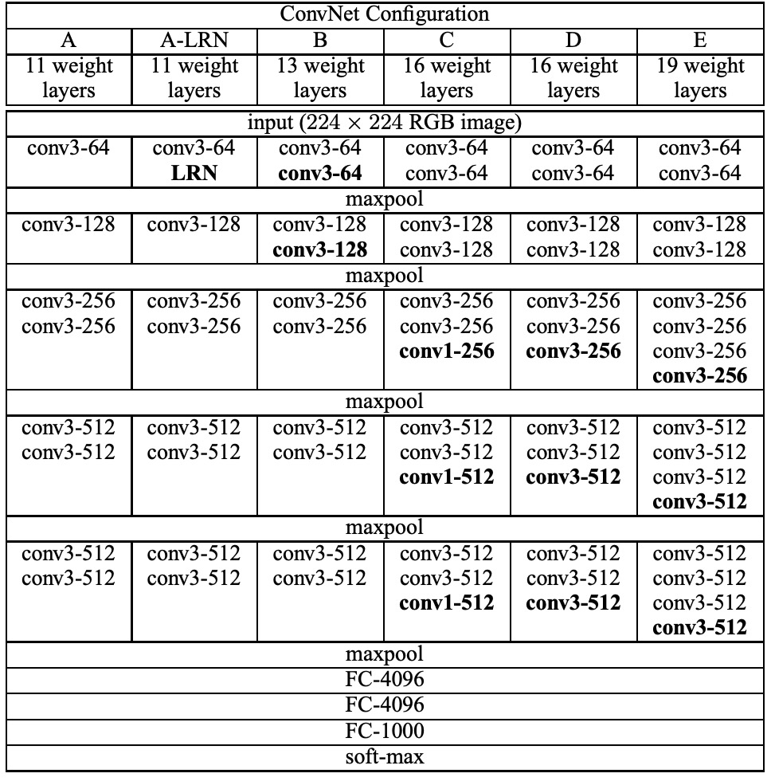
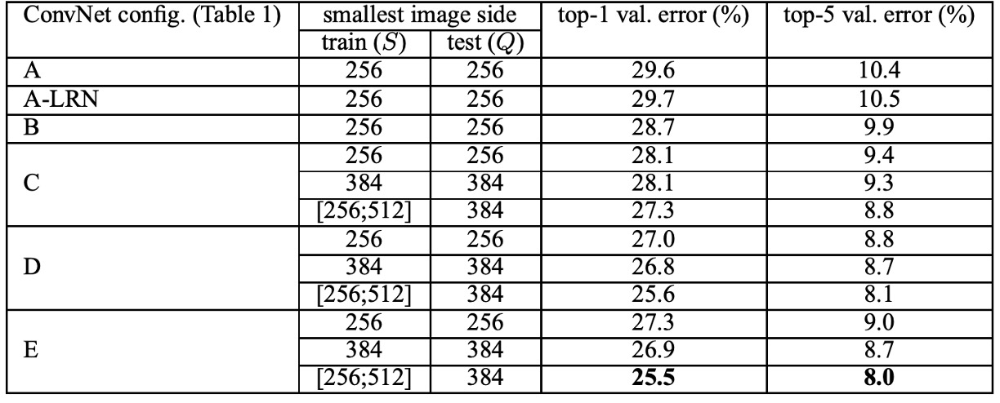
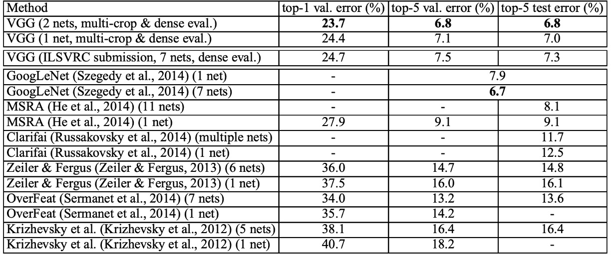

# [14.09] VGG

## Deep and More Deep

[**Very Deep Convolutional Networks for Large-Scale Image Recognition**](https://arxiv.org/abs/1409.1556)

---

In the early stages of neural networks, the exploration of depth was stagnant for a long time.

The primary reason was the vanishing gradient problem. As the network depth increased, the gradient information could not effectively propagate to the earlier layers, making training difficult.

Thus, after AlexNet, researchers began to explore the depth of networks and proposed a series of deep network structures, among which VGG is a significant representative.

## Problem Definition

In previous studies, the size of convolutional kernels was typically 5×5 or 7×7. VGG proposed using multiple 3×3 convolutional kernels to replace the larger ones. The authors argued that using multiple layers of small convolutional kernels instead of a few layers of large kernels brings several advantages:

1.  **Improved Discriminative Power of Decision Functions**:

    Stacking multiple small convolutional kernels (e.g., 3×3) and introducing non-linear activation functions (such as ReLU) between each layer can enhance the model's non-linear representation capabilities. This makes the decision functions more discriminative, allowing them to capture complex features in the data more effectively compared to using a single large convolutional kernel (e.g., 7×7).

2.  **Reduction in Parameter Count**:

    Assuming both the input and output have C channels, the number of parameters required for stacking three 3×3 convolutional layers is:

         - $3×(3×3×C×C) = 27C^2$

    In contrast, a single 7×7 convolutional layer requires:

         - $7×7×C×C = 49C^2$.

    This means that stacking multiple small convolutional kernels reduces the parameter count by approximately 81%, lowering the computational and storage costs of the model.

3.  **Increased Effective Receptive Field**:

    Stacking multiple small convolutional kernels can gradually increase the effective receptive field.

    For instance, stacking two 3×3 convolutional layers results in an effective receptive field of 5×5, while stacking three 3×3 convolutional layers results in a receptive field of 7×7.

    Thus, the receptive field can be flexibly adjusted by increasing the number of convolutional layers without needing larger kernels.

4.  **Regularization Effect**:

    Stacking multiple small convolutional kernels has a regularization-like effect. Decomposing large kernels into smaller ones forces the model to learn more fine-grained feature representations, helping to reduce overfitting.

5.  **Introduction of More Non-linearity**:

    Although a 1×1 convolutional layer is essentially a linear projection, when combined with a non-linear activation function, it can increase the model's non-linearity without changing the convolutional receptive field.

Due to the regularization effect brought by stacking multiple small convolutional kernels, the network depth can be increased naturally. Based on these foundations, the authors proposed the VGG network structure, which constructs deep networks by stacking multiple small convolutional kernels and achieved excellent performance in the ImageNet classification task.

:::tip
**Limitations:**

Although stacking multiple small convolutional kernels can reduce the parameter count, it also increases the number of computation layers and computational complexity. Additionally, in deep networks, stacking multiple small convolutional kernels may exacerbate the vanishing gradient problem, especially when lacking proper initialization and regularization techniques, making the training process more challenging.

Moreover, while stacking multiple small convolutional kernels reduces parameter count, the increased number of layers requires storing intermediate feature maps, potentially increasing memory demands, especially when processing high-resolution images.
:::

## Problem Solving

### Network Architecture

The authors designed five main experiments plus one additional experiment. Experiments A and A-LRN were used to explore the effect of LRN in AlexNet, while B, C, D, and E were used to investigate the impact of network depth on classification performance.

During training, the input to the ConvNet was fixed-size 224 × 224 RGB images. The only preprocessing was to subtract the mean RGB value computed on the training set from each pixel.

The authors used very small receptive field filters for convolution: 3 × 3 (and 1 × 1 in some configurations). The convolution stride was fixed at 1 pixel, and spatial padding was performed to preserve spatial resolution after convolution.

Spatial pooling was carried out by five max-pooling layers, which were performed over a 2 × 2 pixel window with a stride of 2.

Following the convolutional layers were three fully connected (FC) layers: the first two with 4096 channels each, and the last one with 1000 channels corresponding to the number of classes for the ImageNet classification task.

All hidden layers were equipped with ReLU activation functions. Except for one network, all other networks did not include local response normalization (LRN).

The table above summarizes the five ConvNet configurations (A-E), mainly differing in depth:

- Network A has 11 weight layers (8 convolutional layers and 3 FC layers).
- Network E has 19 weight layers (16 convolutional layers and 3 FC layers).
- The width of the layers starts at 64 and increases by a factor of 2 after each max-pooling layer until it reaches 512.
- The deeper networks do not have significantly more weights than the shallower ones with larger layers and receptive fields.

**The use of 3×3 convolutional kernels instead of larger receptive fields is a notable characteristic of the VGG network.**

### Training Details

The training procedure largely followed the approach of Krizhevsky et al. (2012):

1. **Training Method**:

   - Training was performed using mini-batch gradient descent with momentum. The batch size was set to 256, and the momentum was 0.9.
   - L2 regularization was used (weight decay multiplier of $5 × 10^{-4}$).
   - Dropout regularization was applied with a dropout rate of 0.5.

2. **Learning Rate**:

   - The initial learning rate was set to $10^{-2}$, and it was gradually reduced as the validation set accuracy ceased to improve.
   - Training was stopped after 370K iterations (74 epochs).

3. **Weight Initialization**:

   Initialization is crucial for deep networks. The authors used the layers of configuration A to initialize the first four convolutional layers and the last three fully connected layers of the deeper architectures, with the middle layers randomly initialized. This approach helped avoid training stagnation due to gradient instability in deep networks.

4. **Image Cropping and Augmentation**:

   To obtain fixed-size 224×224 ConvNet input images, random crops were taken from rescaled training images. Additionally, random horizontal flips and RGB color shifts were used to augment the training set.

Regarding training image sizes, the authors considered two methods for setting training scales:

1. **Fixed S**: Training was performed at two fixed scales, S = 256 and S = 384. Training began with S = 256, and the weights from this pre-training were used to initialize the network at S = 384.
2. **Multi-scale Training**: S was randomly sampled from the range [Smin, Smax], with Smin = 256 and Smax = 512. This approach allowed better handling of objects of varying sizes in images.

This paper's implementation was based on the C++ Caffe toolbox with significant modifications to support multi-GPU training and evaluation.

On a system equipped with four NVIDIA Titan Black GPUs, training a single network took approximately 2-3 weeks.

## Discussion

### LRN Contribution

In experiments, the authors found that using the LRN layer proposed by AlexNet had almost no impact on the model, so deeper architectures (B-E) did not use this normalization design.

Regarding network depth, the authors found that increasing ConvNet depth reduced classification error. For instance, network E with 19 layers showed significant improvement over network A with 11 layers. However, classification error saturated at a certain depth, indicating that deeper models might benefit from larger datasets.

### Performance on ImageNet

According to the table above, deep convolutional networks (ConvNets) significantly outperformed the best results of the previous generation models in the ILSVRC-2012 and ILSVRC-2013 competitions.

VGG's results were competitive with the competition winner GoogLeNet (error rate of 6.7%) in classification tasks and significantly surpassed the winning submission of ILSVRC-2013, Clarifai (error rate of 11.2% with external training data, 11.7% without external data).

Notably, VGG's best results were achieved by combining only two models, which is much fewer than the number of models used in most ILSVRC submissions. In terms of single-network performance, the VGG architecture achieved the best result (test error rate of 7.0%), outperforming a single GoogLeNet by 0.9%.

It is worth emphasizing that the authors did not deviate from the classical ConvNet architecture proposed by LeCun et al. (1989) but improved it by significantly increasing the depth.

## Conclusion

VGG brought revolutionary progress in the field of deep convolutional neural networks, with its main contribution being the exploration of network depth's impact on large-scale image recognition accuracy. By systematically evaluating networks with increasing depth while using very small 3×3 convolutional filters, VGG networks demonstrated significant accuracy improvements when the depth reached 16-19 weight layers.

Moreover, VGG networks not only achieved excellent results on ImageNet but also generalized well to other datasets, achieving state-of-the-art results. This indicates that VGG networks' deep representations are highly adaptable and superior across various tasks and datasets.

This architecture, simple yet effective, provides valuable insights for subsequent deep learning research.
