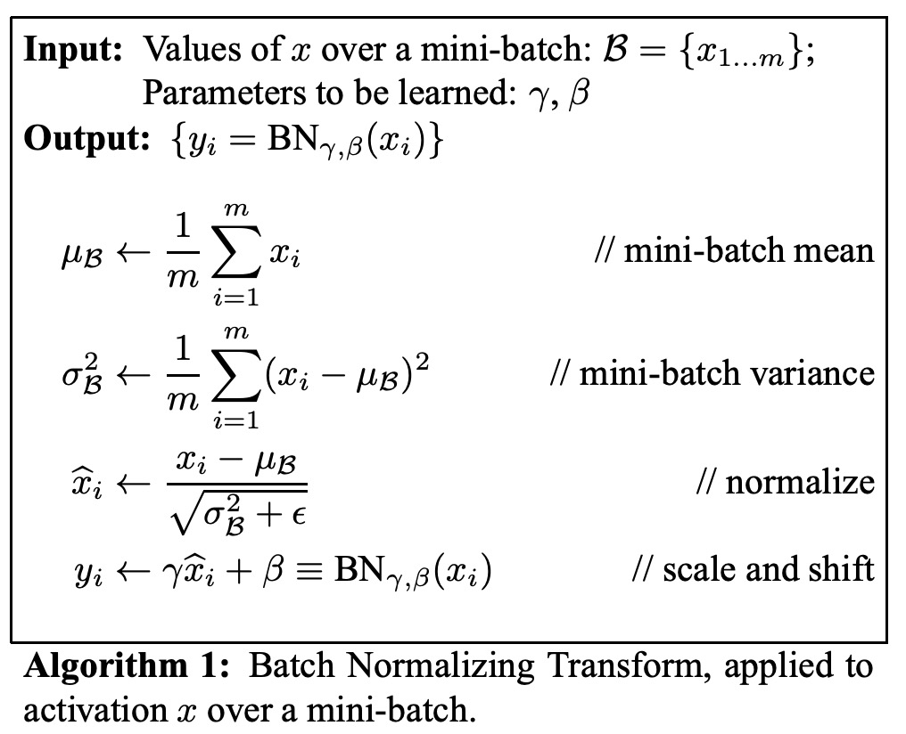
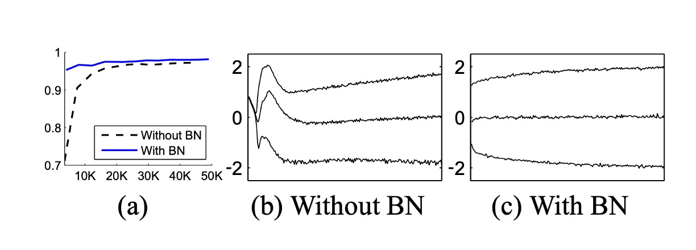
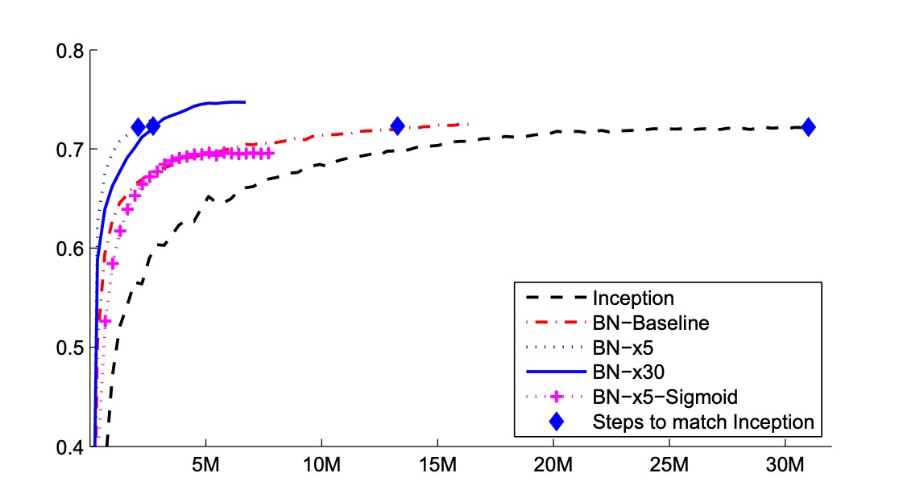

# [15.02] BatchNorm

## Batch Normalization

[**Batch Normalization: Accelerating Deep Network Training by Reducing Internal Covariate Shift**](https://arxiv.org/abs/1502.03167)

---

:::info
The following content has been compiled by ChatGPT-4, with manual proofreading and supplementary explanations.
:::

---

Deep learning has made significant progress in various fields such as vision and speech. Stochastic Gradient Descent (SGD) and its variants like Momentum and Adagrad have proven to be highly effective methods for training deep neural networks. These optimization algorithms adjust the network parameters to minimize loss by processing small batches of data during training.

In the SGD process, instead of updating parameters with each individual training example, we use mini-batches. This approach has two main benefits: first, the gradient of the loss over a mini-batch is a good estimate of the gradient over the entire training set, and as the batch size increases, this estimate improves; second, modern computing platforms support parallel computation, making it more efficient to process a whole batch of data at once rather than multiple individual data points.

However, SGD requires precise tuning of hyperparameters such as the learning rate. As the network depth increases, small changes can be amplified, leading to the problem known as **covariate shift**.

:::tip
This means that "current layers" need to continuously adapt to the changing input distribution caused by parameter updates in "previous layers".

Consider a layer with a sigmoid activation function $g(x) = \frac{1}{1+\exp(-x)}$:

$$z = g(Wu + b)$$

where $u$ is the layer input, and the weight matrix $W$ and bias vector $b$ are learnable parameters.

As $|x|$ increases, $g'(x)$ tends to zero, meaning that except for dimensions where $x = Wu + b$ has small absolute values, the gradient vanishes when flowing towards $u$, slowing down model training. However, since $x$ is influenced by $W$, $b$, and parameters of all preceding layers, parameter changes during training might push multiple dimensions of $x$ into the non-linear saturation regions, decelerating convergence.
:::

## Defining the Problem

The authors define internal covariate shift as:

- **Changes in the distribution of network activations due to the updating of network parameters during training.**

To improve training, we aim to reduce internal covariate shift. By stabilizing the distribution of layer inputs $x$, we expect to accelerate training.

Past research indicates that network training converges faster if its inputs are whitened, i.e., transformed to have zero mean and unit variance, and are uncorrelated. Since the input to each layer comes from the output of the previous layer, it would be beneficial to whiten the input to each layer.

However, alternating these modifications with optimization steps might cause the gradient descent steps to update parameters in a way that necessitates re-normalization, reducing the effectiveness of gradient steps.

For instance, consider a layer with input $u$ plus a learned bias $b$, normalized by subtracting the activation mean: $\hat{x} = x - E[x]$, where $x = u + b$, $X = \{x_1...N\}$ is the set of training values of $x$, and $E[x] = \frac{1}{N} \sum_{i=1}^N x_i$. If the gradient descent step ignores the dependence of $E[x]$ on $b$, it updates $b \leftarrow b + \Delta b$, where $\Delta b \propto -\frac{\partial \ell}{\partial \hat{x}}$.

Then $u + (b + \Delta b) - E[u + (b + \Delta b)] = u + b - E[u + b]$. Thus, the combination of updating $b$ and subsequent normalization changes results in no change in the layer's output or loss. As training continues, $b$ grows indefinitely while the loss remains unchanged. If normalization involves both centering and scaling activations, the problem worsens.

---

The issue with the above approach is that gradient descent optimization does not account for the presence of normalization.

To solve this, the authors aim to ensure that the network always produces activations with the desired distribution for any parameter values. This allows the gradient of the loss with respect to model parameters to account for normalization and its dependence on model parameters $\Theta$.

Let $x$ be the layer input, treated as a vector, and $X$ the set of these inputs over the training dataset. Normalization can then be written as the transformation:

$$
\hat{x} = \text{Norm}(x, \chi)
$$

which depends not only on a given training example $x$ but also on all examples $\chi$.

For backpropagation, we need to compute

$$
\frac{\partial \text{Norm}(x, \chi)}{\partial x}
$$

and

$$
\frac{\partial \text{Norm}(x, \chi)}{\partial \chi}
$$

Neglecting the latter leads to the issue mentioned above.

In this framework, calculating the covariance matrix $\text{Cov}[x] = E_{x \in X}[xx^T] - E[x]E[x]^T$ and its inverse square root to produce whitened activations $\text{Cov}[x]^{-1/2}(x - E[x])$, and the derivatives of these transformations for backpropagation is very expensive. This motivated the authors to seek an alternative method to normalize inputs in a differentiable way without needing to analyze the entire training set after each parameter update.

:::tip
**Whitening vs. Standardization**

- **Standardization**

  Standardization is a data processing technique to transform data to have a mean of 0 and a standard deviation of 1. This method is often referred to as Z-score normalization, calculated as:

  $$
  z = \frac{(x - \mu)}{\sigma}
  $$

  where $x$ is the original data, $\mu$ is the mean, and $\sigma$ is the standard deviation. Standardized data distribution will have characteristics of a standard normal distribution, making different features (or dimensions) comparable and easier to process, especially when training models with gradient-based optimization methods.

- **Whitening**

  Whitening is a more advanced data preprocessing technique aimed at transforming input data into new features with equal variance and no correlation between them (i.e., the covariance matrix of the features is diagonal). This involves not only making data mean-zero and variance-one but also removing correlations among input features. The process usually involves:

  1. Centering the data (subtracting the mean).
  2. Calculating the covariance matrix.
  3. Performing eigenvalue decomposition of the covariance matrix.
  4. Scaling the data using eigenvalues and rotating using eigenvectors to ensure features are independent.

  Whitening produces a set of linearly independent (uncorrelated) features, useful in some algorithms like Principal Component Analysis (PCA) and certain neural network models, helping improve learning efficiency and interpretability.

Standardization primarily scales data to a common range, widely applicable in training various machine learning models, particularly those sensitive to data scale, like Support Vector Machines (SVM) and neural networks. Whitening further transforms features into independent ones, addressing multicollinearity issues in data, with more complex calculations involving eigen decomposition and matrix operations.

In practice, standardization is more common due to its simplicity and adequacy for most model training needs.
:::

## Solving the Problem

Due to the high computational cost and non-differentiability of full whitening of each layer’s input, the authors made two necessary simplifications.

First, instead of jointly whitening the input and output features of a layer, they normalized each scalar feature independently to have zero mean and unit variance. For a layer with $d$-dimensional input $x = (x^{(1)}, \ldots, x^{(d)})$, each dimension is normalized as:

$$
\hat{x}^{(k)} = \frac{x^{(k)} - \mathbb{E}[x^{(k)}]}{\sqrt{\mathrm{Var}[x^{(k)}]}}
$$

where the expectation and variance are computed based on the training dataset.

Note that simply normalizing each input of the layer might alter the layer's representation power. For example, normalizing inputs to a sigmoid function restricts it to its non-linear region. To address this, the authors introduced transformations within the network that can represent the identity transformation. To achieve this, they introduced parameters $\gamma^{(k)}$ and $\beta^{(k)}$ for each activation value $x^{(k)}$ to scale and shift the normalized values:

$$
y^{(k)} = \gamma^{(k)} \hat{x}^{(k)} + \beta^{(k)}
$$

These parameters are learned along with the original model parameters, restoring the network's representation power.

In fact, by setting $\gamma^{(k)} = \sqrt{\mathrm{Var}[x^{(k)}]}$ and $\beta^{(k)} = \mathbb{E}[x^{(k)}]$, the original activations can be recovered in the best case.

In the batch setting using the entire training set, activations are typically normalized using the entire dataset. However, this is impractical for stochastic optimization.

Therefore, the authors made a second simplification: using mini-batches during stochastic gradient training, each mini-batch produces an estimate of the mean and variance for each activation value. Thus, the statistics used for normalization can fully participate in gradient backpropagation. It is important to note that using mini-batches means computing variances per dimension rather than a joint covariance matrix; in the joint case, regularization might be necessary, as the mini-batch size could be smaller than the number of activations to whiten, leading to a singular covariance matrix.

Consider a mini-batch $B$ of size $m$. Since normalization is applied independently to each activation, let's focus on a specific activation $x^{(k)}$ and omit $k$ for simplicity. We have $m$ values of this activation in the mini-batch, $B = \{x_1, \ldots, x_m\}$.

Let $\hat{x}_1, \ldots, \hat{x}_m$ be the normalized values, and $y_1, \ldots, y_m$ the linear transformations of them. We call this transformation the BatchNorm transform $BN_{\gamma, \beta}$, described as follows. In the algorithm, $\epsilon$ is a constant added to the mini-batch variance for numerical stability.

In the representation $y = BN_{\gamma, \beta}(x)$, the parameters $\gamma$ and $\beta$ are learned, but note that the BN transform does not independently process activations in each training example. Instead, $BN_{\gamma, \beta}(x)$ depends on both the training sample and the other samples in the mini-batch. The scaled and shifted values $y$ are propagated to other network layers.

The BN transform is a differentiable transformation that introduces normalized activations into the network. This ensures that during model training, each layer continues to learn on input distributions exhibiting less internal covariate shift, accelerating training. Moreover, the learnable affine transformation applied to these normalized activations allows the BN transform to represent the identity transformation, maintaining network capacity.

### Increasing Learning Rates

In traditional deep neural networks, high learning rates can cause gradient explosion or vanishing and result in getting stuck in poor local minima. BatchNorm helps to mitigate these issues. By normalizing activations throughout the network, it prevents small parameter changes from magnifying into larger, suboptimal changes in activations and gradients, avoiding training in the saturated regions of non-linear functions.

BatchNorm also makes training more robust to parameter scale. Typically, a large learning rate can increase the scale of layer parameters, amplifying gradients during backpropagation and causing the model to explode. However, with BatchNorm, backpropagation through a layer is not affected by its parameter scale.

For a scalar $a$,

$$
\mathrm{BN}(W\mathbf{u}) = \mathrm{BN}((aW)\mathbf{u})
$$

It can be shown that

$$
\frac{\partial \mathrm{BN}((aW)\mathbf{u})}{\partial \mathbf{u}} = \frac{\partial \mathrm{BN}(W\mathbf{u})}{\partial \mathbf{u}}
$$

$$
\frac{\partial \mathrm{BN}((aW)\mathbf{u})}{\partial (aW)} = \frac{1}{a} \cdot \frac{\partial \mathrm{BN}(W\mathbf{u})}{\partial W}
$$

The proportion does not affect the Jacobian matrix of the layer, nor does it affect gradient propagation.

The authors further hypothesize that BatchNorm may cause the singular values of the Jacobian matrix of a layer to be close to 1, which is beneficial for training.

:::tip
Consider two consecutive layers with normalized inputs and the transformation between these normalized vectors: $\hat{z} = F(\hat{x})$.

Assuming $\hat{x}$ and $\hat{z}$ are Gaussian-distributed and uncorrelated, and $F(\hat{x}) \approx J\hat{x}$ is a linear transformation for given model parameters, both $\hat{x}$ and $\hat{z}$ have unit covariance, and

$$
I = \mathrm{Cov}[\hat{z}] = J\mathrm{Cov}[\hat{x}]J^T = JJ^T
$$

Thus, $JJ^T = I$, meaning all singular values of $J$ are 1, preserving gradient magnitude during backpropagation.

In practice, transformations are not linear, and normalized values are not guaranteed to be Gaussian-distributed or independent, but the authors still expect BatchNorm to improve gradient propagation. The specific impact of the algorithm on gradient propagation requires further study.
:::

### No Need for Dropout

When training with BatchNorm, a training sample is observed together with other samples in the mini-batch, so the network no longer produces deterministic values for a given training sample. In the authors' experiments, this effect benefitted network generalization. While Dropout is usually used to reduce overfitting, it can be removed when BatchNorm is used.

## Discussion

### MNIST Experiment

To verify the impact of internal covariate shift on training and BatchNorm's ability to counteract it, the authors tested on the MNIST dataset for digit classification.

A very simple network was used here, with input being 28x28 binary images and three hidden layers, each with 100 activations. Each hidden layer computes $y = g(Wu + b)$, where $g$ is a sigmoid nonlinearity, and weights $W$ are initialized as small random Gaussian values.

After the last hidden layer, a fully connected layer with 10 activations (one per class) follows, using cross-entropy loss. The network was trained for 50,000 steps with mini-batches of 60 samples each. BatchNorm was added to each hidden layer.

The above figure shows the proportion of correct predictions on holdout test data as training progresses for both networks. The BatchNorm network achieved higher test accuracy. Figures (b) and (c) show how the distribution of a typical activation in the last hidden layer evolves. The original network's distribution changes significantly over time, both in mean and variance, complicating training for subsequent layers. In contrast, the BatchNorm network's distribution remains more stable throughout training, facilitating training.

### ImageNet Experiment

The authors then applied BatchNorm to a new variant of the Inception network and trained it on the ImageNet classification task.

Experiments evaluated several modified versions of Inception with BatchNorm. In all cases, BatchNorm was applied to the input of each nonlinearity, leaving the rest of the architecture unchanged.

Simply adding BatchNorm to the network did not fully utilize this method. Therefore, the authors further modified the network and its training parameters:

- **Increased Learning Rate**: With BatchNorm, higher learning rates were achieved, speeding up training without adverse effects.
- **Removed Dropout**: As BatchNorm reached the same goal as Dropout, removing Dropout from the modified BatchNorm Inception accelerated training without increasing overfitting.
- **Reduced L2 Weight Regularization**: In Inception, L2 loss on model parameters controlled overfitting, but in the modified BatchNorm Inception, this loss weight was reduced by 5 times.
- **Accelerated Learning Rate Decay**: As BatchNorm networks train faster than Inception, the learning rate decay was accelerated by 6 times.
- **Removed Local Response Normalization**: While Inception and other networks benefit from this, it was not needed with BatchNorm.
- **More Thorough Shuffling of Training Samples**: Shuffling training data within shards prevented the same samples from appearing in the same mini-batches. This led to about a 1% improvement in validation accuracy, consistent with BatchNorm acting as a regularizer.
- **Reduced Photometric Distortions**: Since BatchNorm networks train faster and each training sample is observed fewer times, the training focused on more “real” images, reducing their distortions.

The authors evaluated the following networks, all trained on LSVRC2012 training data and tested on validation data:

- **Inception**: The architecture described initially, with an initial learning rate of 0.0015.
- **BN-Baseline**: Same as Inception but with BatchNorm applied before each nonlinearity.
- **BN-x5**: Inception with BatchNorm. The initial learning rate increased five times to 0.0075. The same learning rate increase pushed the original Inception model to machine limits.
- **BN-x30**: Similar to BN-x5 but with an initial learning rate of 0.045 (30 times that of Inception).
- **BN-x5-Sigmoid**: Similar to BN-x5 but using sigmoid nonlinearities $g(t) = \frac{1}{1+\exp(-x)}$ instead of ReLU. The authors also tried training the original Inception with sigmoid, but the model accuracy remained random.

The above figure shows network validation accuracy as training progresses. Inception reached 72.2% accuracy after 31 million training steps. The table below shows the number of training steps each network took to reach the same 72.2% accuracy, the highest validation accuracy each network achieved, and the steps required to reach it.

Using only BatchNorm (BN-Baseline), the same accuracy as Inception was achieved in less than half the training steps. BN-x5 required 14 times fewer steps to reach 72.2% accuracy than Inception. Interestingly, further increasing the learning rate (BN-x30) initially slowed down training but allowed for higher final accuracy. After 6 million steps, it reached 74.8%, five times fewer steps than Inception to reach 72.2%.

Additionally, the authors verified that reduced internal covariate shift allows training deep networks with BatchNorm even using sigmoid nonlinearities, achieving 69.8% accuracy with BN-x5-Sigmoid.

:::tip
Everyone knows training networks with sigmoid is incredibly difficult. Without BatchNorm, Inception with sigmoid never surpassed 1/1000 accuracy.
:::

## Conclusion

BatchNorm addresses internal covariate shift by standardizing data within each batch. This method not only stabilizes the learning process but also allows for higher learning rates, significantly speeding up model training. It can also act as a regularizer, helping reduce overfitting.

However, the effectiveness of BatchNorm heavily depends on batch size. For smaller batches, the stability of normalization decreases, and numerical stability issues can arise, particularly when data distribution is near extreme values, previously causing quantization problems with RepVGG:

- [**[22.12] QARepVGG: Making RepVGG Great Again**](../2212-qarepvgg/index.md)

Finally, there is a difference in BatchNorm behavior between training and inference stages, a common pitfall for engineers. During training, the current batch statistics are used, whereas, during inference, global statistics from the entire training dataset are typically used. This difference can lead to discrepancies between model performance during training and inference.

In practice, these factors should be carefully considered when using BatchNorm to ensure the model adapts well to different scenarios.
