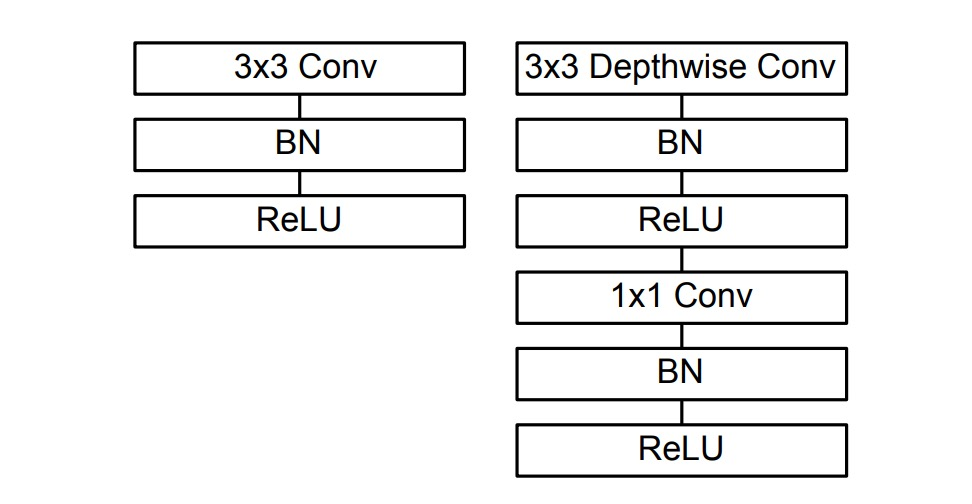

# [17.04] MobileNet-V1

## Pioneers of Depthwise Separable Convolutions

[**MobileNets: Efficient Convolutional Neural Networks for Mobile Vision Applications**](https://arxiv.org/abs/1704.04861)

---

:::info
The following content has been compiled by ChatGPT-4 and manually proofread, edited, and supplemented.
:::

---

Depthwise separable convolution is a convolutional neural network structure that decomposes standard convolution into two separate layers: depthwise convolution and pointwise convolution.

This structure reduces the number of model parameters and computation, making the model more lightweight, which is particularly useful for resource-constrained scenarios like mobile devices.

Although this paper extensively discusses depthwise separable convolution, the originator of this structure is actually:

- [**Rigid-motion scattering for image classification**](https://arxiv.org/abs/1403.1687)

The authors of MobileNets mention that their main contribution is the systematic application of depthwise separable convolutions in convolutional neural networks, achieving good results on ImageNet.

Thus, the well-known **MobileNet-V1** was born.

## Defining the Problem

In recent years, there has been growing interest in building small and efficient neural networks.

However, many papers on small networks "focus only on size without considering efficiency."

Clearly, we need network architectures that are both small and fast.

:::tip
Although not explicitly mentioned in the paper, we speculate that this statement refers to [**SqueezeNet**](https://arxiv.org/abs/1602.07360).
:::

## Solving the Problem

### Depthwise Separable Convolutions


Traditional convolution layers filter and combine the input feature maps through multi-channel convolutional kernels, generating new feature maps. This process considers all input channel information for each output channel, making it computationally expensive. Depthwise separable convolutions break this process into two stages: depthwise convolution, which applies a filter to each input channel independently, and pointwise convolution, which combines these outputs linearly.

Specifically, depthwise convolution does not change the number of input feature map channels, only performing spatial filtering on each channel independently. If there are M input channels, there will be M depthwise convolution filters. Pointwise convolution uses a 1×1 kernel to linearly combine these filtered channels, producing the final output channels. This decomposition significantly reduces computational cost.

For each depthwise convolution, the computational cost is $DK \times DK \times M \times DF \times DF$, where $DK$ is the kernel size, $DF$ is the input feature map size, and $M$ is the number of input channels.

For pointwise convolution, the computational cost is $M \times N \times DF \times DF$, where $N$ is the number of output channels.

Adding these two steps still results in significantly lower computational costs than traditional convolution, which is $DK \times DK \times M \times N \times DF \times DF$.

Thus, using depthwise separable convolutions can significantly reduce model computation and parameter requirements while maintaining relatively high accuracy, making it ideal for applications running on devices with limited computational resources.

:::info

We can implement depthwise separable convolutions in PyTorch as follows:

```python
import torch
import torch.nn as nn
import torch.nn.functional as F

class DepthwiseSeparableConv(nn.Module):

    def __init__(self, n_in, n_out, kernel_size, padding=0, stride=1):
        super(DepthwiseSeparableConv, self).__init__()
        self.depthwise = nn.Conv2d(n_in, n_in, kernel_size=kernel_size, padding=padding, stride=stride, groups=n_in)
        self.pointwise = nn.Conv2d(n_in, n_out, kernel_size=1)

    def forward(self, x):
        out = self.depthwise(x)
        out = self.pointwise(out)
        return out
```

In the implementation mentioned in the paper, each convolution layer is followed by Batch Normalization and a ReLU activation function, as shown below:



So, the implementation can be modified as follows:

```python
import torch
import torch.nn as nn
import torch.nn.functional as F

class DepthwiseSeparableConv(nn.Module):

    def __init__(self, n_in, n_out, kernel_size, padding=0, stride=1):
        super(DepthwiseSeparableConv, self).__init__()
        self.depthwise = nn.Conv2d(n_in, n_in, kernel_size=kernel_size, padding=padding, stride=stride, groups=n_in)
        self.pointwise = nn.Conv2d(n_in, n_out, kernel_size=1)
        self.depth_bn = nn.BatchNorm2d(n_in)
        self.depth_relu = nn.ReLU()
        self.point_bn = nn.BatchNorm2d(n_out)
        self.point_relu = nn.ReLU()

    def forward(self, x):
        x = self.depthwise(x)
        x = self.depth_bn(x)
        x = self.depth_relu(x)
        x = self.pointwise(x)
        x = self.point_bn(x)
        x = self.point_relu(x)
        return x
```

:::

## Network Architecture

According to the paper, the MobileNet-V1 network architecture consists of "depthwise separable convolutions except for the first layer, which is a full convolution."

> The MobileNet structure is built on depthwise separable convolutions as mentioned in the previous section except for the first layer which is a full convolution.

The overall structure is as follows:


## Training Techniques

The authors of MobileNet-V1 used several techniques during training to enhance the model's performance:

- Use less regularization and data augmentation since small models are less prone to overfitting.
- Place little or no weight decay (L2 regularization) on the depthwise convolution filters.
- Use RMSprop as the optimizer with a smaller learning rate.
- Employ asynchronous gradient descent similar to Inception-V3.

:::tip
Asynchronous Gradient Descent is an optimization technique used in deep learning training, particularly suitable for distributed computing environments. In traditional synchronous gradient descent, all computation nodes (or workers) must complete their gradient calculations before the model is updated. This means the training process speed is limited by the slowest node. In contrast, asynchronous gradient descent allows each computation node to independently compute gradients and update the shared model without waiting for other nodes' results.
:::

## Discussion

In the overall experimental design, the above network architecture served as the baseline. The authors introduced two constant hyperparameters:

- **Width Multiplier $\alpha$**: Controls the width of the network, i.e., the number of output channels in each layer.
- **Resolution Multiplier $\rho$**: Controls the resolution of the input image.

### Performance of Depthwise Separable Convolutions


Compared to full convolutions, using depthwise separable convolutions on ImageNet only reduced accuracy by 1% while significantly saving on multiplications and parameters.

### Depth vs. Width?


Reducing the model width decreased accuracy by 2.2%; reducing the model depth decreased accuracy by 5.3%.

This indicates that when computational power is limited, it's better to reduce model width rather than depth.

### Comparison with Other Models


The full MobileNet was compared to the original GoogleNet and VGG16.

MobileNet achieved nearly the same accuracy as VGG16 while being 32 times smaller and reducing computational intensity by 27 times.

MobileNet was more accurate than GoogleNet while being smaller and reducing computations by over 2.5 times.

With approximately the same size and 22 times fewer computations, MobileNet also outperformed Squeezenet by about 4%.

## Conclusion

The introduction of MobileNet-V1 brought depthwise separable convolution into the spotlight. This structure significantly reduces model size and computational needs while maintaining relatively high accuracy, addressing the challenge of running complex deep learning models in resource-limited environments.

This paper provides an effective solution for deploying deep learning models in resource-constrained environments and has inspired the development of subsequent lightweight deep learning architectures, further advancing the application of deep learning in mobile devices and edge computing.

---

MobileNet has since released V2, V3, and V4 versions, further improving model performance and efficiency.

These research outcomes have achieved widespread success in practical applications, becoming classics in lightweight deep learning models.
